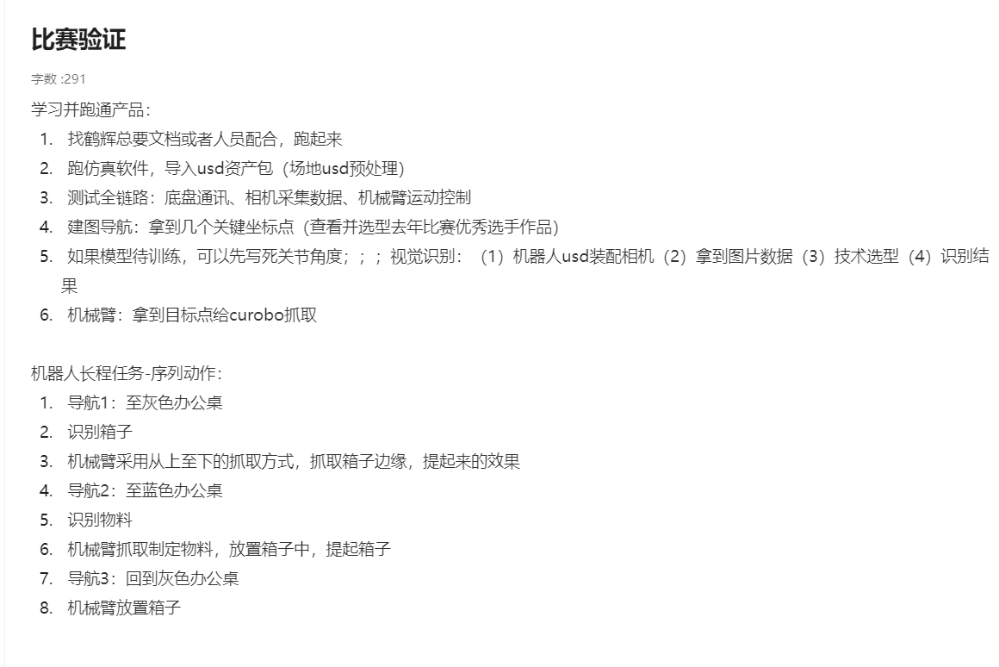
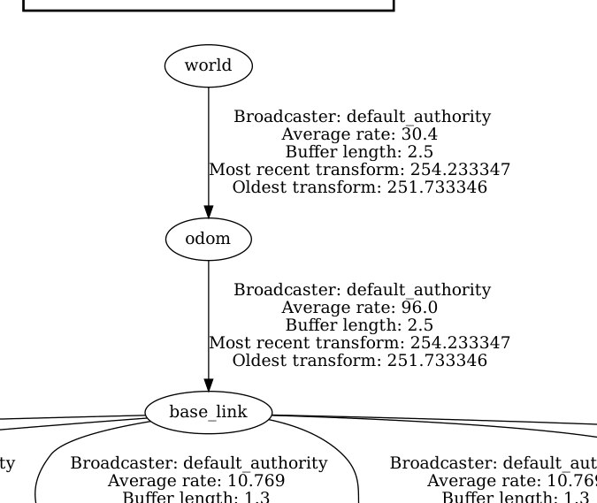
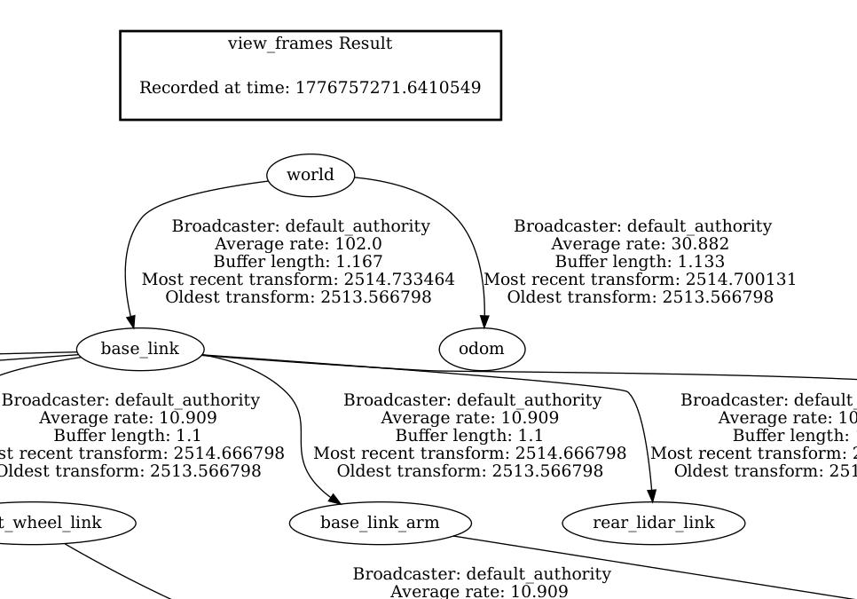
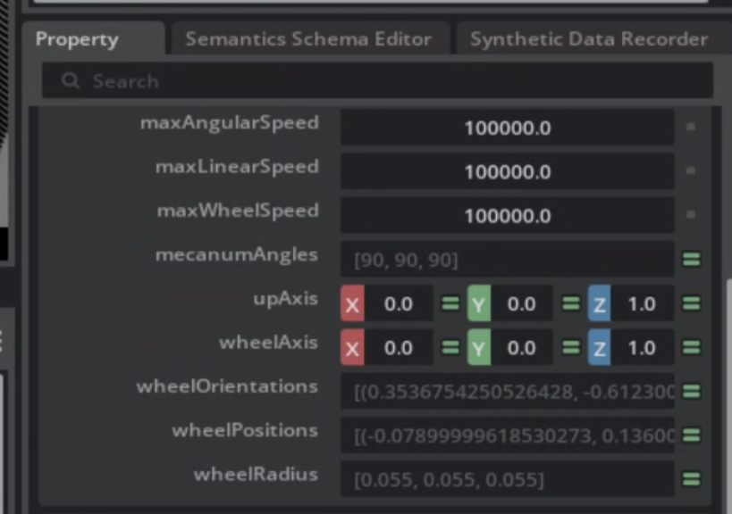
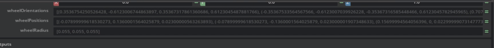
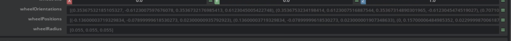
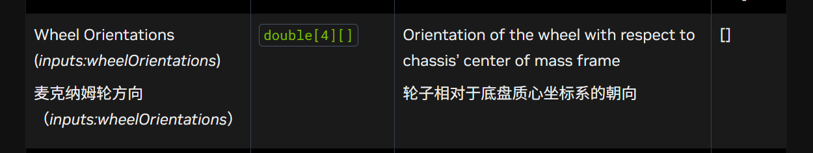

3. - # 2月26
   
        1. 调试好 bobac 机器人的 isaacsim 仿真模型，并让其能够正常的运动
        2. 尝试使用一下 isaacsim 的生成合成数据工具 Replicator 
            1. 尝试生成数据
            2. 尝试生成的数据能不能自动标注
        3. clone 一个 yolo 模型并准备好跑通训练和部署流程
   
        
   
        
   
        
   
        # 2月27日
   
        1. 学习一个 replicator 的具体使用方法
            1. 看一下能不能在采集数据的过程中能不能顺便标注                                   能的，只能标注下面的东西
            2. 标注的数据是什么，是正常的锚框数据吗                                                 rgb图像与锚框的位置numpy 数据，是
            3. 能不能标注旋转框数据呢？                                                                                             不行
            4. 能不能直接让模型预测出物品的3D框呢？
                可以，但是需要深度相机的数据，如果深度相机的数据无效则无法预测出物品的3D模型
                即 2D + 深度相机 [YOLO-3D：使用yolov11（模型可更改）+深度模型进行3D对象检测_yolo 3d-CSDN博客](https://blog.csdn.net/2301_79340622/article/details/147305916)
            5. 能不能自动标注出 2D 和 3D 的标注框？                                     能，但是需要去给物品设置semantic （语义标签）属性
   
        2. yolo 模型选型
            1. 要求一： 识别精度能够尽可能高，且泛化性够高，机制没有很大的缺陷
            2. 要求二（优先）：能在 CPU 上运行，也能在 nano 中运行
        3. 调试好 bobac 机器人的底盘
            1. 了解清楚这个 articulation controller 的整体控制逻辑
            2. 了解清楚 isaacsim 中的关节配置参数含义，以及应该怎么样去配置关节的参数（用什么思路能够直接顺利的调整好）rgb
                bounding_box_2d_tight
                bounding_box_2d_loose
                semantic_segmentation
                colorize_semantic_segmentation
                instance_id_segmentation
                colorize_instance_id_segmentation
                instance_segmentation
                colorize_instance_segmentation
                distance_to_camera
                distance_to_image_plane
                bounding_box_3d
                occlusion
                normals
                motion_vectors
                camera_params
                pointcloud
                pointcloud_include_unlabelledskeleton_data
   
   
        红绿蓝
        紧贴二维边界框
        宽松二维边界框
        语义分割
        语义分割着色
        实例ID分割
        实例ID着色分割
        实例分割
        彩色实例分割
        距相机距离
        至图像平面的距离
        三维边界框
        遮挡
        法线
        运动矢量
        相机参数
        点云
        点云包含未标注的骨架数据
        
        
   
   
   ​     
   
   ​     
   
   ​     
   
        编写教程任务：新手如何通过 isaacsim 的 replicator 来生成带标注的图像数据来用于训练视觉识别模型（先不弄这个，先了解清楚这个 randomizer 到底要怎么用，才能让 replicator 来自动采集我们想要的完整数据集）
   
   
   ​     
   
   ​     
   
        文档备用内容:
        
        调整环境变量程序：
        
        在 ~/.bashrc 中将有关 ros 的环境变量更改为下面的程序，程序在每次创建窗口的时候都会默认加载 ros1 noetic 的运行环境，如果需要使用 ros2 的则可以将下面的 DEFAULT_ROS_VERSION 调整为 galactics
        
        ```
        #source /opt/ros/noetic/setup.bash
        #source /home/elephant/mercury_x1_ros/devel/setup.bash
        
        #source /opt/ros/galactic/setup.bash
        #source /home/elephant/mercury_x1_ros2/install/setup.bash
        
        #export ROS_PACKAGE_PATH=/opt/ros/noetic/share
        #export ROS_PACKAGE_PATH=/home/elephant/mercury_x1_ros/src:$ROS_PACKAGE_PATH
        #export ROS_PACKAGE_PATH="/home/elephant/mercury_x1_ros2/install:$ROS_PACKAGE_PATH
        
        # ========================================
        # ROS 版本选择（noetic/galactics）
        # ========================================
        export DEFAULT_ROS_VERSION="noetic"
        
        unset ROS_DISTRO ROS_VERSION ROS_ROOT ROS_MASTER_URI ROS_PACKAGE_PATH
        unset AMENT_PREFIX_PATH COLCON_PREFIX_PATH
        
        if [ "$DEFAULT_ROS_VERSION" = "noetic" ]; then
            [ -f /opt/ros/noetic/setup.bash ] && source /opt/ros/noetic/setup.bash
            [ -f ~/mercury_x1_ros/devel/setup.bash ] && source ~/mercury_x1_ros/devel/setup.bash
            echo ">>> ROS1 loaded"
        elif [ "$DEFAULT_ROS_VERSION" = "galactic" ]; then
            [ -f /opt/ros/galactic/setup.bash ] && source /opt/ros/galactic/setup.bash
            [ -f ~/mercury_x1_ros2/install/setup.bash ] && source ~/mercury_x1_ros2/install/setup.bash
            echo ">>> ROS2 loaded"
        fi
        
        echo ">>> DEBUG: ROS_DISTRO=$ROS_DISTRO, DEFAULT=$DEFAULT_ROS_VERSION"
        ```
   
   
   ​     
   
   ​     
   
   ​     
   
        # 3月2日
        
        1. 从官方的 USD 中找环境，因为有很多可以大概看一下（注意是有些渲染不出来，可以选择性的使用）
        
            1. 医院场景，场景内有很多室内场景，但是渲染时间较长，需要 3-4 分钟左右
        
            
        
            2. 小仓库场景，场景内比较狭小，渲染时间2-3分钟
                
            3. 室内基础场景，能够根据这些来构建自己所需要的室内场景
                
            4. 办公大楼场景，很大，需要截取其中的某个场景即可（太大了，感觉没办法直接截取）
                
            5. 经典仓库场景，同样需要自己修改一下场景
                
            6. 
   
   
   ​         
   
   ​         
   
   ​         
   
        2. 考虑无人机的场景
        
        3. 考虑渲染时间，可对官方的内容进行修改
        
        4. bobac 硬件文档参数
        
        5. 构建一个新的东西
   
   
   ​     


# 3月4日

1. 跑场景仿真，主要是测试，底盘通讯，相机数据采集，还有机械臂控制
2. 导航建图
3. 视觉模型待训练的话先写死关节角度，机器人装 usd 相机
4. 机械臂，拿到目标点给 curobo 抓取
5. 




# 3月5日

现在的任务：

1. 


# 3月6日

1. 调整好 bobac3 机器人的运动控制
    1. 让其运动起来（完成，但是有问题，会翘头弹跳，走不了直线）
    2. 更换球形轮子会好点吗？（一般，换了之后会走不来直线）
    3. 
2. 修改一下场景的 USD 文件，保证场景的正确性（修改好了，但是还是有很多 reference 的 prim，）
    1. 要继续更改变成独立化脚本嘛  （能彻底解决问题嘛？）
    2. 还是说放弃，直接写一个脚本来将所有 reference 的 资产直接放在，一个文件夹中直接打包走，
    3. 
3. 然后将 X1 和 bobac3 机器人加载到场景中，并测试底盘、相机（需要新加机械臂）、机械臂等


# 3月12日

1. 修好 x1 机器人的在开始仿真的时候大角度的偏转问题：大概已经解决，但是左手的机械夹爪还是会有问题，gripper_controller  这个关节在开始仿真的时候还是会有自动跳到很大的角度的问题

2. 底盘：
    1. 轮子的 stiffness 和 damping 的值感觉有问题
    2. 停车会点头
    3. 为什么修改了夹爪的 prim  的名字就会出现这个仿真开始的时候就会爆开的问题？


# 3月16日

1. 确定广科贸的硬件需求
2. x1机器人准备
3. 


# 3月19日

有啥问题：

1. 这个 IMU 怎么使用？


# 3月23日

今天要做什么：

1. bobac 在赛事场景中的导航任务的正常执行
    1. 给赛事场景建图
    2. 可以理清之前 tora one 的时候使用的导航算法，并确定其具体能够怎么进行调整使用
        1. 建图并将这个地图发到 ros2 的容器里面
        2. 理清 tora one 使用的导航方式
        3. 调整一个 bobac 的版本出来
        4. 然后先运行写好的底盘逆解程序，最后运行这个导航程序进行验证（录制视频以作分析）
        5. 
2. 寻找并验证模型能不能识别出仿真中的物品，并将其抓取起来


# 3月24日

1. 开放词汇学习的模型是什么
    1. 了解一下大概的概念即可
2. 有什么典型的模型能够使用
    1. 先去了解一下有没有除了 yolo-world 以外的典型的开放词汇学习模型，还有 YOLOE 这个开放词汇分割模型
    2. 如果没有可以尝试去部署一下 yolo-world 来进行识别 isaac 仿真场景中的 red-markpan
        可以的我直接让其是被 pencil ，但是其的置信度很低，而且速度很慢，1920x1080预测一次需要6秒以上
        解决方式：重新装 torch，确保能够正常使用 gpu 进行预测（已解决，可以0.1秒识别成功）
    3. 理清一下思路，具体要怎么让 yolo-world 能够去识别场景中的物品
3. 使用在仿真中的效果怎么样？
4. 
5. 
6.   \- Grounding DINO
      \- OWL-ViT
      \- YOLO-World
      \- GLIP


# 3月25日

1. 尝试 graspnet 并了解原理以及要怎么样去使用
2. 了解过后尝试将 yoloE 与 graspnet 结合使用
3. 

X1相机？

bobac的cpu有没有方案检测位姿


# 3月26日

1. 解决一下激光雷达的问题，确保传感器数据正常发放
    1. 有数据，但是全都是-1，但是pointcloud 有值，其他也有值，但是就是 lidar 的值全是 -1 

2. bobac的yolo跑仿真，先不跑导航，先验证好这个再找其他方法。（保底要紧）
3. 继续跟进巡检项目


1. 

# 3月27日

现在还要不要调整这个夹爪的问题？（我觉得没必要了，因为后面可能要换，所以还是先放下，先搞定 yolo 这个识别的吧）

现在夹爪的问题为：

1. 夹爪没办法像是 X1 的夹爪那样直接控制其中一个关节就能够正常的去控制整个夹爪


调整回来的办法，将这个

1. 


# 第10周

1.  完成 bobac 机器人在仿真中的视觉抓取目标实现（yoloe+深度数据+moveit/curobo）
2.  继续尝试解决 isaacsim 没办法正常的将雷达数据发送出来的问题
3.  持续优化比赛的仿真场景
4.  测试瞬擎的平台（岭南）

## 3月30日

1. 在场景中部署好 bobac 机器人的相机，并获取深度数据
    1. 附赠发现了这个 /clock 话题并没有数据，这个是不是罪魁祸首呢？

2. 了解一下 moveit 和 curobo 具体的使用方式，具体有什么区别，哪个使用更加方便
3. 


相机参数：

```
---
header: 
  seq: 66377
  stamp: 
    secs: 1772598413
    nsecs: 800039000
  frame_id: "bobac3_arm/rgb_optical_frame"
height: 400
width: 640
distortion_model: "plumb_bob"
D: [0.0, 0.0, 0.0, 0.0, 0.0]
K: [391.0689697265625, 0.0, 321.19244384765625, 0.0, 390.7862548828125, 205.70883178710938, 0.0, 0.0, 1.0]
R: [1.0, 0.0, 0.0, 0.0, 1.0, 0.0, 0.0, 0.0, 1.0]
P: [391.0689697265625, 0.0, 321.19244384765625, 0.0, 0.0, 390.7862548828125, 205.70883178710938, 0.0, 0.0, 0.0, 1.0, 0.0]
binning_x: 1
binning_y: 1
roi: 
  x_offset: 0
  y_offset: 0
  height: 0
  width: 0
  do_rectify: False
---
```


# 3月31日

1. 在 isaacsim 容器内部署 ros2 (done)
2. 使用 ros2 来捕捉 rgb 以及 depth 画面，并用于 yoloe 的预测 （done）
3. 根据 yoloe 以及 depth 计算出抓取的目标相对于机械臂底盘的 3D 坐标（done，我是直接获取）
4. 尝试使用 moveit 或者是 curobo 让机械臂运动到指定的地方


# 4月1日

1. 配置好 moveit 并使用 moveit 控制机械臂运动
    1. 未完成：原因：
        1. 逆解错误，一直说规划错误，但实际上是因为逆解过后距离过远超过工作球半径（0.6m）导致的，需要排查为什么计算出来的以 base_link_arm 为参考坐标系的坐标都是远超工作球半径的
        2. tf 树有闭环，可能导致 tf 错误


# 4月2日

1. 先使用一个简单的处于工作球半径的坐标试一下这个规划是不是真的可用（保底）
2. 解决坐标系转换过后距离超过工作半径的原因
3. tf 树混乱(done)
    1. 疑问：还没搞清楚这个 isaacsim 中的这个 ros2 publish transform node 这个节点到底怎么用的


1. bobac 进不去系统（done）
    原因：
    1. 硬盘内存不足
    2. 系统文件有问题（重装系统）


# 4月7日

1. 添加全向轮
2. 将 bobac 机械臂与底盘的连接调整一下
3. 调整资产
4. 尝试导航
5. 解决夹爪有问题（还没完成：夹爪没有正常的完全打开，并且 gripper_r_joint2 没动）


# 4月8日

1. 夹爪还是没能设置完，依旧感觉莫名奇妙，无法正常的完整开合
2. 万向轮还是有问题，安装到底盘中后，里面的辊子碰撞网络还在乱动（原因？）


# 4月16日

现在在加上了夹爪之后，正的26度都会失控掉下去无法维持，这意味着是不是就是机械臂完全无法维持在这个位置呢？


# 4月17日

在无重力的影响下，机械臂能够正常的到达每个位置，那应该怎么样才能让机械臂无论怎么样都能到达指定的位置而不失控呢？

1. 重力补偿？
2. 貌似 isaacsim 的 articulation controller 在当关节角度是 负数的时候，会出现一个无法正常维持的问题，


我发现一个问题，那就是这个 isaacsim 的 articulation controller 在当将 target position 设置为负数的时候，当超过了一个关节角度阈值的时候，就会出现无法到达的情况，会被重力影响导致关节直接沉到某个角度，然后停止，并无法继续控制，这该怎么解决？

我认为是重心的问题，因为官方的历程中的link 的mass center 都是 0 的位置


# 4月21日

原本好好的 tf 树，突然之间变成了 odom 没办法与 base_link 连接起来，



本来是这样的，突然就变成了下面的样子




# 4月25日

- [x] X1 夹爪 + 组装 

- [ ] bobac moveit 抓取铅笔


# 5月6日


复杂场景中（Root 架构）旋转的时候会有缓慢增加，转另一个角度的时候也是从刚才的角速度开始，然后慢慢减小

然后发现了 on playback tick 的输出问题，delta second 的参数与普通场景（World 架构）中的有出入

旋转问题的根因：

1. 场景的架构问题（World 还是 Root） (不是这个问题，但是 on playback tick 的输出是这个问题)
2. 地面摩擦问题？（不是）
3. holonomic controller 的问题，controller 输出的值是缓慢增加的 ！！！！！！！！！！

该咋解决？





原因就在这个 holonomic controller 的 wheelPositions 和 wheelOrientations 的读取参数，当读取参数的顺序错误（或者符号错误）的时候（如下图这种情况）就会导致旋转的时候角度只会缓慢增加，转另一个角度的时候也是从刚才的角速度开始，然后慢慢减小



而实际上这个问题最主要的原因就是，将机器人的 Z 轴旋转了 90  度，大模型的解答：
“**把机器人整体在 Property 里 Rotate 90° 就必现**”的信息，基本把根因锁到一个非常具体的机制上了：**usd_setup_holonomic_robot 给 holonomic_controller 的 wheelPositions / wheelOrientations 是在某个坐标系下表达的，而 holonomic_controller 用的是另一个坐标系；当你把整机绕某轴旋转 90° 后，这两个坐标系的关系发生了 90° 交换，导致轮子顺序/符号判断出错，于是触发 holonomic_controller 的内部“渐变/保护模式”。**

这也解释了你观察到的现象链：

- 旋转 90° → wheelPositions 数组顺序发生变化（你截图里 x/y 互换、符号变）
- 顺序变化后 → holonomic_controller 不再“立即输出目标”，而进入很慢的线性 ramp


#### 为什么绕 Z 旋转 90° 会出错（结合你的情况）

`usd_setup_holonomic_robot` 很可能是在 **世界坐标系**下取轮子的位置/朝向并排序，然后直接塞给 HolonomicController。
 但 HolonomicController 假设输入是**在机器人自身（base）坐标系**里表达，且“轮子顺序固定对应输出通道”。



当你把整机绕 Z 旋转 90°：

- 在 world frame 下，轮子的 x/y 关系变了（前后/左右交换）
- setup 的排序结果变了（wheel0/wheel1/wheel2 换位）
- controller 端可能把这视为“几何/方向不一致”，触发内部渐变/保护模式 → 你看到慢爬

所以核心不是“旋转不对”，而是：**wheelPositions / wheelOrientations 应该在 base frame 下稳定排序**，而你现在排序依据漂在 world frame 里。


# 5月7日

出现了 rviz2 中初始化位置的时候，base_link 不跟着 odom 坐标系的位置发生变化

问题出在了 isaacsim 端也同时发送了 map 到 odom 之间的 tf ，与此同时 amcl 也同时发了  map → odom 的 tf 数据，导致了这两个冲突了，进而一直闪烁

#### Nav2 AMCL 官方文档（ROS2）

> AMCL implements the server for taking a static map and localizing the robot within it using an Adaptive Monte-Carlo Localizer. It publishes the transform from **map** (which can be remapped via the ~map_frame_id parameter) to **odom** (which can be remapped via the ~odom_frame_id parameter).


# 5月12日

1. 导航的时候乱转
    1. 导航的路线问题？
    2. base_link 的方向问题？这个项目不存在这个问题
    3. 话题的时间戳对不上？在启动导航的时候 经常会有：
        tf error: Lookup would require extrapolation into the past.  Requested time 715.716704 but the earliest data is at time 716.460791, when looking up transform from frame [base_link] to frame [map]
        tf 的数据使用的时间戳是比 costmap 使用的 /clock 话题数据中的时间戳晚
        时间戳应该是有问题的，但是他们使用的时间来源都是simulation time 
2. 雷达经常没有数据 （-1 ，0）
    1. isaacsim 输出的 range 老是太大(该咋调？)


# 5月19日

1. 测试在相同的高度的情况下，能用多少角度来让笔能够随着它的夹爪的张开而张开


# 5月21日

1. 测试好场景
2. 盒子资产的测试
3. 导航功能的修复


# 5月25日

1. 放置功能实现
2. 完整流程视频录制


# 5月26日

1. 上传完整的代码
2. 与云纵方面对接全新的 USD 


# 5月27日

1. 第一章讲具体的任务需求：在一个办公室中，bobac 机器人主要负责搬运指定的目标物品（这里我们指定分拣的目标物品为笔，而无人机则负责搬运指定的目标到指定的位置，而接下来这个具体的任务我们分为两种场景去实现，首先是 isaacsim 仿真场景，然后是现实真机的场景，并解释为什么这样：是因为 isaacsim 这种仿真环境的什么作用，能够比真机有优势
2. 第二章讲用到的 bobac 机器人的结构，硬件参数
3. 第三章讲 isaacsim 的资产准备，然后讲解如何组装自己的机器人，关节链，关节体，关节树，讲一下这些对于 isaacsim 有什么作用这些关节链，碰撞网络这些内容之间有什么联系，以及作用
4. 第四章讲 isaacsim 中的关节具体是怎么进行控制的，关节控制器是怎么接收到 ros2 指令的（actiongraph），关节控制器是怎么控制机器人的，具体的 actiongraph 有什么作用
5. 第五章讲有了上面这些支持之后，isaacsim 可以看作了一个独立的机器人之后，要怎么 导航功能如何实现，具体的算法是什么，整体的架构是什么，ros2 nav2 的架构这些
6. 第六章讲 抓取放置功能如何实现
7. 


# 5月28日

1. 更改 代码 的 README ，让 README 尽量简短，并且每个模块有其相应的 README 文件，比如说 Navi 有具体的 README 的文件的同时，Yoloe 也有具体的 README 的文档
2. 更改课程的文档名字，将这个功能改成案例来讲，合并成为一个


# 6月1日

1. 第二章，MDH 的解释还未写入


# 6月11日

1. 寻找机器人和无人机的场景的完整加载方式
2. 文档，怎么组合成完整的资产
3. 并上传资产和云纵的代码
4. 机器人和无人机能够一起在场景中一起用（）
5. 安装文档，使用文档


# 6月12日

1. 将资产整合好，然后放到一个仓库中


# 6月13日

1. 解决当前的下货舱无法正常打开的情况（done，并理清了这个程序的整体控制思路）

2. 解决完毕后测试一下完整的流程，确保没有问题， 并拍摄视频（done，未拍摄视频）

3. 完成后总结完整的资产+加载程序总结出来，然后将这个资产上传到指定的仓库中（正在整理加载程序）

4. 确认一下志鹏今天是不是有来，如果没有来，那就看看能不能把课程搞定（课程这周要提供出去）【正在打磨内容，更改具体的教学思路】

5. 绵锋哥的简略使用文档，包括（硬件参数、基础操作、大概的程序环境以及文件目录介绍）

6. 部署无人机环境到指定的机器中，准备打包镜像（理清安装思路，整体的环境结构）

    

    


# 6月14日

1. 搞清楚，现在到底要提供什么环境（）
2. 理清现在要部署的服务器的环境到底是怎么样的
3. 单独分demo的形式去写吧，
4. 优化具体的加载场景代码，不要出现多余的不会使用到的东西，就只是需要实现一个功能，加载资产，添加actiongraph ，同时，云纵的导航功能还依旧能够正常的使用


课程单模块功能教程模板：

1. 前置理论入门
2. 具体的功能环境搭建
3. 模块demo 讲解演示
4. 运行演示效果

##### 单节课固定模板（通用，所有模块复用）

1. 本节学习目标（2-3 条，简洁）

2. 模块底层原理（通俗讲解，避开复杂底层，只讲业务作用）

3. 本节需要用到的 API 清单

4. 教学服务器内置 Demo 逐行注释讲解

5. 分层实操任务

    - 基础任务（必做）：复刻 Demo 基础功能；
    - 进阶任务（选做）：自定义拓展逻辑；

    

6. 高频踩坑点汇总（整理你开发时遇到的环境 / 代码 bug）

7. 课后作业：完善本模块，自定义逻辑

##### 机器人标准拆分模块（可根据你的业务替换）

1. 模块 1：赛场环境感知模块（读取障碍物、敌方坐标、场地信息）
2. 模块 2：运动规划与避障模块（移动、调速、规避障碍）
3. 模块 3：对战策略决策模块（进攻 / 防守判定逻辑）
4. 模块 4：服务器通信交互模块（对局数据上传、对战同步）
5. 模块 5：调试日志与性能优化模块（代码调参、卡顿修复）


# 6月15日

1. 整理完整的提供出去的资产文件，以及启动文件
2. 想想具体的功能 demo 并让 ai 帮我们弄一个 demo 的程序出来
3. 继续编写课程
4. 在写demo 的时候，整理好服务器的环境


# 6月16日

1. 继续安装好 isaacsim 的环境
2. 编写好第四章，第五章的内容
3. 绵锋哥的 文档 G1、Go2、limo ，带封面


# 6月22日

- [x] 绵锋哥的文档 （done）

    - [x] G1
    - [x] limo
    - [x] Go2

- [ ] 第四章，建图、导航、各个模块的 demo 

    - [x] 建图
    - [x] amcl
    - [ ] 路径规划
    - [ ] 膨胀网络

- [ ] 第五章，demo

- [ ] isaacsim 容器的程序环境整理

    ​	现在的环境问题是什么？

    - [x] PegasusSimulator 有吗？
    - [x] PX4 有吗？
    - [ ] PX4 编译了嘛，没有编译失败了，原因是没有具体的包

    ​	

    

    

    # 6月23日

    课程内容：

    执行顺序，demo 的代码，执行视频

    demo 后 + 完整全部整合

    以上是导航的各个模块，接下来我们将这些服务直接使用 launch 文件将上面的所有的 demo 同时启动，然后只需要关注他们的模块之间的数据的内容传输，处理，

- [x]  isaacsim 环境
- [ ] 课程在 周四周五 前搞定
- [ ] 


# 6月24日

- [x] 将昨天打的那个 ros2 的镜像 docker run 到 204 上面
- [x] 测试新的这个 docker 容器，看下有没有问题？
    问题？
    - [x] isaac-sim 的 px4 版本不对
    - [ ] ros2 容器的 setup.bash 环境变量 FASTRTPS_DEFAULT_PROFILES_FILE 设置的环境变量错误导致的  [XMLPARSER Error] realpath failed No such file or directory -> Function loadDefaultXMLFile 这样的错误
- [x] 尝试跑一下完整的流程，让 无人机 和 机器人 一起在没有静态资产的情况下去跑完整流程
- [ ] 如果昨天的 ros2 镜像的容器没有问题，那么就给我们的容器进行优化瘦身，将和比赛无关的资产内容清理掉（还未清理，等待部署）
- [ ] 排查一下为什么 isaacsim 的问题？为什么有的时候就是使用 webrtc 连接的时候无法连接上


- [ ] 课程问题：
    - [ ] 第三章的 PD 控制器理论部分是不是可以精简掉一点
    - [x] 第三章的示例部分的资产加载没有说，要说明一下
    - [x] actiongraph 部分的 图 如何拖动问题，这些没有说清楚


# 6月25日

1. 虚拟机镜像里面是跑不起来（分配算力问题）重打镜像
2. 课程问题（课程资产的问题）
3. 这两天内完成课程
4. 明天培训


# 6月29日

1. 华农服务器的 docker 镜像测试
    - [ ] 第四章课程 demo 程序编写 
        - [ ] amcl
        - [ ] 膨胀网络
        - [ ] 路径规划
    - [ ] 第五章课程 demo 编写
        - [ ] 摄像头视觉图像获取
        - [ ] yoloe 通过视觉图像进行物品识别

启动镜像命令

```
sudo docker run -d \
 --name isaac-sim-test \
 --network host \
 --gpus all \
 -e ISAACSIM_PATH=${DOCKER_ISAACLAB_PATH}/_isaac_sim \
 -e OMNI_KIT_ALLOW_ROOT=1 \
 -e "LD_LIBRARY_PATH=$LD_LIBRARY_PATH:/isaac-sim/exts/isaacsim.ros2.bridge/humble/lib" \
 -v isaac-cache-kit-2.0.0:${DOCKER_ISAACSIM_ROOT_PATH}/kit/cache \
 -v isaac-cache-ov-2.0.0:${DOCKER_USER_HOME}/.cache/ov \
 -v isaac-cache-pip-2.0.0:${DOCKER_USER_HOME}/.cache/pip \
 -v isaac-cache-gl-2.0.0:${DOCKER_USER_HOME}/.cache/nvidia/GLCache \
 -v isaac-cache-compute-2.0.0:${DOCKER_USER_HOME}/.nv/ComputeCache \
 -v isaac-logs-2.0.0:${DOCKER_USER_HOME}/.nvidia-omniverse/logs \
 -v isaac-carb-logs-2.0.0:${DOCKER_ISAACSIM_ROOT_PATH}/kit/logs/Kit/Isaac-Sim \
 -v isaac-data-2.0.0:${DOCKER_USER_HOME}/.local/share/ov/data \
 -v isaac-docs-2.0.0:${DOCKER_USER_HOME}/Documents \
 --entrypoint bash \
 192.168.1.28:10443/turinginno/isaac-sim:gzr-robotac-1 \
 -c "tail -f /dev/null"
```

```
docker run -d \
 --name ros2-test \
 --network host \
 --privileged \
 --device /dev/dri \
 -e NVIDIA_VISIBLE_DEVICES=all \
 -e NVIDIA_DRIVER_CAPABILITIES=all \
 -e DISPLAY=$DISPLAY \
 -e QT_X11_NO_MITSHM=1 \
 -v /tmp/.X11-unix:/tmp/.X11-unix \
 -v $HOME/.Xauthority:/root/.Xauthority \
 --group-add video \
 192.168.1.28:10443/turinginno/jnu_ros2:gzr-robotac-1 \
 tail -f /dev/null
```


# 6月30日

- [x] 整理好课程的思路

- [x] 整理好 demo 的内容

- [ ] 整合课程

- [x] 整理资产
- [ ] 重新安装到华农的机器上进行测试

1. 导航课程问题：
    1. slam 完成了
    2. 但是 amcl 部分还没有完成
    3. amcl 一下的demo 都还没有尝试运行


# 7月1日

- [x] 完成课程
    - [x] 录制视频，并转 gif
    - [x] 并整理一下课程，最终的参考方案也要告诉他们一下

、


# 7月2日

1. yoloe 真机，视觉识别，使用其他的一些物料
2. 一摸一样的代码 moveit 去做规划，然后去抓取
3. 


- [x] 发布 demo_ws 

- [x] 上传 云纵无人机 robotac 赛事功能安装包
- [ ] 了解如何让 ros2 的话题数据能够在 ros1 中正常通信解析
- [ ] 


# 7月6日

1. 继续部署环境
2. 遇到了 bobac 莫名其貌的只显示桌面壁纸，而不显示其他的用户栏的东西（原因：新出现了一个 dp 接口的屏幕，导致将主屏幕设置为了 dp 接口的屏幕上，实际上正常我们外置连接的这个屏幕是 hdmi 的屏幕）
3. 系统版本出现奇怪的问题，原本是 20.04 ，突然变成了 22.04 的了？
    原因：apt 的源版本变成了 22.04 的，导致在进行 sudo apt update 以及 sudo apt upgrade 的时候会下载 22.04 的内核，并且替换掉 20.04 的内核版本，导致了 uname -a 的时候变成了 22.04 ，


# 7月10日

1. limo 的 urdf ，接入 isaacsim  ，然后 replicater 采集10张数据集，然后截取软件的截图
2. 采购遥操设备
3. 培训课（广科贸，提供资料，跑一边 demo） 
4. 


1. 
