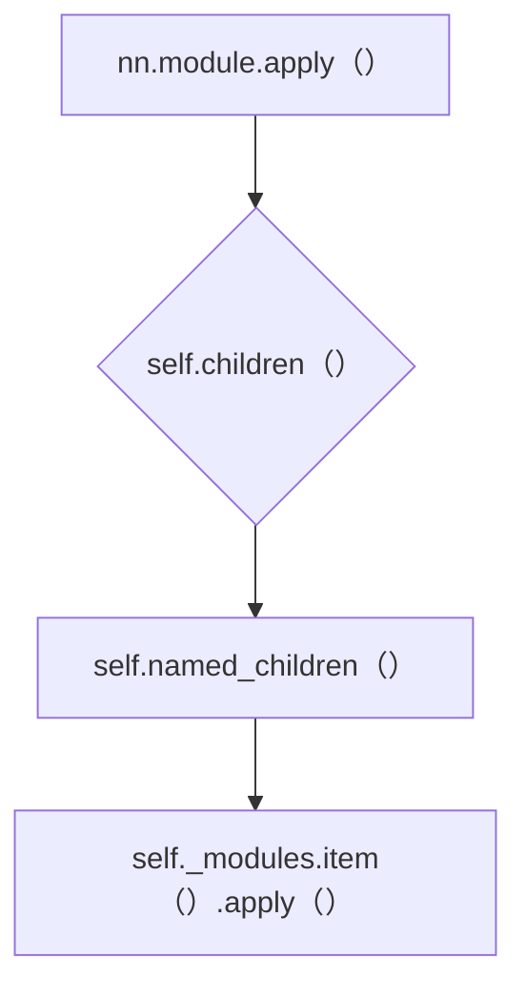

Pytorch官方文档：https://pytorch.org/docs/stable/index.html

# 学习的机制

建立模型的基本流程：

* 从朋友那里得到许多的好的数据

* 试着想象出其中的奥妙，因为总有某系可以的事情发生

* 选择有机会拟合数据的最简单的模型

* 将数据分割，并将数据从中划分出部分数据用于训练，并保留某些独立的数据集进行验证

* 从模型的随机参数开始，反复迭代，直到模型符合观测值

* 从独立的观测结果中验证模型

* 保持怀疑的态度回顾过去

    拟合数据实际上和算法从数据中学习几乎没有任何差别

# 入门

## 基础操作

### 张量

深度学习实际上我们需要完成任务就是：构建一个将输入数据转换为输出数据的系统，总结来看其实就像是小学学习的一个最基础的公式$y=kx+b$, 其中x就是输入数据，y就是输出数据，而系统转换的关键就是公式中的k、b参数，我们称这些参数为**中间表征**，因此可以发现系统是离不开数据的，而张量就是这些数据的载体形式。

张量表示一个由数值组成的数组，这个数组和Numpy中的array数组类似，这个数组可以有多个维度的轴，只有一个轴的张量就是数学中的向量，两个轴的张量就是对应了数学中的矩阵

我们可以使用==torch.tensor()==或者==torch,Tensor()==来创建张量

这两个函数的区别在最后一章问题中有提及

其实创建张量的方式有非常多，下面我们来介绍一下：

#### 1. 直接创建

顾名思义，直接创建就是直接使用torch中的工厂函数（torch.tensor）或者是张量构造函数（torch.Tensor）来进行创建张量

一般情况下，更加推荐使用torch.tensor，因为他能直接自动的将数据的数据类型继承下来，而不改变，而torch.Tensor则会默认将数据类型转换为Float格式，同时如果传入的是Numpy的ndarray类型的数据，则会默认进行浅拷贝（即改变返回的tensor时，传入的np.array数组也可能会被改变）

具体函数形式：

文档网址：https://pytorch.org/docs/2.5/generated/torch.tensor.html#torch.tensor

> **torch.tensor(*data*, \***, *dtype=None*, *device=None*, *requires_grad=False*, *pin_memory=False*) → [Tensor](https://pytorch.org/docs/2.5/tensors.html#torch.Tensor) 
>
> > **Parameters**:
> >
> > > * **data（array_like）张量的初始数据**，可以是列表、元组、Numpy的ndarray、标量以及其他类型
> >
> > **Keyword Arguments**
> >
> > > * **dtype（torch.dtype, optional）想要创建的tensor的具体数据类型。**Default：if was `None`, infers data type from `data`（如果没有指定该关键字，则默认创建的tensor的内部数据类型为初始数据的数据类型）
> > > * **device（torch.device, optional） 构建张量的设备**，如果该参数为`None`或者data参数是一个tensor，则默认将会和data的设备一样，而如果该参数为`None`或者data参数不是一个tensor，则将默认为CPU作为tensor的设备
> > > * **required_grad（bool, optional）是否需要为这个张量计算梯度**，并使用链式法则对张量建立计算图，同时每个权重张量参数的grad参数更新，这些梯度将会使用雅可比矩阵存储（这些梯度表示的是每一层输出对于该层的输入的偏导数）。而Loss对于输出层的权重参数的梯度则是Loss的导数
> > > * **pin_memory（bool, optional）是否需要将数据存放在锁页内存中。**其中锁页内存相当于物理内存（CPU内存）
> > >     而不锁页内存则相当于将数据存放在虚拟内存（硬盘）中，如果将数据存放在锁页内存中，则GPU能直接使用DMA（直接内存访问）技术，将数据更快的传输到GPU中进行计算


#### 2. 其他类型的创建张量

直接创建张量还有下面的这几种方法的大致汇总：

==torch.empty==: https://pytorch.org/docs/2.5/search.html?q=torch.empty&check_keywords=yes&area=default#（创建空的张量）

==torch.ones==: https://pytorch.org/docs/2.5/search.html?q=torch.ones&check_keywords=yes&area=default#（创建数据都是1的张量）

==torch.zeros==: https://pytorch.org/docs/2.5/search.html?q=torch.zeros&check_keywords=yes&area=default#（创建数据都是0的张量）

==torch.rand==: https://pytorch.org/docs/2.5/search.html?q=torch.rand&check_keywords=yes&area=default（创建数据都是随机的张量）


#### 3. 张量与Numpy的互相操作

==torch.from_numpy==: https://pytorch.org/docs/2.5/generated/torch.from_numpy.html#torch-from-numpy（将nd.array数组转换为张量）

==torch.as_tensor==: https://pytorch.org/docs/2.5/generated/torch.as_tensor.html（将数组转换为指定数据类型的张量）

==torch.tensor==: https://pytorch.org/docs/2.5/generated/torch.tensor.html（将传入的数组转换为同样大小以及数据类型的张量）

==x.numpy()==：将张量转换为Numpy数组（仅限CPU张量）


#### 张量的属性

张量的属性如下表：

| **属性**           | **说明**                         | **示例**                 |
| :----------------- | :------------------------------- | :----------------------- |
| `.shape`           | 获取张量的形状                   | `tensor.shape`           |
| `.size()`          | 获取张量的形状                   | `tensor.size()`          |
| `.dtype`           | 获取张量的数据类型               | `tensor.dtype`           |
| `.device`          | 查看张量所在的设备 (CPU/GPU)     | `tensor.device`          |
| `.dim()`           | 获取张量的维度数                 | `tensor.dim()`           |
| `.requires_grad`   | 是否启用梯度计算                 | `tensor.requires_grad`   |
| `.numel()`         | 获取张量中的元素总数             | `tensor.numel()`         |
| `.is_cuda`         | 检查张量是否在 GPU 上            | `tensor.is_cuda`         |
| `.T`               | 获取张量的转置（适用于 2D 张量） | `tensor.T`               |
| `.item()`          | 获取单元素张量的值               | `tensor.item()`          |
| `.is_contiguous()` | 检查张量是否连续存储             | `tensor.is_contiguous()` |


#### 张量的操作

##### 基础操作：

| **操作**                | **说明**                       | **示例代码**                  |
| :---------------------- | :----------------------------- | :---------------------------- |
| `+`, `-`, `*`, `/`      | 元素级加法、减法、乘法、除法。 | `z = x + y`                   |
| `torch.matmul(x, y)`    | 矩阵乘法。                     | `z = torch.matmul(x, y)`      |
| `torch.dot(x, y)`       | 向量点积（仅适用于 1D 张量）。 | `z = torch.dot(x, y)`         |
| `torch.sum(x)`          | 求和。                         | `z = torch.sum(x)`            |
| `torch.mean(x)`         | 求均值。                       | `z = torch.mean(x)`           |
| `torch.max(x)`          | 求最大值。                     | `z = torch.max(x)`            |
| `torch.min(x)`          | 求最小值。                     | `z = torch.min(x)`            |
| `torch.argmax(x, dim)`  | 返回最大值的索引（指定维度）。 | `z = torch.argmax(x, dim=1)`  |
| `torch.softmax(x, dim)` | 计算 softmax（指定维度）。     | `z = torch.softmax(x, dim=1)` |

##### **形状操作**

| **操作**                 | **说明**                       | **示例代码**                   |
| :----------------------- | :----------------------------- | :----------------------------- |
| `x.view(shape)`          | 改变张量的形状（不改变数据）。 | `z = x.view(3, 4)`             |
| `x.reshape(shape)`       | 类似于 `view`，但更灵活。      | `z = x.reshape(3, 4)`          |
| `x.t()`                  | 转置矩阵。                     | `z = x.t()`                    |
| `x.unsqueeze(dim)`       | 在指定维度添加一个维度。       | `z = x.unsqueeze(0)`           |
| `x.squeeze(dim)`         | 去掉指定维度为 1 的维度。      | `z = x.squeeze(0)`             |
| `torch.cat((x, y), dim)` | 按指定维度连接多个张量。       | `z = torch.cat((x, y), dim=1)` |


#### 张量的GPU加速

神经网络本质上是一个相当大的模型（公式）进行计算，而GPU的并行计算能力远远强于CPU，因此我们在进行神经网络训练的时候一般都使用GPU作为计算设备

因此我们在训练之前会将张量转移到GPU中：

```python
device = torch.device('cuda' if torch.cuda.is_available() else 'cpu')
x = torch.tensor([1.0, 2.0, 3.0], device=device)
```

其中==torch.cuda.is_available()==函数是用于查看GPU是否可以使用

再或者我们能够使用to()函数将在CPU中创建的张量复制到GPU上：

例如：

```python
points_gpu = points.to(device="cuda")
```


## 张量的底层逻辑

在Pytorch中，Tensor可以分为==信息区==与==存储区==（Storage）, **信息区**主要保存的是张量的形状（size）、步长（stride）、数据类型（dtype）等信息，而**Storage** 是一种底层数据结构，用于存储张量的数据，并且不管Tensor的形状如何变化（**注意**：这里指的tensor的形状如何变化是指原tensor的形状无论如何变化，Storage存储的值以及其顺序都不会改变，但如果使用了`reshape`函数，则返回的tensor将不会是原tensor，进而其Storage与原tensor的Storage有出入），Storage都是一个一维数组，并且其存储的值以及值得顺序都不会发生变化，当原Tensor的形状发生变化的时候，Storage并不会改变，只会改变Tensor信息区中的形状以及步长等参数

**注意**：在后面如果将torch.tensor存储到GPU中，那么在进行操作、复制、存储的时候将都会在GPU上进行，而当模型训练结束过后，并运行torch.save()函数进行保存模型参数文件的时候才会重新回到CPU，然后才会存储到硬盘中。


#### 序列化张量

创建动态张量是很好的，但如果张量中的数据是有价值的，那么我们将会希望将这个张量数据及时保存下来，并能够方便的加载回来。

Pytorch是使用pickle来序列化张量对象，而pickle是python语言中用于序列化与反序列化的模块，它能够将大多数python对象转换为字节流，并保存到硬盘中

##### 将张量保存到文件中

```python
torch.save(points, '../data/plch3/ourpoints.t')
```

或者

```python
with open('../data/plch3/ourpoints.t', 'wb') as f:
	torch.save(points, f)
```


##### 从文件中加载张量对象

```python
points = torch.load('../data/plch3/ourpoints.t')
```

或者

```python
with open('../data/plch3/ourpoints.t', 'rb') as f:
	points = torch.load(f)
```


## 计算图

Pytorch是动态图机制，所以在训练模型的时候，==每迭代一次就会构建一个新的计算图==，而**计算图**其实就是程序中变量之间的关系。其中**计算图的节点**就是参与运算的变量。**叶子节点**则是计算图中最底层的张量，这些张量并不是被计算得来的，（即例如：模型的参数张量、由用户直接创建的张量）


在上面的计算图中，节点就是参与运算的变量，而在Pytorch中使用<u>Varibale()</u>变量来包装的，而途中的边就是变量之间的运算关系，比如，<u>torch.mul()</u>, <u>torch.mm()</u>, <u>torch.div()</u>等等


而这个计算图中的变量a、b、c都是叶子节点，而f和g则并不是叶子节点，因为这两个都是a、b、c计算得来的，而且其并不是模型的参数，因此其并不是叶子节点

读到这里，可能你对计算图中的**backward**还是一知半解。例如上面提过**backward**只能是标量。那么在实际运用中，如果我们只需要求图中某一节点的梯度，而不是整个图的，又该如何做呢？下面举个例子，列子下面会给出解释。

```python3
x = Variable(torch.FloatTensor([[1, 2]]), requires_grad=True)  # 定义一个输入变量
y = Variable(torch.FloatTensor([[3, 4],        
                                [5, 6]]))
loss = torch.mm(x, y)    # 变量之间的运算
loss.backward(torch.FloatTensor([[1, 0]]), retain_graph=True)  # 求梯度，保留图                                    
print(x.grad.data)   # 求出 x_1 的梯度
x.grad.data.zero_()  # 最后的梯度会累加到叶节点，所以叶节点清零
loss.backward(torch.FloatTensor([[0, 1]]))   # 求出 x_2的梯度
print(x.grad.data)        # 求出 x_2的梯度
```

结果如下：

```py3tb
3  5
[torch.FloatTensor of size 1x2]

 4  6
[torch.FloatTensor of size 1x2]
```

可能看到上面例子有点懵，用数学表达式形式解释一下，上面程序等价于下面的数学表达式：

$x=(x1,x2)|x1=1,x2=2$

$y_1=3x_1+5x_2$

$y_2=4x_1+6x_2$

$x_1.grad=∂y_1/∂x_1⇒3,x_2.grad=∂y_1/∂x_2⇒5$

$x_1.grad=∂y_2/∂x_1⇒4,x_2.grad=∂y_2/∂x_2⇒6$

这样我们就很容易利用backward得到一个[雅克比行列式](https://zhida.zhihu.com/search?content_id=5540734&content_type=Article&match_order=1&q=雅克比行列式&zhida_source=entity)：


# 多层


# 卷积神经网络

卷积的意义：https://www.bilibili.com/video/BV1VV411478E/?spm_id_from=333.1387.favlist.content.click


这个公式可以理解成：

两个函数$f(x)$、$g(x)$组成一个系统，其中$x$为时间，在x时发生了$f(x)$这件事情，受到的$t-x$范围内发生的$g(t-x)$​这件事的影响

将这个映射成我们所学到的卷积神经网络进行视觉处理，我们可以将具体的卷积机制理解成，**在指定的像素点f(x)与指定卷积核的对应t-x位置的权重之间的关联程度，关联程度高则输出卷积操作后的保留值就越高**，简单点理解就是卷积核就是图像特征的像素关系，即特征的检测器

**在数学上，卷积就是将一个函数作为一个输入，另一个函数当作“滑动权重”（随事件变化的权重），一次性算出“过去所有的输入对当前时刻的加权总和”**

**在视觉处理上，卷积核实际上不是特征，而是特征的过滤器**（通过这个卷积核能够直接将图像中的特征提取出来）

在某一个像素点中他的像素值是一个值，而这个像素值是这个值是因为受到了周边像素值的影响的，比如说周围的几个像素的像素值与这个像素值之间的关系，具体周围几个像素点与这个像素点之间的具体影响需要看卷积核的，卷积核像素对应的权重决定了具体周围这几个像素值相对于这个像素值之间的重要性（影响）

而在卷积公式中，实际上的变量 $t$  和变量 $x$ 表达的意思也是不一样的，他们表达的意思是：

| 符号    | 含义                   | 形象比喻                    | 在图像处理中的对应                |
| :------ | :--------------------- | :-------------------------- | :-------------------------------- |
| **`t`** | **输出结果的位置坐标** | 你当前观察的时间点/空间位置 | 特征图上像素的坐标 (如第5行第5列) |
| **`x`** | **输入信号的遍历变量** | 滑动扫描时的临时位置        | 正在计算的局部窗口内像素的偏移量  |

在数学情况下的卷积，这两个变量之间需要有一定的限制，比如说变量 $t$ 应该要比变量 $x$ 大，这是因为在数学中的卷积实际上需要讲究一个**因果性**， 比如说观察的时间变量 $t $ 在10点钟的内容，但是你的遍历变量 $x$​ 在12点，这样就有问题了，因为你不能用未来的东西来观察现在的东西


### 卷积到底是是什么意思？

卷积的本质实际上就是让两个函数进行一个结合操作，卷积神经网络中的卷积核实际上就是图像特征的权重（<u>即什么像素特征重要，什么不重要，通过这个能够提取出重要的像素特征</u>），==通过这些卷积核与图像本身进行结合，能够得到图像中的卷积核想要的重要特征==，然后再通过这些底层的特征能够让线性神经网络能够通过**结合这些数据的特征**来进行识别图片中的指定物品

<u>其中卷积实际上就是两个函数的结合操作，最终卷积操作过后生成的东西由两个参与卷积计算的函数决定，即 $f(x)$、$g(t-x)$ 决定，而卷积核 $g(t-x)$ 则表明了第一个函数在一定范围内的之间的关系（这个关系中，具体的不同的关系决定的东西也不同，例如在视觉中，像素关系大的就能够更好的留下来），通过这个关系能够计算出如余量、特征等的数据</u>

像用一把梳子（$g(t-x)$）梳理毛线（$f(x)$），梳子的齿距决定了哪些部分的毛线会被保留或抑制。


### 卷积神经网络实际上是不是并没有使用出卷积的因果性？

是的，因为卷积神经网络的卷积层中实际上做的和数学卷积上类似的计算，即点积，但实际上，并没有完全使用出卷积的主要的卷的特性，因为在视觉处理中，卷积神经网络中的观测点与观测范围点之间进行 $t-x$ 计算的时候会有正有负，不能体现出卷积中 $t-x$​ 部分的因果性了

**结论**

1. CNN中的"卷积"确实是**术语误用**，实际是互相关操作
2. 抛弃翻转是**工程最优选择**：
    - 视觉任务不需要因果性
    - 学习机制可以补偿数学形式差异
3. 核心思想仍延续：**局部连接+权重共享+层次化特征提取**

您完全正确：CNN只是借用了卷积的概念框架，实际舍弃了"卷"的数学形式。这种取舍正是深度学习实用主义的典型体现——在保持计算效率的前提下，通过数据驱动学习来逼近理论效果。


### 为什么卷积需要卷呢？

卷积中的公式中的$g(t-x)$实际上就表示了卷积中的卷，但是为什么要卷呢？这是因为实际上的

这是因为卷积实际上需要有一个因果性的问题需要解决，假设你开了一家快递站：

- **`t` = 当前时间**（比如下午3点）
- **`x` = 快递到达的时间**（比如上午10点到的包裹）
- **`g(t-x)`** = 包裹到达后经过的时间（这里`t-x=5小时`）

**卷积计算**：
	"下午3点积压的包裹总量" = 把所有包裹(`f(x)`) × 它们的滞留时间影响(`g(t-x)`) 相加

其中变量 $t$ 的时间应该是比变量 $x$ 要大的，因为在变量 $t$ 中表示的是观察的时间，而变量 $x$ 中表示的是观察时间的过去某个范围内的时间，因此我们能够通过这个来计算出过去的那个时间对于现在观察的这个时间的具体影响

通过这个例子实际上我们能够看得出实际上的计算是需要将观察时间的过去某个范围内的时间进行翻转的，因此就是卷的含义


### 卷积为什么和傅里叶变化有关系？

在卷积中主要使用的就是一个**点乘**的内容，而在数学中，点乘能够衡量相似程度或者影响程度，当这两个相似程度或者是影响程度大的时候计算出来的值也大

# 炼丹

优化的所要解决的问题一般包含有：

1. 过拟合
2. 欠拟合
3. 拟合，但震荡
4. 恰好拟合
5. 不收敛


要干嘛：


# transformer

## AE架构


### Encoder 

作用：将高维输入数据（如图像、文本）压缩为低维隐变量，捕捉数据的本质特征


### Decoder

作用：将低维的隐变量重建为与原始输入相似的高维数据


# Pytorch

## torch.nn

在torch.nn中定义了许多神经网络的基础组件，通过这些基础的组件能够进行大部分通用神经网络的定义与操作，以下是这个包中的基础组件：

### torch.nn.Module

神经网络的基础组件的父类，

源码：[pytorch/torch/nn/modules/module.py at v2.7.0 · pytorch/pytorch](https://github.com/pytorch/pytorch/blob/v2.7.0/torch/nn/modules/module.py#L2760)s


ss


#### torch.nn.Module.apply

源码：[pytorch/torch/nn/modules/module.py at v2.7.0 · pytorch/pytorch](https://github.com/pytorch/pytorch/blob/v2.7.0/torch/nn/modules/module.py)

该函数通过调用self.children函数来**获取**self._module字典中的**所有网络组件并使用传入的fn函数来处理网络组件中的内容**，然后最后还会对执行apply函数的对象执行一次fn函数，确保所有的组件都被处理了一遍


Example:

```python
# 初始化网络权重的函数
def init_weights(m):
    print(f"the deal with module is: {type(m)}")
    if type(m) == nn.Linear:
        nn.init.xavier_uniform_(m.weight)
    
# 实现一个简单的多层感知机
def get_net():
    net = nn.Sequential(nn.Linear(4, 10),   
                        nn.ReLU(),
                        nn.Linear(10, 1))
	net.apply(init_weights)
	return net
	
net = get_net()

>>> 
the deal with module is: <class 'torch.nn.modules.linear.Linear'>
the deal with module is: <class 'torch.nn.modules.activation.ReLU'>
the deal with module is: <class 'torch.nn.modules.linear.Linear'>
the deal with module is: <class 'torch.nn.modules.container.Sequential'>
```

如上面这个例子可以看到，apply函数会使用<u>类似于</u>**深度优先算法（递归）**的形式来进行处理网络组件，它首先会遍历调用该函数网络模块的所有子模块，并再次递归去看子模块是否还有子模块，最后在处理好子子模块后再回头处理子模块，然后再继续回头处理子模块中的同级子模块， 并按照前面的方式进行处理：

```python
def apply(self: T, fn: Callable[["Module"], None]) -> T:
	for module in self.children():
            module.apply(fn)
    fn(self)
    return self
```


#### torch.nn.Module.Sequential

源码：[pytorch/torch/nn/modules/container.py at v2.7.0 · pytorch/pytorch](https://github.com/pytorch/pytorch/blob/v2.7.0/torch/nn/modules/container.py#L54)

这个是神经网络的顺序组件容器，**通过向这个容器传入继承了Module模块的网络组件模块，就能够构建一个网络**，且网络的结构是随着传入组件的顺序定义的，越早传入组件，组件就越靠近网络的输入层


执行逻辑：
首先依旧是执行\_\_init\_\(self\)函数，通过这个函数来将传入的网络组件模块存储到self._module字典中，并等待使用。


当使用forward函数的时候，将会将输入数据传入到第一个对象，然后是第二个，直到这个容器中的所有对象都按顺序传了一次

这个容器可以直接传入**nn的数据类型对象**，也可以传入**OrderedDict对象**，他们的<u>差别在于存储进module字典的key是否是自定义的名字，</u>
直接传入nn的数据类型对象的就默认使用1、2、3、4...这样的数字作为key
而使用OrderedDict对象则使用该对象传入的key作为module字典的key


# 问题

## Torch中的tensor和Tensor有什么区别？

1. 首先`torch.tensor()`函数是tensor类的一个**工厂函数**，它可以将许多种数据类型转换为张量的形式（比如：列表，数组等等）并且能够执行数据类型最

    重要的是：torch.tensor()函数是复制数据，即转换过后的tensor发生变化后不会影响到被转换的原始数据

    简单点来说，torch.tensor内部存储的数据类型是由被转换的数据的类型来决定的

    

2. `torch.Tensor()`这是tensor类的**实例化构造函数**，它是torch.FloatTensor的别名，也就是说它在实例化的时候默认创建的是数据类型为浮点数的tensor，它可能回复制被转换的数据，并不会影响原有数据，但也可能不会复制被转换的数据，这取决于*数据的类型*


3. 内存的共享: torch.tensor与torch.Tensor的区别就是一个复制数据，一个可能复制也可能不复制，尤其是当输入的是一个Numpy数组的时候，如果使用torch.Tensor()给Numpy的数组进行创建tensor的话，那么这个新的tensor与原始数组就会共享内存地址（除非是显式的请求复制）


4. 用法：torch.tensor()通常是首选，因为它在创建张量的时候提供了更多灵活性与明确性，它允许用户更加清晰的控制数据类型与是否复制

​		  torch.Tensor()通常式用于在默认数据类型为浮点数的情况下使用

具体的不同可查阅: https://discuss.pytorch.org/t/difference-between-torch-tensor-and-torch-tensor/30786

## 2.Tensor和Numpy之间的区别

1. 数据类型与打印方式

* 在numpy中，数组的类型是numpy.ndarray。要获取数组的类型，通常会使用type(x)，其中x就是数组
* 在Pytorch中，一个张量的类型是torch.Tensor或其伴生类（如：torch.FloatTensor）。要获得张量的数据类型（如float32，int64等），则可以使用x.dtype，而x.type()方法则可以用来获取完整的类别信息（包含其属于哪个类）

2. 计算位置不同

* numpy数组默认是在cpu上进行操作与运算，其本身不带GPU加速

* tensor张量则可以在CPU与GPU上进行操作与运行，通过使用.to()或.cuda()方法，我们可以将张量移动到GPU进行运算，这有助于我们更快的训练出网络


## 为什么在更新参数的时候需要使用torch.no_grad

在pytorch中，会自动构建计算图，在计算图中存放着模型参数的梯度值，而我们在训练神经网络的时候， Pytorch会自动跟踪张量的操作以构建计算图（用于自动微分），但在参数更新阶段（如：weight = weight - lr * grad）时，只是单纯的计算新的参数，并不需要记录这些梯度，同时如果不使用torch.no_grad来禁止梯度跟踪，则会导致计算图的不完整性，即计算图中的某个参数发生变化，就会导致计算图中的梯度会有出入，进而参数更新无效，因此Pytorch默认禁止原地修改模型的参数


## 为什么一定要保证损失函数的值为正数呢

这是为了保证以预测值与实际值之间的差距变小为目标，使得优化模型的方向是差距值越来越小的


## 为什么在googlenet这些模型中需要进行升维呢？

这是为了能够更好的发掘样本的特征，使得样本的特征能够更容易显现出来，从而更容易分类以及回归操作

[为什么需要进行升维](https://www.zhihu.com/question/511713076)


## 概率论与数理统计学习到什么程度才能进行学习序列模型与强化学习呢？

需要有一下两个部分

1. 主要的概率论基础（随机变量、分布、期望、贝叶斯）
2. 期望与方差
3. 大数定律与中心极限定理
4. 统计判断（参数估计、假设检验）
5. 马尔可夫性质：马尔科夫链、马尔可夫决策过程
6. 隐马尔可夫模型


## 为什么transformer中需要这种AE架构，这个架构的意义是什么？
