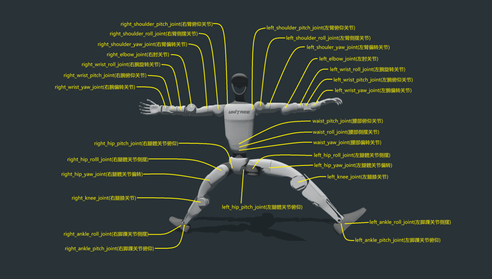
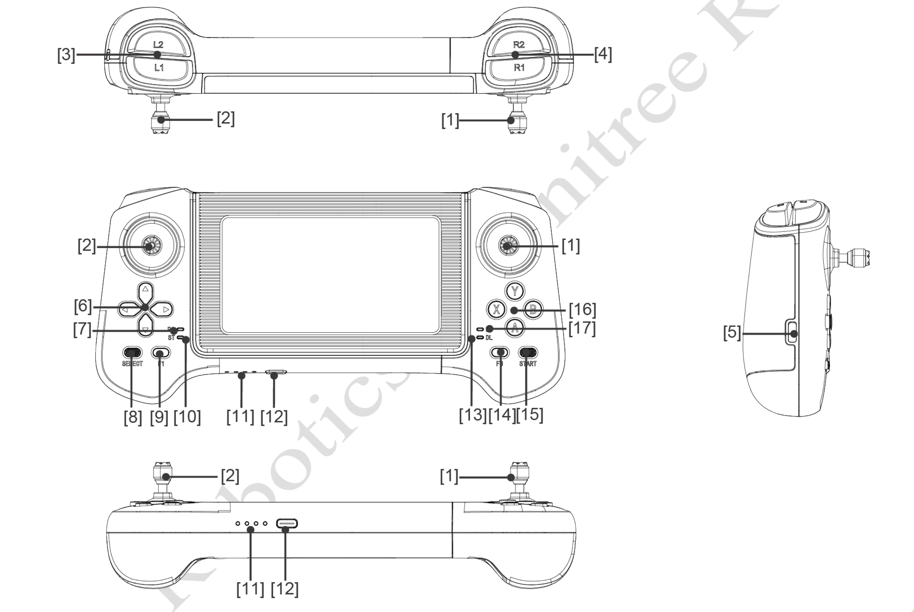
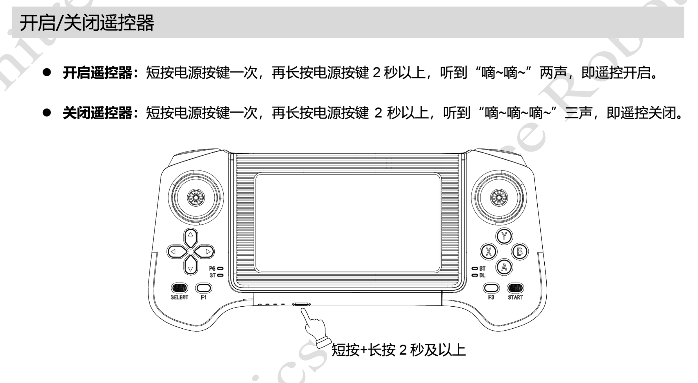
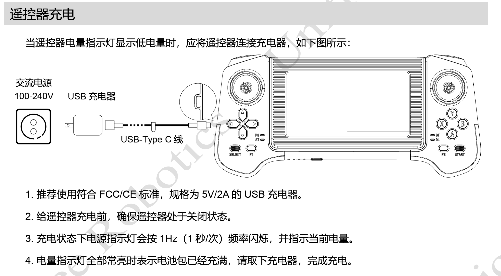
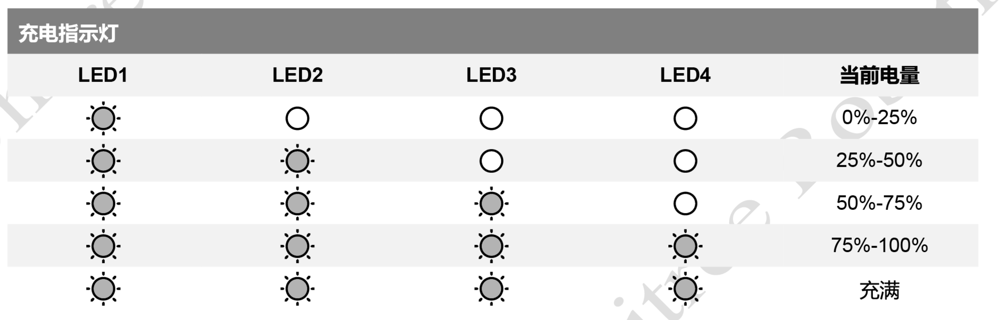

# 宇树 G1 人形机器人 使用手册

**版本**：v2.0
**适用型号**：Unitree G1 标准版 / G1-EDU 教育版
**最后更新**：2026年6月

------

## 手册前言

欢迎使用宇树 G1 人形机器人！G1 是宇树科技面向科研与商业应用推出的高性能人形机器人平台，以高自由度、强算力和开放的开发生态著称。本手册旨在帮助用户从零开始，完成从开箱验机到二次开发的全流程操作。

> **安全提示**：G1 关节扭矩大、动作迅猛，操作不当可能导致人身伤害或设备损坏。首次使用前请务必通读本手册，特别是**第二章 安全启动与关机流程**。

------

## 第一章 产品概述与硬件参数

### 1.1 产品简介

宇树 G1 是一款具备高度灵活性与动态平衡能力的人形机器人，身高约 132cm，体重约 35kg。它基于深度强化学习和仿真训练，能够完成动态站起、坐下折叠、舞棍等高难度动作，被定位为“AI化身”。


#### 机器人规格

| 型号              | G1                                                           | G1-EDU                                                       |
| :---------------- | ------------------------------------------------------------ | ------------------------------------------------------------ |
| 高宽厚(站立)      | 1320x450x200mm                                               | 1320x450x200mm                                               |
| 高宽厚（折叠）    | 690x450x300mm                                                | 690x450x300mm                                                |
| 带电池重量        | 约35kg                                                       | 约35kg                                                       |
| 总自由度          | 23                                                           | 23~43                                                        |
| 单腿自由度        | 6                                                            | 6                                                            |
| 腰部自由度        | 1                                                            | 1+（可加选2个腰部自由度）                                    |
| 单手臂自由度      | 5                                                            | 5                                                            |
| 单手自由度        | /                                                            | **7**（可加选力控3指灵巧手Dex3-1）+**2**（可加选2个手腕自由度） |
| 关节输出轴承      | 工业级交叉滚子轴承（高精度，高承载力）                       | 工业级交叉滚子轴承（高精度，高承载力）                       |
| 关节电机          | 低惯量高速内转子永磁同步电机 （更好的响应速度和散热）        | 低惯量高速内转子永磁同步电机 （更好的响应速度和散热）        |
| 膝关节最大扭矩[1] | 90N.m                                                        | 120N.m                                                       |
| 手臂最大负载[2]   | 约2Kg                                                        | 约3Kg                                                        |
| 小腿+大腿长度     | 0.6M                                                         | 0.6M                                                         |
| 手臂臂展          | 约0.45M                                                      | 约0.45M                                                      |
| 超大关节运动空间  | 腰关节：Z±155° 膝关节：0~165° 髋关节：P±154°、R-30~+170°、Y±158° | 腰关节：Z±155°、X±45°、Y±30° 膝关节：0~165° 髋关节：P±154°、R-30~+170°、Y±158° 腕关节：P±92.5°、Y±92.5° |
| 全关节中空内走线  | 有                                                           | 有                                                           |
| 关节编码器        | 双编码器                                                     | 双编码器                                                     |
| 散热系统          | 局部风冷散热                                                 | 局部风冷散热                                                 |
| 供电方式          | 13串锂电池                                                   | 13串锂电池                                                   |
| 基础算力          | 8核高性能CPU                                                 | 8核高性能CPU                                                 |
| 感知传感器        | 深度相机+3D激光雷达                                          | 深度相机+3D激光雷达                                          |
| 4麦克风阵列       | 有                                                           | 有                                                           |
| 5w扬声器          | 有                                                           | 有                                                           |
| WiFi6、蓝牙5.2    | 有                                                           | 有                                                           |
| 高算力模组        | /                                                            | NVIDIA Jetson Orin                                           |
| 智能电池（快拆）  | 9000mAh                                                      | 9000mAh                                                      |
| 充电器            | 54V 5A                                                       | 54V 5A                                                       |
| 手持式遥控器      | 有                                                           | 有                                                           |
| 续航时间          | 约2h                                                         | 约2h                                                         |
| 智能OTA升级       | 有                                                           | 有                                                           |
| 二次开发[3]       | /                                                            | 有                                                           |


### 1.2 详细机载规格参数

#### 机载计算机

G1-EDU 机载标配 1 块【运控计算单元】，并且标配一块【开发计算单元】。

|         参数         |                   开发计算单元（ PC2 )                   |
| :------------------: | :------------------------------------------------------: |
|         型号         |                      Jetson Orin NX                      |
|         CPU          |                    Arm® Cortex®-A78AE                    |
|        内核数        |                            8                             |
|        线程数        |                            8                             |
|     最大睿频频率     |                           2GHz                           |
|         显存         |                           16G                            |
|         内存         |                           16G                            |
|         缓存         |                     2MB L2 + 4MB L3                      |
|         存储         |                            2T                            |
| 英特尔® 图像处理单元 |                           6.0                            |
|         GPU          | 搭载 32 个 Tensor Core 的 1024 核 NVIDIA Ampere 架构 GPU |
|   显卡最大动态频率   |                          918MHz                          |
|   高斯和神经加速器   |                           3.0                            |
| 英特尔®深度学习提升  |                            是                            |
| 英特尔®Adaptix™ 技术 |                            是                            |
|  英特尔®超线程技术   |                            是                            |
|        指令集        |                          64bit                           |
|        OpenGL        |                           4.6                            |
|        OpenCL        |                           3.0                            |
|       DirectX        |                           12.1                           |
|       IP 地址        |                     192.168.123.164                      |

> - 【运控计算单元】为 Unitree 运动控制程序专用，不对外开放。开发者仅可使用【开发计算单元】进行二次开发。初始用户名：`unitree`, 密码:`123`。
> - 表中PC2【开发计算单元】，地址为192.168.123.164。
> - CPU 模块发货时可能变更为不低于上述的性能的更先进版本。


#### 1.2.1 部件名称

G1 整机分为上半身和下半身，具备多个自由度。单手臂拥有 5 个自由度和 7 个自由度两个版本，包括肩身关节、上臂关节、手肘关节和腕关节（选配）。单腿拥有 6 个自由度，包括胯关节、腿关节、髋关节、膝关节和踝关节。腰部具备 1自由度和3自由度两个版本，即腰关节。整机根据版本不同，可以分为 G1 基础版本 23 自由度，G1-EDU可选23~43 自由度，拥有多个关节电机自由度，使得机器人能够实现精确的运动和姿态控制。

| 类型         | G1                                                           | G1-EDU                                                       |
| ------------ | ------------------------------------------------------------ | ------------------------------------------------------------ |
| 总自由度     | 23                                                           | 23~43                                                        |
| 单腿自由度   | 6                                                            | 6                                                            |
| 腰部自由度   | 1                                                            | 1+（可加选2个腰部自由度）                                    |
| 单手臂自由度 | 5                                                            | 5                                                            |
| 单手自由度   | /                                                            | **7**（可加选力控3指灵巧手Dex3-1）+ **2**（可加选 2 个手腕自由度） |
| 部件说明     |  |  |


#### 电气接口

G1 的顶部配备了电气接口，这些接口用于连接各个机身关节电机、传感器外设、网口等。这样的设计使您能够方便地进行调试、排查问题以及进行二次开发。


​															G1 顶部视图


| 序号 | 接口类型  | 接口简称        | 接口说明                                |
| ---- | --------- | --------------- | --------------------------------------- |
| 1    | XT30UPB-F | VBAT            | 58V/5A 电池电源输出（此处直连电池电源） |
| 2    | XT30UPB-F | 24V             | 24V/5A电源输出                          |
| 3    | XT30UPB-F | 12V             | 12V/5A电源输出                          |
| 4    | RJ45      | 1000 BASE-T     | 千兆以太网                              |
| 5    | RJ45      | 1000 BASE-T     | 千兆以太网                              |
| 6    | Type-C    | Type-C          | 支持USB3.0 host，5V/1.5A电源输出        |
| 7    | Type-C    | Type-C          | 支持USB3.0 host，5V/1.5A电源输出        |
| 8    | Type-C    | Type-C          | 支持USB3.0 host，5V/1.5A电源输出        |
| 9    | Type-C    | Alt Mode Type-C | 支持USB3.2 host，支持DP1.4              |
| 10   | I/O       | I/O OUT         | 12V: 12V/3A电源输出 GPIO详见下表        |

RJ45及IO列表

| GPIO编号 | NX引脚号 | 复用关系  | debugfs文件系统的引脚名 |
| :------- | :------- | :-------- | :---------------------- |
| GPIO1    | 203      | UART1_TXD | GPIO3_PR.02             |
| GPIO2    | 205      | UART1_RXD | GPIO3_PR.03             |
| GPIO3    | 232      | I2C2_SCL  | GPIO3_PI.03             |
| GPIO4    | 234      | I2C2_SDA  | GPIO3_PI.04             |
| GPIO5    | 128      | GPIO      | GPIO3_PCC.02            |
| GPIO6    | 130      | GPIO      | GPIO3_PCC.03            |

注意：

NVIDIA的GPIO的操作方式有很多种，NVIDIA的GPIO定义可以参考如下链接：
https://docs.nvidia.com/jetson/archives/r35.2.1/DeveloperGuide/text/HR/JetsonModuleAdaptationAndBringUp/JetsonOrinNxSeries.html#identifying-the-gpio-number


## G1雷达与相机的视场角

G1头部搭载LIVOX-MID360激光雷达，为机器人提供了卓越的环境感知能力。激光雷达采用全方位、全角度的扫描技术，FOV水平可达360°，竖直最大59°，能够实时获取精准的环境数据。它能够快速识别和测量周围的物体，提供高分辨率的点云数据。

MID360激光雷达FOV 

​															D435i深度相机FOV


G1头部搭载D435i深度相机，为机器人提供了卓越的视觉感知能力，能够更准确地感知和理解周围环境，实现精确的空间感知和障碍物检测，使机器人能够更智能、灵活地与环境进行交互和应对各种场景。


​														MID360+D435i合并的FOV


### 1.3 核心硬件架构

#### 1.3.1 关节系统

G1 关节采用了 Unitree 自研电机，具备出色的性能和特点。电机的最大扭矩为 120N.m，采用了中空轴线的设计，使得电机在结构上更加轻量化、紧凑化。电机还配备了双编码器，提供更准确的位置和速度反馈，以满足高精度控制的需求。

具体的关节定义如下：

> 


##### 腿部部件**

|关节序号|  关节名称| 相对关节| 关节作用|   限位(弧度)|
|----------|---------|-----------|------------------|-------------|
|0| left_hip_pitch_joint|髋关节|控制左腿的前抬后伸 |    -2.5307~2.8798|
|1| left_hip_roll_joint|髋关节|控制左腿的外展内收 | -0.5236~2.9671|
|2| left_hip_yaw_joint|髋关节|控制左腿的旋转 |  -2.7576~2.7576|
|3| left_knee_joint|膝关节|控制左腿弯曲（屈曲）和伸直（伸展） | -0.087267~2.8798|
|4| left_ankle_pitch_joint|踝关节|控制左脚上翘（背屈）和下压（跖屈）|   -0.87267~0.5236|
|5| left_ankle_roll_joint|踝关节|控制左脚的侧翻和内翻|  -0.2618~0.2618|
|6| right_hip_pitch_joint|髋关节|控制右腿的前抬后伸 |   -2.5307~2.8798|
|7| right_hip_roll_joint|髋关节|控制右腿的外展内收 |    -2.9671~0.5236|
|8| right_hip_yaw_joint|髋关节|控制右腿的旋转 | -2.7576~2.7576|
|9| right_knee_joint|膝关节|控制右腿弯曲（屈曲）和伸直（伸展） |    -0.087267~2.8798|
|10| right_ankle_pitch_joint|踝关节|控制右脚上翘（背屈）和下压（跖屈）| -0.87267~0.5236|
|11| right_ankle_roll_joint|踝关节|控制右脚的侧翻和内翻|    -0.2618~0.2618|


##### **腰部部件**

|关节序号|  关节名称| 相对关节| 关节作用|   限位(弧度)|
|----------|---------|-----------|------------------|-------------|
|12|    waist_yaw_joint|脊椎|控制腰部旋转|  -2.618~2.618|
|13|    waist_roll_joint|脊椎|控制腰部侧摆| -0.52~0.52|
|14|    waist_pitch_joint|脊椎|控制腰部前倾后仰|    -0.52~0.52|


##### **手臂部件**

|关节序号|  关节名称| 相对关节| 关节作用|   限位(弧度)|
|----------|---------|-----------|------------------|-------------|
|15|    left_shoulder_pitch_joint|肩关节|控制左臂上举下降|  -3.0892~2.6704|
|16|    left_shoulder_roll_joint|肩关节|控制左臂前伸后摆|   -1.5882~2.2515|
|17|    left_shoulder_yaw_joint|肩关节|控制左臂外展内收|    -2.618~2.618|
|18|    left_elbow_joint|肘关节|控制左臂弯曲或伸直| -1.0472~2.0944|
|19|    left_wrist_roll_joint|腕关节|控制左手手腕旋转|  -1.972222054~1.972222054|
|20|    left_wrist_pitch_joint|腕关节|控制左手手腕尺偏（向小指侧偏移）和桡偏（向拇指侧偏移）|   -1.614429558~1.614429558|
|21|    left_wrist_yaw_joint|腕关节|控制左手手腕屈曲、伸展| -1.614429558~1.614429558|
|22|    right_shoulder_pitch_joint|肩关节|控制右臂上举下降| -3.0892~2.6704|
|23|    right_shoulder_roll_joint|肩关节|控制右臂前伸后摆|  -2.2515~1.5882|
|24|    right_shoulder_yaw_joint|肩关节|控制右臂外展内收|   -2.618~2.618|
|25|    right_elbow_joint|肘关节|控制右臂弯曲或伸直|    -1.0472~2.0944|
|26|    right_wrist_roll_joint|腕关节|控制右手手腕旋转| -1.972222054~1.972222054|
|27|    right_wrist_pitch_joint|腕关节|控制右手手腕尺偏（向小指侧偏移）和桡偏（向拇指侧偏移）|  -1.614429558~1.614429558
|28|    right_wrist_yaw_joint|腕关节|控制右手手腕屈曲、伸展|    -1.614429558~1.614429558|


### 1.4 遥控说明

遥控案件说明










#### 概念说明

| 概念         | 说明                                                         |
| ------------ | ------------------------------------------------------------ |
| 零力矩模式   | 机器人所有电机停止主动运动，摆动时没有阻尼感。               |
| 阻尼模式     | 机器人所有电机停止主动运动，摆动时有明显阻尼感，可以进入预备模式 |
| 预备模式     | 机器人将在5秒内缓慢摆出运动模式前的准备姿势（无平衡控制）    |
| 下蹲模式     | 机器人将在5秒内缓慢摆出下蹲姿势（无平衡控制）                |
| 落座模式     | 机器人将在5秒内缓慢摆出落座姿势（无平衡控制）                |
| 运动模式     | 可以通过遥控器控制机器人移动的模式                           |
| 持续走路模式 | 机器人始终处于踏步状态                                       |
| 站立模式     | 该模式下，当摇杆指令为零时，机器人停止踏步，进入站立；当摇杆指令不为零，或机器人受到干扰难以维持平衡时，机器人将开始迈步。 |
| 调试模式     | 用于底层开发。在需要使用 SDK 进行开发调试时，请务必确保 G1 已经进入调试模式(阻尼或零力矩模式下，遥控器按L2+R2进入调试模式)，以停止运动控制程序发送指令，这样可以避免潜在的指令冲突问题。您可以按下 L2+A 来确认是否进入了调试模式。调试中，若出现紧急情况，请通过遥控器按 L2 + B 让设备进入阻尼状态。 |

> 机器人行走模式，暂未部署爬楼梯的功能，请勿随意爬楼梯，避免损伤机器人。


#### 运控状态与LED灯颜色显示

| 运控模式   | LED灯带颜色  |
| ---------- | ------------ |
| 正常运控   | 蓝灯常亮     |
| 阻尼模式   | 橙灯常亮     |
| 落座模式   | 绿灯常亮     |
| 调试模式   | 黄灯常亮     |
| 零力矩模式 | 紫灯常亮     |
| 预备模式   | 深蓝色灯常亮 |
| 异常状态   | 红灯常亮     |

------


#### 模式切换

<u>**模式切换的按键需根据拿到的手柄遥控的按键说明进行操行，下图仅为模式介绍与说明，不代表正确的按键作用**</u>


>  注意
>
> 1、从**主运控**通过 **L2 + A** 切回**蹲姿**状态后，在不关机的情况下，如果还想切**回主运控**模式，需要通过 **L2 + B** 进入**阻尼**模式，再通过 **L2 + A** 才能切回**主运控**。
>
> 2、设备部仅支持在`零力矩`或者`阻尼`状态下，按`L2+R2`才能进入`调试模式`
>
> 3、在站立状态下，部分按键需要组合`长按2秒`才能生效。
>
>  4、**L2 + B** `阻尼按键，作为急停按键，在调试状态下依然有效, 能有效阻止机器人状态失控。`


## 第二章 基础操作指南

### 2.1 电池安装与充电

**电池安装步骤**：

1.  **安装电池包**

    将 电池从机身侧面插入电池槽，注意安装方向,不要强行按压，以免损坏电池接口和卡扣，当听到“咔哒~”声，电池包安装完成。

    |                           插入电池                           |                           开机启动                           |
    | :----------------------------------------------------------: | :----------------------------------------------------------: |
    |  |  |


### 2.2 三种开机方式

G1 支持三种开机方式，需根据使用场景选择：

1. **Step1：机身摆放**
    在条件允许的情况下，G1支持坐在椅子上开机。首先确保G1端坐在椅子上，手臂和腿部保持自然摆放。

    

    

    **Step2： 安装电池包**

    将 电池从机身侧面插入电池槽，注意安装方向,不要强行按压，以免损坏电池接口和卡扣，当听到“咔哒~”声，电池包安装完成。

    |                           插入电池                           |                           开机启动                           |
    | :----------------------------------------------------------: | :----------------------------------------------------------: |
    |  |  |
    |                                                              |                                                              |

    **Step3： 启动成功**

    短按+长按电源开机后，等待1分钟左右，待G1进入零力矩状态，按下 L2 + B 进入阻尼状态，此时拉住G1肩部后把手，同时按下 L2 + UP 键，帮助G1进入预备状态，如下图所示。当 G1 被扶直站立后，可以按下 **R2 + A（单自由度腰）** 进入运控状态。

    

#### 方式二：悬挂开机

1. **Step1：悬挂 G1**

    请使用保护架悬挂 G1 以确保安全。

    

    

    **Step2： 安装电池包**

    将电池从机身侧面插入电池槽，注意安装方向,不要强行按压，以免损坏电池接口和卡扣，当听到“咔哒~”声，电池包安装完成。

    |                           插入电池                           |                           开机启动                           |
    | :----------------------------------------------------------: | :----------------------------------------------------------: |
    |  |  |
    |                                                              |                                                              |

    **Step3：机身摆放**

    将 G1 悬挂起来后，按自然位置摆放。

    

    

    **Step4：开机启动**

    短按电池的电源开关键 1 次，再长按电源开关键 2 秒 以上，电池上电。

    **Step5：成功开机**

    开机全过程大概持续1分钟，请耐心等待。当所有关节处于零力矩状态，表示初始化成功。按下遥控器 **L2 + B** 进入阻尼以解锁控制，再按 **L2 + UP** 进入预备状态。此时 G1 姿态如下图所示。

    

    

    **Step6：下降悬挂绳**

    下降悬挂绳后，使 G1 双足触地。再次按下遥控器的 **R2 + A**，此时控制程序启动，G1 从预备状态进入运动状态，G1 开始调整步态后站立。

    

    

    **Step7：解开悬挂绳**

    待 G1 运动稳定后，可以完全释放挂钩。此时可操作遥控器的左右摇杆控制 G1 移动。

    按下遥控器上的 **START** 可控制 G1 在站立状态和行走状态之间切换。

    

    

    注意:

    **急停**：当 G1 出现意外状态时，按下 **L2 + B**，G1 进入**阻尼模式**，此模式下，设备将会因为失去平衡控制而摔倒。

    

#### 方式三：蹲姿开机


**Step1： G1 机身摆放**

G1 保持折叠蹲姿状态


**Step2： 安装电池包**

将电池从机身侧面插入电池槽，注意安装方向,不要强行按压，以免损坏电池接口和卡扣，当听到“咔哒~”声，电池包安装完成。

|                           插入电池                           |                           开机启动                           |
| :----------------------------------------------------------: | :----------------------------------------------------------: |
|  |  |
|                                                              |                                                              |

**Step3：开机启动**

短按电池的电源开关键 1 次，再长按电源开关键 2 秒 以上，电池上电。


**Step4：成功开机**

开机全过程大概持续1分钟，请耐心等待。当所有关节处于零力矩状态，表示初始化成功。按下遥控器 **L2 + B** 进入阻尼以解锁控制，再按 **L2 + UP** 进入预备状态。此时 G1 姿态如下图所示。


### 2.3 标准关机流程

⚠️ **严禁直接断电！** 必须按以下流程操作：

1. **遥控器操作**：长按 `L2 + A` 组合键，机器人蹲下模式
2. **长按机身电源键**：等待灯光完全熄灭
3. **断开电池**（如需）：按压电池释放卡扣，拔出电池


### 2.4 紧急停止（急停）

如遇机器人失控或意外情况：

> **按下 `L2 + B`** → 机器人立即进入阻尼模式，关节松弛，缓慢倒地

**注意**：急停后机器人不会站立，请及时扶起并检查状态。

------


## 第三章 连接与开发环境配置

### 3.1 有线连接（推荐新手）

有线连接是通过网线直连开发电脑与 G1 机器人，延迟低、稳定性高，适合底层调试。

**前置条件**：

- 开发电脑：Ubuntu 20.04（推荐）/ Windows + 虚拟机
- 网线：Cat5e 或以上

**配置步骤**：

1. **物理连接**：网线一端插入 G1 顶部接口的 RJ45 口，另一端接入电脑
2. **配置电脑 IP**：
    - Ubuntu：设置 → Network → 有线连接 → IPv4 设置为 Manual
    - IP Address: `192.168.123.99`（或同一网段未占用的地址）
    - Subnet Mask: `255.255.255.0`
3. **验证连接**：终端执行 `ping 192.168.123.161`

```
ping 192.168.123.161
# 如返回响应包，连接成功
```

4. SSH 连接，在电脑中打开 终端 （`cmd.....`），并使用以下指令来连接：

```
ssh unitree@192.168.123.164
```


**G1 默认 IP 地址**：

| 节点              | IP                |
| :---------------- | :---------------- |
| 机载主控电脑      | `192.168.123.161` |
| 二次开发板（EDU） | `192.168.123.164` |


### 3.2 无线连接（SSH远程访问）

适合需要机器人自由移动的场景。

**首次配网**：**需先完成上面的有线连接**

1. 在使用有线连接并通过 ssh 

2. 开机进入 Ubuntu 桌面

3. 在终端中输入 `sudo nmcli dev wifi connect "你的WiFi名称(SSID)" password "你的WiFi密码"`

    >  如果连接失败，可能需要指定网卡，例如 `ifname wlan0`。

4. **查看连接状态**：

    ```
    nmcli device status
    ```

5. **查看 IP**：

    ```
    ip addr
    ```

    

**SSH 登录（开发电脑）**：

```
ssh unitree@<刚查看的机器人IP>
# 默认密码：123
```


------


### C. 官方资源导航

| 资源             | 链接/说明                                           |
| :--------------- | :-------------------------------------------------- |
| 宇树官网         | [https://www.unitree.com](https://www.unitree.com/) |
| G1 产品页        | https://www.unitree.com/operate/g1[citation:2]      |
| Explore APP 下载 | https://www.unitree-robot.com/cn/app/g1[citation:9] |
| GitHub 开源仓库  | https://github.com/unitreerobotics                  |
| SDK 文档         | Unitree 官方文档中心                                |