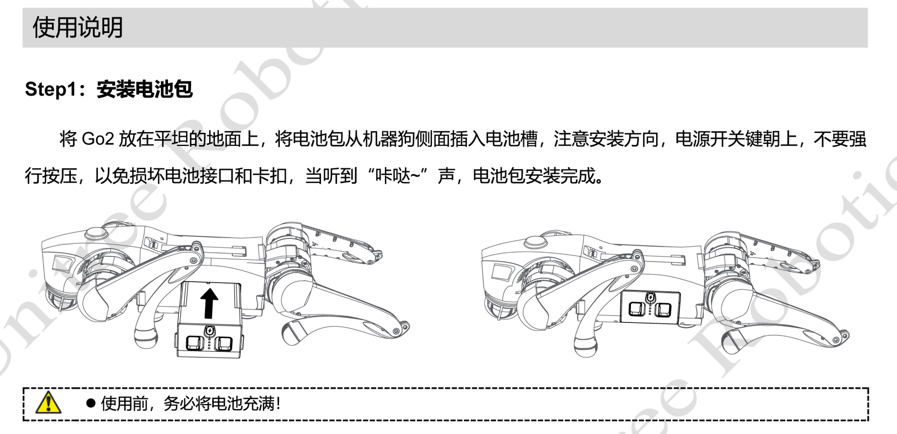
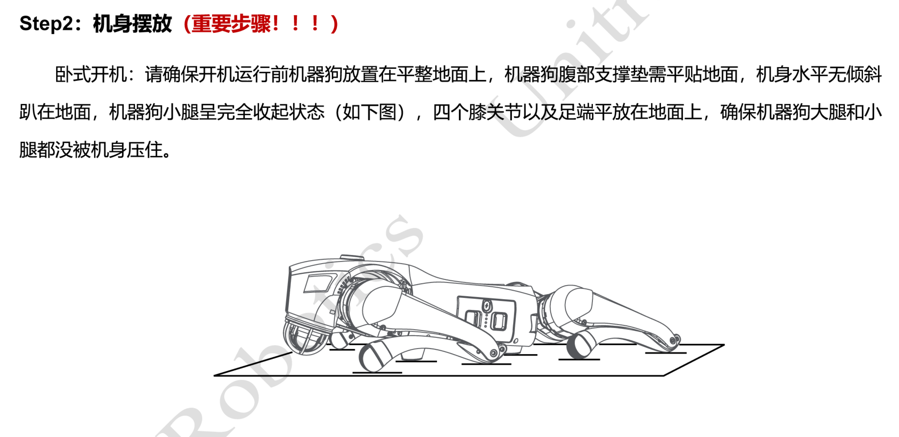
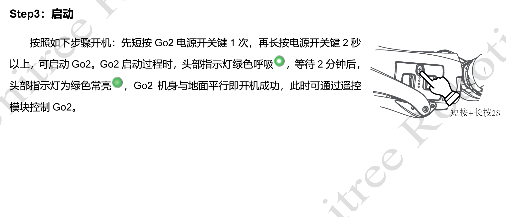
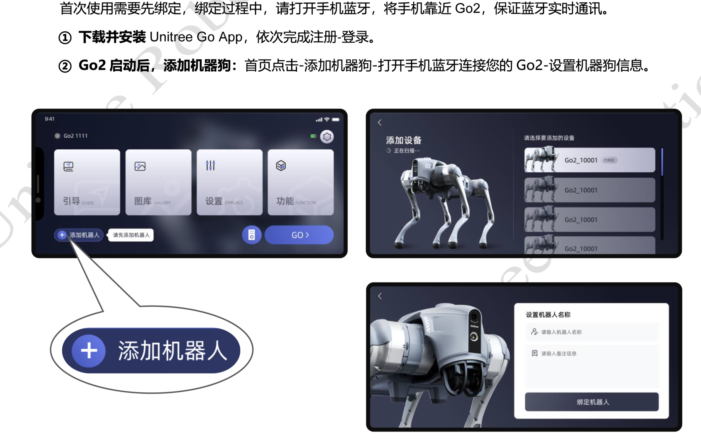
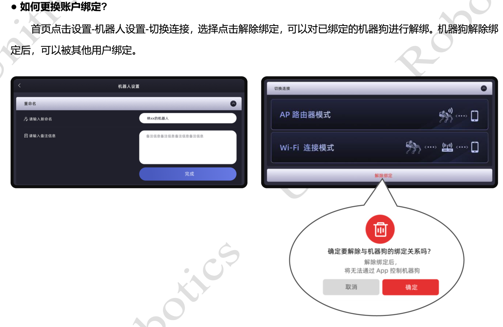
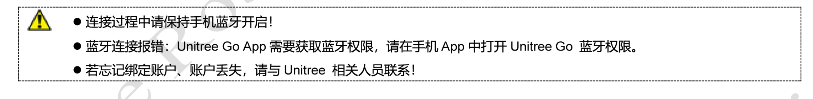
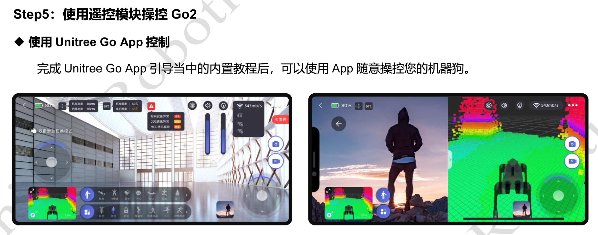

# 部件名称

**GO2 EDU**

背部负载安装孔位图：单位 mm

## 电气接口

- **电源接口**

DC 28.8V输出，连接Orin NX 8/16GB高算力模组BAT输入。

- **以太网接口**

标准RJ45接口，连接User PC/Orin NX 8/16GB，RJ45以太网接口。

- **SBUS接口**

用于通用遥控器上的通讯连接，此接口不提供电源输出，接口定义（从左往右边）：NC/GND/SBUS。

## 雷达

头部 4D LiDAR-L2 采用宇树 Unitree 自研 4D 雷达技术（3D 位置 +1D 灰度），它可以实现每秒 21600 次的高速激光测距采样，实时获取周围环境的三维信息，可用于运动避障，能够应付各种复杂路况！

| Unitree 4D LiDAR |                              |
| :--------------- | ---------------------------- |
| 型号             | L2                           |
| 尺寸             | 75（宽）x75（深）x65（高）mm |
| 供电电压         | 12V DC                       |
| 激光波长         | 905nm                        |
| FOV              | 360°*90°                     |

## 指示灯

|                             颜色                             |   状态   |                    含义                    |
| :----------------------------------------------------------: | :------: | :----------------------------------------: |
|  | 绿灯呼吸 |                   开机中                   |
|  | 绿灯常亮 |           开机完成，默认避障开启           |
|  | 蓝灯常亮 |                  避障关闭                  |
|  | 黄灯常亮 |                  续航模式                  |
|  | 紫灯常亮 |              伴随模式开启状态              |
|  | 蓝灯慢闪 |              电机&IMU 标定中               |
|  | 黄灯慢闪 |       低电量预警，10分钟内将自动爬下       |
|  | 红灯慢闪 | 系统异常，开机失败，硬件故障、需要联系售后 |
|  | 红灯快闪 |             电机&IMU 标定失败              |
|  | 白灯常亮 |              前置探照灯（3w）              |

note

灯光优先级：伴随模式开启（紫灯常亮）>续航模式（黄灯常亮）>避障关闭（蓝灯常亮）.

## 摄像头

头部相机支持720p,15fps,1080p,15fps双码流，摄像头具有1080P(HD)15fps或720p 15fps高清拍摄能力，通光孔径F2.2，视场角120°。可进行App高清图传，在无干扰无遮挡环境下，摄像头可以保证流畅的720p 15fps高清图传。

## 关节序号与关节限位

四足机器人像动物一样，身体（Trunk）和四肢（Leg）都是左右对称的。四条腿，按照前后分成两组，

这两组除了前后不同，坐标系和关节活动范围等都相同的。

| 腿和关节的序号：              |
| :---------------------------- |
| Leg 0 ：FR，右前腿            |
| Leg 1 ：FL，左前腿            |
| Leg 2 ：RR，右后腿            |
| Leg 3 ：RL，左后腿            |
| Joint 0 ：Hip，机身关节       |
| Joint 1 ：Thigh，大腿关节     |
| Joint 2 ：Calf，小腿关节      |
| e.g.FR_thigth：右前腿大腿关节 |

| 各关节限位：                                                 |
| :----------------------------------------------------------- |
| 机身关节：-48°~48°                                           |
| 大腿关节：竖直方向为0°，前进方向为正，后腿-260°~30°，前腿-200°~90° |
| 小腿关节： -156°~-48°                                        |

机身关节限位

## 坐标系，关节旋转轴与关节零点

机身关节旋转轴为 x 轴，大腿关节和小腿关节的旋转轴为 y 轴，旋转正方向符合右手定则。

当各个关节均为零度时，各坐标系如上图。红色为 x 轴，绿色为 y 轴，蓝色为 z 轴。小腿关节由于限位，实际到不了这个位置，这里仅为了指明零点位置。可以看出，各个关节坐标系的初始姿态都是一致的，只是位置和旋转轴不同。

# 机器人规格

## 尺寸

| 参数                 | 规格                  |
| :------------------- | :-------------------- |
| 裸机长宽高（站立）   | 70cm*31cm*40cm        |
| 裸机长宽高（趴下）   | 76cm*31cm*20cm        |
| 裸机净重（不含电池） | 约15kg                |
| 自由度               | 12                    |
| 最大速度             | 3.7m/s（极限 ~ 5m/s） |

## 环境

| 参数         | 规格                       |
| :----------- | :------------------------- |
| 工作温度     | 5℃-35℃，天气良好环境下运行 |
| 斜坡         | +/- 40°                    |
| 最大台阶高度 | 16cm                       |
| 照明         | 3W探照灯                   |

## 电池相关

| 规格参数     |                  |                 |
| :----------- | ---------------- | --------------- |
| 电池型号     | BT2-05           | BT2-06          |
| 电池重量     | 2.5kg            | 2.5kg           |
| 电池容量     | 8000mAh，236.8Wh | 15000mAh，432Wh |
| 额定电压     | DC 29.6V         | DC 28.8V        |
| 充电限制电压 | DC 33.6V         | DC 33.6V        |
| 运行时长     | 1-2h             | 3-5h            |
| 充电方式     | 慢充             | 快充/充电桩     |
| 充电电流     | 3.5A             | 9A              |
| 充电时长     | 2h               | 1h"15           |

## 内部相关

| 规格参数 |                        |
| :------- | ---------------------- |
| 处理芯片 | 8核处理器              |
| 4G       | 内置贴片SIM卡          |
| Wi-Fi    | WiFi 6 双频无线802.11x |
| 蓝牙     | 5.2/4.2/2.1            |
| 存储空间 | 64G                    |
| 输出电源 | DC 28.8V(电池电压)     |
| 连接     | RJ45以太网口           |

## 外部挂载

### 拓展坞

| 规格参数     |                                                              |                                                              |
| :----------- | ------------------------------------------------------------ | ------------------------------------------------------------ |
| 型号         | Orin Nano 8GB                                                | Orin NX 16GB                                                 |
| 供电电压范围 | 16-60V DC                                                    | 16-60V DC                                                    |
| 算力         | 支持可达40Tops算力                                           | 支持可达100Tops算力                                          |
| 拓展接口     | USB3.0-Type A X1、 USB3.0-Type C X1 、USB2.0-Type C X1 、 千兆以太网口（标准RJ45）X2、 百兆以太网（GH1.25-4PIN）X1、 M8航插接口X1 | USB3.0-Type A X1、 USB3.0-Type C X1 、USB2.0-Type C X1 、 千兆以太网口（标准RJ45）X2、 百兆以太网（GH1.25-4PIN）X1、 M8航插接口X1 |

### 激光雷达

Go2适配两款激光雷达，MID-360、禾赛XT16激光雷达可用于 Slam 导航。

| 规格参数     |                       |                                             |
| :----------- | --------------------- | ------------------------------------------- |
| 型号         | MID-360激光雷达       | XT-16激光雷达                               |
| 尺寸         | 65mm*65mm*60mm        | Φ100.0 / 103.0 mm*76mm                      |
| 供电电压范围 | 9-27V DC              | 9-36V DC                                    |
| 激光波长     | 905nm                 | 905nm                                       |
| FOV          | 水平360°，竖直-7°~52° | 水平视场角 360°，垂直视场角30°（-15°~+15°） |

### 深度相机

| 规格参数       |                                    |
| :------------- | ---------------------------------- |
| 型号           | D435i                              |
| 尺寸           | 124mm*29mm*26mm                    |
| 最小深度距离   | 0.105米                            |
| 深度图像分辨率 | 1280*720 @ 30fps；848*480 @ 90 fps |
| 深度视场角     | 86° * 57° （±3°）                  |

### 舵机机械臂

| 型号             | D1                                                       | D1-550                                                       |
| ---------------- | -------------------------------------------------------- | ------------------------------------------------------------ |
| 重量             | 约2.37kg                                                 | 约3.15kg                                                     |
| 自由度           | 6自由度+1爪夹                                            | 6自由度+1爪夹                                                |
| 负载             | 500g（理想重量）                                         | 500g（包含夹爪重量）                                         |
| 最大臂展         | 550mm（不包含爪夹） 670mm（包含爪夹）                    | 550mm（不包含夹爪） 670mm（包含夹爪）                        |
| 电机类型         | 舵机                                                     | 舵机                                                         |
| 工作半径         | /                                                        | 550mm                                                        |
| 电源需求         | 24V 2.5A (MAX 5A)                                        | 24V 10A(15～48V)                                             |
| 功率             | 60W                                                      | 240W                                                         |
| 控制器           | /                                                        | 集成（4 x Cortex-A55 1.8GHz ）                               |
| 通讯方式         | 控制通信接口 RJ45 （ETH）                                | RJ45（Ethernet 100Mbps 通讯）+Type-C（串口调试）             |
| 控制方式         | DDS订阅                                                  | DDS订阅                                                      |
| 控制周期         | /                                                        | 10Hz                                                         |
| 各个关节电机扭矩 | /                                                        | J0: 3.3NM J1: 3.3NM J2: 1.7NM J3: 1.7NM J4: 1.7NM J5: 1.7NM J6: 1.7NM |
| 各个关节运动范围 | J1: ±135° J2: ±90° J3: ±90° J4: ±135° J5: ±90° J6: ±135° | J0: ±135° J1: ±90° J2: ±90° J3: ±135° J4: ±90° J5: ±135° 夹爪行程：0-65mm |

# 硬件架构

