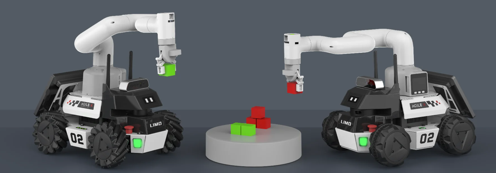
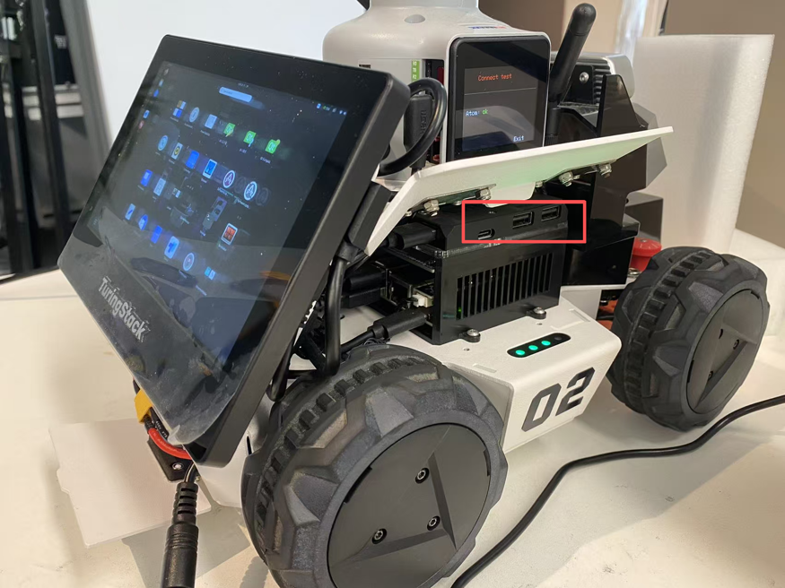

# LIMO 产品用户使用和开发手册

## 一、LIMO产品简介

### 1.1 产品简介

图灵智新多模态机器人实验套件（ LIMO ）是全球集四种运动模态于一体的ROS开发平台，提供了适应场景更广泛、更符合行业应用要求的学习平台，适用于机器人教育、功能研发、产品开发。通过创新性的机械设计，能实现四轮差速、阿克曼、履带型、麦克纳姆轮运动模式的快速切换，可在配套的专业沙盘中快速建立多场景实拟教学和测试，LIMO搭载NVIDIA Jeston Nano、EAI XL2激光雷达、深度相机等高性能传感器配置，可实现精确的自主定位、SLAM建图、路线规划和自主避障、自主倒车入库、红绿灯识别等丰富功能。

### 1.2 产品列表

| 名称                            | 数量                   |
| ------------------------------- | ---------------------- |
| LIMO高配版主体（安装越野轮 X4） | X1                     |
| 电池                            | X1                     |
| 充电器                          | X1                     |
| 麦克纳姆轮                      | X4                     |
| 履带                            | x2                     |
| APP_Nexus                       | X1                     |
| 内六角螺丝刀                    | X1                     |
| 螺丝                            | M3 12mm x3、M3 5mm x20 |

### 1.3 性能参数

| 参数类型           | 项目                                | 指标              |
| ------------------ | ----------------------------------- | ----------------- |
| 机械参数           | 外形尺寸                            | 322*220*251mm     |
| 轴距               | 200mm                               |                   |
| 轮距               | 175mm                               |                   |
| 自重               | 4.8kg                               |                   |
| 负载               | 四轮差速（1kg）                     |                   |
| 阿克曼模式（4kg）  |                                     |                   |
| 麦轮模式（4kg）    |                                     |                   |
| 最小离地间隙       | 24mm                                |                   |
| 驱动方式           | 轮毂电机(4x14.4W)                   |                   |
| 性能参数           | 空载最高车速                        | 1m/s              |
| 阿克曼最小转弯半径 | 0.4m                                |                   |
| 工作环境           | -10~+40℃                            |                   |
| 最大爬坡角度       | 40°（履带模式下）                   |                   |
| 系统参数           | 电源接口                            | DC（5.5x2.1mm)    |
| 系统               | Ubuntu18.0                          |                   |
| IMU                | MPU6050                             |                   |
| CPU                | ARM 64位四核@1.43GHz （Cortex-A57） |                   |
|                    |                                     |                   |
| GPU                | 128核 NVIDIA Maxwell @921MHz        |                   |
| 电池               | 5200mAh 12V                         |                   |
| 工作时间           | 40min                               |                   |
| 待机时间           | 2h                                  |                   |
| 通讯接口           | WIFI、蓝牙                          |                   |
| 传感器             | 激光雷达                            | EAI X2L           |
| 深度相机           | 奥比中光 DaBai/RealSense D435       |                   |
| 工控机             | NVIDIA Jetson Nano（4G）            |                   |
| 语音模块           | 讯飞语音助手/谷歌助手               |                   |
| 扬声器             | 左右双声道（2x2W)                   |                   |
| USB-HUB            | TYPE-C x1、USB2.0 x2                |                   |
| 前显示器           | 1.54寸128x64白色OLED显示屏          |                   |
| 后显示器           | 7寸1024x600 IPS触控屏               |                   |
| 控制参数           | 控制模式                            | 手机APP、指令控制 |
| 手机APP            | 蓝牙/极限距离10m                    |                   |

### 1.4 Nvidia Jetson Nano介绍

Nvidia Jetson Nano 是一款功能强大的小型计算机，专为支持入门级边缘 AI 应用程序和设备而设计。依托完善的 NVIDIA JetPack™ SDK 包含用于深度学习、计算机视觉、图形、多媒体等方面的加速库。搭载在limo高配版本，可以用于拓展机器人导航定位、图像处理、语音识别等技术的拓展。

| GPU      | 128-Core Maxwell                                             |
| -------- | ------------------------------------------------------------ |
| CPU      | Quad-core ARM57 @1.43Ghz                                     |
| 内存     | 4GB 64Bit LPDDR4 25.6GB/s                                    |
| 存储     | Micro SD卡（默认）                                           |
| 视频编码 | 4K@30\| 4 X 1080p@30 \| 9 X 720p@30(H.264/H.265)             |
| 视频解码 | 4K@60\| 2X 4K@30 \| 8X 1080p@30 \| 18 X 720p@30(H.264/H.265) |
| 摄像头   | 2 X MIPI CSI-2 DPHY lanes                                    |
| 联网     | 千兆以太网，M.2 Key E 接口外扩                               |
| 显示     | HDMI X 1, DP X 1                                             |
| USB      | 4 X USB 3.0, USB 2.0 Micro-B                                 |
| 扩展接口 | GPIO，I2C，I2S，SPI，UART                                    |

### 1.5 部件名称

①　WIFI/蓝牙天线；

②　深度相机；

③　前显示器；

④　EAI X2L激光雷达;

⑤　轮毂电机；

⑥　RGB车灯；

⑦　四轮差速/阿克曼模式切换插销；

⑧　电量显示；

⑨　左扬声器；

⑩　左海鸥门；

⑪　后显示器；

⑫　电池门；

⑬　开关；

⑭　右海鸥门；

⑮　右扬声器；

⑯　USB-HUB模块；

⑰　语音模块；

⑱　工控机NVIDIA Jetson Nano（4G）；

⑲　电池；

### 1.6 功能亮点

（1）使用四个轮毂电机，节省车体内部空间，可在一个车体上实现阿克曼、四轮差速、履带和麦轮这四种模态的快速切换；

①阿克曼模式：

一种为了解决交通工具转弯时，内外转向轮路径指向的圆心不同的几何学，依据阿克曼转向几何设计的车辆，沿着弯道转弯时，利用四连杆的相等曲柄使内侧轮的转向角比外侧轮大大约2~4度，使四个轮子路径的圆心大致上交会于后轴的延长线上瞬时转向中心，让车辆可以顺畅的转弯。

②四轮差速模式：

四轮驱动，可实现原地自转，但对轮胎磨损严重，请勿长时间原地自转；

③履带模式：

具有良好的越野性能，可上40°坡和小台阶；

④麦克纳姆轮模式：

基于麦克纳姆轮技术的全方位运动设备可以实现前行、横移、斜行、旋转及其组合等运动方式。

（2）车灯状态指示：

两车灯为RGB LED，选用5种对比度高的颜色作为指示灯，其余颜色可供开发者自定义；

| 颜色     | 状态              |
| -------- | ----------------- |
| 红色闪烁 | 低电量/主控报警   |
| 红色常亮 | 程序暂停          |
| 绿色     | 阿克曼模式        |
| 黄色     | 四轮差速/履带模式 |
| 蓝色     | 麦克纳姆轮模式    |

（3）两侧车门可展开，预留一个TYPE-C口和两个USB2.0口，方便调试；

（4）电池可拆换；

（5）预留丰富的拓展孔位：

车顶预留8个M3螺丝孔位，以及两条3.2mm宽的槽口；

两车门预留4个M3螺丝孔位，水平展开获得更大安装平台；

车底前后各预留四个M3螺丝孔位；

（6）丰富的交互体验：

摄像头、激光雷达、语音模块、双扬声器配合前显示器可提供丰富的交互体验。

### 1.7 模态切换方法

（1）切换阿克曼模式：

先将两侧插销拔起，顺时针转30度，使两插销上较长的线指向车体正前方 ，即可卡住，车灯变为绿色且常亮时，则切换成功；

（2）切换四轮差速模式：

拔起来顺时针转30度，使两插销上较短的线指向车体正前方，此时为插入状态，微调轮胎角度对准孔位让插销插入，车灯变为黄色且常亮时，则切换成功；

（3）切换履带模式：

在四轮差速模式下将履带直接套上，建议先套空间较小的后轮，并且履带模式下请将两侧车门抬起防止剐蹭；

（4）切换麦轮模式：

先将轮毂盖和轮胎拆下，只保留轮毂电机，然后保证每个麦轮的小滚子朝向车体中心，用包装里的M3*5螺丝将麦轮安装上，最后需要用遥控/APP调整至麦轮模式。

**注：切换至麦轮模式的时候，请确保每个麦轮安装的角度如上图所示**

### 1.8 操作说明

（1）长按开关键开机（短按暂停程序），观察电量表，最后一颗红灯量时请及时充电或更换电池；

（2）观察前面插销状态以及车灯颜色判断当前模式：

| 插销状态 | 车灯颜色       | 当前模式          |
| -------- | -------------- | ----------------- |
| 插入     | 黄色           | 四轮差速/履带模式 |
| 蓝色     | 麦克纳姆轮模式 |                   |
| 拔起     | 绿色           | 阿克曼            |

（3）遥控器说明

遥控准备：右滑开机键开机，将SWB通道拨到中间即可遥控控制，下方为指令控制，上方关闭控制；

差速模式：将SWD通道拨到中下档位为四轮差速模式，左摇杆控制前进后退，右摇杆控制原地左右转；

履带模式：与四轮差速模式的运动模型一样；

麦轮模式：SWD通道在上档位时为麦克纳姆轮模式，左摇杆控制运动方向，右摇杆控制左右原地转；

阿克曼模式：在车体上切换为阿克曼模式，开启遥控器控制即可，左摇杆控制前进后退，右摇杆控制左右方向；

（4）APP遥控说明

1、 首先在手机上下载我司提供的APP--Nexus，下载方式如下：

IOS端下载：在AppStore搜索Nexus并下载

Android端扫描下面二维码：

下载链接：https://www.pgyer.com/CjOI

2、下载App成功后，打开App,如图1-1所示，连接LIMO_xxxxxx的蓝牙；安卓手机点击左上的的蓝牙图标进入蓝牙扫描界面

3、遥控limo

左边控制杆：控制limo前进后退

右边控制杆：控制limo左转右转

中间进度条：速度值显示

模式切换：总共有三种模式，阿克曼运动模式：ackermann，四轮差速运动模式：4wd，麦克纳姆运动模式：mailun

ackerMann：需要手动将LIMO小车切换阿克曼模式，主要用于校准零点、控制前进后退以及转动角度；

4wd：需要手动将LIMO小车切换四轮差速模式，主要控制前进后退、转换方向以及原地旋转；

Mailun：需要手动将LIMO小车切换麦轮模式，主要控制前进后退、转换方向以及原地旋转

4、APP设置说明

Language switch：通过点击右边的按钮 English/简体，来切换英语和中文

Left-romte min speed：设置LIMO小车的最小速度

Left-romte max speed：设置LIMO小车的最大速度

right-romte min speed：设置LIMO小车的最小旋转速度

right-romte max speed：设置LIMO小车的最大旋转速度

veer calibration：设置零点矫正，先点击+号，然后点击确定Verify，当校准成功会弹出提醒框Successful calibration

BlueTooth：点击弹出蓝牙扫描界面

Bluetooth management：点击random 生成任意以LIMO_xxxx的命名的名字，确认OK并同步修改小车蓝牙的名字，注意此时蓝牙会断开，并会提醒重新连接蓝牙，重新连接蓝牙后可以继续控制小车；当app再次启动，小车的蓝牙名字已经显示修改成功的状态

### 1.9 远程桌面连接

有些操作需要在小车上进行操作，但是跟着车跑有点不现实，所以我们在进行所有操作之前都需要远程连接小车

## 一、 配置网络

1. 确保 **个人电脑端** 和 **limo** **小车端** 处于同一的网络环境下

打开limo右侧的海鸥门，找到USB-HUB模块，给limo连接上键盘鼠标，USB-HUB 模块位置如下

1. 键盘鼠标成功连接之后通过以下操作连接wifi

    1. 

2. 连接过后可以打开一个终端并使用 `ip addr` 命令来查看本机的 ip 地址，以便后面直接使用 ssh 进行连接

    

## 二、远程连接 limo 小车

远程连接支持两类工具选型，按需选择即可：

① 可视化远程桌面（ToDesk、向日葵），适合图形化操作；

② SSH 命令行（MobaXterm、Xshell），适合快速执行指令。

按需选择即可

### 2.1 ToDesk 远程连接

1. 在 **个人电脑端** 安装并运行 `ToDesk` 远程控制工具

2. 根据 **limo 小车端** 开机后自动启动的 ToDesk 软件获取**设备代码**以及连接设备的**临时密码**
    （提示：ToDesk 与 向日葵远程控制软件都默认验证码为 `turing12`）

    

3. 在 **个人电脑端** 的 ToDesk 中输入刚获取到的设备代码，并使用临时密码远程连接

    

    

    

    连接成功后就可以正常的进行远程控制 **limo 小车** 继续开始下面的操作以启动展示功能

​    
​    

4. 若 **limo 小车端** 没有开机弹出向日葵的**连接窗口界面**，可直接使用 **limo 小车 的触控屏幕**前往**菜单**手动打开该连接窗口界面

    **菜单**位置如下：

    

不灵敏请耐心多按几次

打开菜单后下滑找到 ToDesk 的图标点开即可

### 2.2 向日葵远程控制

1. **个人电脑端**和**limo 小车端**均安装并运行向日葵客户端

2. 直接在 **limo 小车端** 界面获取 **识别码** 和 **验证码**
    （提示：ToDesk 与 向日葵远程控制软件都默认验证码为 `turing12`）

    

    

3. 电脑端输入识别码 + 验证码完成临时连接

    

    连接成功后就可以正常的进行远程控制 **limo 小车** 继续开始下面的操作以启动展示功能

​    

​    

4. 若 **limo 小车端** 没有开机弹出向日葵的**连接窗口界面**，可直接使用 **limo 小车 的触控屏幕**前往**菜单**手动打开该连接窗口界面

    **菜单**位置如下：
    

    不灵敏请耐心多按几次

    打开菜单后即可点击向日葵的图标打开连接窗口界面
    

### 2.3  MobaXterm 远程控制（SSH 模式）

提示：

limo 小车系统账号：`turing`

​			密码：`Passw0rd`

当进入到**命令行界面**或是进入到**系统桌面**则证明连接成功

## 二、底盘电气信息说明

### 2.1 电池与充电

#### 2.1.1 电池基本信息

LIMO随车配备一个12V的电池，该电池有两个接口。分别为黄色的电池输出接口和黑色的电池充电接口。

该电池参数如下表

| 项目             | 额定参数 |
| ---------------- | -------- |
| 典型容量         | 5200mAH  |
| 最小容量         | 5000mAH  |
| 标称电压         | 11.1V    |
| 充电截至电压     | 12.6V    |
| 放电截至电压     | 8.25V    |
| 最大持续放电电流 | 10A      |

##### 电池注意事项

------

- 为了保证运输存储安全，LIMO配备的电池并不一定处于满电状态 。
- 请不要在电池使用殆尽以后再进行充电，当 LIMO提示电量低时，请及时充电。
- LIMO在关机状态下仍会产生静态待机电流，为防止电池过放，长时间不使用LIMO时请断开电池与车体的连接。
- 请勿将电池投火中，或对电池加热，请勿在高温下存储电池，电池存储的最佳温度为-10℃~40℃。
- 必须使用原厂配备或认证的电池为LIMO供电。

------

#### 2.1.2 充电

LIMO默认随车配备一个12.6V 2A的充电器，可满足客户的充电需求，且充电器上设有指示灯可显示充电状态。

------

- 充电时请关机取出电池，将电池输出接口与车体分离。
- 将充电器的充电接头与电池连接，再接通充电器电源进行充电。
- 充满时请先将电池与充电器分离，再断开充电器电源。

------

充电器状态如下表：

| 充电器指示灯颜色 | 电池状态 |
| ---------------- | -------- |
| 红色             | 充电中   |
| 绿色闪烁         | 即将充满 |
| 绿色             | 已充满   |

##### 充电注意事项：

------

- 禁止使用非原装充电器对电池进行充电，请勿在0℃以下给电池充电。
- 充电时必须将电池与LIMO车体分离，禁止在电池充电的同时为LIMO进行供电。
- 当充电器指示灯变为绿色时表示充电完毕，但为了延长电池寿命，充电器会以0.1A的电流进行涓流充电，持续约0.5小时。
- 当前电池从8.25V到充满电状态大约需要2.5小时，电池充满电电压约为12.6V。

### 2.2 使用环境及安全注意事项

------

- LIMO的工作温度为-10℃ ~ 40℃，请勿在温度低于-10℃、高于40℃环境中使用；
- LIMO的使用环境的相对湿度要求是：最大80%，最小30%；
- 请勿在存在腐蚀性、易燃性气体的环境或者靠近可燃性物质的环境中使用；
- LIMO不具有防水功能，请勿在有雨、雪、积水的环境使用；
- 建议使用环境海拔高度不超过1000米、昼夜温差不超过25℃；
- 使用过程有疑问，请按照相关说明手册进行操作或者咨询相关技术人员；
- 请勿未经技术支持和允许，私自改装内部设备结构。

### 2.3 供电拓扑

------

- LIMO的电池能提供最大10A的电流给底盘、Nano及传感器等系统供电，当系统检测到工作电流大于10A时，为了保护电池和电机会进入过流保护模式。
- USB HUB 的三个USB接口合计输出电流最大为0.5A。

### 2.4 通信拓扑

------

- LIMO底盘内置了蓝牙5.0模块可以与手机端的APP连接，实现遥控功能。
- LIMO与Nano通过UART接口直接连接，Nano通过该接口可实现对底盘的控制。
- USB HUB提供2个USB和1个Type C接口，3个接口均工作在USB2.0协议下。
- 后显示屏通过USB2.0接口与USB HUB相连，起触摸功能。