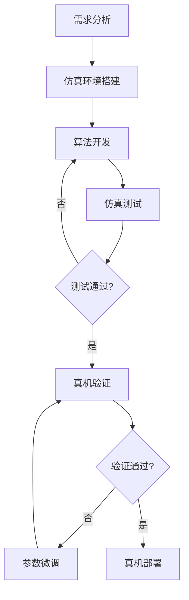

# 第一章：任务需求与场景介绍

## 1.1 任务背景

在现代办公环境中，物品搬运是一项频繁且重复的工作。本课程以办公室场景为背景，设计了一个典型的机器人协同搬运任务：**Bobac 机器人负责识别和抓取指定物品（如笔），无人机负责将物品搬运到指定位置**。

这个任务场景具有以下特点：
- **多机器人协同**：地面机器人与空中无人机配合作业
- **复杂感知**：需要视觉识别、定位、抓取点计算
- **精准操作**：机械臂需要精确抓取小型物品
- **自主导航**：机器人需要在办公室环境中自主移动

## 1.2 具体任务需求

### 1.2.1 任务目标

在办公室环境中，Bobac 机器人需要完成以下任务流程：

### 1.2.2 目标物品

本课程选择**笔**作为目标物品，原因如下：
- **尺寸适中**：长度约 15cm，适合机械臂抓取
- **形状规则**：圆柱形，便于夹爪夹持
- **常见物品**：办公室场景中的典型物品
- **识别容易**：视觉特征明显，便于检测算法识别

### 1.2.3 任务分解

完整的任务可以分解为以下子任务：

#### 1. 导航子任务
- **输入**：目标位置坐标
- **输出**：机器人到达目标位置
- **关键技术**：
  - SLAM 建图与定位
  - 路径规划（全局 + 局部）
  - 避障控制
  - 底盘运动控制

#### 2. 视觉识别子任务
- **输入**：RGB 图像 + 深度图像
- **输出**：目标物品的 3D 位置和姿态
- **关键技术**：
  - 物体检测（YOLOE）
  - 深度估计
  - 坐标系转换
  - 抓取点生成

#### 3. 抓取子任务
- **输入**：目标物品的位置和姿态
- **输出**：成功抓取物品
- **关键技术**：
  - 运动规划（MoveIt2）
  - 逆运动学求解
  - 轨迹执行
  - 夹爪控制

#### 4. 放置子任务
- **输入**：放置目标位置
- **输出**：物品放置到指定位置
- **关键技术**：
  - 容器检测
  - 精准放置
  - 夹爪释放

## 1.3 两种实现场景

### 1.3.1 Isaac Sim 仿真场景

#### 场景描述

在 Isaac Sim 中构建的虚拟办公室环境，包含：
- **办公桌**：放置目标物品
- **障碍物**：椅子、文件柜等
- **地面**：平整地面，支持机器人导航
- **光照**：模拟真实办公室光照条件

#### 仿真优势

**1. 低成本优势**
- **零硬件投入**：无需购买实体机器人即可开始开发
- **无损耗**：算法调试过程中不会损坏任何硬件
- **场地灵活**：无需专门的测试场地，电脑即可运行

**2. 高保真模拟**
- **物理引擎**：PhysX 物理引擎提供真实的物理模拟
  - 重力、摩擦力、碰撞检测
  - 关节动力学模拟
  - 物体抓取的接触力模拟
- **传感器仿真**：
  - 激光雷达：360° 扫描，可配置噪声
  - 深度相机：RGB-D 数据，模拟真实相机参数
  - IMU：加速度和角速度数据
  - 里程计：轮式编码器数据

**3. 高效开发**
- **快速迭代**：修改参数后立即看到效果
- **并行测试**：可以同时运行多个仿真实例
- **数据记录**：完整记录所有传感器数据和机器人状态
- **可重复性**：相同条件下结果完全可重复

**4. 安全测试**
- **极限测试**：可以测试碰撞、跌落等危险场景
- **算法验证**：在仿真中充分验证后再部署到真机
- **错误调试**：失败后可立即重置，无需等待

**5. 可视化调试**
- **实时可视化**：查看机器人状态、传感器数据、规划路径
- **调试工具**：断点、单步执行、变量监控
- **性能分析**：CPU/GPU 使用率、帧率监控

#### 仿真环境的作用

Isaac Sim 仿真环境在机器人开发中扮演以下角色：

**1. 算法开发平台**
- 在虚拟环境中开发和测试算法
- 快速验证算法的可行性
- 优化算法参数

**2. 验证测试平台**
- 验证算法在不同场景下的鲁棒性
- 测试边界条件和异常情况
- 评估系统性能指标

**3. 培训学习平台**
- 学习机器人开发技术
- 理解算法原理和实现
- 积累开发经验

**4. 真机部署的桥梁**
- 仿真代码可直接迁移到真机
- 降低真机调试的风险和成本
- 缩短开发周期

### 1.3.2 真机场景

#### 场景描述

在实际办公室环境中部署 Bobac 机器人，面对真实的：
- **复杂环境**：不规则的障碍物、动态的人员
- **光照变化**：自然光、人工光的变化
- **地面条件**：地毯、瓷砖、门槛等
- **传感器噪声**：真实传感器的噪声和误差

#### 真机挑战

**1. 硬件限制**
- 传感器精度有限
- 执行器响应延迟
- 电池续航限制
- 计算资源受限

**2. 环境不确定性**
- 光照条件变化
- 动态障碍物（人员走动）
- 地面不平整
- 无线通信干扰

**3. 安全风险**
- 碰撞可能损坏机器人或环境
- 抓取失败可能导致物品掉落
- 导航错误可能造成危险

#### 从仿真到真机的迁移

**1. 模型一致性**
- 机器人 URDF 模型与真机完全对应
- 传感器参数（内参、外参）与真机一致
- 物理参数（质量、惯性）与真机匹配

**2. 接口统一**
- 仿真和真机使用相同的 ROS2 接口
- 话题名称、消息类型完全一致
- 控制指令格式相同

**3. 参数调优**
- 在仿真中初步调优参数
- 在真机上进行微调
- 建立参数映射关系

**4. 鲁棒性增强**
- 在仿真中测试各种异常情况
- 添加容错机制
- 提高算法的适应性

### 1.3.3 两种场景的对比

| 对比项 | Isaac Sim 仿真 | 真机场景 |
|--------|----------------|----------|
| **成本** | 低（仅需电脑） | 高（硬件 + 场地） |
| **安全性** | 完全安全 | 存在风险 |
| **开发效率** | 高（快速迭代） | 低（调试耗时） |
| **真实性** | 高保真模拟 | 完全真实 |
| **可重复性** | 完全可重复 | 难以重复 |
| **测试范围** | 可测试极限场景 | 受限于安全 |
| **数据记录** | 完整记录 | 部分记录 |
| **并行测试** | 支持 | 不支持 |
| **环境搭建** | 快速（分钟级） | 慢（小时/天级） |
| **适用阶段** | 开发、测试、培训 | 验证、部署 |

### 1.3.4 推荐的开发流程

**阶段说明**：

1. **需求分析**：明确任务目标和技术要求
2. **仿真环境搭建**：在 Isaac Sim 中构建场景
3. **算法开发**：在仿真中开发和调试算法
4. **仿真测试**：在各种场景下充分测试
5. **真机验证**：将代码部署到真机进行验证
6. **参数微调**：根据真机表现微调参数
7. **真机部署**：正式部署到生产环境

## 1.4 为什么选择 Isaac Sim？

### 1.4.1 技术优势

**1. NVIDIA 生态集成**
- **GPU 加速**：充分利用 NVIDIA GPU 的计算能力
- **RTX 技术**：实时光线追踪，提供逼真的视觉效果
- **PhysX 引擎**：高性能物理模拟
- **Omniverse 平台**：与其他 NVIDIA 工具无缝集成

**2. 机器人专用功能**
- **ROS/ROS2 桥接**：原生支持 ROS2 通信
- **传感器仿真**：丰富的传感器模型库
- **机器人模型**：支持 URDF、USD 等格式
- **运动规划**：集成 MoveIt、Lula 等规划库

**3. 高保真仿真**
- **物理精度**：精确的刚体动力学、接触力模拟
- **视觉真实性**：基于物理的渲染（PBR）
- **传感器真实性**：模拟真实传感器的噪声和误差

**4. 开发效率**
- **Python API**：简洁易用的 Python 接口
- **可视化编程**：ActionGraph 可视化逻辑开发
- **扩展系统**：丰富的扩展插件

## 1.5 课程学习目标

通过本课程的学习，你将能够：

### 1.5.1 理论知识
- ✅ 理解移动机器人的导航原理
- ✅ 掌握机械臂运动学和运动规划
- ✅ 了解视觉识别和抓取算法
- ✅ 理解 ROS2 机器人开发框架

### 1.5.2 实践能力
- ✅ 在 Isaac Sim 中搭建机器人仿真环境
- ✅ 实现机器人自主导航功能
- ✅ 实现视觉识别和抓取功能
- ✅ 调试和优化机器人系统

### 1.5.3 工程能力
- ✅ 掌握从仿真到真机的开发流程
- ✅ 具备系统集成和调试能力
- ✅ 能够解决实际工程问题
- ✅ 建立完整的机器人开发知识体系

## 1.6 本章小结

本章介绍了 Bobac 机器人办公室物品搬运任务的背景、需求和实现场景。重点阐述了为什么选择 Isaac Sim 仿真环境进行开发，以及仿真相比真机的优势。

**关键要点**：
1. 任务目标：Bobac 机器人抓取笔，无人机搬运
2. 两种场景：Isaac Sim 仿真 + 真机部署
3. 仿真优势：低成本、高效率、高安全性
4. 开发流程：仿真开发 → 仿真测试 → 真机验证 → 真机部署

下一章将详细介绍 Bobac 机器人的硬件结构和参数，为后续的仿真建模和控制打下基础。

---

**思考题**：
1. 为什么选择笔作为目标物品？还可以选择哪些物品？
2. 仿真环境无法完全替代真机测试，原因是什么？
3. 如何保证仿真中验证的算法能够在真机上正常工作？
