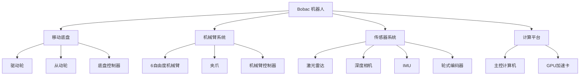
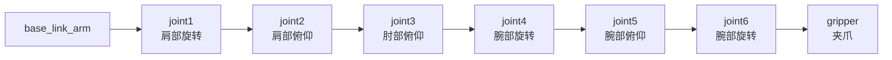
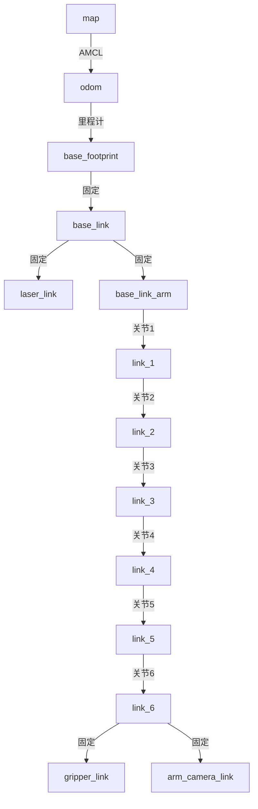

# 第二章：Bobac 机器人结构与硬件参数

## 2.1 Bobac 机器人整体介绍

Bobac 机器人是一款面向办公室场景的移动操作机器人，集成了移动底盘、机械臂、视觉传感器等多个子系统，能够完成导航、识别、抓取等复杂任务。

### 2.1.1 机器人组成

Bobac 机器人主要由以下部分组成：



### 2.1.2 机器人规格参数

| 参数项 | 规格 |
|--------|------|
| **整机尺寸** | 长 × 宽 × 高：600mm × 500mm × 1200mm |
| **整机重量** | 约 45kg |
| **工作电压** | 24V DC |
| **续航时间** | 约 6-8 小时（标准工况） |
| **最大负载** | 底盘：50kg，机械臂：2kg |
| **工作环境** | 室内平整地面，温度 0-40℃ |

## 2.2 移动底盘系统

### 2.2.1 底盘结构

Bobac 机器人采用**四轮差速驱动**结构：
- **前轮**：两个主动驱动轮，独立电机驱动
- **后轮**：两个从动万向轮，提供支撑

这种结构的优势：
- ✅ 转向灵活，可实现原地旋转
- ✅ 结构简单，控制方便
- ✅ 成本较低，维护容易
- ✅ 适合室内平整地面

### 2.2.2 底盘运动学参数

#### 关键参数

| 参数 | 数值 | 说明 |
|------|------|------|
| **轮距（wheel_base）** | 0.38m | 左右驱动轮中心距离 |
| **车轮半径（wheel_radius）** | 0.075m | 驱动轮半径 |
| **最大线速度** | 1.0 m/s | 直线运动最大速度 |
| **最大角速度** | 1.0 rad/s | 旋转最大角速度 |
| **最大加速度** | 0.5 m/s² | 线加速度限制 |
| **最大角加速度** | 1.0 rad/s² | 角加速度限制 |

#### 差速驱动原理

差速驱动通过控制左右轮的速度差实现转向：

**运动学方程**：

```
线速度 v = (v_left + v_right) / 2
角速度 ω = (v_right - v_left) / wheel_base

左轮速度 v_left = v - (ω × wheel_base) / 2
右轮速度 v_right = v + (ω × wheel_base) / 2
```

**运动模式**：

| 运动模式 | 左轮速度 | 右轮速度 | 效果 |
|----------|----------|----------|------|
| 直线前进 | v | v | 直线运动 |
| 直线后退 | -v | -v | 直线后退 |
| 原地左转 | -v | v | 逆时针旋转 |
| 原地右转 | v | -v | 顺时针旋转 |
| 左转弯 | v_slow | v_fast | 向左转弯 |
| 右转弯 | v_fast | v_slow | 向右转弯 |

### 2.2.3 底盘坐标系

底盘使用标准的 ROS 坐标系：

```
        X (前)
        ↑
        |
        |
Y (左) ←●─────  Z (上，垂直纸面向外)
    base_link
```

- **X 轴**：指向机器人前方
- **Y 轴**：指向机器人左侧
- **Z 轴**：指向机器人上方（右手坐标系）

### 2.2.4 驱动电机参数

| 参数 | 数值 |
|------|------|
| 电机类型 | 无刷直流电机 |
| 额定功率 | 150W × 2 |
| 额定转速 | 3000 RPM |
| 减速比 | 1:30 |
| 编码器分辨率 | 2048 线/圈 |
| 控制方式 | CAN 总线 |

## 2.3 机械臂系统

### 2.3.1 机械臂结构

Bobac 机器人配备 **ECO65-B 6自由度机械臂**，采用串联关节结构。

#### 关节配置



#### 关节类型与自由度

| 关节 | 类型 | 自由度 | 作用 |
|------|------|--------|------|
| joint1 | 旋转关节 | 1 DOF | 肩部水平旋转 |
| joint2 | 旋转关节 | 1 DOF | 肩部上下俯仰 |
| joint3 | 旋转关节 | 1 DOF | 肘部弯曲 |
| joint4 | 旋转关节 | 1 DOF | 腕部旋转 |
| joint5 | 旋转关节 | 1 DOF | 腕部俯仰 |
| joint6 | 旋转关节 | 1 DOF | 末端旋转 |
| **总计** | - | **6 DOF** | - |

### 2.3.2 关节运动范围

每个关节都有运动范围限制，防止机械干涉和损坏：

| 关节 | 下限（rad） | 上限（rad） | 下限（度） | 上限（度） | 范围 |
|------|-------------|-------------|------------|------------|------|
| joint1 | -3.14 | 3.14 | -180° | 180° | 360° |
| joint2 | -1.57 | 1.57 | -90° | 90° | 180° |
| joint3 | -2.35 | 2.35 | -135° | 135° | 270° |
| joint4 | -3.14 | 3.14 | -180° | 180° | 360° |
| joint5 | -1.57 | 1.57 | -90° | 90° | 180° |
| joint6 | -3.14 | 3.14 | -180° | 180° | 360° |

**注意事项**：
- ⚠️ 控制时必须遵守关节限制，否则可能损坏机械臂
- ⚠️ 接近限位时应降低速度，避免冲击
- ⚠️ 某些关节角度组合可能导致奇异点，需要避免

### 2.3.3 DH 参数（Denavit-Hartenberg）

DH 参数是描述机械臂运动学的标准方法，用于建立各关节坐标系之间的变换关系。

#### DH 参数表

| 关节 | a (m) | α (rad) | d (m) | θ (rad) |
|------|-------|---------|-------|---------|
| 1 | 0 | π/2 | 0.15 | θ₁ |
| 2 | 0.28 | 0 | 0 | θ₂ |
| 3 | 0.225 | 0 | 0 | θ₃ |
| 4 | 0 | π/2 | 0.13 | θ₄ |
| 5 | 0 | -π/2 | 0 | θ₅ |
| 6 | 0 | 0 | 0.095 | θ₆ |

**参数说明**：
- **a**：连杆长度（沿 X 轴）
- **α**：连杆扭角（绕 X 轴旋转）
- **d**：连杆偏移（沿 Z 轴）
- **θ**：关节角度（绕 Z 轴旋转，变量）

#### DH 参数的作用

**1. 正运动学计算**
- 已知关节角度 [θ₁, θ₂, ..., θ₆]
- 计算末端执行器的位置和姿态
- 用于路径规划和可视化

**2. 逆运动学求解**
- 已知末端执行器的目标位姿
- 反推各关节角度
- 用于抓取控制

**3. 雅可比矩阵计算**
- 描述关节速度与末端速度的关系
- 用于速度控制和力控制

**4. 工作空间分析**
- 计算机械臂可达范围
- 避免奇异点配置

### 2.3.4 机械臂性能参数

| 参数 | 数值 |
|------|------|
| **工作半径** | 0.65m |
| **最大负载** | 2kg |
| **重复定位精度** | ±0.5mm |
| **最大速度** | 180°/s（关节） |
| **末端速度** | 1.0 m/s |
| **通信接口** | ROS2 Action |
| **控制频率** | 100 Hz |

### 2.3.5 夹爪系统

#### 夹爪结构

- **类型**：平行夹爪
- **驱动方式**：电动驱动
- **开合范围**：0-100mm
- **夹持力**：可调节，最大 20N

#### 夹爪参数

| 参数 | 数值 |
|------|------|
| 最大开口 | 100mm |
| 最小开口 | 0mm |
| 夹持力 | 5-20N（可调） |
| 响应时间 | < 0.5s |
| 控制精度 | ±1mm |

#### 夹爪控制

夹爪通过 ROS2 Action 接口控制：

```python
# 夹爪控制命令
command: "open"      # 打开夹爪
command: "close"     # 关闭夹爪
command: "position"  # 指定位置（0-100%）
```

## 2.4 传感器系统

### 2.4.1 激光雷达

#### 型号与参数

**型号**：N10P 激光雷达

| 参数 | 数值 |
|------|------|
| **测距原理** | TOF（Time of Flight） |
| **扫描角度** | 360° |
| **角度分辨率** | 0.4° - 0.8°（可调） |
| **测量距离** | 0.1m - 25m（白色物体） |
| **测量精度** | ±3cm（0-6m），±4.5cm（≥6m） |
| **扫描频率** | 6-12 Hz（可调） |
| **数据输出** | 距离、角度、光强 |
| **通信接口** | 网口、串口（460800 bps） |
| **功耗** | 5V / 360mA |

#### 安装位置

- 安装在底盘顶部中心位置
- 高度：距地面约 0.3m
- 坐标系：`laser_link`

#### 数据格式

```
ROS2 话题：/scan
消息类型：sensor_msgs/LaserScan

数据内容：
- angle_min: 起始角度（rad）
- angle_max: 结束角度（rad）
- angle_increment: 角度增量（rad）
- range_min: 最小测距（m）
- range_max: 最大测距（m）
- ranges[]: 距离数组（m）
- intensities[]: 强度数组
```

### 2.4.2 深度相机

#### 型号与参数

**型号**：IMX219-83 双目相机

| 参数 | 数值 |
|------|------|
| **传感器** | Sony IMX219 |
| **像素** | 800万像素 |
| **分辨率** | 3280 × 2464（单路） |
| **CMOS 尺寸** | 1/4 英寸 |
| **焦距** | 2.6mm |
| **光圈** | F2.4 |
| **视场角** | 对角 83° / 水平 73° / 垂直 50° |
| **基线距离** | 60mm |
| **畸变** | < 1% |
| **帧率** | 30 FPS |

#### 相机内参

相机内参矩阵（示例）：

```
K = [fx  0  cx]
    [0  fy  cy]
    [0   0   1]

fx = 615.0  # 焦距（像素）
fy = 615.0
cx = 320.0  # 主点（像素）
cy = 240.0
```

#### 安装位置

- 安装在机械臂末端附近
- 朝向：与机械臂末端方向一致
- 坐标系：`arm_camera_optical_frame`

#### 数据输出

```
RGB 图像：
- 话题：/arm_camera/rgb
- 类型：sensor_msgs/Image
- 格式：RGB8

深度图像：
- 话题：/arm_camera/depth
- 类型：sensor_msgs/Image
- 格式：32FC1（米）

相机信息：
- 话题：/arm_camera/camera_info
- 类型：sensor_msgs/CameraInfo
```

### 2.4.3 IMU（惯性测量单元）

#### 型号与参数

**型号**：ICM20948 9轴传感器

| 传感器 | 参数 |
|--------|------|
| **加速度计** | 分辨率：16位<br/>量程：±2/±4/±8/±16g<br/>工作电流：68.9μA |
| **陀螺仪** | 分辨率：16位<br/>量程：±250/±500/±1000/±2000°/s<br/>工作电流：1.23mA |
| **磁力计** | 分辨率：16位<br/>量程：±4900μT<br/>工作电流：90μA |

#### 数据输出

```
话题：/imu
类型：sensor_msgs/Imu

数据内容：
- orientation: 姿态（四元数）
- angular_velocity: 角速度（rad/s）
- linear_acceleration: 线加速度（m/s²）
```

### 2.4.4 轮式编码器

#### 参数

| 参数 | 数值 |
|------|------|
| 类型 | 增量式编码器 |
| 分辨率 | 2048 线/圈 |
| 精度 | ±0.1% |
| 输出频率 | 100 Hz |

#### 里程计数据

```
话题：/odom
类型：nav_msgs/Odometry

数据内容：
- pose: 位姿（位置 + 姿态）
- twist: 速度（线速度 + 角速度）
- covariance: 协方差矩阵
```

## 2.5 计算平台

### 2.5.1 主控计算机

| 参数 | 配置 |
|------|------|
| **处理器** | Intel Core i7 或 AMD Ryzen 7 |
| **内存** | 16GB DDR4 |
| **存储** | 256GB SSD |
| **操作系统** | Ubuntu 22.04 |
| **ROS 版本** | ROS2 Humble |

### 2.5.2 GPU 加速卡（可选）

| 参数 | 配置 |
|------|------|
| **型号** | NVIDIA RTX 3060 或更高 |
| **显存** | 6GB GDDR6 |
| **CUDA 核心** | 3584 |
| **用途** | 视觉识别加速 |

## 2.6 坐标系统

### 2.6.1 坐标系层次结构



### 2.6.2 主要坐标系说明

| 坐标系 | 说明 |
|--------|------|
| **map** | 全局地图坐标系，固定不动 |
| **odom** | 里程计坐标系，随机器人漂移 |
| **base_footprint** | 机器人投影到地面的坐标系 |
| **base_link** | 机器人本体坐标系 |
| **laser_link** | 激光雷达坐标系 |
| **base_link_arm** | 机械臂基座坐标系 |
| **link_1 ~ link_6** | 机械臂各连杆坐标系 |
| **gripper_link** | 夹爪坐标系 |
| **arm_camera_link** | 相机坐标系 |

## 2.7 通信接口

### 2.7.1 ROS2 话题

| 话题 | 类型 | 方向 | 说明 |
|------|------|------|------|
| `/cmd_vel` | geometry_msgs/Twist | 订阅 | 底盘速度控制 |
| `/odom` | nav_msgs/Odometry | 发布 | 里程计数据 |
| `/scan` | sensor_msgs/LaserScan | 发布 | 激光雷达数据 |
| `/joint_states` | sensor_msgs/JointState | 发布 | 关节状态 |
| `/hand_command` | sensor_msgs/JointState | 订阅 | 关节控制命令 |
| `/arm_camera/rgb` | sensor_msgs/Image | 发布 | RGB 图像 |
| `/arm_camera/depth` | sensor_msgs/Image | 发布 | 深度图像 |
| `/imu` | sensor_msgs/Imu | 发布 | IMU 数据 |

### 2.7.2 ROS2 Action

| Action | 类型 | 说明 |
|--------|------|------|
| `/navigate_to_pose` | nav2_msgs/NavigateToPose | 导航到目标点 |
| `/grasp_to_point` | eco65b_grasp_interfaces/GraspToPoint | 抓取到指定点 |
| `/detect_object` | eco65b_grasp_interfaces/DetectObject | 物体检测 |
| `/gripper_control` | eco65b_grasp_interfaces/GripperControl | 夹爪控制 |

## 2.8 本章小结

本章详细介绍了 Bobac 机器人的硬件结构和参数，包括：

**关键要点**：
1. **移动底盘**：四轮差速驱动，轮距 0.38m，轮半径 0.075m
2. **机械臂**：6自由度串联机械臂，工作半径 0.65m，负载 2kg
3. **传感器**：激光雷达（360°）、深度相机（双目）、IMU、编码器
4. **DH 参数**：描述机械臂运动学的标准参数
5. **坐标系**：从 map 到末端执行器的完整 TF 树

这些硬件参数是后续在 Isaac Sim 中构建仿真模型的基础，必须准确配置才能保证仿真的真实性。

---

**思考题**：
1. 为什么 Bobac 机器人选择差速驱动而不是全向轮？
2. 6自由度机械臂能够实现末端的哪些运动？
3. DH 参数中的 4 个参数分别描述了什么？
4. 如何根据轮距和轮半径计算机器人的转弯半径？
