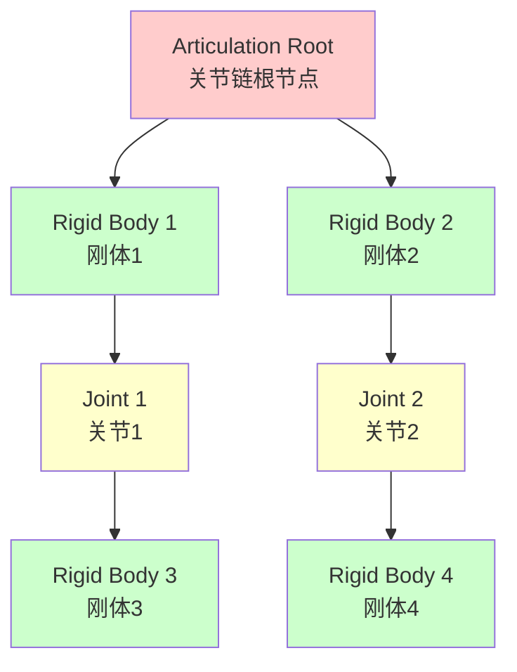
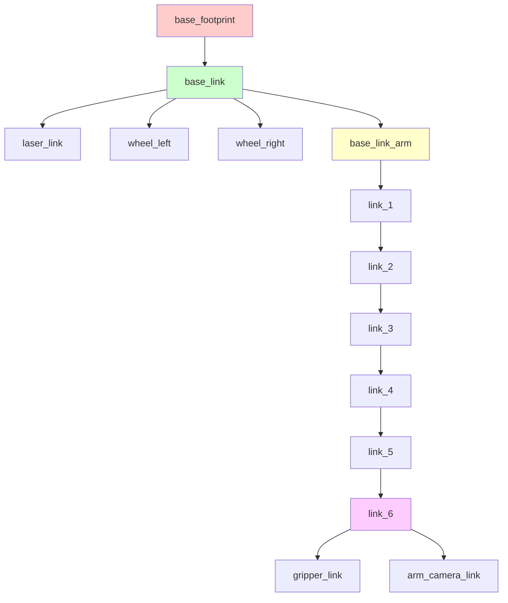
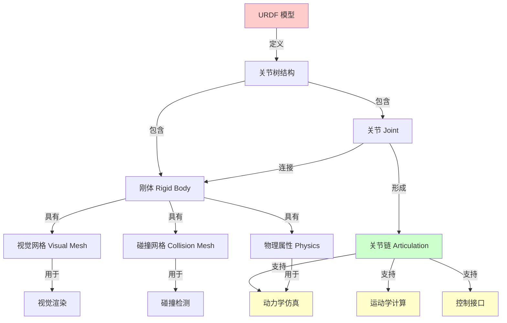

# 第三章：Isaac Sim 资产准备与机器人组装

## 3.1 Isaac Sim 资产管理

### 3.1.1 什么是资产（Asset）

在 Isaac Sim 中，**资产（Asset）**是指可以在仿真场景中使用的各种模型和组件，包括：
- **机器人模型**：完整的机器人 URDF/USD 文件
- **环境模型**：桌子、椅子、墙壁等场景物体
- **传感器模型**：相机、激光雷达、IMU 等
- **材质和纹理**：物体的外观属性
- **物理属性**：质量、摩擦系数、碰撞属性等

### 3.1.2 资产格式

Isaac Sim 支持多种资产格式：

| 格式 | 说明 | 用途 |
|------|------|------|
| **USD/USDA** | Universal Scene Description | Isaac Sim 原生格式，性能最优 |
| **URDF** | Unified Robot Description Format | ROS 标准机器人描述格式 |
| **OBJ** | Wavefront OBJ | 通用 3D 模型格式 |
| **FBX** | Filmbox | 动画和模型格式 |
| **STL** | Stereolithography | 3D 打印和 CAD 格式 |

**推荐使用**：
- 机器人模型：URDF（便于从 ROS 迁移）→ 转换为 USD
- 环境模型：USD（性能最优）
- 简单几何体：直接在 Isaac Sim 中创建

### 3.1.3 资产导入流程


## 3.2 机器人模型构建

### 3.2.1 URDF 模型结构

URDF（Unified Robot Description Format）是 ROS 中描述机器人的标准格式。一个完整的 URDF 模型包含：

**1. Link（连杆）**
- 定义机器人的刚体部分
- 包含视觉模型、碰撞模型、惯性参数

**2. Joint（关节）**
- 定义连杆之间的连接关系
- 指定运动类型（旋转、平移、固定）
- 设置运动范围和限制

**3. Sensor（传感器）**
- 定义传感器的类型和参数
- 指定传感器的安装位置

**4. Actuator（执行器）**
- 定义驱动器的参数
- 指定控制接口

### 3.2.2 URDF 基本语法

#### Link 定义

```xml
<link name="base_link">
  <!-- 视觉模型 -->
  <visual>
    <origin xyz="0 0 0" rpy="0 0 0"/>
    <geometry>
      <box size="0.5 0.4 0.2"/>
    </geometry>
    <material name="blue">
      <color rgba="0 0 1 1"/>
    </material>
  </visual>
  
  <!-- 碰撞模型 -->
  <collision>
    <origin xyz="0 0 0" rpy="0 0 0"/>
    <geometry>
      <box size="0.5 0.4 0.2"/>
    </geometry>
  </collision>
  
  <!-- 惯性参数 -->
  <inertial>
    <mass value="10.0"/>
    <origin xyz="0 0 0" rpy="0 0 0"/>
    <inertia ixx="0.1" ixy="0" ixz="0"
             iyy="0.1" iyz="0" izz="0.1"/>
  </inertial>
</link>
```

#### Joint 定义

```xml
<joint name="joint1" type="revolute">
  <!-- 父连杆 -->
  <parent link="base_link"/>
  <!-- 子连杆 -->
  <child link="link1"/>
  
  <!-- 关节原点 -->
  <origin xyz="0 0 0.1" rpy="0 0 0"/>
  
  <!-- 旋转轴 -->
  <axis xyz="0 0 1"/>
  
  <!-- 运动范围 -->
  <limit lower="-3.14" upper="3.14" 
         effort="100" velocity="2.0"/>
  
  <!-- 动力学参数 -->
  <dynamics damping="0.1" friction="0.1"/>
</joint>
```

### 3.2.3 Bobac 机器人 URDF 结构

Bobac 机器人的 URDF 结构如下：

```
bobac_robot.urdf
├── base_footprint (虚拟连杆，地面投影)
│   └── base_link (底盘本体)
│       ├── laser_link (激光雷达)
│       ├── wheel_left_link (左驱动轮)
│       ├── wheel_right_link (右驱动轮)
│       ├── caster_front_link (前万向轮)
│       ├── caster_back_link (后万向轮)
│       └── base_link_arm (机械臂基座)
│           ├── link_1 (肩部)
│           │   └── link_2 (大臂)
│           │       └── link_3 (小臂)
│           │           └── link_4 (腕部1)
│           │               └── link_5 (腕部2)
│           │                   └── link_6 (腕部3)
│           │                       ├── gripper_link (夹爪)
│           │                       └── arm_camera_link (相机)
```

## 3.3 关节链（Articulation）

### 3.3.1 什么是关节链

**关节链（Articulation）**是 Isaac Sim 中用于描述多刚体系统的核心概念。它将多个刚体通过关节连接成一个整体，形成一个运动学树结构。

**特点**：
- 🔗 多个刚体通过关节连接
- 🌲 形成树状层次结构
- ⚙️ 支持正向和逆向运动学
- 🎯 统一的物理模拟和控制

### 3.3.2 关节链的作用

**1. 运动学建模**
- 描述机器人的运动学结构
- 定义各部分之间的连接关系
- 计算正向和逆向运动学

**2. 动力学模拟**
- 模拟关节的运动和受力
- 计算关节力矩和速度
- 处理关节约束和限制

**3. 控制接口**
- 提供统一的控制接口
- 支持位置、速度、力矩控制
- 集成 ROS2 控制器

**4. 碰撞检测**
- 自动处理自碰撞检测
- 与环境的碰撞检测
- 碰撞响应和力反馈

### 3.3.3 关节链的组成



**组成部分**：
1. **Articulation Root**：关节链的根节点，通常是机器人的基座
2. **Rigid Body**：刚体，机器人的各个连杆
3. **Joint**：关节，连接刚体的运动副

## 3.4 关节体（Rigid Body）

### 3.4.1 什么是刚体

**刚体（Rigid Body）**是物理仿真中的基本单元，表示一个不会发生形变的物体。在 Isaac Sim 中，机器人的每个连杆都是一个刚体。

**刚体的属性**：
- **质量（Mass）**：物体的质量，单位 kg
- **惯性矩阵（Inertia）**：描述物体旋转惯性的 3×3 矩阵
- **质心位置（Center of Mass）**：物体的质心坐标
- **碰撞形状（Collision Shape）**：用于碰撞检测的几何形状
- **视觉形状（Visual Shape）**：用于渲染显示的几何形状

### 3.4.2 刚体的物理属性

#### 质量和惯性

```python
# 质量（kg）
mass = 2.5

# 惯性矩阵（kg·m²）
inertia = [
    [Ixx, Ixy, Ixz],
    [Ixy, Iyy, Iyz],
    [Ixz, Iyz, Izz]
]

# 对于简单几何体，可以用公式计算：
# 长方体：
Ixx = (1/12) * m * (h² + d²)
Iyy = (1/12) * m * (w² + d²)
Izz = (1/12) * m * (w² + h²)

# 圆柱体：
Ixx = Iyy = (1/12) * m * (3*r² + h²)
Izz = (1/2) * m * r²
```

#### 材质属性

| 属性 | 说明 | 典型值 |
|------|------|--------|
| **静摩擦系数** | 静止时的摩擦力 | 0.5 - 1.0 |
| **动摩擦系数** | 运动时的摩擦力 | 0.3 - 0.8 |
| **恢复系数** | 碰撞后的弹性 | 0.0 - 1.0 |
| **密度** | 材料密度 | 根据材料 |

### 3.4.3 刚体在 Isaac Sim 中的配置

在 Isaac Sim 中，刚体的物理属性通过以下方式配置：

**1. 通过 URDF 导入**
```xml
<inertial>
  <mass value="2.5"/>
  <inertia ixx="0.01" ixy="0" ixz="0"
           iyy="0.01" iyz="0" izz="0.01"/>
</inertial>
```

**2. 通过 Isaac Sim UI 设置**
- 选择物体 → Property 面板
- Physics → Rigid Body Physics
- 设置 Mass、Inertia、Material 等

**3. 通过 Python API 设置**
```python
from pxr import UsdPhysics, PhysxSchema

# 添加刚体组件
rigid_body_api = UsdPhysics.RigidBodyAPI.Apply(prim)

# 设置质量
mass_api = UsdPhysics.MassAPI.Apply(prim)
mass_api.GetMassAttr().Set(2.5)

# 设置材质
material = PhysxSchema.PhysxMaterialAPI.Apply(prim)
material.GetStaticFrictionAttr().Set(0.8)
material.GetDynamicFrictionAttr().Set(0.6)
```

## 3.5 关节树（Kinematic Tree）

### 3.5.1 什么是关节树

**关节树（Kinematic Tree）**是描述机器人运动学结构的树状数据结构。树的每个节点代表一个连杆，边代表关节。

**特点**：
- 🌲 树状层次结构，有唯一的根节点
- 🔗 父子关系明确，无环路
- 📐 便于正向运动学计算
- 🎯 支持逆向运动学求解

### 3.5.2 Bobac 机器人的关节树



### 3.5.3 关节树的作用

**1. 正向运动学（Forward Kinematics）**
- 输入：各关节的角度
- 输出：末端执行器的位姿
- 用途：可视化、路径规划

**计算过程**：
```
T_end = T_base × T_1 × T_2 × ... × T_n

其中 T_i 是第 i 个关节的变换矩阵
```

**2. 逆向运动学（Inverse Kinematics）**
- 输入：末端执行器的目标位姿
- 输出：各关节的角度
- 用途：抓取控制、轨迹跟踪

**3. 雅可比矩阵计算**
- 描述关节速度与末端速度的关系
- 用于速度控制和力控制

```
v_end = J(q) × q̇

其中：
v_end: 末端速度（线速度 + 角速度）
J(q): 雅可比矩阵
q̇: 关节速度
```

**4. 碰撞检测优化**
- 利用树结构快速剪枝
- 只检测可能碰撞的连杆对
- 提高碰撞检测效率

### 3.5.4 关节树与 TF 树的关系

在 ROS2 中，关节树对应于 TF（Transform）树：

| 概念 | 关节树 | TF 树 |
|------|--------|-------|
| **节点** | 连杆（Link） | 坐标系（Frame） |
| **边** | 关节（Joint） | 变换（Transform） |
| **根节点** | base_link | map 或 odom |
| **用途** | 运动学建模 | 坐标变换 |

**TF 树的作用**：
- 🗺️ 统一管理所有坐标系
- 🔄 自动计算坐标变换
- 📡 支持传感器数据融合
- 🎯 简化多坐标系编程

## 3.6 碰撞网格（Collision Mesh）

### 3.6.1 什么是碰撞网格

**碰撞网格（Collision Mesh）**是用于物理碰撞检测的简化几何模型。它通常比视觉模型更简单，以提高碰撞检测的效率。

**为什么需要碰撞网格**：
- ⚡ 提高碰撞检测速度
- 💾 减少计算资源消耗
- 🎯 提供更稳定的物理模拟
- 🔧 便于调整碰撞行为

### 3.6.2 碰撞网格的类型

| 类型 | 说明 | 优点 | 缺点 | 适用场景 |
|------|------|------|------|----------|
| **基本几何体** | 盒子、球体、圆柱 | 速度最快 | 精度低 | 简单物体 |
| **凸包** | 包围物体的最小凸多面体 | 速度快，精度中等 | 不能表示凹形 | 大部分物体 |
| **三角网格** | 精确的三角面片 | 精度最高 | 速度慢 | 复杂形状 |
| **复合形状** | 多个基本几何体组合 | 平衡速度和精度 | 配置复杂 | 复杂机器人 |

### 3.6.3 碰撞网格的设计原则

**1. 简化原则**
- 使用尽可能少的几何体
- 优先使用基本几何体（盒子、球体、圆柱）
- 避免过于复杂的网格

**2. 精度原则**
- 碰撞网格应略大于视觉模型（安全边距）
- 关键部位（如夹爪）需要较高精度
- 非关键部位可以简化

**3. 性能原则**
- 减少三角面片数量
- 使用凸包代替精确网格
- 合并相邻的小几何体

### 3.6.4 Bobac 机器人的碰撞网格配置

**底盘碰撞模型**：
```xml
<collision>
  <geometry>
    <!-- 使用盒子简化底盘 -->
    <box size="0.5 0.4 0.2"/>
  </geometry>
</collision>
```

**机械臂碰撞模型**：
```xml
<collision>
  <geometry>
    <!-- 使用圆柱简化连杆 -->
    <cylinder radius="0.05" length="0.3"/>
  </geometry>
</collision>
```

**夹爪碰撞模型**：
```xml
<collision>
  <geometry>
    <!-- 使用精确网格 -->
    <mesh filename="gripper_collision.stl"/>
  </geometry>
</collision>
```

### 3.6.5 碰撞网格在 Isaac Sim 中的配置

**1. 通过 URDF 导入**
- URDF 中的 `<collision>` 标签会自动转换为碰撞网格

**2. 通过 Isaac Sim UI 设置**
- 选择物体 → Add → Physics → Collision
- 选择碰撞形状类型
- 调整碰撞参数

**3. 通过 Python API 设置**
```python
from pxr import UsdPhysics, UsdGeom

# 添加碰撞组件
collision_api = UsdPhysics.CollisionAPI.Apply(prim)

# 设置碰撞形状（盒子）
cube = UsdGeom.Cube.Define(stage, prim_path + "/collision")
cube.GetSizeAttr().Set(0.5)

# 设置碰撞组
collision_api.GetCollisionGroupAttr().Set("robot")
```

## 3.7 各组件之间的联系与作用

### 3.7.1 组件关系图



### 3.7.2 组件协同工作流程

**1. 模型加载阶段**
```
URDF 文件 → 解析 → 创建关节树 → 创建刚体 → 添加碰撞网格 → 添加视觉网格
```

**2. 物理仿真阶段**
```
控制指令 → 关节驱动 → 刚体运动 → 碰撞检测 → 力反馈 → 更新状态
```

**3. 渲染显示阶段**
```
刚体位姿 → 更新视觉网格 → 光照计算 → 渲染输出 → 显示画面
```

### 3.7.3 关键概念总结

| 概念 | 作用 | 与其他组件的关系 |
|------|------|------------------|
| **URDF** | 机器人描述文件 | 定义所有组件的结构和参数 |
| **关节树** | 运动学结构 | 组织刚体和关节的层次关系 |
| **刚体** | 物理实体 | 包含视觉网格、碰撞网格、物理属性 |
| **关节** | 连接关系 | 连接刚体，定义运动约束 |
| **关节链** | 多体系统 | 统一管理关节树，提供控制接口 |
| **碰撞网格** | 碰撞检测 | 附加在刚体上，用于物理仿真 |
| **视觉网格** | 视觉显示 | 附加在刚体上，用于渲染 |

## 3.8 在 Isaac Sim 中组装 Bobac 机器人

### 3.8.1 导入 URDF 模型

**方法 1：通过 UI 导入**
1. 打开 Isaac Sim
2. 菜单：Isaac Utils → URDF Importer
3. 选择 URDF 文件
4. 配置导入选项：
   - Import Inertia Tensor：导入惯性参数
   - Fix Base Link：固定基座（移动机器人选否）
   - Self Collision：启用自碰撞检测
5. 点击 Import 导入

**方法 2：通过 Python API 导入**
```python
from omni.isaac.core.utils.extensions import enable_extension
enable_extension("omni.importer.urdf")

from omni.importer.urdf import _urdf

# 导入 URDF
urdf_path = "/path/to/bobac_robot.urdf"
imported_robot = _urdf.acquire_urdf_interface().parse_urdf(
    urdf_path=urdf_path,
    import_inertia_tensor=True,
    fix_base=False,
    self_collision=True
)
```

### 3.8.2 配置物理属性

导入后需要检查和调整物理属性：

**1. 检查关节链**
```python
from omni.isaac.core.articulations import Articulation

# 获取关节链
robot = Articulation("/World/bobac_robot")
robot.initialize()

# 查看关节信息
print("关节数量:", robot.num_dof)
print("关节名称:", robot.dof_names)
```

**2. 设置关节属性**
```python
# 设置关节刚度和阻尼
robot.set_joint_stiffness(values=[1000.0] * robot.num_dof)
robot.set_joint_damping(values=[100.0] * robot.num_dof)

# 设置关节限制
robot.set_joint_limits(
    lower_limits=[-3.14, -1.57, -2.35, -3.14, -1.57, -3.14],
    upper_limits=[3.14, 1.57, 2.35, 3.14, 1.57, 3.14]
)
```

**3. 配置碰撞过滤**
```python
from pxr import PhysicsSchemaTools

# 禁用相邻连杆的碰撞检测
PhysicsSchemaTools.disableCollisionBetweenPrims(
    stage,
    prim1_path="/World/bobac_robot/link_1",
    prim2_path="/World/bobac_robot/link_2"
)
```

### 3.8.3 验证模型

**1. 视觉检查**
- 检查模型是否正确显示
- 检查坐标系方向是否正确
- 检查各部件的相对位置

**2. 物理检查**
```python
# 测试关节运动
robot.set_joint_positions([0.5, 0.3, -0.5, 0, 0.2, 0])

# 检查是否有碰撞
from omni.isaac.core.utils.physics import simulate_async
simulate_async(1.0)  # 仿真 1 秒

# 检查关节状态
positions = robot.get_joint_positions()
print("关节位置:", positions)
```

**3. 控制检查**
```python
# 测试速度控制
robot.set_joint_velocities([0.1] * robot.num_dof)
simulate_async(2.0)

# 测试力矩控制
robot.set_joint_efforts([1.0] * robot.num_dof)
simulate_async(2.0)
```

## 3.9 本章小结

本章详细介绍了在 Isaac Sim 中准备资产和组装机器人的完整流程。

**关键要点**：
1. **资产管理**：URDF 是 ROS 机器人的标准描述格式
2. **关节链**：多刚体系统的核心概念，统一管理机器人结构
3. **刚体**：物理仿真的基本单元，包含质量、惯性等属性
4. **关节树**：描述运动学结构的树状数据结构
5. **碰撞网格**：简化的几何模型，用于高效的碰撞检测
6. **组件关系**：各组件协同工作，实现完整的机器人仿真

**重要概念**：
- 关节链 = 多个刚体 + 关节 + 物理属性
- 刚体 = 视觉网格 + 碰撞网格 + 物理属性
- 关节树 = 运动学结构 = TF 树
- 碰撞网格 ≠ 视觉网格（简化 vs 精确）

下一章将介绍如何在 Isaac Sim 中控制机器人的关节，以及如何使用 ActionGraph 实现可视化编程。

---

**思考题**：
1. 为什么碰撞网格要比视觉网格简单？
2. 关节链和关节树有什么区别和联系？
3. 如何为一个新的机器人连杆计算惯性矩阵？
4. 在什么情况下需要禁用某些连杆之间的碰撞检测？
