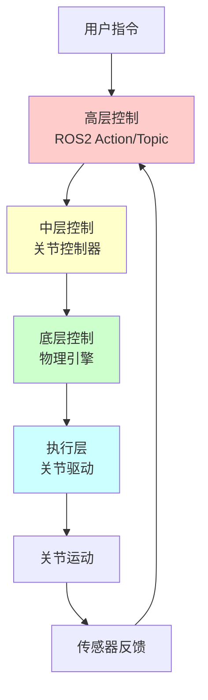
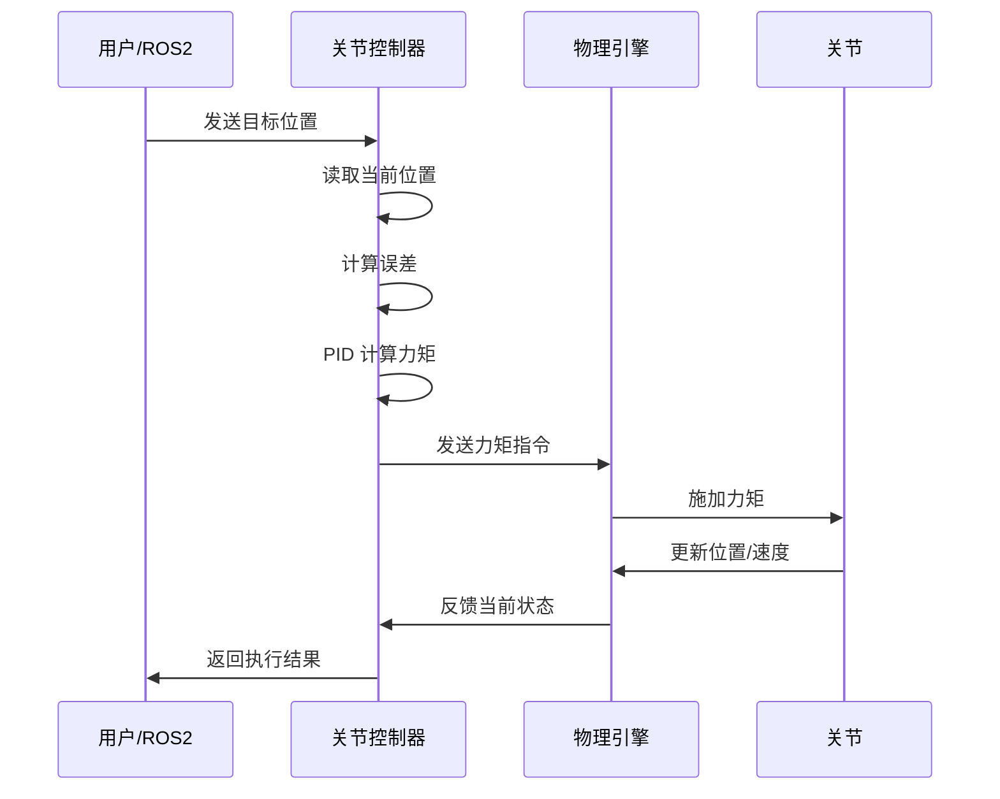
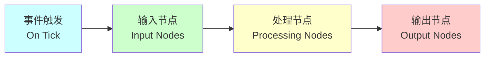
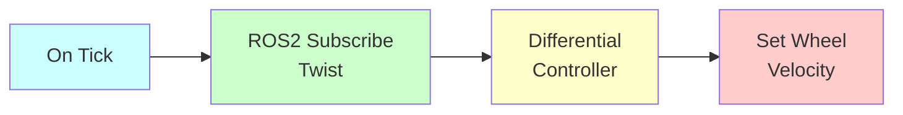
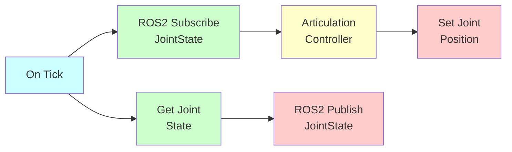
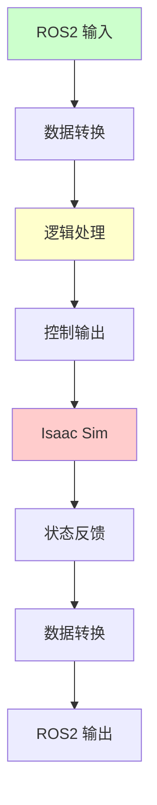
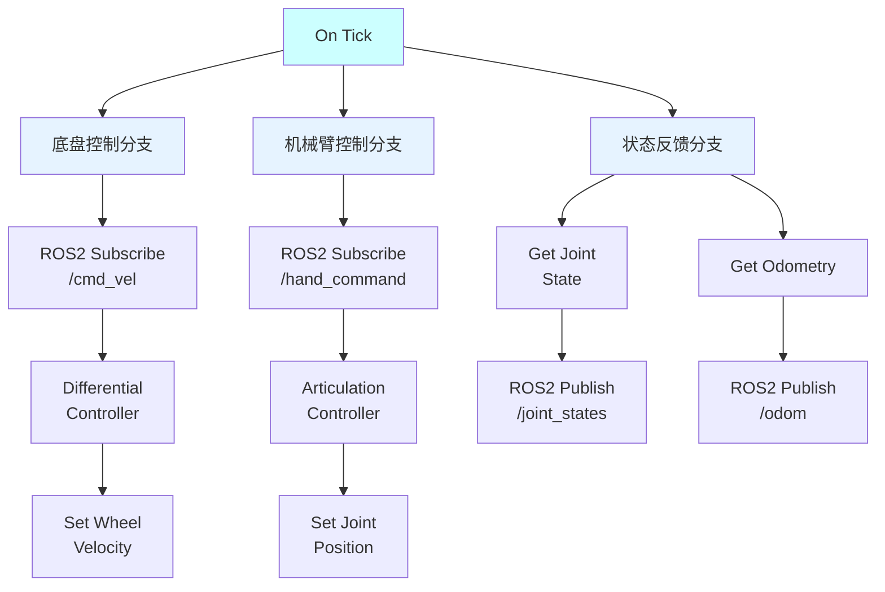

# 第四章：Isaac Sim 关节控制与 ActionGraph

## 4.1 关节控制基础

### 4.1.1 什么是关节控制

**关节控制（Joint Control）**是指通过发送控制指令来驱动机器人关节运动的过程。在 Isaac Sim 中，关节控制是实现机器人运动的核心机制。

**控制目标**：
- 🎯 位置控制：控制关节到达指定角度
- 🚀 速度控制：控制关节以指定速度运动
- 💪 力矩控制：控制关节输出指定力矩
- 🔄 混合控制：结合多种控制模式

### 4.1.2 关节控制的层次结构



**各层职责**：
1. **高层控制**：接收用户指令，规划轨迹
2. **中层控制**：将轨迹转换为关节指令
3. **底层控制**：物理引擎执行运动仿真
4. **执行层**：关节实际运动

### 4.1.3 关节控制模式

| 控制模式 | 输入 | 输出 | 适用场景 |
|----------|------|------|----------|
| **位置控制** | 目标角度 | 关节位置 | 精确定位、轨迹跟踪 |
| **速度控制** | 目标速度 | 关节速度 | 连续运动、速度跟踪 |
| **力矩控制** | 目标力矩 | 关节力矩 | 力控制、柔顺控制 |
| **阻抗控制** | 目标位置+刚度 | 关节力矩 | 接触任务、装配 |

## 4.2 关节控制器（Joint Controller）

### 4.2.1 什么是关节控制器

**关节控制器（Joint Controller）**是 Isaac Sim 中用于控制关节运动的核心组件。它接收控制指令，计算控制输出，并驱动关节运动。

**控制器的作用**：
- 📥 接收外部控制指令
- 🧮 计算控制输出（PID 控制等）
- 📤 发送指令到物理引擎
- 🔄 处理反馈和误差修正

### 4.2.2 PID 控制器原理

Isaac Sim 的关节控制器主要基于 **PID 控制**：

```
控制输出 = Kp × e(t) + Ki × ∫e(t)dt + Kd × de(t)/dt

其中：
e(t) = 目标值 - 当前值（误差）
Kp: 比例增益
Ki: 积分增益
Kd: 微分增益
```

**PID 各项的作用**：
- **P（比例）**：根据当前误差产生控制量，响应快但可能震荡
- **I（积分）**：消除稳态误差，但可能导致超调
- **D（微分）**：预测误差趋势，抑制震荡，提高稳定性

### 4.2.3 关节控制器的配置

在 Isaac Sim 中，关节控制器通过以下参数配置：

| 参数 | 说明 | 典型值 |
|------|------|--------|
| **stiffness** | 刚度（位置控制增益） | 1000 - 10000 |
| **damping** | 阻尼（速度控制增益） | 100 - 1000 |
| **max_effort** | 最大力矩限制 | 10 - 100 N·m |
| **max_velocity** | 最大速度限制 | 1 - 5 rad/s |
| **armature** | 电机转子惯量 | 0.001 - 0.01 |

**配置示例**：
```python
from omni.isaac.core.articulations import Articulation

# 获取机器人
robot = Articulation("/World/bobac_robot")
robot.initialize()

# 设置关节刚度（位置控制增益）
robot.set_gains(
    kps=[5000.0] * robot.num_dof,  # 比例增益
    kds=[500.0] * robot.num_dof    # 微分增益
)

# 设置关节限制
robot.set_max_efforts([50.0] * robot.num_dof)
robot.set_max_velocities([2.0] * robot.num_dof)
```

### 4.2.4 关节控制器的工作流程



## 4.3 ROS2 与 Isaac Sim 通信

### 4.3.1 通信架构

```mermaid
graph LR
    A[ROS2 节点] <-->|ROS2 Bridge| B[Isaac Sim]
    
    A -->|发布| C[/cmd_vel]
    A -->|发布| D[/hand_command]
    A -->|订阅| E[/joint_states]
    A -->|订阅| F[/odom]
    
    B -->|订阅| C
    B -->|订阅| D
    B -->|发布| E
    B -->|发布| F
    
    style A fill:#ccffcc
    style B fill:#ffcccc
```

### 4.3.2 ROS2 Bridge 原理

**ROS2 Bridge** 是 Isaac Sim 与 ROS2 之间的通信桥梁，它实现了：
- 📡 ROS2 话题的订阅和发布
- 🔄 数据格式的转换（USD ↔ ROS2 消息）
- ⏱️ 时间同步（仿真时间 ↔ ROS 时间）
- 🎯 TF 变换的发布

**启用 ROS2 Bridge**：
```python
from omni.isaac.core.utils.extensions import enable_extension

# 启用 ROS2 扩展
enable_extension("omni.isaac.ros2_bridge")
```

### 4.3.3 关节状态发布

Isaac Sim 通过 `/joint_states` 话题发布关节状态：

```python
# 话题：/joint_states
# 类型：sensor_msgs/JointState

# 消息内容：
{
  "header": {
    "stamp": {"sec": 10, "nanosec": 500000000},
    "frame_id": ""
  },
  "name": ["joint1", "joint2", "joint3", "joint4", "joint5", "joint6"],
  "position": [0.0, 0.5, -0.3, 0.0, 0.2, 0.0],
  "velocity": [0.0, 0.1, -0.05, 0.0, 0.03, 0.0],
  "effort": [0.0, 5.2, -3.1, 0.0, 1.5, 0.0]
}
```

### 4.3.4 关节控制指令接收

Isaac Sim 通过 `/hand_command` 话题接收关节控制指令：

```python
# 话题：/hand_command
# 类型：sensor_msgs/JointState

# 发送位置控制指令
import rclpy
from sensor_msgs.msg import JointState

joint_cmd = JointState()
joint_cmd.name = ["joint1", "joint2", "joint3", "joint4", "joint5", "joint6"]
joint_cmd.position = [0.5, 0.3, -0.5, 0.0, 0.2, 0.0]

publisher.publish(joint_cmd)
```

### 4.3.5 底盘速度控制

底盘通过 `/cmd_vel` 话题接收速度指令：

```python
# 话题：/cmd_vel
# 类型：geometry_msgs/Twist

from geometry_msgs.msg import Twist

cmd = Twist()
cmd.linear.x = 0.5   # 前进速度 (m/s)
cmd.linear.y = 0.0   # 左右速度 (m/s)
cmd.angular.z = 0.3  # 旋转速度 (rad/s)

publisher.publish(cmd)
```

## 4.4 ActionGraph 可视化编程

### 4.4.1 什么是 ActionGraph

**ActionGraph** 是 Isaac Sim 提供的可视化编程工具，允许用户通过拖拽节点和连接的方式构建逻辑流程，无需编写代码即可实现复杂的机器人控制。

**特点**：
- 🎨 可视化编程，直观易懂
- 🔌 丰富的节点库，开箱即用
- 🔄 实时执行，即时反馈
- 🧩 模块化设计，易于复用

### 4.4.2 ActionGraph 的组成



**节点类型**：
1. **事件节点**：触发执行（On Tick、On Impulse Event）
2. **输入节点**：读取数据（ROS2 Subscribe、Get Prim Attribute）
3. **处理节点**：数据处理（Math、Logic、Array）
4. **输出节点**：输出数据（ROS2 Publish、Set Prim Attribute）

### 4.4.3 创建 ActionGraph

**步骤 1：打开 ActionGraph 编辑器**
1. 菜单：Window → Visual Scripting → Action Graph
2. 点击 "New Action Graph" 创建新图

**步骤 2：添加节点**
1. 右键点击画布 → Add Node
2. 搜索并选择需要的节点
3. 拖拽节点到画布

**步骤 3：连接节点**
1. 点击节点的输出端口
2. 拖拽到目标节点的输入端口
3. 释放鼠标完成连接

**步骤 4：配置参数**
1. 选中节点
2. 在 Property 面板中设置参数
3. 保存 ActionGraph

### 4.4.4 常用节点介绍

#### 事件节点

| 节点 | 说明 | 用途 |
|------|------|------|
| **On Tick** | 每帧触发 | 周期性执行 |
| **On Impulse Event** | 事件触发 | 响应特定事件 |
| **On Keyboard Input** | 键盘输入 | 手动控制 |

#### ROS2 节点

| 节点 | 说明 | 输入/输出 |
|------|------|-----------|
| **ROS2 Subscribe JointState** | 订阅关节状态 | 输出：关节位置、速度、力矩 |
| **ROS2 Publish JointState** | 发布关节状态 | 输入：关节位置、速度、力矩 |
| **ROS2 Subscribe Twist** | 订阅速度指令 | 输出：线速度、角速度 |
| **ROS2 Publish Odometry** | 发布里程计 | 输入：位姿、速度 |

#### 机器人控制节点

| 节点 | 说明 | 用途 |
|------|------|------|
| **Articulation Controller** | 关节控制器 | 控制关节运动 |
| **Differential Controller** | 差速控制器 | 控制差速底盘 |
| **Get Joint State** | 获取关节状态 | 读取关节位置/速度 |
| **Set Joint Position** | 设置关节位置 | 位置控制 |

### 4.4.5 ActionGraph 示例：底盘速度控制

**功能**：订阅 `/cmd_vel` 话题，控制差速底盘运动



**节点配置**：

1. **On Tick**
   - 触发频率：每帧

2. **ROS2 Subscribe Twist**
   - Topic Name: `/cmd_vel`
   - QoS Profile: Default

3. **Differential Controller**
   - Wheel Base: 0.38 (m)
   - Wheel Radius: 0.075 (m)

4. **Set Wheel Velocity**
   - Left Wheel: `/World/bobac_robot/wheel_left`
   - Right Wheel: `/World/bobac_robot/wheel_right`

### 4.4.6 ActionGraph 示例：机械臂关节控制

**功能**：订阅 `/hand_command` 话题，控制机械臂关节



**节点配置**：

1. **ROS2 Subscribe JointState**
   - Topic Name: `/hand_command`
   - QoS Profile: Default

2. **Articulation Controller**
   - Robot Path: `/World/bobac_robot`
   - Control Mode: Position

3. **Set Joint Position**
   - Joint Names: ["joint1", "joint2", ..., "joint6"]

4. **Get Joint State**
   - Robot Path: `/World/bobac_robot`

5. **ROS2 Publish JointState**
   - Topic Name: `/joint_states`
   - Publish Rate: 50 Hz

## 4.5 ActionGraph 在机器人控制中的作用

### 4.5.1 数据流管理

ActionGraph 提供了清晰的数据流管理：



**优势**：
- 📊 可视化数据流向
- 🔍 便于调试和监控
- 🔄 支持实时修改
- 📝 自动生成文档

### 4.5.2 模块化设计

ActionGraph 支持模块化设计：

**1. 子图（Subgraph）**
- 将复杂逻辑封装为子图
- 提高可读性和可维护性
- 支持跨项目复用

**2. 模板（Template）**
- 预定义常用功能模块
- 快速搭建控制逻辑
- 保证一致性

### 4.5.3 调试和监控

ActionGraph 提供强大的调试功能：

**1. 实时监控**
- 查看节点的输入输出值
- 监控数据流动
- 检测异常状态

**2. 断点调试**
- 在节点处设置断点
- 单步执行
- 检查中间结果

**3. 性能分析**
- 查看节点执行时间
- 识别性能瓶颈
- 优化执行效率

### 4.5.4 与 Python 脚本的对比

| 特性 | ActionGraph | Python 脚本 |
|------|-------------|-------------|
| **学习曲线** | 低，可视化 | 中，需要编程基础 |
| **开发速度** | 快，拖拽即用 | 中，需要编写代码 |
| **灵活性** | 中，受限于节点库 | 高，完全自定义 |
| **调试难度** | 低，可视化调试 | 中，需要打印/断点 |
| **性能** | 中，有一定开销 | 高，直接执行 |
| **复用性** | 高，子图/模板 | 高，函数/类 |
| **适用场景** | 简单逻辑、快速原型 | 复杂算法、高性能 |

**推荐使用场景**：
- ✅ ActionGraph：ROS2 通信、简单控制逻辑、快速原型
- ✅ Python 脚本：复杂算法、高性能计算、批量处理

## 4.6 实战：通过 ActionGraph 控制 Bobac 机器人

### 4.6.1 任务目标

构建一个完整的 ActionGraph，实现：
1. 订阅 `/cmd_vel` 控制底盘运动
2. 订阅 `/hand_command` 控制机械臂
3. 发布 `/joint_states` 反馈关节状态
4. 发布 `/odom` 反馈里程计数据

### 4.6.2 ActionGraph 结构



### 4.6.3 详细配置步骤

**步骤 1：创建 ActionGraph**
```python
# 通过 Python API 创建
from omni.isaac.core_nodes.scripts.utils import set_target_prims

import omni.graph.core as og

# 创建 ActionGraph
keys = og.Controller.Keys
(graph, nodes, _, _) = og.Controller.edit(
    {"graph_path": "/ActionGraph", "evaluator_name": "execution"},
    {
        keys.CREATE_NODES: [
            ("OnTick", "omni.graph.action.OnTick"),
            ("SubscribeCmdVel", "omni.isaac.ros2_bridge.ROS2SubscribeTwist"),
            ("DiffController", "omni.isaac.wheeled_robots.DifferentialController"),
            # ... 其他节点
        ],
        keys.CONNECT: [
            ("OnTick.outputs:tick", "SubscribeCmdVel.inputs:execIn"),
            # ... 其他连接
        ],
    },
)
```

**步骤 2：配置底盘控制**
```python
# 配置差速控制器
og.Controller.attribute("DiffController.inputs:wheelDistance").set(0.38)
og.Controller.attribute("DiffController.inputs:wheelRadius").set(0.075)
og.Controller.attribute("DiffController.inputs:maxLinearSpeed").set(1.0)
og.Controller.attribute("DiffController.inputs:maxAngularSpeed").set(1.0)
```

**步骤 3：配置机械臂控制**
```python
# 配置关节控制器
set_target_prims(
    primPath="/World/bobac_robot",
    targetPrimPaths=["/World/bobac_robot"]
)
```

**步骤 4：配置状态发布**
```python
# 配置关节状态发布
og.Controller.attribute("PublishJointState.inputs:topicName").set("/joint_states")
og.Controller.attribute("PublishJointState.inputs:queueSize").set(10)

# 配置里程计发布
og.Controller.attribute("PublishOdom.inputs:topicName").set("/odom")
og.Controller.attribute("PublishOdom.inputs:frameId").set("odom")
og.Controller.attribute("PublishOdom.inputs:childFrameId").set("base_link")
```

### 4.6.4 测试和验证

**1. 启动 Isaac Sim**
```bash
# 加载场景和 ActionGraph
# 点击 Play 开始仿真
```

**2. 测试底盘控制**
```bash
# 在 ROS2 终端发送速度指令
ros2 topic pub /cmd_vel geometry_msgs/Twist \
  "{linear: {x: 0.5, y: 0.0, z: 0.0}, angular: {x: 0.0, y: 0.0, z: 0.3}}"
```

**3. 测试机械臂控制**
```bash
# 发送关节位置指令
ros2 topic pub /hand_command sensor_msgs/JointState \
  "{name: ['joint1', 'joint2', 'joint3', 'joint4', 'joint5', 'joint6'], \
    position: [0.5, 0.3, -0.5, 0.0, 0.2, 0.0]}"
```

**4. 查看状态反馈**
```bash
# 查看关节状态
ros2 topic echo /joint_states

# 查看里程计
ros2 topic echo /odom
```

## 4.7 本章小结

本章详细介绍了 Isaac Sim 中的关节控制机制和 ActionGraph 可视化编程。

**关键要点**：
1. **关节控制器**：基于 PID 控制，通过刚度和阻尼参数调节
2. **ROS2 通信**：通过 ROS2 Bridge 实现 Isaac Sim 与 ROS2 的数据交换
3. **ActionGraph**：可视化编程工具，适合快速原型和简单逻辑
4. **控制流程**：ROS2 指令 → ActionGraph → 关节控制器 → 物理引擎 → 关节运动

**重要概念**：
- 关节控制器 = PID 控制器 + 物理约束
- ActionGraph = 可视化编程 + 实时执行
- ROS2 Bridge = 数据转换 + 时间同步
- 控制模式 = 位置控制 / 速度控制 / 力矩控制

**实践建议**：
- 🎯 简单任务优先使用 ActionGraph
- 💻 复杂算法使用 Python 脚本
- 🔄 两者结合，发挥各自优势
- 🐛 充分利用 ActionGraph 的调试功能

下一章将介绍如何在 Isaac Sim 中实现机器人的自主导航功能，包括 SLAM 建图、路径规划和避障控制。

---

**思考题**：
1. PID 控制器的三个参数分别如何影响控制效果？
2. ActionGraph 和 Python 脚本各适合什么场景？
3. 如何在 ActionGraph 中实现条件判断和循环？
4. 为什么需要 ROS2 Bridge 而不是直接通信？
