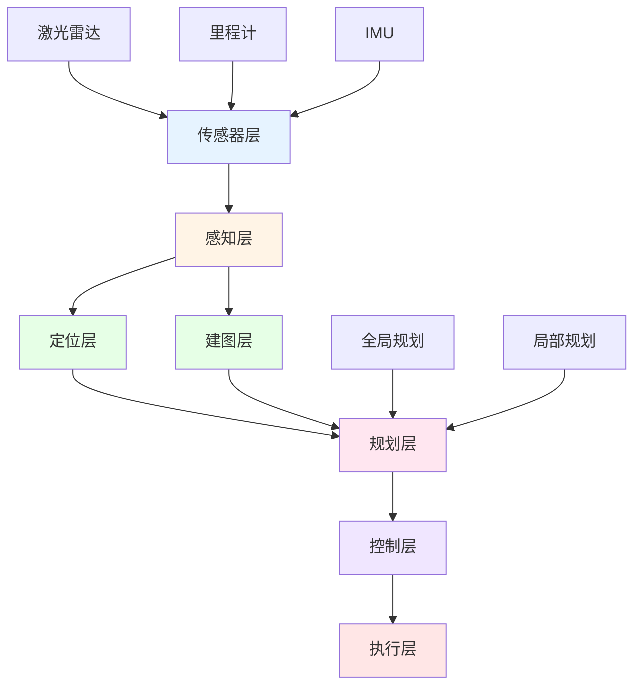
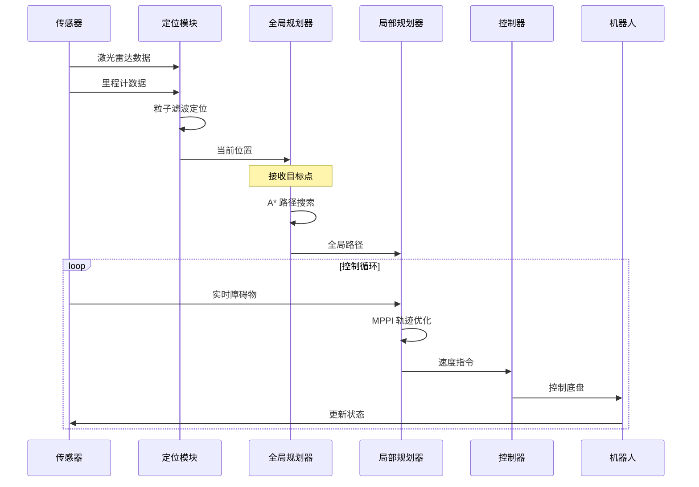
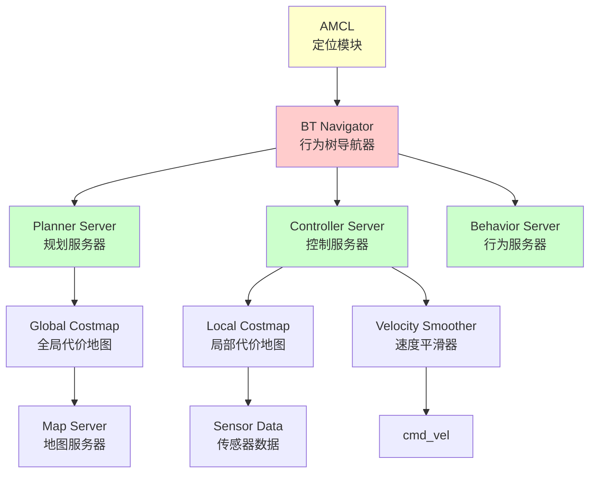
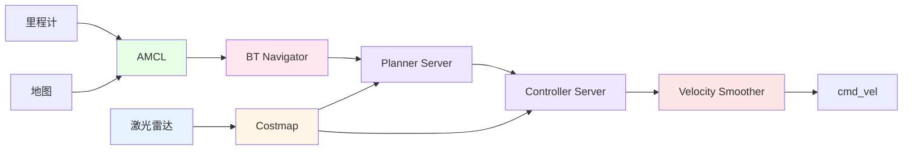
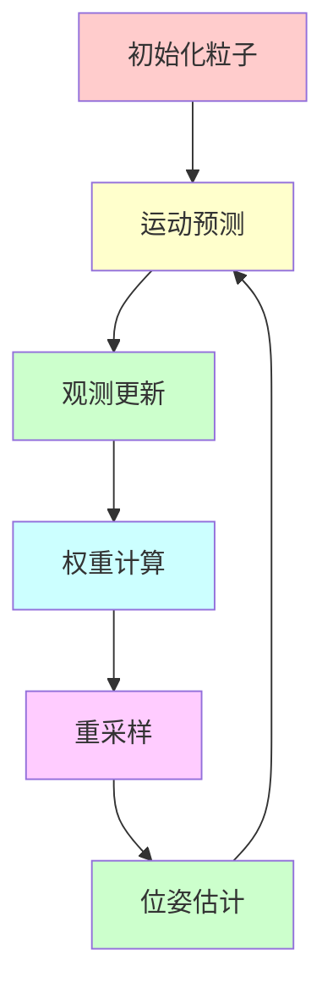
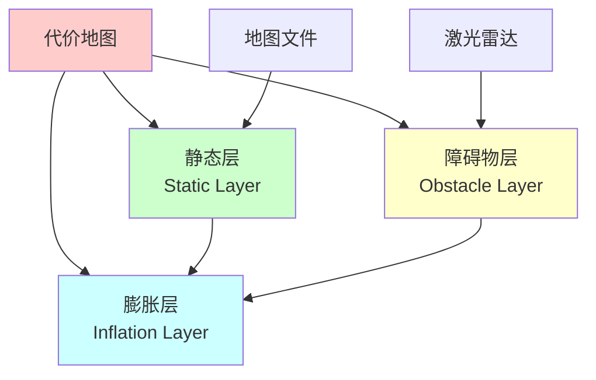
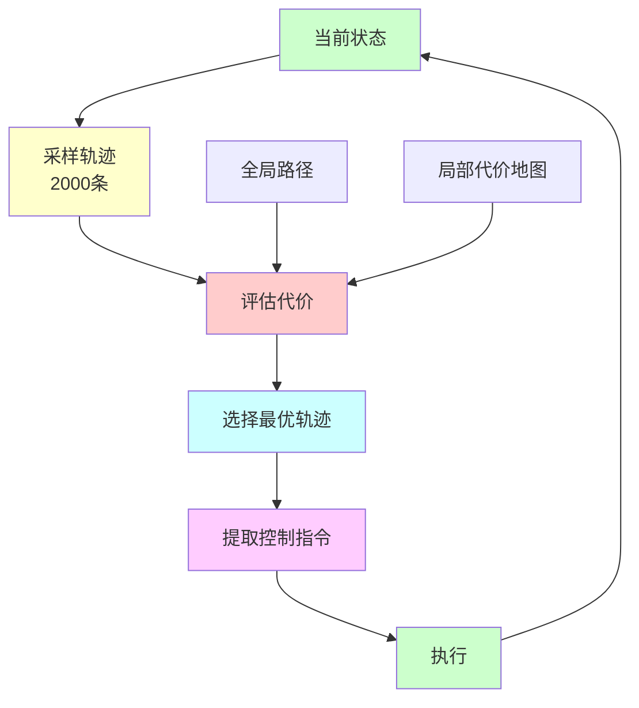
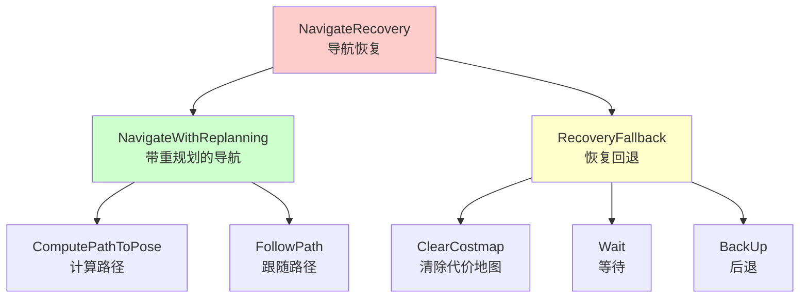

# 第五章：导航功能实现

## 5.1 导航系统概述

### 5.1.1 什么是自主导航

**自主导航（Autonomous Navigation）**是指机器人在未知或已知环境中，通过传感器感知环境、规划路径、避开障碍物，自主地从起点移动到目标点的能力。

**导航的核心问题**：
- 🗺️ **我在哪里？**（定位 Localization）
- 🎯 **我要去哪里？**（目标设定 Goal Setting）
- 🛣️ **怎么去？**（路径规划 Path Planning）
- 🚧 **如何避障？**（避障控制 Obstacle Avoidance）

### 5.1.2 导航系统的组成



**各层功能**：
1. **传感器层**：采集环境数据（激光、视觉、里程计）
2. **感知层**：处理传感器数据，提取特征
3. **定位层**：估计机器人在地图中的位置
4. **建图层**：构建环境地图
5. **规划层**：规划从当前位置到目标的路径
6. **控制层**：生成速度控制指令
7. **执行层**：驱动底盘运动

### 5.1.3 导航系统的工作流程



## 5.2 ROS2 Nav2 导航栈

### 5.2.1 什么是 Nav2

**Nav2（Navigation 2）**是 ROS2 的官方导航框架，提供了完整的移动机器人导航解决方案。

**Nav2 的特点**：
- 🚀 专为 ROS2 设计，充分利用 ROS2 特性
- 🧩 模块化架构，易于定制和扩展
- 🎯 支持多种规划器和控制器
- 🔄 行为树协调，灵活的任务管理
- 📊 丰富的插件系统

### 5.2.2 Nav2 架构



**核心组件**：

| 组件 | 功能 | 说明 |
|------|------|------|
| **BT Navigator** | 任务协调 | 使用行为树协调各模块 |
| **Planner Server** | 全局规划 | 计算从起点到终点的路径 |
| **Controller Server** | 局部规划 | 生成实时速度指令 |
| **Behavior Server** | 恢复行为 | 处理导航失败情况 |
| **AMCL** | 定位 | 估计机器人位置 |
| **Map Server** | 地图管理 | 加载和发布地图 |
| **Costmap** | 代价地图 | 表示环境障碍物 |
| **Velocity Smoother** | 速度平滑 | 限制加速度 |

### 5.2.3 Nav2 数据流



## 5.3 AMCL 定位算法

### 5.3.1 AMCL 原理

**AMCL（Adaptive Monte Carlo Localization）**是一种基于粒子滤波的自适应定位算法。

**核心思想**：
- 使用大量粒子表示机器人可能的位置
- 根据传感器观测更新粒子权重
- 重采样保留高权重粒子
- 自适应调整粒子数量

### 5.3.2 粒子滤波过程



**算法步骤**：

1. **初始化**：在地图上随机分布粒子
2. **运动预测**：根据里程计移动粒子
3. **观测更新**：根据激光雷达计算粒子权重
4. **重采样**：保留高权重粒子，淘汰低权重粒子
5. **位姿估计**：计算粒子的加权平均作为位姿估计

### 5.3.3 AMCL 关键参数

| 参数 | 说明 | 典型值 |
|------|------|--------|
| **min_particles** | 最小粒子数 | 300 |
| **max_particles** | 最大粒子数 | 1500 |
| **update_min_d** | 触发更新的最小移动距离 | 0.15 m |
| **update_min_a** | 触发更新的最小旋转角度 | 0.1 rad |
| **laser_model_type** | 激光模型类型 | likelihood_field |
| **max_beams** | 使用的激光束数量 | 360 |
| **robot_model_type** | 运动模型类型 | differential / omni |

### 5.3.4 AMCL 配置示例

```yaml
amcl:
  ros__parameters:
    # 粒子滤波参数
    min_particles: 300
    max_particles: 1500
    
    # 更新触发条件
    update_min_d: 0.15
    update_min_a: 0.1
    
    # 运动模型（差速驱动）
    robot_model_type: "nav2_amcl::DifferentialMotionModel"
    
    # 激光模型
    laser_model_type: "likelihood_field"
    max_beams: 360
    
    # 坐标系
    global_frame_id: "map"
    odom_frame_id: "odom"
    base_frame_id: "base_link"
```

## 5.4 全局路径规划

### 5.4.1 SmacPlanner2D 规划器

**SmacPlanner2D** 是 Nav2 中的全局路径规划器，基于 A* 算法的改进版本。

**特点**：
- 🎯 考虑代价地图信息
- 🔄 支持路径平滑
- ⚡ 高效的搜索算法
- 🛣️ 生成可行驶路径

### 5.4.2 A* 算法原理

**A* 算法**是一种启发式搜索算法，通过评估函数选择最优路径。

**评估函数**：
```
f(n) = g(n) + h(n)

其中：
g(n): 从起点到节点 n 的实际代价
h(n): 从节点 n 到终点的估计代价（启发函数）
```

**算法流程**：
1. 将起点加入开放列表
2. 从开放列表选择 f 值最小的节点
3. 扩展该节点的邻居
4. 更新邻居的 g、h、f 值
5. 重复直到找到终点

### 5.4.3 代价地图（Costmap）

**代价地图**是一个二维网格，每个格子表示该位置的通行代价。

**代价值含义**：
- **0**：自由空间，可安全通行
- **1-252**：接近障碍物，代价递增
- **253**：内切障碍物（inscribed）
- **254**：致命障碍物（lethal）
- **255**：未知区域

**代价地图层级**：



**层级说明**：
1. **静态层**：从地图文件加载的静态障碍物
2. **障碍物层**：从传感器检测的动态障碍物
3. **膨胀层**：将障碍物膨胀，保证安全距离

### 5.4.4 全局规划器配置

```yaml
planner_server:
  ros__parameters:
    planner_plugins: ["GridBased"]
    
    GridBased:
      plugin: "nav2_smac_planner/SmacPlanner2D"
      tolerance: 0.25                # 目标容差
      max_planning_time: 10.0        # 最大规划时间
      allow_unknown: true            # 允许未知区域
      smooth_path: true              # 路径平滑
      cost_travel_multiplier: 2.0    # 代价权重
```

## 5.5 局部路径规划

### 5.5.1 MPPI 控制器

**MPPI（Model Predictive Path Integral）**是一种基于模型预测的控制算法。

**核心思想**：
- 采样大量候选轨迹
- 评估每条轨迹的代价
- 选择代价最小的轨迹
- 执行第一步控制指令

### 5.5.2 MPPI 工作流程



### 5.5.3 MPPI 评价器

MPPI 使用多个评价器对轨迹进行评分：

| 评价器 | 权重 | 作用 |
|--------|------|------|
| **ConstraintCritic** | 3.0 | 惩罚违反约束的轨迹 |
| **ObstaclesCritic** | 50.0 | 惩罚接近障碍物的轨迹 |
| **CostCritic** | 3.5 | 惩罚高代价区域 |
| **PathAlignCritic** | 5.0 | 奖励对齐全局路径 |
| **PathFollowCritic** | 20.0 | 奖励跟随全局路径 |
| **GoalCritic** | 20.0 | 奖励接近目标 |
| **GoalAngleCritic** | 10.0 | 奖励目标角度对齐 |

**总代价计算**：
```
总代价 = Σ (权重_i × 评价器_i)
```

### 5.5.4 MPPI 控制器配置

```yaml
controller_server:
  ros__parameters:
    controller_plugins: ["FollowPath"]
    
    FollowPath:
      plugin: "nav2_mppi_controller::MPPIController"
      
      # 预测参数
      time_steps: 50              # 预测步数
      model_dt: 0.05              # 时间步长
      batch_size: 2000            # 采样轨迹数
      
      # 运动模型
      motion_model: "DiffDrive"   # 差速驱动
      
      # 速度限制
      vx_max: 1.0
      vx_min: -1.0
      vy_max: 0.0
      wz_max: 1.0
      
      # 评价器配置
      critics: [
        "ConstraintCritic",
        "ObstaclesCritic", 
        "CostCritic",
        "PathAlignCritic",
        "PathFollowCritic",
        "GoalCritic",
        "GoalAngleCritic"
      ]
      
      ObstaclesCritic:
        cost_weight: 50.0
        collision_margin_distance: 0.35
```

## 5.6 行为树导航器

### 5.6.1 什么是行为树

**行为树（Behavior Tree）**是一种用于任务规划和决策的树状结构，广泛应用于游戏 AI 和机器人控制。

**节点类型**：
- **Action**：执行具体动作
- **Condition**：检查条件
- **Sequence**：顺序执行子节点
- **Fallback**：尝试子节点直到成功
- **Parallel**：并行执行子节点

### 5.6.2 Nav2 行为树结构



### 5.6.3 行为树的作用

**1. 任务协调**
- 协调规划、控制、恢复等模块
- 管理任务执行顺序
- 处理任务失败和重试

**2. 错误恢复**
- 检测导航失败
- 执行恢复行为
- 重新尝试导航

**3. 灵活配置**
- 通过 XML 配置行为树
- 支持自定义行为节点
- 易于调整导航策略

### 5.6.4 自定义行为树示例

```xml
<root main_tree_to_execute="MainTree">
  <BehaviorTree ID="MainTree">
    <RecoveryNode number_of_retries="6" name="NavigateRecovery">
      <PipelineSequence name="NavigateWithReplanning">
        <RateController hz="1.0">
          <RecoveryNode number_of_retries="1">
            <ComputePathToPose goal="{goal}"/>
            <ClearEntireCostmap name="ClearGlobalCostmap"/>
          </RecoveryNode>
        </RateController>
        
        <RecoveryNode number_of_retries="1">
          <FollowPath path="{path}"/>
          <ClearEntireCostmap name="ClearLocalCostmap"/>
        </RecoveryNode>
      </PipelineSequence>
      
      <ReactiveFallback name="RecoveryFallback">
        <GoalUpdated/>
        <RoundRobin name="RecoveryActions">
          <Sequence name="ClearingActions">
            <ClearEntireCostmap name="ClearLocalCostmap"/>
            <ClearEntireCostmap name="ClearGlobalCostmap"/>
          </Sequence>
          <Wait wait_duration="5"/>
          <BackUp backup_dist="0.3" backup_speed="0.1"/>
        </RoundRobin>
      </ReactiveFallback>
    </RecoveryNode>
  </BehaviorTree>
</root>
```

## 5.7 在 Isaac Sim 中实现导航

### 5.7.1 环境准备

**1. 创建仿真场景**
```python
from omni.isaac.core import World
from omni.isaac.core.objects import DynamicCuboid

# 创建世界
world = World()

# 添加地面
world.scene.add_default_ground_plane()

# 添加障碍物
obstacle1 = DynamicCuboid(
    prim_path="/World/Obstacle1",
    position=[2.0, 1.0, 0.5],
    size=1.0,
    color=[0.8, 0.2, 0.2]
)
world.scene.add(obstacle1)
```

**2. 加载机器人**
```python
from omni.isaac.core.robots import Robot

# 加载 Bobac 机器人
robot = Robot(
    prim_path="/World/bobac_robot",
    name="bobac"
)
world.scene.add(robot)
```

**3. 配置传感器**
```python
# 激光雷达已在 URDF 中定义
# 确保发布到 /scan 话题
```

### 5.7.2 启动 Nav2

**启动文件**：
```bash
ros2 launch bobac_navigation bobac_navigation.launch.py \
  map:=/path/to/map.yaml \
  use_sim_time:=True
```

**启动的节点**：
- map_server：地图服务器
- amcl：定位节点
- planner_server：全局规划器
- controller_server：局部规划器
- bt_navigator：行为树导航器
- velocity_smoother：速度平滑器

### 5.7.3 建图（可选）

如果没有地图，需要先建图：

```bash
# 启动 SLAM 建图
ros2 launch slam_toolbox online_async_launch.py \
  use_sim_time:=True

# 在 Isaac Sim 中手动控制机器人移动
ros2 run teleop_twist_keyboard teleop_twist_keyboard

# 保存地图
ros2 run nav2_map_server map_saver_cli -f my_map
```

### 5.7.4 发送导航目标

**方法 1：通过 RViz2**
1. 打开 RViz2
2. 点击 "2D Goal Pose" 按钮
3. 在地图上点击目标位置

**方法 2：通过命令行**
```bash
ros2 action send_goal /navigate_to_pose nav2_msgs/action/NavigateToPose \
  "{pose: {header: {frame_id: 'map'}, \
   pose: {position: {x: 5.0, y: 3.0, z: 0.0}, \
   orientation: {w: 1.0}}}}"
```

**方法 3：通过 Python**
```python
import rclpy
from rclpy.action import ActionClient
from nav2_msgs.action import NavigateToPose
from geometry_msgs.msg import PoseStamped

# 创建 Action 客户端
nav_client = ActionClient(node, NavigateToPose, '/navigate_to_pose')

# 创建目标
goal_msg = NavigateToPose.Goal()
goal_msg.pose.header.frame_id = 'map'
goal_msg.pose.pose.position.x = 5.0
goal_msg.pose.pose.position.y = 3.0
goal_msg.pose.pose.orientation.w = 1.0

# 发送目标
nav_client.send_goal_async(goal_msg)
```

## 5.8 导航调试与优化

### 5.8.1 常见问题

**1. 定位不准确**
- 检查激光雷达数据质量
- 调整 AMCL 粒子数量
- 增加激光束数量
- 检查地图与环境是否匹配

**2. 路径规划失败**
- 检查目标点是否在自由空间
- 调整规划器容差
- 允许未知区域
- 清除代价地图

**3. 机器人震荡**
- 降低速度限制
- 调整 MPPI 评价器权重
- 增加速度平滑
- 调整目标容差

**4. 碰撞障碍物**
- 增加障碍物膨胀半径
- 调整机器人足迹大小
- 增加 ObstaclesCritic 权重
- 降低最大速度

### 5.8.2 参数调优建议

**定位参数**：
```yaml
# 提高定位精度
max_particles: 2000
max_beams: 720

# 降低定位精度，提高性能
max_particles: 500
max_beams: 180
```

**规划参数**：
```yaml
# 提高规划成功率
tolerance: 0.5
allow_unknown: true
max_planning_time: 20.0

# 提高规划速度
tolerance: 0.1
max_planning_time: 5.0
```

**控制参数**：
```yaml
# 提高跟踪精度
PathFollowCritic.cost_weight: 30.0
vx_max: 0.5

# 提高运动速度
PathFollowCritic.cost_weight: 10.0
vx_max: 1.5
```

## 5.9 本章小结

本章详细介绍了移动机器人的自主导航系统，包括 ROS2 Nav2 导航栈的架构、核心算法和实现方法。

**关键要点**：
1. **导航系统**：定位 + 建图 + 规划 + 控制
2. **Nav2 架构**：模块化设计，行为树协调
3. **AMCL 定位**：粒子滤波，自适应调整
4. **全局规划**：A* 算法，考虑代价地图
5. **局部规划**：MPPI 控制器，采样优化
6. **行为树**：任务协调，错误恢复

**重要概念**：
- 代价地图 = 静态层 + 障碍物层 + 膨胀层
- AMCL = 粒子滤波 + 运动模型 + 观测模型
- MPPI = 采样轨迹 + 评价器打分 + 最优选择
- 行为树 = 任务协调 + 错误恢复 + 灵活配置

**实践建议**：
- 🗺️ 先建立准确的地图
- 🎯 从简单场景开始测试
- 🔧 逐步调整参数优化性能
- 📊 使用 RViz2 可视化调试

下一章将介绍机器人的抓取放置功能，包括视觉识别、运动规划和夹爪控制。

---

**思考题**：
1. AMCL 为什么使用粒子滤波而不是卡尔曼滤波？
2. 全局规划和局部规划有什么区别和联系？
3. 如何根据机器人的运动特性选择合适的控制器？
4. 行为树相比状态机有什么优势？
