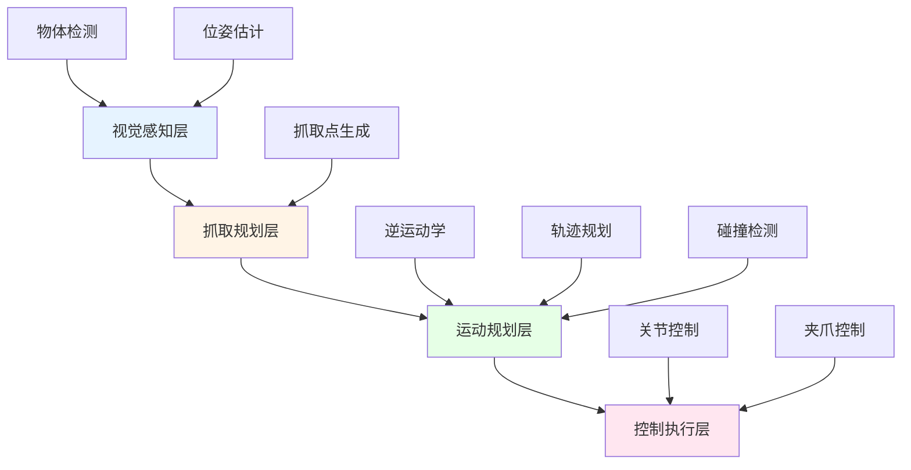
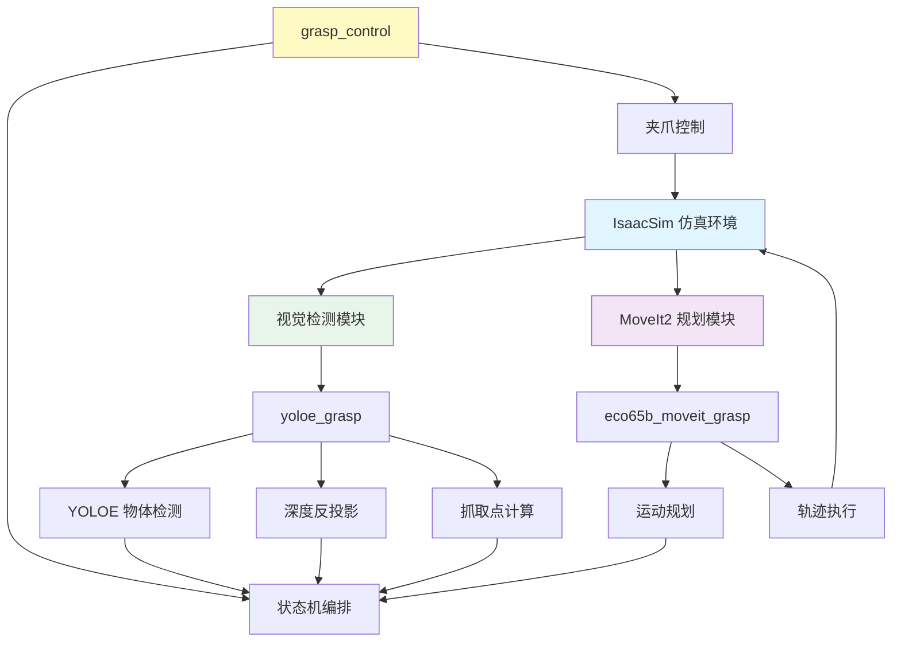
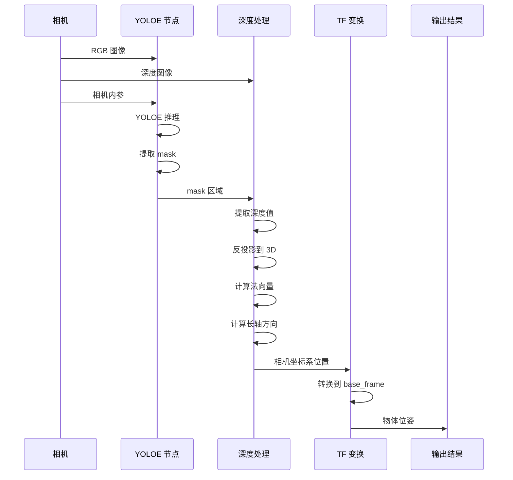
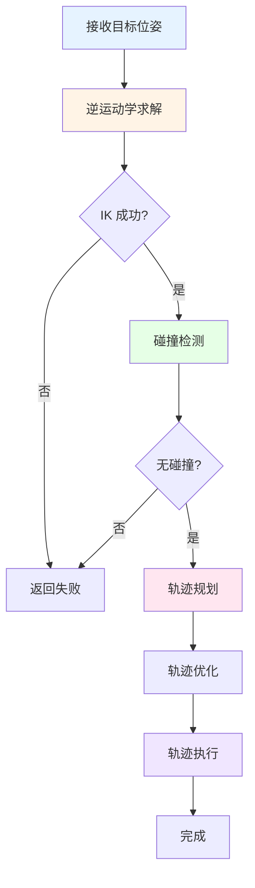
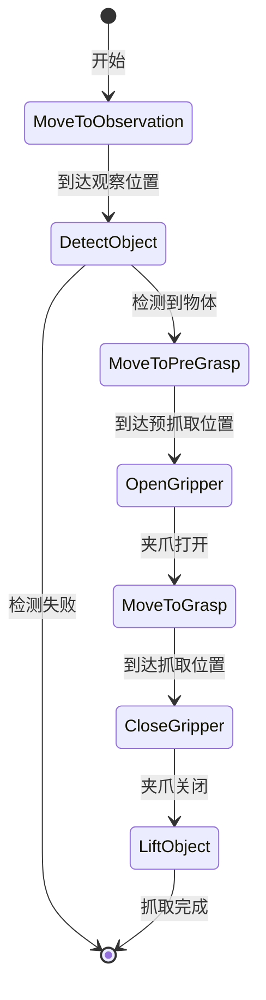
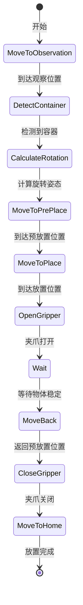

# 第六章：抓取放置功能实现

## 6.1 抓取系统概述

### 6.1.1 什么是机器人抓取

**机器人抓取（Robotic Grasping）**是指机器人通过视觉感知、运动规划和力控制，实现对目标物体的识别、定位和抓取的过程。

**抓取的核心问题**：
- 👁️ **看到什么？**（视觉识别）
- 📍 **在哪里？**（位置估计）
- 🤏 **怎么抓？**（抓取规划）
- ✋ **抓稳了吗？**（力控制）

### 6.1.2 抓取系统的组成



### 6.1.3 Bobac 抓取系统架构

根据 `/workspace/bobac_ws/src` 中的功能包，Bobac 抓取系统包含以下模块：



## 6.2 视觉检测模块（YOLOE）

### 6.2.1 YOLOE 物体检测

**YOLOE（You Only Look Once Extended）**是基于 YOLO 系列的物体检测算法，支持实例分割。

**功能包**：`yoloe_grasp`

**核心功能**：
- 🎯 物体检测：识别图像中的目标物体
- 🖼️ 实例分割：提取物体的精确轮廓
- 📏 深度估计：结合深度图获取 3D 位置
- 🧭 姿态估计：计算物体的方向和姿态

### 6.2.2 检测流程



### 6.2.3 关键参数配置

**配置文件**：`yoloe_grasp/config/pen_grasp_params.yaml`

```yaml
yoloe_grasp_node:
  ros__parameters:
    # 模型配置
    model_path: "/path/to/yoloe-26m-seg.pt"
    classes: ['pencil', 'pen']
    conf: 0.01                    # 置信度阈值
    device: "cuda:0"              # 推理设备
    
    # 法向量计算模式
    normal_mode: "fixed_base"     # fixed_base / local_plane / camera_side
    
    # 长轴计算模式
    axis_mode: "mask_long"        # mask_long / mask_short
    
    # 坐标系
    base_frame: "base_link_arm"
    camera_frame: "arm_camera_link"
```

**参数说明**：

| 参数 | 说明 | 可选值 |
|------|------|--------|
| **model_path** | YOLOE 模型路径 | .pt 文件路径 |
| **classes** | 检测类别 | 类别名称列表 |
| **conf** | 置信度阈值 | 0.0 - 1.0 |
| **normal_mode** | 法向量计算方式 | fixed_base / local_plane / camera_side |
| **axis_mode** | 长轴计算方式 | mask_long / mask_short |

### 6.2.4 深度反投影

**原理**：将 2D 图像坐标和深度值转换为 3D 空间坐标。

**公式**：
```
已知：
- 图像坐标 (u, v)
- 深度值 z
- 相机内参 K = [fx, 0, cx; 0, fy, cy; 0, 0, 1]

计算 3D 坐标：
x = (u - cx) * z / fx
y = (v - cy) * z / fy
z = z
```

**实现**：
```python
def depth_to_3d(u, v, depth, camera_info):
    """深度反投影"""
    fx = camera_info.K[0]
    fy = camera_info.K[4]
    cx = camera_info.K[2]
    cy = camera_info.K[5]
    
    x = (u - cx) * depth / fx
    y = (v - cy) * depth / fy
    z = depth
    
    return [x, y, z]
```

### 6.2.5 抓取点生成

**法向量计算**：

1. **fixed_base**：使用固定的法向量（如 [0, 0, -1]）
2. **local_plane**：拟合局部平面，计算平面法向量
3. **camera_side**：使用相机侧面方向

**长轴计算**：

使用 PCA（主成分分析）计算物体的主方向：

```python
import numpy as np
from sklearn.decomposition import PCA

def calculate_long_axis(points):
    """计算长轴方向"""
    pca = PCA(n_components=2)
    pca.fit(points)
    
    # 第一主成分为长轴方向
    long_axis = pca.components_[0]
    
    return long_axis
```

## 6.3 MoveIt2 运动规划

### 6.3.1 MoveIt2 简介

**MoveIt2** 是 ROS2 的运动规划框架，提供了完整的机械臂控制解决方案。

**核心功能**：
- 🎯 逆运动学求解
- 🛣️ 轨迹规划（OMPL）
- 🚧 碰撞检测
- 📐 笛卡尔路径规划
- 🎮 可视化和调试

### 6.3.2 MoveIt2 配置

**功能包**：
- `eco65b_moveit_description`：机器人 URDF/SRDF 描述
- `eco65b_moveit_config`：MoveIt2 配置文件
- `eco65b_moveit_grasp`：抓取运动规划节点

**配置文件结构**：
```
eco65b_moveit_config/
├── config/
│   ├── kinematics.yaml          # 运动学求解器配置
│   ├── ompl_planning.yaml       # OMPL 规划器配置
│   ├── joint_limits.yaml        # 关节限制
│   └── moveit_controllers.yaml  # 控制器配置
├── launch/
│   └── move_group.launch.py     # 启动文件
└── srdf/
    └── eco65b.srdf              # 语义机器人描述
```

### 6.3.3 运动规划流程



### 6.3.4 grasp_moveit_node 实现

**功能**：接收抓取目标，规划并执行机械臂运动。

**Action 接口**：`/grasp_to_point`

**输入**：
```cpp
// GraspToPoint.action
geometry_msgs/PointStamped target          // 目标点
geometry_msgs/Vector3Stamped normal        // 法向量
geometry_msgs/Vector3Stamped short_axis    // 短轴（实际用作长轴）
string ee_link                             // 末端 link
string finger_link                         // 夹爪 link
bool plan_only                             // 只规划不执行
```

**输出**：
```cpp
bool success
int32 error_code
string message
geometry_msgs/PoseStamped commanded_pose   // 实际规划的姿态
```

**核心代码逻辑**：

```cpp
// 1. 计算目标姿态
Eigen::Vector3d z_axis = normal.normalized();        // 接近方向
Eigen::Vector3d y_axis = long_axis.normalized();     // 长轴方向
Eigen::Vector3d x_axis = y_axis.cross(z_axis);       // 右手坐标系

Eigen::Matrix3d rotation;
rotation.col(0) = x_axis;
rotation.col(1) = y_axis;
rotation.col(2) = z_axis;

Eigen::Quaterniond quat(rotation);

// 2. 设置目标位姿
geometry_msgs::PoseStamped target_pose;
target_pose.pose.position = target_point;
target_pose.pose.orientation = quat;

// 3. 调用 MoveIt2 规划
move_group_->setPoseTarget(target_pose);
moveit::planning_interface::MoveGroupInterface::Plan plan;
bool success = (move_group_->plan(plan) == moveit::core::MoveItErrorCode::SUCCESS);

// 4. 执行轨迹
if (success) {
    move_group_->execute(plan);
}
```

### 6.3.5 笛卡尔路径规划

**用途**：生成直线运动轨迹，避免末端姿态突变。

**实现**：
```cpp
std::vector<geometry_msgs::Pose> waypoints;
waypoints.push_back(start_pose);
waypoints.push_back(end_pose);

moveit_msgs::RobotTrajectory trajectory;
double fraction = move_group_->computeCartesianPath(
    waypoints,
    0.01,        // eef_step: 末端步长
    0.0,         // jump_threshold: 跳跃阈值
    trajectory   // 输出轨迹
);

if (fraction > 0.95) {
    // 轨迹规划成功
    move_group_->execute(trajectory);
}
```

## 6.4 状态机编排

### 6.4.1 grasp_state_machine

**功能包**：`grasp_control`

**功能**：编排完整的抓取流程，协调视觉、规划、控制模块。

**抓取流程**：



**关键参数**：

```python
# 观察位置（关节角度）
observation_pose = [0.0, -0.5, 0.5, 0.0, 0.0, 0.0]

# 目标类别
target_classes = ['pencil', 'pen']

# 偏移量
finger_tip_offset = 0.03    # 指尖偏移（m）
pre_grasp_offset = 0.05     # 预抓取偏移（m）
lift_offset = 0.1           # 提升偏移（m）

# 夹爪位置
gripper_open_position = 100.0   # 打开（%）
gripper_close_position = 0.0    # 关闭（%）
```

### 6.4.2 状态机实现

**核心代码**：

```python
class GraspStateMachine(Node):
    def __init__(self):
        super().__init__('grasp_state_machine')
        
        # 创建 Action 客户端
        self.detect_client = ActionClient(self, DetectObject, '/detect_object')
        self.grasp_client = ActionClient(self, GraspToPoint, '/grasp_to_point')
        self.gripper_client = ActionClient(self, GripperControl, '/gripper_control')
        
    async def execute_grasp(self):
        # 1. 移动到观察位置
        await self.move_to_observation()
        
        # 2. 检测物体
        result = await self.detect_object()
        if not result.success:
            return False
        
        # 3. 计算预抓取位置
        pre_grasp_pose = self.calculate_pre_grasp_pose(
            result.object_position,
            result.normal,
            self.pre_grasp_offset
        )
        
        # 4. 移动到预抓取位置
        await self.grasp_to_point(pre_grasp_pose)
        
        # 5. 打开夹爪
        await self.control_gripper('open')
        
        # 6. 移动到抓取位置
        grasp_pose = result.object_position
        await self.grasp_to_point(grasp_pose)
        
        # 7. 关闭夹爪
        await self.control_gripper('close')
        
        # 8. 提升物体
        lift_pose = self.calculate_lift_pose(grasp_pose, self.lift_offset)
        await self.grasp_to_point(lift_pose)
        
        return True
```

### 6.4.3 place_state_machine

**功能**：编排放置流程。

**放置流程**：



## 6.5 夹爪控制

### 6.5.1 gripper_control_node

**功能**：控制夹爪的开合。

**Action 接口**：`/gripper_control`

**输入**：
```python
string command                  # "open" / "close" / "position"
float32 position                # 位置（0-100%）
float32 speed                   # 速度（0-100）
bool wait_for_completion        # 是否等待完成
```

**输出**：
```python
bool success
string message
float32 final_position          # 最终位置
```

### 6.5.2 夹爪控制实现

```python
class GripperControlNode(Node):
    def __init__(self):
        super().__init__('gripper_control_node')
        
        # 创建 Action 服务器
        self._action_server = ActionServer(
            self,
            GripperControl,
            '/gripper_control',
            self.execute_callback
        )
        
        # 创建关节命令发布器
        self.joint_pub = self.create_publisher(
            JointState,
            '/hand_command',
            10
        )
        
    async def execute_callback(self, goal_handle):
        command = goal_handle.request.command
        position = goal_handle.request.position
        
        # 转换为关节角度
        if command == 'open':
            joint_angle = 0.0
        elif command == 'close':
            joint_angle = 1.134  # 65度
        else:  # position
            joint_angle = position / 100.0 * 1.134
        
        # 发布关节命令
        joint_cmd = JointState()
        joint_cmd.name = ['gripper_joint']
        joint_cmd.position = [joint_angle]
        self.joint_pub.publish(joint_cmd)
        
        # 等待到达目标
        await self.wait_for_gripper(joint_angle)
        
        # 返回结果
        result = GripperControl.Result()
        result.success = True
        result.final_position = position
        goal_handle.succeed()
        
        return result
```

## 6.6 完整抓取流程实战

### 6.6.1 系统启动

**终端 1：启动 MoveIt2**
```bash
cd /workspace/bobac_ws
source /opt/ros/humble/setup.bash
source install/setup.bash
ros2 launch eco65b_moveit_config move_group.launch.py
```

**终端 2：启动运动规划节点**
```bash
ros2 run eco65b_moveit_grasp grasp_moveit_node
```

**终端 3：启动视觉检测节点**
```bash
ros2 run yoloe_grasp yoloe_grasp_node \
  --ros-args \
  --params-file src/yoloe_grasp/config/pen_grasp_params.yaml
```

**终端 4：启动夹爪控制节点**
```bash
ros2 run grasp_control gripper_control_node
```

**终端 5：启动抓取状态机**
```bash
ros2 run grasp_control grasp_state_machine
```

### 6.6.2 数据流监控

**查看话题**：
```bash
# 查看关节状态
ros2 topic echo /joint_states

# 查看相机图像
ros2 topic echo /arm_camera/rgb

# 查看深度图像
ros2 topic echo /arm_camera/depth

# 查看关节命令
ros2 topic echo /hand_command
```

**查看 Action 状态**：
```bash
# 查看检测 Action
ros2 action info /detect_object

# 查看抓取 Action
ros2 action info /grasp_to_point

# 查看夹爪 Action
ros2 action info /gripper_control
```

### 6.6.3 手动测试

**测试物体检测**：
```bash
ros2 action send_goal /detect_object eco65b_grasp_interfaces/action/DetectObject \
  "{target_classes: ['pen'], confidence_threshold: 0.01, timeout: 30.0}"
```

**测试抓取运动**：
```bash
ros2 action send_goal /grasp_to_point eco65b_grasp_interfaces/action/GraspToPoint \
  "{target: {header: {frame_id: 'base_link_arm'}, point: {x: 0.3, y: 0.0, z: 0.2}}, \
    normal: {header: {frame_id: 'base_link_arm'}, vector: {x: 0.0, y: 0.0, z: -1.0}}}"
```

**测试夹爪控制**：
```bash
# 打开夹爪
ros2 action send_goal /gripper_control eco65b_grasp_interfaces/action/GripperControl \
  "{command: 'open', position: 100.0, speed: 50.0}"

# 关闭夹爪
ros2 action send_goal /gripper_control eco65b_grasp_interfaces/action/GripperControl \
  "{command: 'close', position: 0.0, speed: 50.0}"
```

## 6.7 技术要点总结

### 6.7.1 视觉识别技术

**核心技术**：
- **YOLOE 检测**：实时物体检测和分割
- **深度反投影**：2D 图像坐标转 3D 空间坐标
- **PCA 分析**：计算物体主方向
- **坐标变换**：相机坐标系到机器人坐标系

**关键参数**：
- 置信度阈值：影响检测准确率
- 法向量模式：影响抓取姿态
- 长轴模式：影响夹爪方向

### 6.7.2 运动规划技术

**核心技术**：
- **逆运动学**：目标位姿到关节角度
- **OMPL 规划**：无碰撞轨迹生成
- **笛卡尔规划**：直线运动轨迹
- **碰撞检测**：避免自碰撞和环境碰撞

**关键参数**：
- 规划时间：影响规划成功率
- 步长：影响轨迹平滑度
- 跳跃阈值：影响轨迹连续性

### 6.7.3 状态机编排技术

**核心技术**：
- **异步编程**：非阻塞的任务执行
- **Action 通信**：可取消的长时间任务
- **错误处理**：失败重试和恢复
- **参数化配置**：灵活调整行为

**关键参数**：
- 偏移量：影响安全性和成功率
- 超时时间：影响系统响应
- 重试次数：影响鲁棒性

## 6.8 常见问题与调试

### 6.8.1 视觉检测问题

**问题 1：检测不到物体**
- 检查相机是否正常工作
- 调低置信度阈值
- 检查光照条件
- 确认物体在相机视野内

**问题 2：位置不准确**
- 校准相机内参
- 检查深度图质量
- 验证 TF 变换
- 调整深度滤波参数

### 6.8.2 运动规划问题

**问题 1：规划失败**
- 检查目标点是否可达
- 增加规划时间
- 调整关节限制
- 检查碰撞模型

**问题 2：轨迹不平滑**
- 使用笛卡尔路径规划
- 增加轨迹点数量
- 调整速度限制
- 启用轨迹平滑

### 6.8.3 抓取失败问题

**问题 1：夹不住物体**
- 调整抓取点位置
- 增加夹持力
- 检查夹爪开合范围
- 调整接近方向

**问题 2：碰撞物体**
- 增加预抓取偏移
- 调整接近速度
- 检查碰撞检测
- 优化抓取姿态

## 6.9 本章小结

本章详细介绍了 Bobac 机器人的抓取放置功能实现，涵盖了视觉识别、运动规划、状态机编排和夹爪控制等核心技术。

**关键要点**：
1. **视觉检测**：YOLOE + 深度反投影 + 抓取点生成
2. **运动规划**：MoveIt2 + 逆运动学 + 轨迹规划
3. **状态机**：异步编排 + Action 通信 + 错误恢复
4. **夹爪控制**：位置控制 + 力控制

**技术栈**：
- YOLOE：物体检测和分割
- MoveIt2：运动规划框架
- ROS2 Action：异步任务通信
- TF2：坐标系变换

**实践建议**：
- 🎯 先在简单场景测试各模块
- 🔧 逐步调整参数优化性能
- 📊 使用 RViz2 可视化调试
- 🐛 记录和分析失败案例

**完整流程回顾**：
```
1. 导航到目标区域（第五章）
2. 移动到观察位置
3. 视觉检测目标物体
4. 计算抓取点和姿态
5. 规划并执行抓取运动
6. 控制夹爪抓取物体
7. 提升物体
8. 导航到放置位置
9. 放置物体
10. 任务完成
```

至此，Bobac 机器人办公室物品搬运课程的所有章节已经完成。通过本课程的学习，你已经掌握了从任务需求分析、机器人建模、仿真环境搭建、关节控制、导航功能到抓取放置功能的完整开发流程。

---

**思考题**：
1. 如何提高物体检测的准确率和鲁棒性？
2. 为什么需要预抓取位置，不能直接抓取？
3. 如何处理抓取失败的情况？
4. 如何将仿真中的抓取算法迁移到真机？

**进阶学习**：
- 学习更高级的抓取规划算法（GraspNet、Dex-Net）
- 研究力控制和柔顺抓取
- 探索多物体抓取和堆叠
- 实现视觉伺服抓取
