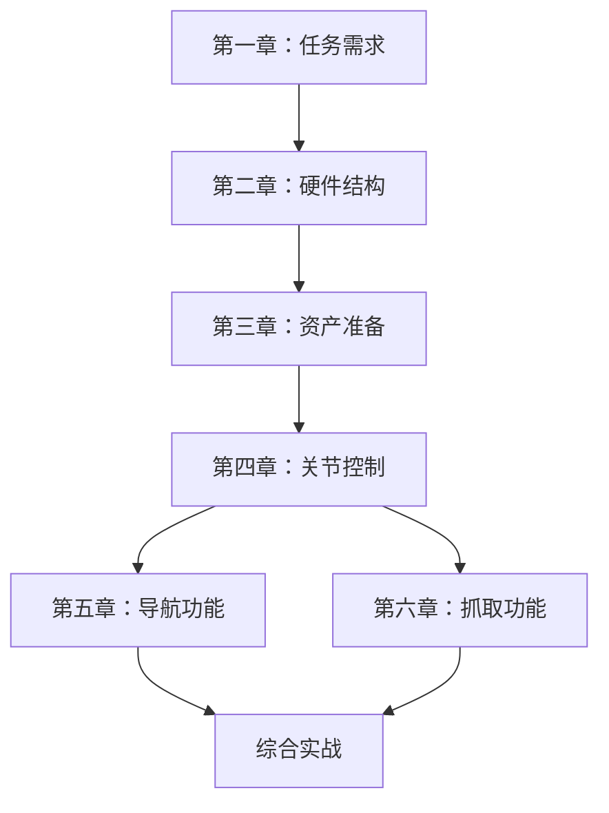

# Bobac 机器人办公室物品搬运课程

## 课程简介

本课程基于 Bobac 机器人，讲解如何在办公室场景中实现智能物品搬运任务。课程涵盖从任务需求分析、机器人硬件结构、Isaac Sim 仿真环境搭建、关节控制、导航功能到抓取放置功能的完整实现流程。

## 课程定位

本课程是 **Bobac 机器人仿真开发实战课程**，通过 Isaac Sim 仿真平台，帮助学习者系统掌握移动机器人的导航、视觉识别、机械臂抓取等核心技术，为实际机器人应用开发提供技术支撑。

## 任务场景

在办公室环境中，Bobac 机器人需要完成以下任务：
- **Bobac 机器人**：负责搬运指定的目标物品（如笔）
- **无人机**：负责将物品搬运到指定位置

任务分为两种场景实现：
1. **Isaac Sim 仿真场景**：低成本、高保真的虚拟测试环境
2. **真机场景**：实际物理环境中的部署验证

## 为什么选择 Isaac Sim？

Isaac Sim 仿真环境相比真机具有以下优势：

### 1. 成本优势
- **零硬件损耗**：无需担心机器人碰撞、跌落等物理损坏
- **场地灵活**：无需搭建实体测试场地，节省空间成本
- **可复用性**：一次搭建，多次使用，支持快速场景切换

### 2. 安全优势
- **零风险测试**：算法调试过程中不会对人员和设备造成伤害
- **极限测试**：可以测试真机难以实现的极端场景
- **快速迭代**：失败后可立即重置，无需等待硬件恢复

### 3. 效率优势
- **并行开发**：多人可同时在不同仿真环境中开发测试
- **快速验证**：参数调整后立即看到效果，无需等待硬件响应
- **数据记录**：完整记录传感器数据、运动轨迹，便于分析优化
- **时间加速**：支持加速仿真，快速验证长时间运行场景

### 4. 技术优势
- **高保真物理模拟**：精确模拟真实世界的物理特性
- **传感器仿真**：完整模拟激光雷达、相机、IMU 等传感器
- **ROS2 集成**：无缝对接 ROS2 生态，仿真代码可直接迁移到真机
- **可视化调试**：实时查看机器人状态、传感器数据、规划路径

### 5. 从仿真到真机的无缝迁移
- **统一接口**：仿真环境与真机使用相同的 ROS2 接口
- **参数一致**：机器人模型、传感器参数与真机完全对应
- **验证保障**：仿真验证通过的算法可直接部署到真机

## 课程结构

### [第一章：任务需求与场景介绍](01-任务需求与场景介绍.md)
- 办公室物品搬运任务详解
- Bobac 机器人与无人机协同工作流程
- Isaac Sim 仿真场景 vs 真机场景对比
- 仿真环境的优势与价值

### [第二章：Bobac 机器人结构与硬件参数](02-Bobac机器人结构与硬件参数.md)
- Bobac 机器人整体结构解析
- 底盘驱动系统与运动学参数
- 机械臂关节结构与 DH 参数
- 传感器配置（激光雷达、相机、IMU）
- 硬件规格与性能指标

### [第三章：Isaac Sim 资产准备与机器人组装](03-IsaacSim资产准备与机器人组装.md)
- Isaac Sim 资产导入与管理
- 机器人 URDF/USD 模型构建
- 关节链（Articulation）概念与作用
- 关节体（Rigid Body）与物理属性
- 关节树（Kinematic Tree）结构
- 碰撞网格（Collision Mesh）配置
- 各组件之间的联系与作用

### [第四章：Isaac Sim 关节控制与 ActionGraph](04-IsaacSim关节控制与ActionGraph.md)
- 关节控制器（Joint Controller）原理
- ActionGraph 可视化编程基础
- ROS2 与 Isaac Sim 通信机制
- 关节控制器如何接收 ROS2 指令
- ActionGraph 在机器人控制中的作用
- 实战：通过 ActionGraph 控制机器人运动

### [第五章：导航功能实现](05-导航功能实现.md)
- 导航系统整体架构
- ROS2 Nav2 导航栈介绍
- AMCL 定位算法原理
- 全局路径规划（SmacPlanner2D）
- 局部路径规划（MPPI Controller）
- 代价地图（Costmap）配置
- 行为树（Behavior Tree）导航协调
- 实战：在 Isaac Sim 中实现自主导航

### [第六章：抓取放置功能实现](06-抓取放置功能实现.md)
- 抓取系统整体架构
- 视觉检测模块（YOLOE）
- MoveIt2 运动规划
- 抓取点生成算法
- 状态机编排（State Machine）
- 夹爪控制实现
- 完整抓取流程实战

## 学习路径

## 环境要求

### 软件环境
- **操作系统**：Ubuntu 22.04
- **Isaac Sim**：4.5.0 或更高版本
- **ROS2**：Humble
- **Python**：3.10+
- **CUDA**：11.x+ （用于 GPU 加速）

### 硬件要求
| 配置项 | 最低要求 | 推荐配置 |
|--------|----------|----------|
| CPU | Intel Core i7 (7th Gen) | Intel Core i9 |
| 内存 | 32GB | 64GB |
| GPU | RTX 3070 (8GB VRAM) | RTX 4080 (16GB VRAM) |
| 存储 | 50GB SSD | 500GB NVMe SSD |

## 学习建议

1. **循序渐进**：按照章节顺序学习，每章的知识都是后续章节的基础
2. **动手实践**：每个章节都包含实战案例，务必亲自操作验证
3. **理解原理**：不仅要知道怎么做，更要理解为什么这么做
4. **记录笔记**：记录遇到的问题和解决方案，建立自己的知识库
5. **参数调优**：尝试调整不同参数，观察对系统性能的影响

## 参考资源

- [Isaac Sim 官方文档](https://docs.omniverse.nvidia.com/isaacsim/latest/index.html)
- [ROS2 Humble 文档](https://docs.ros.org/en/humble/index.html)
- [Nav2 导航文档](https://navigation.ros.org/)
- [MoveIt2 官方文档](https://moveit.picknik.ai/humble/index.html)
- [Bobac 工作空间代码](/workspace/bobac_ws/src)

## 技术支持

如有问题，请参考：
1. 各章节的常见问题解答
2. Bobac 工作空间的 README 文档
3. 相关技术社区和论坛

---

**课程更新日期**：2026-05-27

**适用对象**：机器人开发者、仿真工程师、ROS2 学习者
