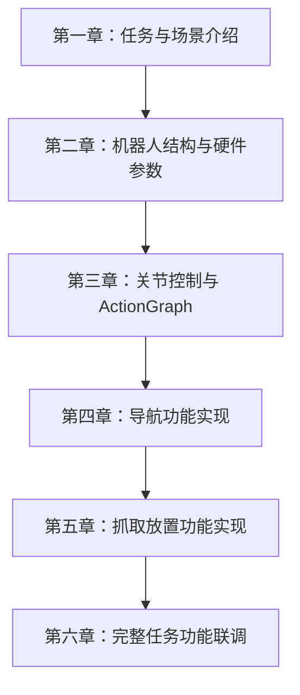

# Bobac 机器人办公室物品搬运课程

## 课程简介

本课程基于 Bobac 机器人与 Isaac Sim 仿真平台，围绕办公室物品搬运任务，讲解从机器人认知、关节控制、导航到视觉抓取联调的完整实现过程。课程整体采用**实操为主、理论穿插**的方式：前两章介绍任务与硬件，第三到第六章则结合实际功能实现讲解相关控制理论、运动规划与任务编排方法。

## 课程定位

本课程是 **Bobac 机器人仿真实战课程**。学习者将通过 Isaac Sim 平台，逐步掌握移动底盘控制、全向导航、视觉识别、机械臂抓取与系统联调等核心能力，建立从仿真开发到任务落地的完整认知。

## 任务场景

在办公室环境中，Bobac 机器人需要完成完整的物品搬运任务：
- 通过底盘移动到目标区域
- 通过视觉识别找到目标物体
- 通过机械臂与夹爪完成抓取
- 通过联调流程完成整套任务闭环

## 为什么选择 Isaac Sim？

Isaac Sim 仿真环境相比真机具有以下优势：

### 1. 成本优势
- 无需依赖真实硬件反复试错
- 可以快速切换场景和参数
- 适合高频迭代与功能验证

### 2. 安全优势
- 可在无风险环境中测试控制逻辑
- 便于调试复杂任务流程
- 避免真机碰撞和设备损耗

### 3. 效率优势
- 可快速查看机器人运动效果
- 便于记录与分析传感器数据
- 支持更高效的开发和调参过程

### 4. 技术优势
- 支持高保真物理模拟
- 可对接 ROS2、Nav2、MoveIt 等主流技术栈
- 便于从仿真迁移到真实系统

## 课程结构

### [第一章：任务需求与场景介绍](01-任务需求与场景介绍.ipynb)
- 介绍办公室物品搬运任务的目标与背景
- 说明 Bobac 机器人在课程中的任务定位
- 讲解 Isaac Sim 仿真场景的作用与价值
- 建立整套课程的学习路径

### [第二章：Bobac 机器人结构与硬件参数](02-Bobac机器人结构与硬件参数.ipynb)
- 介绍 Bobac 机器人的整体结构
- 讲解底盘、机械臂与传感器之间的关系
- 理解后续控制、导航、抓取所需的硬件基础

### [第三章：Isaac Sim 关节控制与 ActionGraph](03-IsaacSim关节控制与ActionGraph.ipynb)
- 讲解 articulation controller 如何控制 Isaac Sim 关节
- 通过 Action Graph 连接控制逻辑与机器人模型
- 区分 position 与 velocity 两种控制方式
- 说明轮子关节、机械臂关节与 target prim、关节树之间的关系

### [第四章：导航功能实现](04-导航功能实现.ipynb)
- 在关节控制基础上实现底盘移动
- 讲解 holonomic controller 如何计算轮速
- 介绍 Nav2 的结构、算法与参数
- 在 Isaac Sim 中完成全向底盘导航任务

### [第五章：抓取放置功能实现](05-抓取放置功能实现.ipynb)
- 使用 YOLOE 进行目标识别
- 通过深度相机获取目标的三维坐标
- 将坐标转换到 `base_link_arm` 参考系
- 使用 MoveIt 控制机械臂与夹爪完成抓取

### [第六章：完整任务功能联调](06-完整任务功能联调.ipynb)
- 将导航与抓取功能进行联调
- 讲解状态机式任务编排思路
- 总结完整任务流程的实现方法
- 展示最终完整任务流程 GIF / 视频

## 学习路径

## 课程说明

- 本课程以实操为主，理论内容围绕功能实现展开
- 01 和 02 是介绍章节，重点建立任务认知与机器人认知
- 03 到 06 是实操与理论并存的章节，重点讲清楚“如何做”以及“为什么这样做”
- 课程目标是帮助学习者系统掌握办公室搬运任务的完整仿真实现流程
