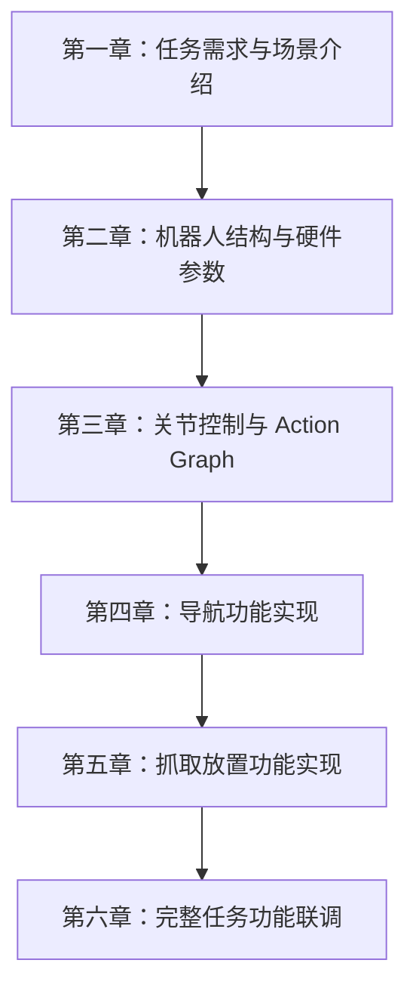

# Bobac 机器人办公室物品搬运课程 - 完整大纲

## 课程概述

本课程基于 Bobac 机器人与 Isaac Sim 仿真平台，围绕“办公室物品搬运”这一完整任务链，系统讲解从机器人控制、导航到视觉抓取联动的实战开发流程。课程以**实操为主、理论为辅**：前两章侧重场景与硬件认知，第三到第六章则在真实功能实现中穿插必要的控制理论、运动学与任务编排方法，帮助学习者真正理解“为什么这样做”和“如何做出来”。

**课程特色**：
- ✅ 以实操任务为主线，理论服务于功能实现
- ✅ 从仿真到任务联调，覆盖完整开发链路
- ✅ 基于 Bobac 机器人与 Isaac Sim 的真实课程内容
- ✅ 涵盖 ROS2、Isaac Sim、Nav2、MoveIt、YOLOE 等核心技术

---

## 第一章：任务需求与场景介绍（介绍章节）

### 学习目标
- 了解办公室物品搬运任务的背景与目标
- 认识 Bobac 机器人在课程中的角色与任务边界
- 了解仿真环境、真机环境与课程整体学习路径
- 建立后续实操章节所需的任务认知

### 核心内容

#### 1.1 课程背景与任务定义
- 办公室场景下的物品搬运需求
- 任务目标、任务流程与最终效果
- 课程中机器人需要完成的核心动作链路

#### 1.2 Bobac 机器人任务定位
- Bobac 机器人在搬运任务中的职责
- 移动、导航、识别、抓取、联动控制之间的关系
- 学习本课程需要具备的基础认知

#### 1.3 仿真与真机的关系
- 为什么先从 Isaac Sim 开始
- 仿真与真机之间的对应关系
- 课程中如何逐步从认知走向实现

#### 1.4 课程学习路径概览
- 从场景理解到机器人结构
- 从关节控制到导航与抓取
- 从单功能实现到完整任务联调

### 关键要点
- 第一章的重点不是功能实现，而是建立任务视角
- 学习者要先理解“要完成什么”，再进入“如何完成”
- 本章为后续所有实操章节提供统一目标

---

## 第二章：Bobac 机器人结构与硬件参数（介绍章节）

### 学习目标
- 认识 Bobac 机器人的整体构成
- 理解底盘、机械臂、传感器之间的协作关系
- 建立后续控制、导航、抓取所需的硬件基础
- 为仿真模型与真实系统的映射打基础

### 核心内容

#### 2.1 机器人整体结构
- 底盘、机械臂、传感器与计算单元的组成
- 机器人各功能模块之间的关系
- 机器人在仿真中的表现形式

#### 2.2 底盘与运动基础
- 底盘结构与运动方式
- 轮子关节、驱动方式与移动能力
- 后续底盘控制与导航的硬件前提

#### 2.3 机械臂与关节结构
- 机械臂的关节组成与层级关系
- 关节链与关节树的基础概念
- 机械臂在抓取任务中的作用

#### 2.4 传感器配置与数据来源
- 激光雷达、深度相机、IMU 等传感器的角色
- 不同传感器服务于不同任务阶段
- 后续导航与识别任务需要用到哪些数据

#### 2.5 坐标系与系统认知
- 机器人常见坐标系的作用
- 传感器、底盘、机械臂之间的空间关系
- 为后续控制与视觉定位建立坐标基础

### 关键要点
- 第二章的重点是“认识机器人本体”
- 不强调算法推导，而强调硬件结构和功能对应关系
- 这是进入仿真搭建与控制实操前的必要准备

---

## 第三章：Isaac Sim 关节控制与 Action Graph（实操 + 理论）

### 学习目标
- 理解控制理论在 Isaac Sim 关节控制中的基本作用
- 掌握 articulation controller 如何控制机器人关节
- 学会通过 Action Graph 将控制逻辑连接到机器人模型
- 理解轮子关节与机械臂关节的不同控制方式
- 了解 articulation controller 参数含义与 target prim 的作用

### 核心内容

#### 3.1 关节控制的基本思路
- 什么是关节控制，为什么机器人控制离不开关节
- 从“控制一个关节”到“控制一个机器人”的思路
- 关节控制在仿真中的基本工作路径

#### 3.2 articulation controller 如何工作
- articulation controller 的职责
- 它如何驱动 Isaac Sim 中的关节运动
- 控制输入如何传递到具体关节
- 轮子关节与机械臂关节如何分别被控制

#### 3.3 position 与 velocity 两种控制方式
- position 控制：控制关节到达目标位置
- velocity 控制：控制关节以指定速度运动
- 两种方式的适用场景
- 底盘轮子与机械臂关节在课程中的控制差异

#### 3.4 Action Graph 的作用与搭建思路
- 为什么需要 Action Graph
- 如何把事件、节点和控制器连接起来
- Action Graph 在机器人控制链路中的位置
- 通过 Action Graph 完成轮子与机械臂的控制输入传递

#### 3.5 articulation controller 参数与 target prim
- articulation controller 的常见配置参数含义
- target prim 的作用与选择方法
- 如何通过 target prim 理解关节树的结构
- 关节树与整机控制之间的关系

### 讲解思路
- 先从“一个关节怎么动”讲起，再过渡到“整台机器人怎么被控制”
- 先讲控制理论中最必要的概念，再落到 Isaac Sim 的实际配置
- 用轮子关节和机械臂关节分别举例，突出 position / velocity 的差异
- 通过 target prim 把控制器配置与机器人层级结构串起来

### 关键要点
- 本章是后续导航与抓取的基础
- Action Graph 不是单独的理论点，而是控制链路的组织方式
- 学习者要理解“控制器 + 关节树 + 配置参数”三者的配合关系

---

## 第四章：导航功能实现（实操 + 理论）

### 学习目标
- 在已能控制轮子关节的基础上，进一步完成底盘移动控制
- 理解 holonomic controller 如何计算全向底盘轮速
- 了解 Nav2 的结构、工作流程与关键算法
- 掌握导航任务在 Isaac Sim 中的完整实现思路

### 核心内容

#### 4.1 从关节控制到底盘移动
- 回顾上一章如何控制轮子关节旋转
- 为什么仅有关节控制还不能完成导航
- 底盘移动需要怎样的速度分配与运动控制

#### 4.2 holonomic controller 的作用
- holonomic controller 的基本原理
- 如何根据运动目标计算各个轮子的转速
- 轮速如何传递给 articulation controller
- 全向底盘为何适合做导航移动

#### 4.3 Nav2 的结构与组成
- Nav2 在导航系统中的位置
- 定位、规划、控制、恢复等模块如何协作
- 导航流程中各组件的职责分工

#### 4.4 导航算法与参数理解
- 导航中使用的核心算法及其作用
- 算法为什么这样设计
- 常见参数的意义与调试方向
- 参数如何影响路径规划和运动稳定性

#### 4.5 Isaac Sim 中的导航任务实现
- 导航环境如何在 Isaac Sim 中搭建
- 如何让底盘移动、定位和路径规划联动起来
- 导航任务从起点到目标点的完整执行过程

### 讲解思路
- 先说明“机器人已经能动”，再讲“怎么让它按导航目标动”
- 先理解 holonomic controller 如何把运动目标转成轮速，再理解 Nav2 如何决定走哪条路
- 将理论拆成“算什么”“为什么算”“算完传给谁”三步讲清楚
- 最后回到 Isaac Sim 中落地，实现完整导航闭环

### 关键要点
- 本章强调“轮子控制”与“导航决策”之间的桥梁
- holonomic controller 是运动执行层，Nav2 是导航决策层
- 课程中会把理论、参数配置和仿真实操放在一起讲

---

## 第五章：抓取放置功能实现（实操 + 理论）

### 学习目标
- 理解视觉识别到机械臂抓取的完整链路
- 掌握 YOLOE 在目标识别中的作用
- 了解深度相机如何将识别结果转换为 3D 空间坐标
- 理解如何把目标坐标转换到以 `base_link_arm` 为参考的坐标系下
- 掌握 MoveIt 如何驱动机械臂和夹爪完成抓取
- 了解该任务在 Isaac Sim 中的配置和实现方式

### 核心内容

#### 5.1 从视觉识别到抓取任务
- 识别、定位、规划、执行之间的关系
- 为什么抓取任务必须先做目标识别
- 视觉信息如何转化为控制输入

#### 5.2 YOLOE 识别模块
- YOLOE 的作用与输出结果
- 如何从图像中找到目标物体
- 识别结果如何进入后续流程

#### 5.3 深度相机与三维坐标恢复
- 深度相机在抓取任务中的作用
- 如何根据图像与深度信息恢复空间位置
- 如何把目标位置表达为 3D 坐标
- 为什么要转换到 `base_link_arm` 参考坐标系

#### 5.4 MoveIt 控制机械臂与夹爪
- MoveIt 在机械臂任务中的作用
- 如何根据目标坐标进行运动规划
- 机械臂与夹爪如何协同完成抓取动作
- 规划结果如何变成实际执行动作

#### 5.5 Isaac Sim 中的配置与实现
- 识别、坐标转换、规划、抓取的仿真连接方式
- 如何在 Isaac Sim 中验证抓取链路
- 如何让视觉与机械臂控制在仿真中闭环

### 讲解思路
- 先从“看见目标”讲到“知道它在哪”
- 再讲“知道位置后怎么让机械臂去抓”
- 用视觉、深度、坐标系、规划、夹爪几个环节串成完整流程
- 强调这是感知与运动规划结合的典型任务

### 关键要点
- 本章核心不是单一识别算法，而是感知到执行的完整链路
- `base_link_arm` 坐标系是视觉结果转换和机械臂规划的重要参考
- MoveIt 是将目标坐标转化为可执行轨迹的关键环节

---

## 第六章：完整任务功能联调（实操 + 理论）

### 学习目标
- 将导航功能与抓取功能组合成完整任务流程
- 理解系统联调的基本思路与常见问题
- 掌握状态机式任务编排的设计思路
- 了解完整任务流程的演示方式与结果展示

### 核心内容

#### 6.1 功能联调的目标
- 导航、识别、抓取三个功能如何拼接
- 为什么单独功能成功不代表任务成功
- 联调阶段需要验证哪些关键环节

#### 6.2 状态机式任务编排思路
- 任务如何按阶段切换
- 导航、识别、靠近、抓取、返回等状态如何衔接
- 为什么适合用状态机来组织整套流程
- 课程中给出状态机方案，但不提供代码

#### 6.3 联调中的关键问题
- 坐标、时序、控制和执行一致性问题
- 导航与抓取之间的切换条件
- 仿真中如何验证系统稳定性

#### 6.4 完整任务展示
- 完整流程的演示结构
- 课程中加入完整任务流程 GIF / 视频展示
- 用演示结果总结整套系统的学习成果

### 讲解思路
- 从“单个功能能跑”过渡到“整套流程能跑”
- 用状态机的视角说明任务切换和流程控制
- 强调联调阶段的核心价值是验证系统协同，而不是重新讲单个模块

### 关键要点
- 第六章是课程成果汇总章
- 本章不重点讲代码，而讲系统整合与调试思路
- 通过完整流程展示让学习者建立全局理解

---

## 学习路径

## 环境要求

### 软件环境
- **操作系统**：Ubuntu 22.04
- **Isaac Sim**：4.5.0 或更高版本
- **ROS2**：Humble
- **MoveIt2**：适配 Humble 版本
- **Nav2**：适配 Humble 版本

### 课程文件
- 第一章：任务需求与场景介绍
- 第二章：Bobac 机器人结构与硬件参数
- 第三章：Isaac Sim 关节控制与 Action Graph
- 第四章：导航功能实现
- 第五章：抓取放置功能实现
- 第六章：完整任务功能联调

## 课程说明

- 本课程以实操为主，理论内容围绕实操展开
- 前两章用于建立任务背景与机器人认知
- 第三到第六章以功能实现为主，并穿插必要理论说明
- 课程目标是帮助学习者完整掌握办公室搬运任务的仿真实现流程
