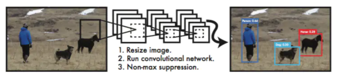
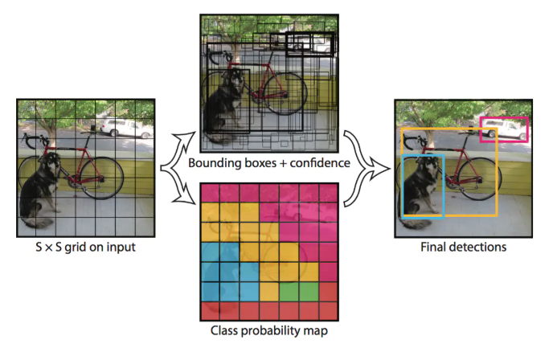
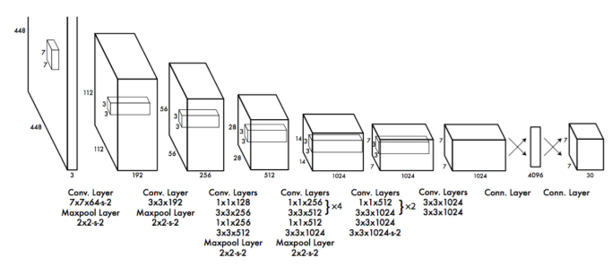
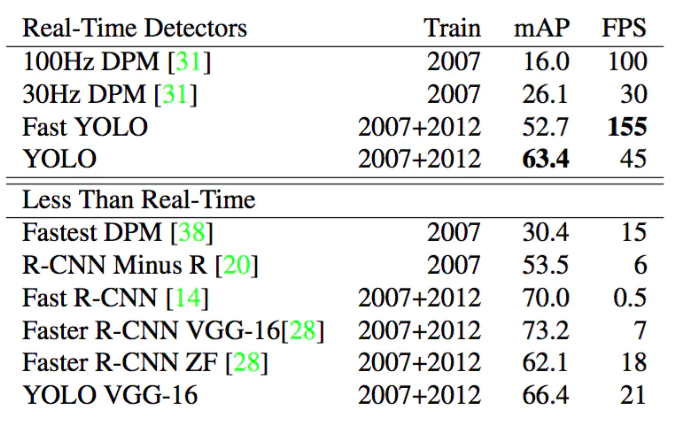
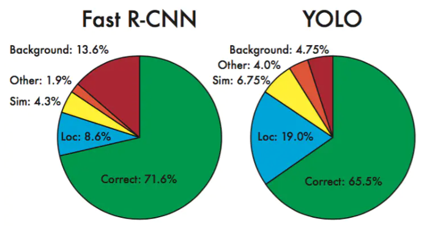
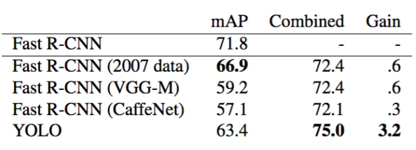
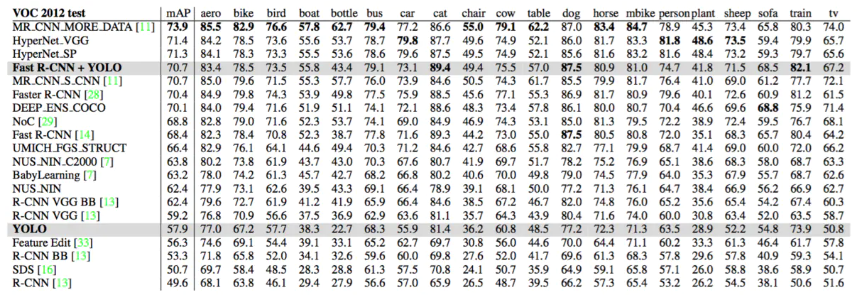
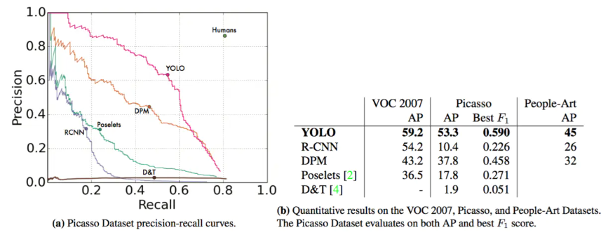
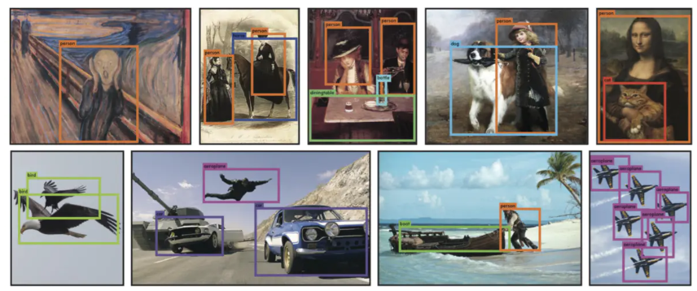

# YOLO1中文版

## 摘要

我们提出了YOLO，一种新的目标检测方法。以前的目标检测工作重新利用分类器来执行检测。相反，我们将目标检测框架看作回归问题从空间上分割边界框和相关的类别概率。单个神经网络在一次评估中直接从完整图像上预测边界框和类别概率。由于整个检测流水线是单一网络，因此可以直接对检测性能进行端到端的优化。

我们的统一架构非常快。我们的基础YOLO模型以45帧/秒的速度实时处理图像。网络的一个较小版本，快速YOLO，每秒能处理惊人的155帧，同时实现其它实时检测器两倍的mAP（平均精度）。与最先进的检测系统相比，YOLO产生了更多的定位误差，但不太可能在背景上的预测假阳性。最后，YOLO学习目标非常通用的表示。当从自然图像到艺术品等其它领域泛化时，它都优于其它检测方法，包括DPM和R-CNN。

## 1. 引言

人们瞥一眼图像，立即知道图像中的物体是什么，它们在哪里以及它们如何相互作用。人类的视觉系统是快速和准确的，使我们能够执行复杂的任务，如驾驶时没有多少有意识的想法。快速，准确的目标检测算法可以让计算机在没有专门传感器的情况下驾驶汽车，使辅助设备能够向人类用户传达实时的场景信息，并表现出对一般用途和响应机器人系统的潜力。

目前的检测系统重用分类器来执行检测。为了检测目标，这些系统为该目标提供一个分类器，并在不同的位置对其进行评估，并在测试图像中进行缩放。像可变形部件模型（DPM）这样的系统使用滑动窗口方法，其分类器在整个图像的均匀间隔的位置上运行[10]。

最近的方法，如R-CNN使用区域提出方法首先在图像中生成潜在的边界框，然后在这些提出的框上运行分类器。在分类之后，后处理用于细化边界框，消除重复的检测，并根据场景中的其它目标重新定位边界框[13]。这些复杂的流程很慢，很难优化，因为每个单独的组件都必须单独进行训练。

我们将目标检测重新看作单一的回归问题，直接从图像像素到边界框坐标和类概率。使用我们的系统，您只需要在图像上看一次（YOLO），以预测出现的目标和位置。

YOLO很简单：参见图1。单个卷积网络同时预测这些框的多个边界框和类概率。YOLO在全图像上训练并直接优化检测性能。这种统一的模型比传统的目标检测方法有一些好处。

图1：YOLO检测系统。用YOLO处理图像简单直接。我们的系统（1）将输入图像调整为448×448，（2）在图像上运行单个卷积网络，以及（3）由模型的置信度对所得到的检测进行阈值处理。

首先，YOLO速度非常快。由于我们将检测视为回归问题，所以我们不需要复杂的流程。测试时我们在一张新图像上简单的运行我们的神经网络来预测检测。我们的基础网络以每秒45帧的速度运行，在Titan X GPU上没有批处理，快速版本运行速度超过150fps。这意味着我们可以在不到25毫秒的延迟内实时处理流媒体视频。此外，YOLO实现了其它实时系统两倍以上的平均精度。关于我们的系统在网络摄像头上实时运行的演示，请参阅我们的项目网页：[http://pjreddie.com/yolo/](https://link.jianshu.com?t=http%3A%2F%2Fpjreddie.com%2Fyolo%2F)。

其次，YOLO在进行预测时，会对图像进行全局推理。与基于滑动窗口和区域提出的技术不同，YOLO在训练期间和测试时会看到整个图像，所以它隐式地编码了关于类的上下文信息以及它们的外观。快速R-CNN是一种顶级的检测方法[14]，因为它看不到更大的上下文，所以在图像中会将背景块误检为目标。与快速R-CNN相比，YOLO的背景误检数量少了一半。

第三，YOLO学习目标的泛化表示。当在自然图像上进行训练并对艺术作品进行测试时，YOLO大幅优于DPM和R-CNN等顶级检测方法。由于YOLO具有高度泛化能力，因此在应用于新领域或碰到意外的输入时不太可能出故障。

YOLO在精度上仍然落后于最先进的检测系统。虽然它可以快速识别图像中的目标，但它仍在努力精确定位一些目标，尤其是小的目标。我们在实验中会进一步检查这些权衡。

我们所有的训练和测试代码都是开源的。各种预训练模型也都可以下载。

## 2. 统一检测

我们将目标检测的单独组件集成到单个神经网络中。我们的网络使用整个图像的特征来预测每个边界框。它还可以同时预测一张图像中的所有类别的所有边界框。这意味着我们的网络全面地推理整张图像和图像中的所有目标。YOLO设计可实现端到端训练和实时的速度，同时保持较高的平均精度。

我们的系统将输入图像分成$S\times S$的网格。如果一个目标的中心落入一个网格单元中，该网格单元负责检测该目标。

每个网格单元预测这些框的$B$个边界框和置信度分数。这些置信度分数反映了该模型对框是否包含目标的可靠程度，以及它预测框的准确程度。在形式上，我们将置信度定义为$\Pr(\textrm{Object}) * \textrm{IOU}_{\textrm{pred}}^{\textrm{truth}}$。如果该单元格中不存在目标，则置信度分数应为零。否则，我们希望置信度分数等于预测框与真实值之间联合部分的交集（IOU）。

每个边界框包含5个预测：$x$，$y$，$w$，$h$和置信度。$(x，y)$坐标表示边界框相对于网格单元边界框的中心。宽度和高度是相对于整张图像预测的。最后，置信度预测表示预测框与实际边界框之间的IOU。

每个网格单元还预测$C$个条件类别概率$\Pr(\textrm{Class}_i | \textrm{Object})$。这些概率以包含目标的网格单元为条件。每个网格单元我们只预测的一组类别概率，而不管边界框的的数量$B$是多少。

在测试时，我们乘以条件类概率和单个框的置信度预测，$$\Pr(\textrm{Class}_i | \textrm{Object}) * \Pr(\textrm{Object}) * \textrm{IOU}_{\textrm{pred}}^{\textrm{truth}} = \Pr(\textrm{Class}_i)*\textrm{IOU}_{\textrm{pred}}^{\textrm{truth}}$$ 它为我们提供了每个框特定类别的置信度分数。这些分数编码了该类出现在框中的概率以及预测框拟合目标的程度。

为了在Pascal VOC上评估YOLO，我们使用$S=7$，$B=2$。Pascal VOC有20个标注类，所以$C=20$。我们最终的预测是$7\times 7 \times 30$的张量。

模型。 我们的系统将检测建模为回归问题。它将图像分成$S \times S$的网格，并且每个网格单元预测$B$个边界框，这些边界框的置信度以及$C$个类别概率。这些预测被编码为$S \times S \times (B*5 + C)$的张量。

### 2.1 网络设计

我们将此模型作为卷积神经网络来实现，并在Pascal VOC检测数据集[9]上进行评估。网络的初始卷积层从图像中提取特征，而全连接层预测输出概率和坐标。

我们的网络架构受到GoogLeNet图像分类模型的启发[34]。我们的网络有24个卷积层，后面是2个全连接层。我们只使用$1 \times 1$降维层，后面是$3 \times 3$卷积层，这与Lin等人[22]类似，而不是GoogLeNet使用的Inception模块。完整的网络如图3所示。

图3：架构。我们的检测网络有24个卷积层，其次是2个全连接层。交替$1 \times 1$卷积层减少了前面层的特征空间。我们在ImageNet分类任务上以一半的分辨率（$224 \times 224$的输入图像）预训练卷积层，然后将分辨率加倍来进行检测。

我们还训练了快速版本的YOLO，旨在推动快速目标检测的界限。快速YOLO使用具有较少卷积层（9层而不是24层）的神经网络，在这些层中使用较少的滤波器。除了网络规模之外，YOLO和快速YOLO的所有训练和测试参数都是相同的。

我们网络的最终输出是$7 \times 7 \times 30$的预测张量。

### 2.2 训练

我们在ImageNet 1000类竞赛数据集[30]上预训练我们的卷积图层。对于预训练，我们使用图3中的前20个卷积层，接着是平均池化层和全连接层。我们对这个网络进行了大约一周的训练，并且在ImageNet 2012验证集上获得了单一裁剪图像88%​的top-5准确率，与Caffe模型池中的GoogLeNet模型相当。我们使用Darknet框架进行所有的训练和推断[26]。

然后我们转换模型来执行检测。Ren等人表明，预训练网络中增加卷积层和连接层可以提高性能[29]。按照他们的例子，我们添加了四个卷积层和两个全连接层，并且具有随机初始化的权重。检测通常需要细粒度的视觉信息，因此我们将网络的输入分辨率从$224 \times 224$变为$448 \times 448$。

我们的最后一层预测类概率和边界框坐标。我们通过图像宽度和高度来规范边界框的宽度和高度，使它们落在0和1之间。我们将边界框$x$和$y$坐标参数化为特定网格单元位置的偏移量，所以它们边界也在0和1之间。

我们对最后一层使用线性激活函数，所有其它层使用下面的leaky-relu激活：
$$
\phi(x) =
\begin{cases}
x, if\ x > 0 \\
0.1x, otherwise
\end{cases}
$$
我们优化了模型输出中的平方和误差。我们使用平方和误差，因为它很容易进行优化，但是它并不完全符合我们最大化平均精度的目标。分类误差与定位误差的权重是一样的，这可能并不理想。另外，在每张图像中，许多网格单元不包含任何对象。这将这些单元格的“置信度”分数推向零，通常压倒了包含目标的单元格的梯度。这可能导致模型不稳定，从而导致训练早期发散。

为了改善这一点，我们增加了边界框坐标预测损失，并减少了不包含目标边界框的置信度预测损失。我们使用两个参数$\lambda_\textrm{coord}$和$\lambda_\textrm{noobj}$来完成这个工作。我们设置$\lambda_\textrm{coord} = 5$和$\lambda_\textrm{noobj} = .5$。

平方和误差也可以在大框和小框中同样加权误差。我们的错误指标应该反映出，大框小偏差的重要性不如小框小偏差的重要性。为了部分解决这个问题，我们直接预测边界框宽度和高度的平方根，而不是宽度和高度。

YOLO每个网格单元预测多个边界框。在训练时，每个目标我们只需要一个边界框预测器来负责。我们指定一个预测器“负责”根据哪个预测与真实值之间具有当前最高的IOU来预测目标。这导致边界框预测器之间的专业化。每个预测器可以更好地预测特定大小，方向角，或目标的类别，从而改善整体召回率。

在训练期间，我们优化以下多部分损失函数：
$$
\begin{multline}
\lambda_\textbf{coord}
\sum_{i = 0}^{S2}
\sum_{j = 0}^{B}
\mathbb{1}_{ij}^{\text{obj}}
\left[
\left(
x_i - \hat{x}_i
\right)^2 +
\left(
y_i - \hat{y}_i
\right)^2
\right]
\\
+ \lambda_\textbf{coord}
\sum_{i = 0}^{S2}
\sum_{j = 0}^{B}
\mathbb{1}_{ij}^{\text{obj}}
\left[
\left(
\sqrt{w_i} - \sqrt{\hat{w}_i}
\right)^2 +
\left(
\sqrt{h_i} - \sqrt{\hat{h}_i}
\right)^2
\right]
\\
+ \sum_{i = 0}^{S2}
\sum_{j = 0}^{B}
\mathbb{1}_{ij}^{\text{obj}}
\left(
C_i - \hat{C}_i
\right)^2
\\
+ \lambda_\textrm{noobj}
\sum_{i = 0}^{S2}
\sum_{j = 0}^{B}
\mathbb{1}_{ij}^{\text{noobj}}
\left(
C_i - \hat{C}_i
\right)^2
\\
+ \sum_{i = 0}^{S2}
\mathbb{1}_i^{\text{obj}}
\sum_{c \in \textrm{classes}}
\left(
p_i(c) - \hat{p}_i(c)
\right)^2
\end{multline}
$$
其中$\mathbb{1}_i{\text{obj}}$表示目标是否出现在网格单元$i$中，$\mathbb{1}_{ij}{\text{obj}}$表示网格单元$i$中的第$j$个边界框预测器“负责”该预测。注意，如果目标存在于该网格单元中（前面讨论的条件类别概率），则损失函数仅惩罚分类错误。如果预测器“负责”实际边界框（即该网格单元中具有最高IOU的预测器），则它也仅惩罚边界框坐标错误。

我们对Pascal VOC 2007和2012的训练和验证数据集进行了大约135个迭代周期的网络训练。在Pascal VOC 2012上进行测试时，我们的训练包含了Pascal VOC 2007的测试数据。在整个训练过程中，我们使用了$64$的批大小，$0.9$的动量和$0.0005$的衰减。

我们的学习率方案如下：对于第一个迭代周期，我们慢慢地将学习率从$10^{-3}$提高到$10^{-2}$。如果我们从高学习率开始，我们的模型往往会由于不稳定的梯度而发散。我们继续以$10^{-2}$的学习率训练75个迭代周期，然后用$10^{-3}$的学习率训练30个迭代周期，最后用$10^{-4}$的学习率训练30个迭代周期。

为了避免过度拟合，我们使用丢弃和大量的数据增强。在第一个连接层之后，丢弃层使用0.5的比例，防止层之间的互相适应[18]。对于数据增强，我们引入高达原始图像​20%大小的随机缩放和转换。我们还在HSV色彩空间中使用高达$1.5$的因子来随机调整图像的曝光和饱和度。

### 2.3 推断

就像在训练中一样，预测测试图像的检测只需要一次网络评估。在Pascal VOC上，每张图像上网络预测98个边界框和每个框的类别概率。YOLO在测试时非常快，因为它只需要一次网络评估，不像基于分类器的方法。

网格设计强化了边界框预测中的空间多样性。通常很明显一个目标落在哪一个网格单元中，而网络只能为每个目标预测一个边界框。然而，一些大的目标或靠近多个网格单元边界的目标可以被多个网格单元很好地定位。非极大值抑制可以用来修正这些多重检测。对于R-CNN或DPM而言，性能不是关键的，非最大抑制会增加2-3%​的mAP。

### 2.4 YOLO的限制

YOLO对边界框预测强加空间约束，因为每个网格单元只预测两个框，只能有一个类别。这个空间约束限制了我们的模型可以预测的邻近目标的数量。我们的模型与群组中出现的小物体（比如鸟群）进行斗争。

由于我们的模型学习从数据中预测边界框，因此它很难泛化到新的、不常见的方向比或配置的目标。我们的模型也使用相对较粗糙的特征来预测边界框，因为我们的架构具有来自输入图像的多个下采样层。

最后，当我们训练一个近似检测性能的损失函数时，我们的损失函数会同样的对待小边界框与大边界框的误差。大边界框的小误差通常是良性的，但小边界框的小误差对IOU的影响要大得多。我们的主要错误来源是不正确的定位。

## 3. 与其它检测系统的比较

目标检测是计算机视觉中的核心问题。检测流程通常从输入图像上（Haar [25]，SIFT [23]，HOG [4]，卷积特征[6]）提取一组鲁棒特征（鲁棒特征是指基于像素级别的图像提取到的特征，并且这些特征具有一定的鲁棒性，也就是说这些特征是我们的目标的绝对特征，并不一定会受干扰）开始。然后，分类器[36,21,13,10]或定位器[1,32]被用来识别特征空间中的目标。这些分类器或定位器在整个图像上或在图像中的一些子区域上以**滑动窗口**的方式运行[35,15,39]。我们将YOLO检测系统与几种顶级检测框架进行比较，突出了关键的相似性和差异性。

**可变形组件模型。**可变形组件模型（DPM）使用滑动窗口方法进行目标检测[10]。DPM使用不相交的流程来提取静态特征（静态特征即稳定特征也指目标那些并不容易），对区域进行分类，预测高评分区域的边界框等。我们的系统用单个卷积神经网络替换所有这些不同的部分。网络同时进行特征提取，边界框预测，非极大值抑制和上下文推理。代替静态特征，网络内嵌地训练特征并为检测任务优化它们。我们的统一架构导致了比DPM更快，更准确的模型。

**R-CNN。**R-CNN及其变种使用候选区域而不是滑动窗口来查找图像中的目标。选择性搜索[35]产生潜在的边界框，卷积网络提取特征，SVM对边界框进行评分，线性模型调整边界框，非极大值抑制消除重复检测。这个复杂流程的每个阶段都必须独立地进行精确调整，所得到的系统非常慢，测试时每张图像需要超过40秒[14]。

YOLO与R-CNN有一些相似之处。每个网格单元提出潜在的边界框并使用卷积特征对这些框进行评分。但是，我们的系统对网格单元提出进行了空间限制，这有助于缓解对同一目标的多次检测。我们的系统还提出了更少的边界框，每张图像只有98个，而选择性搜索则只有2000个左右。最后，我们的系统将这些单独的组件组合成一个单一的，共同优化的模型。

**其它快速检测器。**Fast和Faster R-CNN通过共享计算和使用神经网络替代选择性搜索来提出区域加速R-CNN框架[14]，[28]。虽然它们提供了比R-CNN更快的速度和更高的准确度，但两者仍然不能达到实时性能。

许多研究工作集中在加快DPM流程上[31] [38] [5]。它们加速HOG计算，使用级联，并将计算推动到GPU上。但是，实际上只有30Hz的DPM [31]可以实时运行。

YOLO不是试图优化大型检测流程的单个组件，而是完全抛弃流程，被设计为快速检测。

像人脸或行人等单类别的检测器可以高度优化，因为他们必须处理更少的变化[37]。YOLO是一种通用的检测器，可以学习同时检测多个目标。

**Deep MultiBox。**与R-CNN不同，Szegedy等人训练了一个卷积神经网络来预测感兴趣区域[8]，而不是使用选择性搜索。MultiBox还可以通过用单类预测替换置信度预测来执行单目标检测。然而，MultiBox无法执行通用的目标检测，并且仍然只是一个较大的检测流程中的一部分，需要进一步的图像块分类。YOLO和MultiBox都使用卷积网络来预测图像中的边界框，但是YOLO是一个完整的检测系统。

**OverFeat。**Sermanet等人训练了一个卷积神经网络来执行定位，并使该定位器进行检测[32]。OverFeat高效地执行滑动窗口检测，但它仍然是一个不相交的系统。OverFeat优化了定位，而不是检测性能。像DPM一样，定位器在进行预测时只能看到局部信息。OverFeat不能推断全局上下文，因此需要大量的后处理来产生连贯的检测。

**MultiGrasp。**我们的工作在设计上类似于Redmon等[27]的抓取检测。我们对边界框预测的网格方法是基于MultiGrasp系统抓取的回归分析。然而，抓取检测比目标检测任务要简单得多。MultiGrasp只需要为包含一个目标的图像预测一个可以抓取的区域。不必估计目标的大小，位置或目标边界或预测目标的类别，只找到适合抓取的区域。YOLO预测图像中多个类别的多个目标的边界框和类别概率。

## 4. 实验

首先，我们在PASCAL VOC 2007上比较YOLO和其它的实时检测系统。为了理解YOLO和R-CNN变种之间的差异，我们探索了YOLO和R-CNN性能最高的版本之一Fast R-CNN[14]在VOC 2007上错误率。根据不同的误差曲线，我们显示YOLO可以用来重新评估Fast R-CNN检测，并减少背景假阳性带来的错误，从而显著提升性能。我们还展示了在VOC 2012上的结果，并与目前最先进的方法比较了mAP。最后，在两个艺术品数据集上我们显示了YOLO可以比其它检测器更好地泛化到新领域。

### 4. 1 与其它实时系统的比较

目标检测方面的许多研究工作都集中在快速制定标准检测流程上[5]，[38]，[31]，[14]，[17]，[28]。然而，只有Sadeghi等实际上产生了一个实时运行的检测系统（每秒30帧或更好）[31]。我们将YOLO与DPM的GPU实现进行了比较，其在30Hz或100Hz下运行。虽然其它的努力没有达到实时性的里程碑，我们也比较了它们的相对mAP和速度来检查目标检测系统中精度——性能权衡。

快速YOLO是PASCAL上最快的目标检测方法；据我们所知，它是现有的最快的目标检测器。具有52.7%的mAP，实时检测的精度是以前工作的两倍以上。YOLO将mAP推到63.4%​的同时保持了实时性能。

我们还使用VGG-16训练YOLO。这个模型比YOLO更准确，但也比它慢得多。对于依赖于VGG-16的其它检测系统来说，它是比较有用的，但由于它比实时的YOLO更慢，本文的其它部分将重点放在我们更快的模型上。

最快的DPM可以在不牺牲太多mAP的情况下有效地加速DPM，但仍然会将实时性能降低2倍[38]。与神经网络方法相比，DPM相对低的检测精度也受到限制。

去掉R的R-CNN用静态边界框提出取代选择性搜索[20]。虽然速度比R-CNN更快，但仍然不能实时，并且由于没有好的边界框提出，准确性受到了严重影响。

快速R-CNN加快了R-CNN的分类阶段，但是仍然依赖选择性搜索，每张图像需要花费大约2秒来生成边界框提出。因此，它具有很高的mAP，但是$0.5$的fps仍离实时性很远。

最近Faster R-CNN用神经网络替代了选择性搜索来提出边界框，类似于Szegedy等[8]。在我们的测试中，他们最精确的模型达到了7fps，而较小的，不太精确的模型以18fps运行。VGG-16版本的Faster R-CNN要高出10mAP，但比YOLO慢6倍。Zeiler-Fergus的Faster R-CNN只比YOLO慢了2.5倍，但也不太准确。

表1：Pascal VOC 2007上的实时系统。比较快速检测器的性能和速度。快速YOLO是Pascal VOC检测记录中速度最快的检测器，其精度仍然是其它实时检测器的两倍。YOLO比快速版本更精确10mAP，同时在速度上仍保持实时性。

### 4.2 VOC 2007错误率分析

为了进一步检查YOLO和最先进的检测器之间的差异，我们详细分析了VOC 2007的结果。我们将YOLO与Fast R-CNN进行比较，因为Fast R-CNN是PASCAL上性能最高的检测器之一并且它的检测代码是可公开得到的。

我们使用Hoiem等人[19]的方法和工具。对于测试时的每个类别，我们看这个类别的前N个预测。每个预测或者是正确的，或者根据错误类型进行分类：

- Correct：正确的类别且IOU$> 0.5$。
- Localization：正确的类别，$0.1 < IOU < 0.5$。
- Similar：类别相似，IOU $> 0.1$。
- Other：类别错误，IOU $> 0.1$。
- Background：任何IOU $< 0.1$的目标。

图4显示了在所有的20个类别上每种错误类型平均值的分解图。

图4 误差分析：Fast R-CNN vs. YOLO。这些图显示了各种类别的前N个预测中定位错误和背景错误的百分比（N = #表示目标在那个类别中）。

YOLO努力地正确定位目标。定位错误占YOLO错误的大多数，比其它错误源加起来都多。Fast R-CNN使定位错误少得多，但背景错误更多。它的检测的13.6%是不包含任何目标的误报。Fast R-CNN比YOLO预测背景检测的可能性高出近3倍。

### 4.3 结合Fast R-CNN和YOLO

YOLO比Fast R-CNN的背景误检要少得多。通过使用YOLO消除Fast R-CNN的背景检测，我们获得了显著的性能提升。对于R-CNN预测的每个边界框，我们检查YOLO是否预测一个类似的框。如果是这样，我们根据YOLO预测的概率和两个框之间的重叠来对这个预测进行提升。

最好的Fast R-CNN模型在VOC 2007测试集上达到了71.8%​的mAP。当与YOLO结合时，其mAP增加了​3.2%​达到了75.0%​。我们也尝试将最好的Fast R-CNN模型与其它几个版本的Fast R-CNN结合起来。这些模型组合产生了​0.3​到0.6%​之间的小幅增加，详见表2。

表2：VOC 2007模型组合实验。我们检验了各种模型与Fast R-CNN最佳版本结合的效果。Fast R-CNN的其它版本只提供很小的好处，而YOLO则提供了显著的性能提升。

来自YOLO的提升不仅仅是模型组合的副产品，因为组合不同版本的Fast R-CNN几乎没有什么好处。相反，正是因为YOLO在测试时出现了各种各样的错误，所以在提高Fast R-CNN的性能方面非常有效。

遗憾的是，这个组合并没有从YOLO的速度中受益，因为我们分别运行每个模型，然后结合结果。但是，由于YOLO速度如此之快，与Fast R-CNN相比，不会增加任何显著的计算时间。

### 4.4 VOC 2012的结果

在VOC 2012测试集上，YOLO得分为57.9%的mAP。这低于现有的最新技术，接近于使用VGG-16的原始R-CNN，见表3。我们的系统与其最接近的竞争对手相比，在小目标上努力。在bottle，sheep和tv/monitor等类别上，YOLO的得分比R-CNN或Feature Edit低8-10%​。然而，在cat和train等其它类别上YOLO实现了更高的性能。

表3：PASCAL VOC 2012排行榜。截至2015年11月6日，YOLO与完整comp4（允许外部数据）公开排行榜进行了比较。显示了各种检测方法的平均精度均值和每类的平均精度。YOLO是唯一的实时检测器。Fast R-CNN + YOLO是评分第四高的方法，比Fast R-CNN提升了2.3％。

我们联合的Fast R-CNN + YOLO模型是性能最高的检测方法之一。Fast R-CNN从与YOLO的组合中获得了2.3%的提高，在公开排行榜上上移了5位。

### 4.5 泛化能力：艺术品中的行人检测

用于目标检测的学术数据集以相同分布获取训练和测试数据。在现实世界的应用中，很难预测所有可能的用例，而且测试数据可能与系统之前看到的不同[3]。我们在Picasso数据集上[12]和People-Art数据集[3]上将YOLO与其它的检测系统进行比较，这两个数据集用于测试艺术品中的行人检测。

图5显示了YOLO和其它检测方法之间的比较性能。作为参考，我们在person上提供VOC 2007的检测AP，其中所有模型仅在VOC 2007数据上训练。在Picasso数据集上的模型在VOC 2012上训练，而People-Art数据集上的模型则在VOC 2010上训练。

图5：Picasso和People-Art数据集上的泛化结果。

R-CNN在VOC 2007上有高AP。然而，当应用于艺术品时，R-CNN明显下降。R-CNN使用选择性搜索来调整自然图像的边界框提出。R-CNN中的分类器步骤只能看到小区域，并且需要很好的边界框提出。

DPM在应用于艺术品时保持了其AP。之前的工作认为DPM表现良好，因为它具有目标形状和布局的强大空间模型。虽然DPM不会像R-CNN那样退化，但它开始时的AP较低。

YOLO在VOC 2007上有很好的性能，在应用于艺术品时其AP下降低于其它方法。像DPM一样，YOLO建模目标的大小和形状，以及目标和目标通常出现的位置之间的关系。艺术品和自然图像在像素级别上有很大不同，但是它们在目标的大小和形状方面是相似的，因此YOLO仍然可以预测好的边界框和检测结果。

图6：定性结果。YOLO在网络采样的艺术品和自然图像上的运行结果。虽然它将人误检成了飞机，但它大部分上是准确的。

## 5. 现实环境下的实时检测

YOLO是一种快速，精确的目标检测器，非常适合计算机视觉应用。我们将YOLO连接到网络摄像头，并验证它是否能保持实时性能，包括从摄像头获取图像并显示检测结果的时间。

由此产生的系统是交互式和参与式的。虽然YOLO单独处理图像，但当连接到网络摄像头时，其功能类似于跟踪系统，可在目标移动和外观变化时检测目标。系统演示和源代码可以在我们的项目网站上找到：[http://pjreddie.com/yolo/](https://link.jianshu.com?t=http%3A%2F%2Fpjreddie.com%2Fyolo%2F)。

## 6. 结论

我们介绍了YOLO，一种统一的目标检测模型。我们的模型构建简单，可以直接在整张图像上进行训练。与基于分类器的方法不同，YOLO直接在对应检测性能的损失函数上训练，并且整个模型联合训练。

快速YOLO是文献中最快的通用目的的目标检测器，YOLO推动了实时目标检测的最新技术。YOLO还很好地泛化到新领域，使其成为依赖快速，强大的目标检测应用的理想选择。

**致谢**：这项工作得到了ONR N00014-13-1-0720，NSF IIS-1338054和艾伦杰出研究者奖的部分支持。

## 参考文献

[1] M. B. Blaschko and C. H. Lampert. Learning to localize objects with structured output regression. In Computer Vision–ECCV 2008, pages 2–15. Springer, 2008. 4

[2] L. Bourdev and J. Malik. Poselets: Body part detectors trained using 3d human pose annotations. In International Conference on Computer Vision (ICCV), 2009. 8

[3] H. Cai, Q. Wu, T. Corradi, and P. Hall. The cross-depiction problem: Computer vision algorithms for recognising objects in artwork and in photographs. arXiv preprint arXiv:1505.00110, 2015. 7

[4] N. Dalal and B. Triggs. Histograms of oriented gradients for human detection. In Computer Vision and Pattern Recognition, 2005. CVPR 2005. IEEE Computer Society Conference on, volume 1, pages 886–893. IEEE, 2005. 4, 8

[5] T. Dean, M. Ruzon, M. Segal, J. Shlens, S. Vijaya-narasimhan, J. Yagnik, et al. Fast, accurate detection of 100,000 object classes on a single machine. In Computer Vision and Pattern Recognition (CVPR), 2013 IEEE Conference on, pages 1814–1821. IEEE, 2013. 5

[6] J. Donahue, Y. Jia, O. Vinyals, J. Hoffman, N. Zhang, E. Tzeng, and T. Darrell. Decaf: A deep convolutional activation feature for generic visual recognition. arXiv preprint arXiv:1310.1531, 2013. 4

[7] J. Dong, Q. Chen, S. Yan, and A. Yuille. Towards unified object detection and semantic segmentation. In Computer Vision–ECCV 2014, pages 299–314. Springer, 2014. 7

[8] D.Erhan, C.Szegedy, A.Toshev, and D.Anguelov. Scalable object detection using deep neural networks. In Computer Vision and Pattern Recognition (CVPR), 2014 IEEE Conference on, pages 2155–2162. IEEE, 2014. 5, 6

[9] M. Everingham, S. M. A. Eslami, L. Van Gool, C. K. I. Williams, J. Winn, and A. Zisserman. The pascal visual object classes challenge: A retrospective. International Journal of Computer Vision, 111(1):98–136, Jan. 2015. 2

[10] P.F.Felzenszwalb, R.B.Girshick, D.McAllester, and D.Ramanan. Object detection with discriminatively trained part based models. IEEE Transactions on Pattern Analysis and Machine Intelligence, 32(9):1627–1645, 2010. 1, 4

[11] S. Gidaris and N. Komodakis. Object detection via a multi-region & semantic segmentation-aware CNN model. CoRR, abs/1505.01749, 2015. 7

[12] S. Ginosar, D. Haas, T. Brown, and J. Malik. Detecting people in cubist art. In Computer Vision-ECCV 2014 Workshops, pages 101–116. Springer, 2014. 7

[13] R. Girshick, J. Donahue, T. Darrell, and J. Malik. Rich feature hierarchies for accurate object detection and semantic segmentation. In Computer Vision and Pattern Recognition (CVPR), 2014 IEEE Conference on, pages 580–587. IEEE, 2014. 1, 4, 7

[14] R. B. Girshick. Fast R-CNN. CoRR, abs/1504.08083, 2015. 2, 5, 6, 7

[15] S. Gould, T. Gao, and D. Koller. Region-based segmentation and object detection. In Advances in neural information processing systems, pages 655–663, 2009. 4

[16] B. Hariharan, P. Arbeláez, R. Girshick, and J. Malik. Simultaneous detection and segmentation. In Computer Vision–ECCV 2014, pages 297–312. Springer, 2014. 7

[17] K.He, X.Zhang, S.Ren, and J.Sun. Spatial pyramid pooling in deep convolutional networks for visual recognition. arXiv preprint arXiv:1406.4729, 2014. 5

[18] G.E.Hinton, N.Srivastava, A.Krizhevsky, I.Sutskever, and R. R. Salakhutdinov. Improving neural networks by preventing co-adaptation of feature detectors. arXiv preprint arXiv:1207.0580, 2012. 4

[19] D.Hoiem, Y.Chodpathumwan, and Q.Dai. Diagnosing error in object detectors. In Computer Vision–ECCV 2012, pages 340–353. Springer, 2012. 6

[20] K. Lenc and A. Vedaldi. R-cnn minus r. arXiv preprint arXiv:1506.06981, 2015. 5, 6

[21] R. Lienhart and J. Maydt. An extended set of haar-like features for rapid object detection. In Image Processing. 2002. Proceedings. 2002
 International Conference on, volume 1, pages I–900. IEEE, 2002. 4

[22] M. Lin, Q. Chen, and S. Yan. Network in network. CoRR, abs/1312.4400, 2013. 2

[23] D. G. Lowe. Object recognition from local scale-invariant features. In Computer vision, 1999. The proceedings of the seventh IEEE international conference on, volume 2, pages 1150–1157. Ieee, 1999. 4

[24] D. Mishkin. Models accuracy on imagenet 2012 val. [https://github.com/BVLC/caffe/wiki/](https://link.jianshu.com?t=https%3A%2F%2Fgithub.com%2FBVLC%2Fcaffe%2Fwiki%2F) Models-accuracy-on-ImageNet-2012-val. Accessed: 2015-10-2. 3

[25] C. P. Papageorgiou, M. Oren, and T. Poggio. A general framework for object detection. In Computer vision, 1998. sixth international conference on, pages 555–562. IEEE, 1998. 4

[26] J. Redmon. Darknet: Open source neural networks in c. [http://pjreddie.com/darknet/](https://link.jianshu.com?t=http%3A%2F%2Fpjreddie.com%2Fdarknet%2F), 2013–2016. 3

[27] J.Redmon and A.Angelova. Real-time grasp detection using convolutional neural networks. CoRR, abs/1412.3128, 2014. 5

[28] S. Ren, K. He, R. Girshick, and J. Sun. Faster r-cnn: Towards real-time object detection with region proposal networks. arXiv preprint arXiv:1506.01497, 2015. 5, 6, 7

[29] S. Ren, K. He, R. B. Girshick, X. Zhang, and J. Sun. Object detection networks on convolutional feature maps. CoRR, abs/1504.06066, 2015. 3, 7

[30] O. Russakovsky, J. Deng, H. Su, J. Krause, S. Satheesh, S. Ma, Z. Huang, A. Karpathy, A. Khosla, M. Bernstein, A. C. Berg, and L. Fei-Fei. ImageNet Large Scale Visual Recognition Challenge. International Journal of Computer Vision (IJCV), 2015. 3

[31] M. A. Sadeghi and D. Forsyth. 30hz object detection with dpm v5. In Computer Vision–ECCV 2014, pages 65–79. Springer, 2014. 5, 6

[32] P. Sermanet, D. Eigen, X. Zhang, M. Mathieu, R. Fergus, and Y. LeCun. Overfeat: Integrated recognition, localization and detection using convolutional networks. CoRR, abs/1312.6229, 2013. 4, 5

[33] Z.Shen and X.Xue. Do more dropouts in pool5 feature maps for better object detection. arXiv preprint arXiv:1409.6911, 2014. 7

[34] C. Szegedy, W. Liu, Y. Jia, P. Sermanet, S. Reed, D. Anguelov, D. Erhan, V. Vanhoucke, and A. Rabinovich. Going deeper with convolutions. CoRR, abs/1409.4842, 2014. 2

[35] J. R. Uijlings, K. E. van de Sande, T. Gevers, and A. W. Smeulders. Selective search for object recognition. International journal of computer vision, 104(2):154–171, 2013. 4, 5

[36] P. Viola and M. Jones. Robust real-time object detection. International Journal of Computer Vision, 4:34–47, 2001. 4

[37] P. Viola and M. J. Jones. Robust real-time face detection. International journal of computer vision, 57(2):137–154, 2004. 5

[38] J. Yan, Z. Lei, L. Wen, and S. Z. Li. The fastest deformable part model for object detection. In Computer Vision and Pattern Recognition (CVPR), 2014 IEEE Conference on, pages 2497–2504. IEEE, 2014. 5, 6

[39] C.L.Zitnick and P.Dollár.Edgeboxes:Locating object proposals from edges. In Computer Vision–ECCV 2014, pages 391–405. Springer, 2014. 4