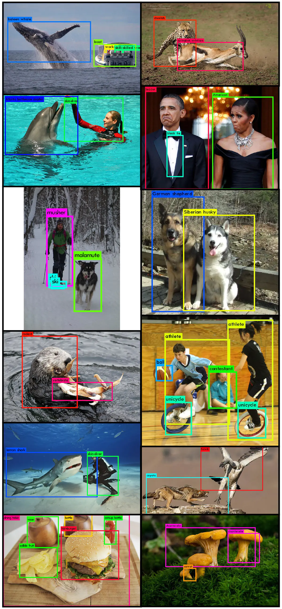
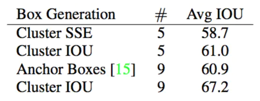
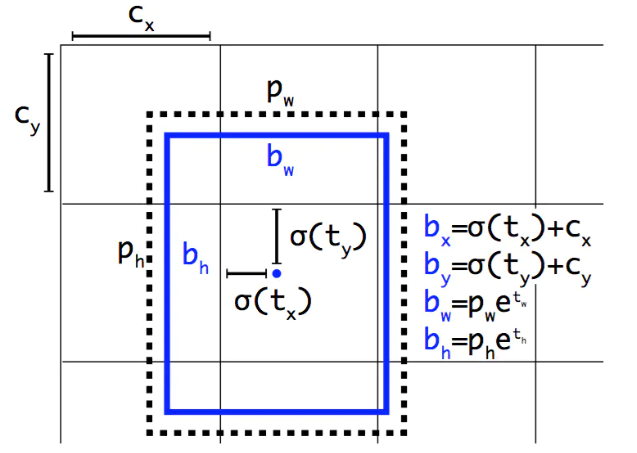
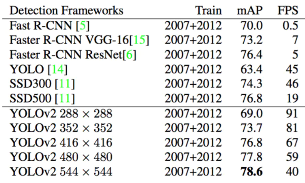
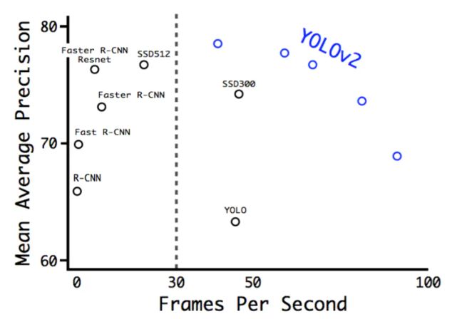
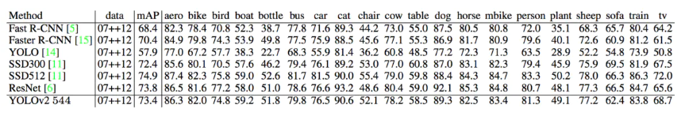
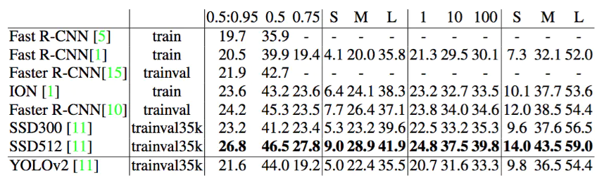
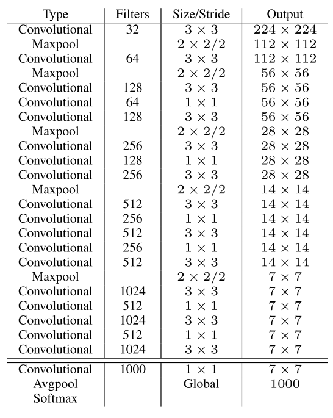
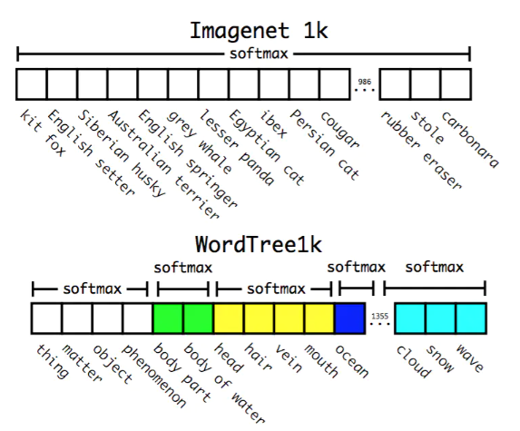

#  qYOLO9000中文版

## 摘要

我们引入了一个先进的实时目标检测系统YOLO9000，可以检测超过9000个目标类别。首先，我们提出了对YOLO检测方法的各种改进，既有新颖性，也有前期的工作。改进后的模型YOLOv2在PASCAL VOC和COCO等标准检测任务上是最先进的。使用一种新颖的，多尺度训练方法，同样的YOLOv2模型可以以不同的尺寸运行，从而在速度和准确性之间提供了一个简单的折衷。在67FPS时，YOLOv2在VOC 2007上获得了76.8 mAP。在40FPS时，YOLOv2获得了78.6 mAP，比使用ResNet的Faster R-CNN和SSD等先进方法表现更出色，同时仍然运行速度显著更快。最后我们提出了一种联合训练目标检测与分类的方法。使用这种方法，我们在COCO检测数据集和ImageNet分类数据集上同时训练YOLO9000。我们的联合训练允许YOLO9000预测未标注的检测数据目标类别的检测结果。我们在ImageNet检测任务上验证了我们的方法。YOLO9000在ImageNet检测验证集上获得19.7 mAP，尽管200个类别中只有44个具有检测数据。在没有COCO的156个类别上，YOLO9000获得16.0 mAP。但YOLO可以检测到200多个类别；它预测超过9000个不同目标类别的检测结果。并且它仍然能实时运行。

## 1. 引言

通用目的的目标检测应该快速，准确，并且能够识别各种各样的目标。自从引入神经网络以来，检测框架变得越来越快速和准确。但是，大多数检测方法仍然受限于一小部分目标。

与分类和标记等其他任务的数据集相比，目前目标检测数据集是有限的。最常见的检测数据集包含成千上万到数十万张具有成百上千个标签的图像[3][10][2]。分类数据集有数以百万计的图像，数十或数十万个类别[20][2]。

我们希望检测能够扩展到目标分类的级别。但是，标注检测图像要比标注分类或贴标签要昂贵得多（标签通常是用户免费提供的）。因此，我们不太可能在近期内看到与分类数据集相同规模的检测数据集。

我们提出了一种新的方法来利用我们已经拥有的大量分类数据，并用它来扩大当前检测系统的范围。我们的方法使用目标分类的分层视图，允许我们将不同的数据集组合在一起。

我们还提出了一种联合训练算法，使我们能够在检测和分类数据上训练目标检测器。我们的方法利用标记的检测图像来学习精确定位物体，同时使用分类图像来增加词表和鲁棒性。

使用这种方法我们训练YOLO9000，一个实时的目标检测器，可以检测超过9000种不同的目标类别。首先，我们改进YOLO基础检测系统，产生最先进的实时检测器YOLOv2。然后利用我们的数据集组合方法和联合训练算法对来自ImageNet的9000多个类别以及COCO的检测数据训练了一个模型。

图1：YOLO9000。YOLO9000可以实时检测许多目标类别。

我们的所有代码和预训练模型都可在线获得：[http://pjreddie.com/yolo9000/](https://link.jianshu.com/?t=http%3A%2F%2Fpjreddie.com%2Fyolo9000%2F)。

## 2. 更好

与最先进的检测系统相比，YOLO有许多缺点。YOLO与Fast R-CNN相比的误差分析表明，YOLO造成了大量的定位误差。此外，与基于区域提出的方法相比，YOLO召回率相对较低。因此，我们主要侧重于提高召回率和改进定位，同时保持分类准确性。

计算机视觉一般趋向于更大，更深的网络[6][18][17]。更好的性能通常取决于训练更大的网络或将多个模型组合在一起。但是，在YOLOv2中，我们需要一个更精确的检测器，它仍然很快。我们不是扩大我们的网络，而是简化网络，然后让表示更容易学习。我们将过去的工作与我们自己的新概念汇集起来，以提高YOLO的性能。表2列出了结果总结。

表2：从YOLO到YOLOv2的路径。列出的大部分设计决定都会导致mAP的显著增加。有两个例外是切换到具有Anchor Boxes的一个全卷积网络和使用新网络。切换到Anchor Boxes风格的方法增加了召回，而不改变mAP，而使用新网络会削减$33%$的计算量。

**Batch Normal**。Batch Normal导致收敛性的显著改善，同时消除了对其他形式正则化的需求[7]。通过在YOLO的所有卷积层上添加Batch Normal，我们在mAP中获得了超过2%的改进。Batch Normal也有助于模型正则化。通过Batch Normal，我们可以从模型中删除dropout而不会过拟合。

**高分辨率分类器**。所有最先进的检测方法都使用在ImageNet[16]上预训练的分类器。从AlexNet开始，大多数分类器对小于256×256[8]的输入图像进行操作。原来的YOLO以224×224的分辨率训练分类器网络，并将分辨率提高到448进行检测。这意味着网络必须同时切换到学习目标检测和调整到新的输入分辨率。

对于YOLOv2，我们首先**ImageNet上以448×448的分辨率对分类网络进行10个迭代周期的微调。这给了网络时间来调整其滤波器以便更好地处理更高分辨率的输入**。然后，我们在检测上微调得到的网络。这个高分辨率分类网络使我们增加了近4%的mAP。

**具有Anchor Boxes 的卷积**。YOLO直接使用卷积特征提取器顶部的全连接层来预测边界框的坐标。Faster R-CNN使用手动选择的先验来预测边界框而不是直接预测坐标[15]。Faster R-CNN中的区域提出网络（RPN）仅使用卷积层来预测Anchor Boxes的偏移和置信度。由于预测层是卷积的，所以RPN在特征映射的每个位置上预测这些偏移。预测偏移而不是坐标简化了问题，并且使网络更容易学习。

\*（*特征映射就是通过输入数据进行卷积操作得到的输出数据，同时特征映射可以看作是输入数据在卷积神经网络中的“抽象”，它可以提取输入数据中不同的特征，例如边缘、纹理等信息，并且随着网络的深度的增加，特征映射也变得越来越抽象，可以提取更高级别的特征，例如物体的某个部分、整体、类别的信息*）

我们从YOLO中移除全连接层，并使用Anchor Boxes来预测边界框。首先，我们消除了一个池化层，使网络卷积层输出具有更高的分辨率。我们还缩小了网络，操作416×416的输入图像而不是448×448。我们这样做是因为我们要在我们的特征映射中有奇数个位置，所以只有一个中心单元。目标，特别是大目标，往往占据图像的中心，所以在中心有一个单独的位置来预测这些目标，而不是四个都在附近的位置是很好的。YOLO的卷积层将图像下采样32倍，所以通过使用416的输入图像，我们得到了13×13的输出特征映射。

当我们移动到Anchor Boxes时，我们也将类预测机制与空间位置分离，预测每个Anchor Boxes的类别和目标。在YOLO之后，目标预测仍然预测了实际值和提出的边界框的IOU，并且类别预测预测了当存在目标时该类别的条件概率。

使用Anchor Boxes，我们在精度上得到了一个小下降。YOLO每张图像只预测98个边界框，但是使用Anchor Boxes我们的模型预测超过一千。如果没有Anchor Boxes，我们的中间模型将获得69.5的mAP，召回率为81%​。具有Anchor Boxes我们的模型得到了69.2 mAP，召回率为​88%。尽管mAP下降，但召回率的上升意味着我们的模型有更大的提升空间。

**维度聚类**。当Anchor Boxes与YOLO一起使用时，我们遇到了两个问题。首先是边界框尺寸是手工挑选的。网络可以学习适当调整边界框，但如果我们为网络选择更好的**先验**，我们可以使网络更容易学习它以便预测好的检测。

\* **先验：指的是我们对模型参数或是数据分布的先前知识或者是假设，先验知识可以帮助我们更好的训练和优化神经网络模型，以提高模型的性能以及泛化能力**

1. **先验知识：我们可以通过先前的实验、领域知识或经验来获得关于模型参数的先验知识。例如，在图像分类任务中，我们可以知道某些特定特征在不同类别中的重要性。**
2. **先验分布：我们可以假设参数服从某种概率分布，这被称为先验分布。常见的先验分布包括高斯分布、拉普拉斯分布等。通过引入先验分布，我们可以在训练过程中约束参数的取值范围，以避免过拟合或提高模型的稳定性。**
3. **贝叶斯推断：贝叶斯推断是一种基于先验和后验概率的统计推断方法。在神经网络中，我们可以使用贝叶斯推断来估计参数的后验分布，从而获得更准确的模型预测和不确定性估计。**

我们不用手工选择先验，而是在训练集边界框上运行k-means聚类，自动找到好的先验。如果我们使用具有欧几里得距离的标准k-means，那么较大的边界框比较小的边界框产生更多的误差。然而，我们真正想要的是导致好的IOU分数的先验，这是独立于边界框大小的。因此，对于我们的距离度量，我们使用：$$d(\text{box}, \text{centroid}) = 1 - \text{IOU}(\text{box}, \text{centroid})$$我们运行各种$k$值的k-means，并画出平均IOU与最接近的几何中心，见图2。我们选择$k=5$作为模型复杂性和高召回率之间的良好折衷。聚类中心与手工挑选的Anchor Boxes明显不同。有更短更宽的边界框和更高更细的边界框。

图2：VOC和COCO的聚类边界框尺寸。我们对边界框的维度进行k-means聚类，以获得我们模型的良好先验。左图显示了我们通过对$k$的各种选择得到的平均IOU。我们发现$k = 5$给出了一个很好的召回率与模型复杂度的权衡。右图显示了VOC和COCO的相对中心。这两种先验都赞成更薄更高的边界框，而COCO比VOC在尺寸上有更大的变化。

在表1中我们将平均IOU与我们聚类策略中最接近的先验以及手工选取的anchor box进行了比较。仅有5个先验中心的平均IOU为61.0，其性能类似于9个锚盒的60.9。如果我们使用9个中心，我们会看到更高的平均IOU。这表明使用k-means来生成我们的边界框会以更好的表示开始训练模型，并使得任务更容易学习。

**直接位置预测**。当YOLO使用anchor boxes时，我们会遇到第二个问题：模型不稳定，特别是在早期的迭代过程中。大部分的不稳定来自预测边界框的$(x,y)$位置。在区域提出网络中，网络预测值$t_x$和$t_y$，$(x,y)$中心坐标计算如下：
$$
 x = (t_x * w_a) - x_a\\
 y = (t_y * h_a) - y_a
$$

这个公式是不受限制的，所以任何锚盒都可以在图像任一点结束，而不管在哪个位置预测该边界框。随机初始化模型需要很长时间才能稳定以预测合理的偏移量。

我们没有预测偏移量，而是按照YOLO的方法预测相对于网格单元位置的位置坐标。这限制了落到$0$和$1$之间的真实值。我们使用逻辑激活来限制网络的预测落在这个范围内。

网络预测输出特征映射中每个单元的5个边界框。网络预测每个边界框的5个坐标，$t_x$，$t_y$，$t_w$，$t_h$和$t_o$。如果单元从图像的左上角偏移了$(c_x, c_y)$，并且边界框先验的宽度和高度为$p_w$，$p_h$，那么预测对应：
$$
b_x = \sigma(t_x) + c_x \\
 b_y = \sigma(t_y)  + c_y\\
 b_w = p_w e^{t_w}\\
 b_h = p_h e^{t_h}\\
 Pr(\text{object}) * IOU(b, \text{object}) = \sigma(t_o)
$$

图3：具有维度先验和位置预测的边界框。我们预测边界框的宽度和高度作为聚类中心的偏移量。我们使用sigmoid函数预测边界框相对于滤波器应用位置的中心坐标。

由于我们限制位置预测参数化更容易学习，使网络更稳定。使用维度聚类以及直接预测边界框中心位置的方式比使用锚盒的版本将YOLO提高了近5%。

**细粒度特征**。这个修改后的YOLO在13×13特征映射上预测检测结果。虽然这对于大型目标来说已经足够了，但它可以从用于定位较小目标的更细粒度的特征中受益。Faster R-CNN和SSD都在网络的各种特征映射上运行他们提出的网络，以获得一系列的分辨率。我们采用不同的方法，仅仅添加一个通道层，从26x26分辨率的更早层中提取特征。

**多尺度训练**。原来的YOLO使用448×448的输入分辨率。通过添加anchor boxes，我们将分辨率更改为416×416。但是，由于我们的模型只使用卷积层和池化层，因此它可以实时调整大小。我们希望YOLOv2能够鲁棒的运行在不同大小的图像上，因此我们可以将其训练到模型中。

我们没有固定的输入图像大小，每隔几次迭代就改变网络。每隔10个批次我们的网络会随机选择一个新的图像尺寸大小。由于我们的模型缩减了32倍，我们从下面的32的倍数中选择：{320,352，...，608}。因此最小的选项是320×320，最大的是608×608。我们调整网络的尺寸并继续训练。

这个制度迫使网络学习如何在各种输入维度上做好预测。这意味着相同的网络可以预测不同分辨率下的检测结果。在更小尺寸上网络运行速度更快，因此YOLOv2在速度和准确性之间提供了一个简单的折衷。

在低分辨率YOLOv2作为一个便宜，相当准确的检测器。在288×288时，其运行速度超过90FPS，mAP与Fast R-CNN差不多。这使其成为小型GPU，高帧率视频或多视频流的理想选择。

在高分辨率下，YOLOv2是VOC 2007上最先进的检测器，达到了78.6 mAP，同时仍保持运行在实时速度之上。请参阅表3，了解YOLOv2与VOC 2007其他框架的比较。

表3：PASCAL VOC 2007的检测框架。YOLOv2比先前的检测方法更快，更准确。它也可以以不同的分辨率运行，以便在速度和准确性之间进行简单折衷。每个YOLOv2条目实际上是具有相同权重的相同训练模型，只是以不同的大小进行评估。所有的时间信息都是在Geforce GTX Titan X（原始的，而不是Pascal模型）上测得的。

图4：VOC 2007上的准确性与速度。

**进一步实验**。我们在VOC 2012上训练YOLOv2进行检测。表4显示了YOLOv2与其他最先进的检测系统的比较性能。YOLOv2取得了73.4 mAP同时运行速度比竞争方法快的多。我们在COCO上进行了训练，并在表5中与其他方法进行比较。在VOC度量（IOU = 0.5）上，YOLOv2得到44.0 mAP，与SSD和Faster R-CNN相当。

表4：PASCAL VOC2012 test上的检测结果。YOLOv2与最先进的检测器如具有ResNet的Faster R-CNN、SSD512在标准数据集上运行，YOLOv2比它们快2-10倍。

表5：在COCO test-dev2015上的结果。表参考[11]

## 3. 更快

我们希望检测是准确的，但我们也希望它快速。大多数检测应用（如机器人或自动驾驶机车）依赖于低延迟预测。为了最大限度提高性能，我们从头开始设计YOLOv2。

大多数检测框架依赖于VGG-16作为的基本特征提取器[17]。VGG-16是一个强大的，准确的分类网络，但它是不必要的复杂。在单张图像224×224分辨率的情况下VGG-16的卷积层运行一次传递需要306.90亿次浮点运算。

YOLO框架使用基于Googlenet架构[19]的自定义网络。这个网络比VGG-16更快，一次前馈传播只有85.2亿次的操作。然而，它的准确性比VGG-16略差。在ImageNet上，对于单张裁剪图像，224×224分辨率下的`top-5`准确率，YOLO的自定义模型获得了$88.0%$，而VGG-16则为$90.0%$。

**Darknet-19**。我们提出了一个新的分类模型作为YOLOv2的基础。我们的模型建立在网络设计先前工作以及该领域常识的基础上。与VGG模型类似，我们大多使用3×3滤波器，并在每个池化步骤之后使通道数量加倍[17]。按照Network in Network（NIN）的工作，我们使用全局平均池化做预测以及1×1滤波器来压缩3×3卷积之间的特征表示[9]。我们使用Batch Normal来稳定训练，加速收敛，并正则化模型[7]。

我们的最终模型叫做Darknet-19，它有19个卷积层和5个最大池化层。完整描述请看表6。Darknet-19只需要55.8亿次运算来处理图像，但在ImageNet上却达到了72.9%​的top-1准确率和91.2%的top-5准确率。

表6：Darknet-19

如上所述，在我们对224×224的图像进行初始训练之后，我们对网络在更大的尺寸448上进行了微调。对于这种微调，我们使用上述参数进行训练，但是只有10个迭代周期，并且以$10^{−3}$的学习率开始。在这种更高的分辨率下，我们的网络达到了76.5%​的top-1准确率和93.3%的top-5准确率。

**检测训练**。我们修改这个网络进行检测，删除了最后一个卷积层，加上了三个具有1024个滤波器的3×3卷积层，其后是最后的1×1卷积层与我们检测需要的输出数量。对于VOC，我们预测5个边界框，每个边界框有5个坐标和20个类别，所以有125个滤波器。我们还添加了从最后的3×3×512层到倒数第二层卷积层的直通层，以便我们的模型可以使用细粒度特征。

我们训练网络160个迭代周期，初始学习率为$10^{−3}$，在60个和90个迭代周期时将学习率除以10。我们使用0.0005的权重衰减和0.9的动量。我们对YOLO和SSD进行类似的数据增强，随机裁剪，色彩偏移等。我们对COCO和VOC使用相同的训练策略。

## 4. 更强

我们提出了一个联合训练分类和检测数据的机制。我们的方法使用标记为检测的图像来学习边界框坐标预测和目标之类的特定检测信息以及如何对常见目标进行分类。它使用仅具有类别标签的图像来扩展可检测类别的数量。

在训练期间，我们混合来自检测和分类数据集的图像。当我们的网络看到标记为检测的图像时，我们可以基于完整的YOLOv2损失函数进行反向传播。当它看到一个分类图像时，我们只能从该架构的分类特定部分反向传播损失。

这种方法提出了一些挑战。检测数据集只有通用目标和通用标签，如“狗”或“船”。分类数据集具有更广更深的标签范围。ImageNet有超过一百种品种的狗，包括`Norfolk terrier`，`Yorkshire terrier`和`Bedlington terrier`。如果我们想在两个数据集上训练，我们需要一个连贯的方式来合并这些标签。

大多数分类方法使用跨所有可能类别的softmax层来计算最终的概率分布。使用softmax假定这些类是相互排斥的。这给数据集的组合带来了问题，例如你不想用这个模型来组合ImageNet和COCO，因为类`Norfolk terrier`和`dog`不是相互排斥的。

我们可以改为使用多标签模型来组合不假定互斥的数据集。这种方法忽略了我们已知的关于数据的所有结构，例如，所有的COCO类是互斥的。

**分层分类**。ImageNet标签是从WordNet中提取的，这是一个构建概念及其相互关系的语言数据库[12]。在WordNet中，`Norfolk terrier`和`Yorkshire terrier`都是`terrier`的下义词，`terrier`是一种`hunting dog`，`hunting dog`是`dog`，`dog`是`canine`等。分类的大多数方法为标签假设一个扁平结构，但是对于组合数据集，结构正是我们所需要的。

WordNet的结构是有向图，而不是树，因为语言是复杂的。例如，`dog`既是一种`canine`，也是一种`domestic animal`，它们都是WordNet中的同义词。我们不是使用完整的图结构，而是通过从ImageNet的概念中构建分层树来简化问题。

为了构建这棵树，我们检查了ImageNet中的视觉名词，并查看它们通过WordNet图到根节点的路径，在这种情况下是“物理对象”。许多同义词通过图只有一条路径，所以首先我们将所有这些路径添加到我们的树中。然后我们反复检查我们留下的概念，并尽可能少地添加生长树的路径。所以如果一个概念有两条路径到一个根，一条路径会给我们的树增加三条边，另一条只增加一条边，我们选择更短的路径。

最终的结果是WordTree，一个视觉概念的分层模型。为了使用WordTree进行分类，我们预测每个节点的条件概率，以得到同义词集合中每个同义词下义词的概率。例如，在`terrier`节点我们预测：
$$
 Pr(\text{Norfolk terrier} | \text{terrier}) \\
 Pr(\text{Yorkshire terrier} | \text{terrier}) \\
 Pr(\text{Bedlington terrier} | \text{terrier})\\
 ...\\
$$

如果我们想要计算一个特定节点的绝对概率，我们只需沿着通过树到达根节点的路径，再乘以条件概率。所以如果我们想知道一张图片是否是`Norfolk terrier`，我们计算：
$$
 Pr(\text{Norfolk terrier}) = Pr(\text{Norfolk terrier} | \text{terrier})\\
 \* Pr(\text{terrier} | \text{hunting dog}) \\
 \* \ldots * \\
 *Pr(\text{mammal} | Pr(\text{animal})\\
 \* Pr(\text{animal} | \text{physical object})
$$
为了分类目的，我们假定图像包含一个目标：$Pr(\text{physical object}) = 1$。

为了验证这种方法，我们在使用1000类ImageNet构建的WordTree上训练Darknet-19模型。为了构建WordTree1k，我们添加了所有将标签空间从1000扩展到1369的中间节点。在训练过程中，我们将真实标签向树上面传播，以便如果图像被标记为`Norfolk terrier`，则它也被标记为`dog`和`mammal`等。为了计算条件概率，我们的模型预测了具有1369个值的向量，并且我们计算了相同概念的下义词在所有同义词集上的softmax，见图5。

图5：在ImageNet与WordTree上的预测。大多数ImageNet模型使用一个较大的softmax来预测概率分布。使用WordTree，我们可以在共同的下义词上执行多次softmax操作。

使用与以前相同的训练参数，我们的分级Darknet-19达到71.9%​的`top-1`准确率和90.4%​的`top-5`准确率。尽管增加了369个额外的概念，而且我们的网络预测了一个树状结构，但我们的准确率仅下降了一点点。以这种方式进行分类也有一些好处。在新的或未知的目标类别上性能会优雅地降低。例如，如果网络看到一只狗的照片，但不确定它是什么类型的狗，它仍然会高度自信地预测“狗”，但是在下义位扩展之间有更低的置信度。

这个构想也适用于检测。现在，我们不是假定每张图像都有一个目标，而是使用YOLOv2的目标预测器给我们$Pr(\text{physical object})$的值。检测器预测边界框和概率树。我们遍历树，在每个分割中采用最高的置信度路径，直到达到某个阈值，然后我们预测目标类。

**联合分类和检测**。现在我们可以使用WordTree组合数据集，我们可以在分类和检测上训练联合模型。我们想要训练一个非常大规模的检测器，所以我们使用COCO检测数据集和完整的ImageNet版本中的前9000个类来创建我们的组合数据集。我们还需要评估我们的方法，以便从ImageNet检测挑战中添加任何尚未包含的类。该数据集的相应WordTree有9418个类别。ImageNet是一个更大的数据集，所以我们通过对COCO进行过采样来平衡数据集，使得ImageNet仅仅大于4:1的比例。

使用这种联合训练，YOLO9000学习使用COCO中的检测数据来查找图像中的目标，并学习使用来自ImageNet的数据对各种目标进行分类。

我们在ImageNet检测任务上评估YOLO9000。ImageNet的检测任务与COCO共享44个目标类别，这意味着YOLO9000只能看到大多数测试图像的分类数据，而不是检测数据。YOLO9000在从未见过任何标记的检测数据的情况下，整体上获得了19.7 mAP，在不相交的156个目标类别中获得了16.0 mAP。这个mAP高于DPM的结果，但是YOLO9000在不同的数据集上训练，只有部分监督[4]。它也同时检测9000个其他目标类别，所有的都是实时的。

当我们分析YOLO9000在ImageNet上的表现时，我们发现它很好地学习了新的动物种类，但是却在像服装和设备这样的学习类别中挣扎。新动物更容易学习，因为目标预测可以从COCO中的动物泛化的很好。相反，COCO没有任何类型的衣服的边界框标签，只针对人，因此YOLO9000正在努力建模“墨镜”或“泳裤”等类别。

## 5. 结论

我们介绍了YOLOv2和YOLO9000，两个实时检测系统。YOLOv2在各种检测数据集上都是最先进的，也比其他检测系统更快。此外，它可以运行在各种图像大小，以提供速度和准确性之间的平滑折衷。

YOLO9000是一个通过联合优化检测和分类来检测9000多个目标类别的实时框架。我们使用WordTree将各种来源的数据和我们的联合优化技术相结合，在ImageNet和COCO上同时进行训练。YOLO9000是在检测和分类之间缩小数据集大小差距的重要一步。

我们的许多技术都可以泛化到目标检测之外。我们对ImageNet的WordTree表示为图像分类提供了更丰富，更详细的输出空间。使用分层分类的数据集组合在分类和分割领域将是有用的。像多尺度训练这样的训练技术可以为各种视觉任务提供益处。

对于未来的工作，我们希望使用类似的技术来进行弱监督的图像分割。我们还计划使用更强大的匹配策略来改善我们的检测结果，以在训练期间将弱标签分配给分类数据。计算机视觉受到大量标记数据的祝福。我们将继续寻找方法，将不同来源和数据结构的数据整合起来，形成更强大的视觉世界模型。

## 参考文献

[1] S. Bell, C. L. Zitnick, K. Bala, and R. Girshick. Inside-outside net: Detecting objects in context with skip pooling and recurrent neural networks. arXiv preprint arXiv:1512.04143, 2015. 6

[2] J. Deng, W. Dong, R. Socher, L.-J. Li, K. Li, and L. Fei- Fei. Imagenet: A large-scale hierarchical image database. In Computer Vision and Pattern Recognition, 2009. CVPR 2009. IEEE Conference on, pages 248–255. IEEE, 2009. 1

[3] M. Everingham, L. Van Gool, C. K. Williams, J. Winn, and A. Zisserman. The pascal visual object classes (voc) challenge. International journal of computer vision, 88(2):303– 338, 2010. 1

[4] P. F. Felzenszwalb, R. B. Girshick, and D. McAllester. Discriminatively trained deformable part models, release 4. [http://people.cs.uchicago.edu/pff/latent-release4/](https://link.jianshu.com?t=http%3A%2F%2Fpeople.cs.uchicago.edu%2Fpff%2Flatent-release4%2F). 8

[5] R. B. Girshick. Fast R-CNN. CoRR, abs/1504.08083, 2015. 4, 5, 6

[6] K. He, X. Zhang, S. Ren, and J. Sun. Deep residual learning for image recognition. arXiv preprint arXiv:1512.03385, 2015. 2, 4, 5

[7] S. Ioffe and C. Szegedy. Batch normalization: Accelerating deep network training by reducing internal covariate shift. arXiv preprint arXiv:1502.03167, 2015. 2, 5

[8] A. Krizhevsky, I. Sutskever, and G. E. Hinton. Imagenet classification with deep convolutional neural networks. In Advances in neural information processing systems, pages 1097–1105, 2012. 2

[9] M. Lin, Q. Chen, and S. Yan. Network in network. arXiv preprint arXiv:1312.4400, 2013. 5

[10] T.-Y. Lin, M. Maire, S. Belongie, J. Hays, P. Perona, D. Ramanan, P. Dollar, and C. L. Zitnick. Microsoft coco: Common objects in context. In European Conference on Computer Vision, pages 740–755. Springer, 2014. 1, 6

[11] W. Liu, D. Anguelov, D. Erhan, C. Szegedy, and S. E. Reed. SSD: single shot multibox detector. CoRR, abs/1512.02325, 2015. 4, 5, 6

[12] G. A. Miller, R. Beckwith, C. Fellbaum, D. Gross, and K. J. Miller. Introduction to wordnet: An on-line lexical database. International journal of lexicography, 3(4):235–244, 1990. 6

[13] J. Redmon. Darknet: Open source neural networks in c. [http://pjreddie.com/darknet/](https://link.jianshu.com?t=http%3A%2F%2Fpjreddie.com%2Fdarknet%2F), 2013–2016. 5

[14] J. Redmon, S. Divvala, R. Girshick, and A. Farhadi. You only look once: Unified, real-time object detection. arXiv preprint arXiv:1506.02640, 2015. 4, 5

[15] S. Ren, K. He, R. Girshick, and J. Sun. Faster r-cnn: Towards real-time object detection with region proposal net- works. arXiv preprint arXiv:1506.01497, 2015. 2, 3, 4, 5, 6

[16] O. Russakovsky, J. Deng, H. Su, J. Krause, S. Satheesh, S. Ma, Z. Huang, A. Karpathy, A. Khosla, M. Bernstein, A. C. Berg, and L. Fei-Fei. ImageNet Large Scale Visual Recognition Challenge. International Journal of Computer Vision (IJCV), 2015. 2

[17] K. Simonyan and A. Zisserman. Very deep convolutional networks for large-scale image recognition. arXiv preprint arXiv:1409.1556, 2014. 2, 5

[18] C. Szegedy, S. Ioffe, and V. Vanhoucke. Inception-v4, inception-resnet and the impact of residual connections on learning. CoRR, abs/1602.07261, 2016. 2

[19] C. Szegedy, W. Liu, Y. Jia, P. Sermanet, S. Reed, D. Anguelov, D. Erhan, V. Vanhoucke, and A. Rabinovich. Going deeper with convolutions. CoRR, abs/1409.4842, 2014. 5

[20] B. Thomee, D. A. Shamma, G. Friedland, B. Elizalde, K. Ni, D. Poland, D. Borth, and L.-J. Li. Yfcc100m: The new data in multimedia research. Communications of the ACM, 59(2):64–73, 2016. 1