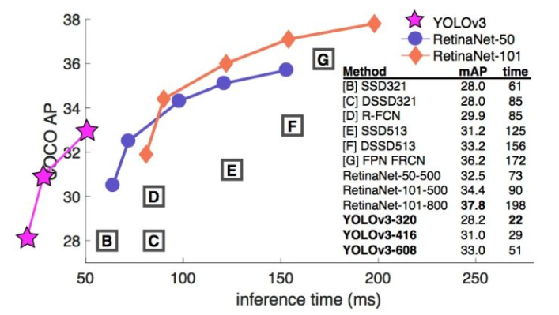
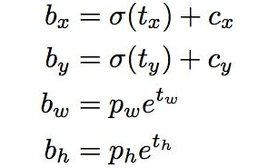
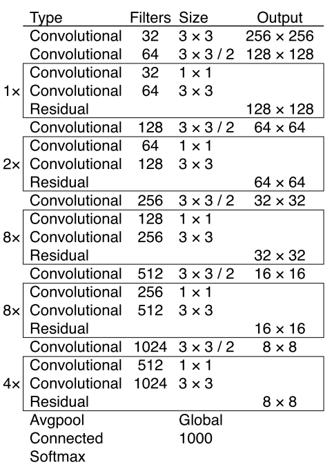
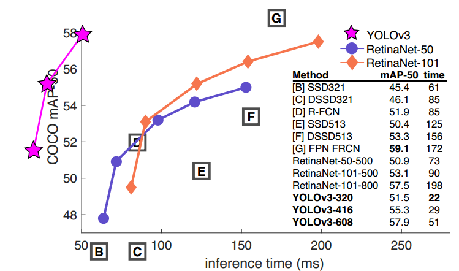

# YOLO3中文版

## 摘要

更新YOLO啦！ 我们在设计上做了一些小的更改，使它变得更好。 我们训练了这个新的网络，它比以前的版本更准确不过比之前的稍大一些，但不用担心，它的速度依然是扛扛的。 YOLOv3在输入为320×320的图片上的检测速度是22ms ，mAP为28.2。这与SSD一样精确，但速度提高了三倍。 当使用旧的0.5 IOU mAP检测指标，YOLOv3是相当不错的。 在Titan X上，它在51 ms内达到57.9$AP_{50}$，与RetinaNet在198 ms内的57.5$AP_{50}$相比，表现相当，但速度提高了3.8倍。 跟以前一样，所有代码都在网站 https://pjreddie.com/yolo/。

## 1.引言

知道吗？有时你会敷衍了事浑浑噩噩就度过了一年，今年我没有做太多研究，只是在Twitter上挥霍时间。玩了一下GAN。凭着去年遗留的一点动力[10] [1]， 我设法对YOLO进行了一些改进。然而，讲真，没有什么超级有趣的进展，只是一小丁点的改善。同时，我也为别人的研究略尽绵力。

于是就有了今天的这篇文章。我们有一个最终的截止日期，需要引用一些我对YOLO进行的随机更新，但我们没有一个资源。所以准备好迎接这篇技术报告！

技术报告的好处是他们不需要引言，大家都知道缘由。所以简介的最后将为本文的其余部分提供指路标。首先我们会告诉你YOLOv3的方案，然后会告诉你我们是如何实现的。我们还会告诉你我们尝试过但并不奏效的一些事情。最后是探讨这一切的意义。

## 2. 解决方案

这里主要介绍YOLOv3的方案，我们从别人的工作里获得了一些好的点子，还训练了一个比其他模型更好的新的分类器网络。 我们将从头开始介绍整个系统，以便您能彻底地理解它。

图1.这个图来自Focal Loss论文[7]。 YOLOv3的运行速度明显快于其他具有可比性能的检测方法。 基于自、M40或Titan X（这两个基本上是相同的GPU）的检测时间。

### 2.1 边界框预测

遵循YOLO9000的方法，YOLOv3使用由维度聚类（dimension cluster）得到的锚框（anchor box）来预测边界框（bounding box）[13]。 网络为每个边界框预测4个坐标，tx，ty，tw，th。 假设单元格距离图像的左上角偏移了（cx，cy），先验边界框（bounding box prior）具有宽度pw和高度ph，则预测应为：

在训练时，损失的计算使用平方误差的总和。如果某个坐标预测的真实值是 ![[公式]](https://www.zhihu.com/equation?tex=%5Ctilde%7Bt_%2A%7D) ，那么梯度是真实值（从真实标签框计算得到）减去预测 ![[公式]](https://www.zhihu.com/equation?tex=t_%2A) ：![[公式]](https://www.zhihu.com/equation?tex=%5Ctilde%7Bt_%2A%7D) - ![[公式]](https://www.zhihu.com/equation?tex=t_%2A)。真实值可以很容易地通过变换前面的式子得到。

YOLOv3使用逻辑回归预测每个边界框的目标分数（objectness score）。如果真实标签框与某个边界框重叠的面积比与其他任何边界框都大，那么这个先验边界框为1。按照[15]的做法，如果先验边界框不是最好的，但是确实与目标的真实标签框重叠的面积大于阈值，我们就会忽略这个预测。我们使用阈值为0.5。与[15]不同，我们的系统只为每个真实标签框分配一个边界框。如果先验边界框未分配给真实标签框，则不会产生坐标或类别预测损失，只会产生目标预测损失。

图2.具有维度先验和位置预测的边界框。 我们使用聚类质心的偏移量预测框的宽度和高度。 我们使用sigmoid函数预测相对于滤波器应用位置的框的中心坐标。 这个图公然从[13]自“拿来”的。

### 2.2 类预测

每个框使用多标签分类预测边界框可能包含的类。我们不使用softmax，因为我们发现它没能显著提升性能，相反，我们只是使用独立的逻辑分类器。在进行训练时，我们使用二元交叉熵损失来进行类别预测。

当我们转向更复杂的领域，这个公式会变得很有用。例如开放图像数据集[5]，在这个数据集中有许多重叠的标签（即女性和人）。使用softmax会强加这样一个假设——每个框只有一个类别，但通常情况并非如此。多标签的方式更好地模拟数据。

### 2.3 多尺度预测

YOLOv3预测3种不同尺度的框。 我们的系统使用类似金字塔网络的相似概念，从这些尺度中提取特征[6]。 在我们的基本特征提取器上添加几个卷积层，其中最后一个卷积层预测了一个三维张量——边界框，目标和类别预测。 在我们的COCO实验[8]中，我们为每个尺度预测3个框，所以对于4个边界框偏移量，1个目标预测和80个类别预测，张量的大小为N×N×[3 *（4 + 1 + 80）]。

接下来，我们从前面的2个层中取得特征图，并将其上采样2倍。我们还从网络中的较前的层中获取特征图，并使用按元素相加的方式将其与我们的上采样特征图进行合并。这种方法使我们能够从上采样的特征图中获得更有意义的语义信息，同时可以从更前的层中获取更细粒度的信息。然后，我们再添加几个卷积层来处理这个组合的特征图，并最终预测出一个类似的张量，虽然其尺寸是之前的两倍。

我们再次使用相同的设计来预测最终尺寸的边界框。因此，第三个尺寸的预测将既能从所有先前的计算，又能从网络前面的层中的细粒度的特征中获益。

我们仍然使用k-means聚类来确定我们的先验边界框。我们只是选择了9个类和3个尺度，然后在所有尺度上均匀分割聚类。在COCO数据集上，9个聚类分别为（10×13），（16×30），（33×23），（30×61），（62×45），（59×119），（116×90） ，（156×198），（373×326）。

### 2.4 特征提取器

我们使用新的网络来执行特征提取。我们的新网络融合了YOLOv2，Darknet-19和新颖的残差网络的思想。我们的网络使用连续的3×3和1×1卷积层，但现在多了一些捷径连接（shortcut connetction），而且规模更大。它有53个卷积层，所以我们称之为....emmm...... Darknet-53！

表1. Darknet-53。

这个新网络比Darknet-19功能强大得多，但仍比ResNet-101或ResNet-152更高效。 以下是一些ImageNet结果：

表2.不同backbone的各种网络在准确度，Bn Ops，BFLOP／s和FPS上的比较。

每个网络都使用相同的设置进行训练，并在256×256的图像上进行单精度测试。 运行时间是在Titan X上用256×256图像进行测量的。因此，Darknet-53可与最先进的分类器相媲美，但浮点运算更少，速度更快。 Darknet-53比ResNet-101更好，且速度快1.5倍。 Darknet-53与ResNet-152具有相似的性能，但速度快2倍。

Darknet-53也实现了最高的每秒浮点运算测量。 这意味着网络结构可以更好地利用GPU，使它的评测更加高效，更快。 这主要是因为ResNets的层数太多，效率不高。

### 2.5 训练

我们仍然在完整的图像进行训练，没有使用难负样本挖掘（hard negative mining）或其他类似的方法。 我们使用多尺度训练，大量的数据增强，批量标准化等等标准的操作。 我们使用Darknet神经网络框架进行训练和测试[12]。

## 3.我们的做法

YOLOv3非常好！请参见表3，就COCO的mAP指标而言，它与SSD类的模型相当，但速度提高了3倍。尽管如此，它仍然在这个指标上比像RetinaNet这样的其他模型差些。

表3.我从[7]中“拿来”了所有这些表，他们花了很长时间才从头开始制作。 好的，YOLOv3没问题。 请记住，RetinaNet处理图像的时间要长3.8倍。 YOLOv3比SSD好得多，可以媲美最新的技术水平的模型。

但是，当我们在“旧的”检测指标——在IOU = 0.5的mAP（或图表中的$AP_{50}$YOLOv3非常强大。它几乎与RetinaNet相当，并且远高于SSD。这表明YOLOv3是一个非常强大的检测器，擅长为目标生成恰当的框。然而，随着IOU阈值增加，性能显著下降，YOLOv3预测的边界框与目标不能完美对齐。

在过去，YOLO不擅长检测小物体。但是，现在我们看到了这种趋势的逆转。随着新的多尺度预测，我们看到YOLOv3具有相对较高的APS性能。但是，它在中等和更大尺寸的物体上的表现相对较差。需要更多的研究来了解这一点。

当我们在$AP_{50}$指标上绘制准确度和速度时（见图3），我们看到YOLOv3与其他检测系统相比具有显着的优势。也就是说，速度越来越快。

图3.来自[7]，这次显示的是在0.5 IOU指标上速度/准确度的折衷。 你可以说YOLOv3是好的，因为它非常高并且在左边很远。 你能引用你自己的论文吗？ 猜猜谁会去尝试，这个人→[14]。

## 4. 失败的尝试

我们在研究YOLOv3时尝试了很多东西，但很多都不起作用。 这是我们要记住的血的教训。

**锚框的x，y偏移预测**。 我们尝试使用常规的锚框预测机制，比如利用线性激活将坐标x、y的偏移程度预测为边界框宽度或高度的倍数。但我们发现这种方法降低了模型的稳定性，并且效果不佳。

**用线性激活代替逻辑激活进行x，y预测**。 我们尝试使用线性激活代替逻辑激活来直接预测x，y偏移。 这导致了MAP下降了几个点。

**focal loss**。 我们尝试使用focal loss。 它使得平均分下降2个点。 YOLOv3可能已经对focal loss试图解决的问题具有鲁棒性，因为它具有单独的目标预测和条件类别预测。 因此，对于大多数例子来说，类别预测没有损失？ 或者其他的东西？ 我们并不完全确定。

**双IOU阈值和真值分配**。 Faster R-CNN在训练期间使用两个IOU阈值。 如果一个预测与真实标签框重叠超过0.7，它就是一个正的样本，若重叠为[0.3，0.7]之间，那么它会被忽略，若它与所有的真实标签框的IOU小于.3，那么这是一个负样本。 我们尝试了类似的策略，但无法取得好的结果。

我们非常喜欢目前的更新，它似乎至少在局部达到了最佳。 有些方法可能最终会产生好的结果，也许他们只是需要一些调整来稳定训练。

## 5.这一切意味着什么

YOLOv3是一个很好的检测器。 速度很快，很准确。 COCO在平均AP介于.5和.95 IOU之间的指标的情况并不理想。 但是，对于旧的检测度量.5 IOU来说非常好。

为什么我们要改变指标？COCO的原文件只是有这样一句含糊不清的句子：“一旦评估服务器完成，就会生成全面评测标准”。 Russakovsky等人报告说，人们很难区分.3和.5的IOU。 “训练人类用视觉检查IOU为0.3的边界框，并且与IOU为0.5的框区别开来是非常困难的。“[16]如果人类很难说出差异，那么它也没有多重要吧？

但是也许更好的问题是：“现在我们有了这些检测器，我们要做什么？”很多做关于这方面的研究的人都受聘于Google和Facebook。我想至少我们知道这项技术在好人的手中，绝对不会被用来收集您的个人信息并将其出售给......等等，您是说这正是它的用途？oh。

其他花大钱资助视觉研究的人还有军方，他们从来没有做过任何可怕的事情，例如用新技术杀死很多人，等等.....

我强烈地希望，大多数使用计算机视觉的人都用它来做一些快乐且有益的事情，比如计算一个国家公园里斑马的数量[11]，或者追踪在附近徘徊时的猫[17]。但是计算机视觉已经有很多可疑的用途，作为研究人员，我们有责任考虑我们的工作可能造成的损害，并思考如何减轻它的影响。我们非常珍惜这个世界。