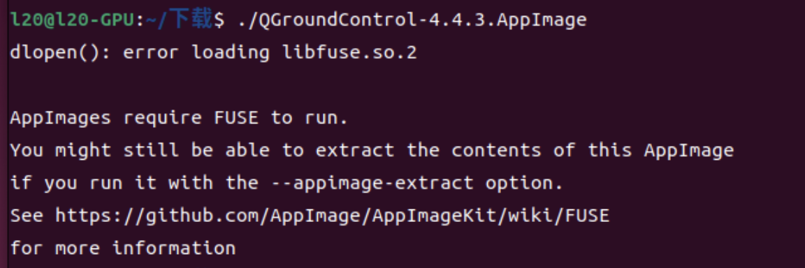

# 项目介绍

该项目是云纵无人机在 Robotac 赛事中使用到的最终优化后版本的安装包，该安装包的的安装流程为 ：

`宿主机`  →  `isaacsim容器` → `ros2容器`


# 配置要求 

| 位置       | 当前远端配置                            | 注意事项                                                     |
| :--------- | :-------------------------------------- | :----------------------------------------------------------- |
| 宿主机     | Ubuntu 20.04 + ROS Foxy RViz            | 宿主机不要求安装 Humble。RViz 脚本会兼容 Foxy 配置。         |
| ROS2 容器  | ROS 2 Humble                            | 负责 EGO-Planner、px4_msgs、quadrotor_msgs 和任务控制节点。  |
| Isaac 容器 | Isaac Sim 4.5、Pegasus、PX4、XRCE Agent | 负s责仿真、无人机接管、PX4 SITL 和场景资产加载。             |
| 通信配置   | rmw_fastrtps_cpp                        | 远端完整流程统一使用这个 RMW，不要和本机 CycloneDDS 配置混用。 |

```bash
export RMW_IMPLEMENTATION=rmw_fastrtps_cpp
```


# IsaacSim 容器安装环境


## 安装 git

```
# docker exec -it isaac-lab-test bash

apt update
apt install -y git 
```


## 配置 git 代理

```
git config --global http.proxy http://代理主机ip:代理端口
git config --global https.proxy http://代理主机ip:代理端口
```

```
git config --global http.proxy http://192.168.1.124:7890
git config --global https.proxy http://192.168.1.124:7890
```

```
git config --global http.proxy http://192.168.1.124:10808
git config --global https.proxy http://192.168.1.124:10808
```


## 取消 git 代理

```
git config --global --unset http.proxy
git config --global --unset https.proxy
```


## 安装PX4-Autopilot

```Python
#下载容器环境
docker exec -it isaac-lab-test bash

#拉取控制包和相关依赖
cd /root
git clone -b v1.14.3 https://github.com/PX4/PX4-Autopilot.git
 
#编译这个包
cd /root/PX4-Autopilot
export PATH=/isaac-sim/kit/python/bin:$PATH
export PYTHONPATH=/root/.px4-kit-pydeps:/usr/lib/python3.10/lib-dynload${PYTHONPATH:+:$PYTHONPATH}
export GIT_CONFIG_COUNT=1
export GIT_CONFIG_KEY_0=safe.directory
export GIT_CONFIG_VALUE_0=*

make px4_sitl_default 
 
```


### 编译出现 make：command not found

* 原因：找不到 make 程序

* 解决办法：执行下面的代码来进行安装编译工具

    ```bash
    apt update && apt install -y build-essential cmake cmake-data
    ```


### 编译出现了很多的错误，并且说ModuleNotFoundError: No module named '_curses'

这是因为默认使用的是 /isaac-sim/kit/python/bin/python3 这个环境的 python 进行编译，而实际上这个环境里面是经过裁剪的，我们需要使用另外一个系统环境去进行编译，解决办法：

```
apt update
apt install python3 python3-venv python3-dev -y
```

```
/usr/bin/python3 --version
```

```
/usr/bin/python3 -c "import curses"
```

```
export PATH=/usr/bin:/usr/local/sbin:/usr/local/bin:$PATH
```

完成上面的操作之后，再将刚才生成出来的 build 文件都删除掉，防止编译的缓存，导致编译失败

```
cd ~/PX4-Autopilot
rm -rf build/
```

完成后可尝试用下面的命令进行重新编译

```
make px4_sitl_default     PYTHON_EXECUTABLE=/usr/bin/python3
```


## 安装pegasus simulation及基础使用

```Bash
#在容器环境里面操作
cd /root
git clone --branch v4.5.1 --depth 1 https://github.com/PegasusSimulator/PegasusSimulator.git
cd /root/PegasusSimulator/extensions

#需要注意，isaac sim要求插件使用自身的python环境，所以需要设置环境变量
export ISAACSIM_PATH=/isaac-sim
export ISAACSIM_PYTHON=/isaac-sim/python.sh
cd ~/PegasusSimulator/extensions/pegasus.simulator

$ISAACSIM_PYTHON -m pip install -e ~/PegasusSimulator/extensions/pegasus.simulator
```


## 安装XRCEagent和px4_msg

因为我们本机有着ros2 humble的专用docker和isaac sim4.5的docker，所以我们将控制层在ros2 docker里面实现，仿真层在isaac sim4.5 docker里面实现。具体需要的内容和通信用法如下：

1. PX4和ROS2之间的通信-----XRCEagent

XRCEagnet是实现PX4与ros2之间通信的桥梁，可以将PX4的相关控制指令转化为ros2话题输出，具体话题内容可以自行了解。下面是安装指令：

```
apt update
apt install -y git cmake g++ make

#下载源码：
cd /root
git clone -b v2.4.3 https://github.com/eProsima/Micro-XRCE-DDS-Agent.git

#编译：
cd /root/Micro-XRCE-DDS-Agent
mkdir -p build
cd build
cmake ..
make -j"$(nproc)"

#检查是否编译成功：
ls -lh /root/Micro-XRCE-DDS-Agent/build/MicroXRCEAgent
/root/Micro-XRCE-DDS-Agent/build/MicroXRCEAgent --help

#前台启动：
cd /root/Micro-XRCE-DDS-Agent/build
./MicroXRCEAgent udp4 -p 8888

```


# 宿主机安装环境

```
#下载QGC控制器
cd ~/Downloads
wget -O QGroundControl-4.4.3.AppImage \
https://github.com/mavlink/qgroundcontrol/releases/download/v4.4.3/QGroundControl.AppImage

#添加可执行权限
chmod +x QGroundControl-4.4.3.AppImage

#增加端口控制权限
sudo usermod -aG dialout $USER
sudo apt-get remove -y modemmanager

#然后重启电脑
reboot
```


## 安装交付包

```bash
tar -xzf cargo_delivery_demo_release_20260604.tar.gz

cd cargo_delivery_demo_release_20260604
docker cp isaac_container/robotac_isaac_assets 指定的容器isaacsim:/root/

docker cp ros2_container/cargo_delivery_demo 指定的容器ros:/root/
docker cp ros2_container/cargo_ros_ws_src/uav_avoidance_demo 指定的ros容器:/root/cargo_ros_ws/src/

cp -r host_rviz/cargo_delivery_demo ~/
cd ~/cargo_delivery_demo_release_20260604
./isaac_container/pegasus_patch/apply_pegasus_patch.sh isaac-lab-test
./ros2_container/ego_planner_patch/apply_ego_planner_patch.sh ros2
```


## 启动 QGroundControl...AppImage 的时候遇到了依赖问题



解决办法：在宿主机终端使用：

```
sudo apt update && sudo apt install libfuse2
```

安装依赖即可


# ROS 容器安装环境

```
cd /root/cargo_ros_ws
source /opt/ros/humble/setup.bash
source /root/px4_ros_ws/install/setup.bash
export RMW_IMPLEMENTATION=rmw_fastrtps_cpp
colcon build
```


## 编译遇到问题了

```
root@l20-GPU:~/cargo_ros_ws# colcon build
Starting >>> quadrotor_msgs
Starting >>> cmake_utils
Starting >>> plan_env
Starting >>> traj_utils
Starting >>> pose_utils
Starting >>> drone_detect
Starting >>> map_generator
Starting >>> mockamap
Finished <<< cmake_utils [0.29s]                                                                                                  
Starting >>> uav_utils
Finished <<< drone_detect [0.30s]                                                                                                 
Finished <<< pose_utils [0.33s]
Starting >>> waypoint_generator
Finished <<< plan_env [0.35s]
Finished <<< map_generator [0.35s]
Starting >>> path_searching
Finished <<< mockamap [0.41s]                                                                                                     
Finished <<< waypoint_generator [0.20s]                                                                                            
Finished <<< uav_utils [0.26s]
Finished <<< path_searching [0.19s]
--- stderr: traj_utils                                                                           
ERROR setuptools_scm._file_finders.git listing git files failed - pretending there aren't any
---
Finished <<< traj_utils [0.72s]
Starting >>> bspline_opt
Starting >>> rosmsg_tcp_bridge
--- stderr: quadrotor_msgs
ERROR setuptools_scm._file_finders.git listing git files failed - pretending there aren't any
---
Finished <<< quadrotor_msgs [0.76s]
Starting >>> local_sensing
Starting >>> multi_map_server
Starting >>> odom_visualization
Starting >>> poscmd_2_odom
Starting >>> so3_control
Starting >>> uav_avoidance_demo
Finished <<< rosmsg_tcp_bridge [0.48s]                                                                                          
Starting >>> so3_quadrotor_simulator
Finished <<< poscmd_2_odom [0.47s]
Finished <<< local_sensing [0.50s]
Finished <<< bspline_opt [0.53s]
Starting >>> ego_planner
Finished <<< odom_visualization [0.52s]
Finished <<< so3_control [0.53s]
--- stderr: multi_map_server                                                                            
ERROR setuptools_scm._file_finders.git listing git files failed - pretending there aren't any
---
Finished <<< multi_map_server [0.67s]
Finished <<< ego_planner [0.23s]
Finished <<< so3_quadrotor_simulator [0.29s]                                                            
--- stderr: uav_avoidance_demo                     
ERROR setuptools_scm._file_finders.git listing git files failed - pretending there aren't any
---
Finished <<< uav_avoidance_demo [1.37s]

Summary: 21 packages finished [2.39s]
  4 packages had stderr output: multi_map_server quadrotor_msgs traj_utils uav_avoidance_demo
```

解决办法：

```
cd ws
rm -rf build/ log/ install/
pip install setuptools==59.6.0

colcon build 
```


## 安装控制需要的px4_msg

```

#进入容器后执行安装依赖
source /opt/ros/humble/setup.bash
apt update
apt install -y git python3-colcon-common-extensions \
ros-humble-rosidl-default-generators \
ros-humble-rosidl-generator-py \
ros-humble-ament-cmake

#创建工作空间
mkdir -p /root/px4_ros_ws/src
cd /root/px4_ros_ws/src
git clone -b release/1.14 https://github.com/PX4/px4_msgs.git

#进行编译
cd /root/px4_ros_ws
colcon build --symlink-install
```


只安装 `px4_msgs` 还不够。完整流程还需要 EGO-Planner 编译出来的 `quadrotor_msgs`，以及点云转换、PCL、OpenCV、Marker 可视化等 ROS 依赖。下面这些依赖建议在 ROS2 容器里一次装齐。

```bash
source /opt/ros/humble/setup.bash
source /root/px4_ros_ws/install/setup.bash
source /root/cargo_ros_ws/install/setup.bash

ros2 pkg prefix px4_msgs
ros2 pkg prefix quadrotor_msgs
ros2 pkg prefix plan_env
ros2 pkg prefix path_searching
ros2 pkg prefix bspline_opt
ros2 pkg prefix traj_utils
ros2 pkg prefix ego_planner
ros2 pkg prefix uav_avoidance_demo

ros2 pkg executables ego_planner
ros2 pkg executables uav_avoidance_demo
```

ROS2 容器补齐 EGO 和点云相关依赖

```
source /opt/ros/humble/setup.bash
apt update
apt install -y \
  git python3-pip python3-colcon-common-extensions \
  ros-humble-rosidl-default-generators \
  ros-humble-ament-cmake \
  ros-humble-tf2-sensor-msgs \
  ros-humble-sensor-msgs-py \
  ros-humble-message-filters \
  ros-humble-visualization-msgs \
  ros-humble-cv-bridge \
  ros-humble-pcl-ros \
  ros-humble-pcl-conversions \
  ros-humble-tf2-geometry-msgs \
  ros-humble-laser-geometry \
  ros-humble-image-transport \
  libpcl-dev libeigen3-dev libarmadillo-dev libopencv-dev libboost-all-dev
```


## 安装 EGO-Planner 和当前项目的补丁

完整避障流程不能只安装上游 EGO-Planner。当前远端使用的是 `ego-planner-swarm` 的 `ros2_version` 分支，并额外补了 map frame、目标点 z、高度裁剪、膨胀参数和可视化 frame 等修改。目标机器需要先 clone 上游源码，再应用交付包里的 EGO patch。

```
source /opt/ros/humble/setup.bash

mkdir -p /root/cargo_ros_ws/src
cd /root/cargo_ros_ws/src
git clone -b ros2_version https://github.com/ZJU-FAST-Lab/ego-planner-swarm.git ego-planner-swarm-ros2
cd ego-planner-swarm-ros2
git checkout 23a8d5a191711dd65633df689bd00f55d4dea8f9
```

ROS2 容器编译 EGO 和项目 bridg

```
cd /root/cargo_ros_ws
source /opt/ros/humble/setup.bash
source /root/px4_ros_ws/install/setup.bash
export RMW_IMPLEMENTATION=rmw_fastrtps_cpp
colcon build --symlink-install --packages-up-to ego_planner uav_avoidance_demo
```

确认 EGO 关键包和脚本

```
source /opt/ros/humble/setup.bash
source /root/px4_ros_ws/install/setup.bash
source /root/cargo_ros_ws/install/setup.bash

ros2 pkg prefix quadrotor_msgs
ros2 pkg prefix plan_env
ros2 pkg prefix path_searching
ros2 pkg prefix bspline_opt
ros2 pkg prefix traj_utils
ros2 pkg prefix ego_planner
ros2 pkg prefix uav_avoidance_demo

ros2 pkg executables ego_planner
ros2 pkg executables uav_avoidance_demo
```


# 代码执行流程：

## isaacsim 容器执行的命令

```
# 终端1
cd /root/cargo_delivery_demo
./integrated_runtime/run_demo_scene.sh --world office
```

```
# 终端2
cd /root/Micro-XRCE-DDS-Agent/build
./MicroXRCEAgent udp4 -p 8888
```


## ros 容器执行的命令

```
# 终端1
export ROS_DOMAIN_ID=0
cd /root/cargo_delivery_demo
./controls/run_ego_bridge.sh --restart
```

```
# 终端2
export ROS_DOMAIN_ID=0
source /opt/ros/humble/setup.bash
source /root/px4_ros_ws/install/setup.bash
source /root/cargo_ros_ws/install/setup.bash
export RMW_IMPLEMENTATION=rmw_fastrtps_cpp

rviz2 -d /root/cargo_delivery_demo/rviz/cargo_ego_avoidance.rviz
```

```
# 终端3
export ROS_DOMAIN_ID=0
cd /root/cargo_delivery_demo
source /opt/ros/humble/setup.bash
source /root/px4_ros_ws/install/setup.bash
source /root/cargo_ros_ws/install/setup.bash
export RMW_IMPLEMENTATION=rmw_fastrtps_cpp

python3 integrated_runtime/ego_mission_runner.py
```

```
# 终端4
export ROS_DOMAIN_ID=0
source /opt/ros/humble/setup.bash
source /root/px4_ros_ws/install/setup.bash
source /root/cargo_ros_ws/install/setup.bash
export RMW_IMPLEMENTATION=rmw_fastrtps_cpp

ros2 topic pub /cargo_delivery/start std_msgs/msg/String "data: 'start'" --once
```

### 运行过程中遇到了报错？

#### [XMLPARSER Error] realpath failed No such file or directory -> Function loadDefaultXMLFile

该错误主要原因是因为 `ros2容器` 端的 PX4 msg 数据类型版本和 `isaacsim容器`端的 PX4-Autopilot 所适配的 PX4 msg 数据类型版本不一致导致的

解决办法：

1. 检查 PX4-AutoPilot 的版本是否为 `v1.14.3` 版本的
2. 检查 PX4-msg 的安装版本是否为 `release/1.14` 的
3. 如果不为上面的，就需要将其安装为上面说的版本

```
# 手动控制货舱指令
docker exec -it ros2 bash

cd /root/cargo_delivery_demo
source /opt/ros/humble/setup.bash
source /root/px4_ros_ws/install/setup.bash
source /root/cargo_ros_ws/install/setup.bash
export RMW_IMPLEMENTATION=rmw_fastrtps_cpp

python3 controls/cargo_bay_control.py left_open
python3 controls/cargo_bay_control.py left_close
python3 controls/cargo_bay_control.py bottom_open
python3 controls/cargo_bay_control.py bottom_close
python3 controls/cargo_bay_control.py status
```

