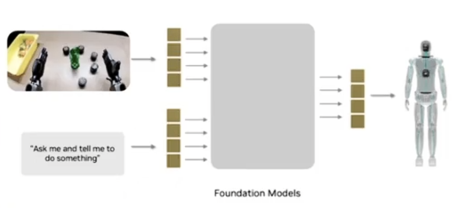
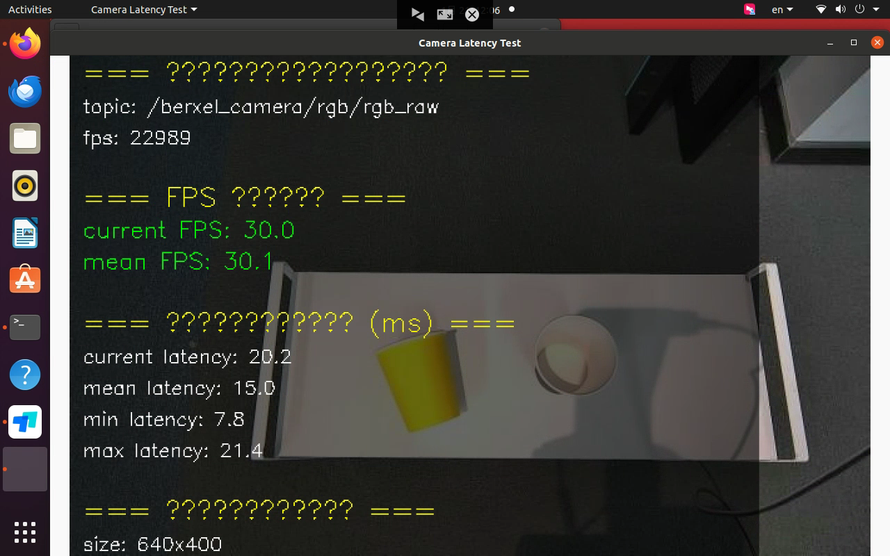
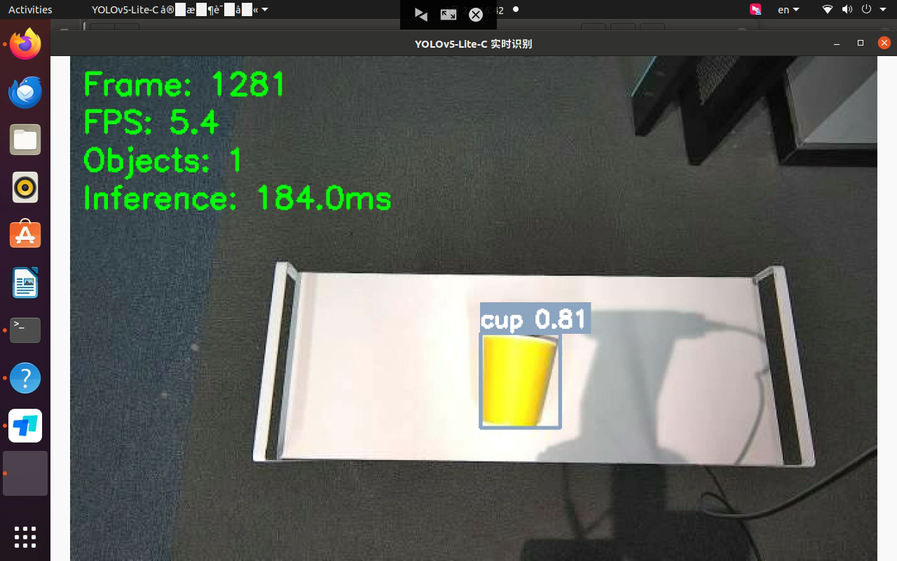

# 大任务：展厅机器人


## 4月24日

任务：

1. 在Isaac Sim中实现宇树科技机器人G1的独立行走，并搭配大模型进行语音交互


具体做法：

1. 打开isaac sim并查看到渲染到的仿真软件画面
2. 添加G1机器人


强化学习的基本框架：马尔科夫决策过程

在这个决策过程中，学习与决策者被称为**智能体**，与智能体进行交互的被称为**环境**， 智能体与环境不断地进行交互，而这一交互可以看作是多个时刻，每一时刻，智能体都会根据环境的状态，并依据一定的**策略**来选择一个动作（这里的策略指的是从环境状态到智能体的动作或者智能体的动作概率的<u>映射</u>，通过映射能决定获得奖励最大的动作），然后环境依据一定的**状态转移**概率转移到下一个状态，与此同时根据此时智能体的状态来给予智能体一个**奖励**。而智能体可以通过环境的反馈调整其策略，然后继续在环境中探索，最终学习到一个能够获得最多奖励的最优策略


为什么强化学习需要符合马尔科夫特性呢，因为在场景中，场景的状态变化概率是不确定的，只有符合马尔科夫特性，智能体才能从不断变换的环境中学习到环境变化的规律，并通过环境变换的规律，以及当前的状态，推断出下一步的状态，从而方便智能体在训练过程中清晰地推理出每一步的状态变化	


问题：强化学习与Isaac Lab的配合所需要的东西讲的很清楚，但是具体怎么使用，以及训练启动怎么做到的没有讲清楚，就比如说导入了一个机器人，我到底是怎么进行控制呢？是通过强化学习训练出来的模型进行控制呢，还是直接通过关节控制呢？


你没搞懂什么：

1. 这个工作具体的步骤

   * 首先找到Humanoid的对应的运行的Extension python代码文件

   * 并将其中加载的usd文件更改成G1的
   * 更改完毕过后想办法训练一个G1的自主决策强化学习模型
   * 训练完毕过后将h1.py文件中的h1.pt权重更换为刚才训练好的权重文件
   * 尝试进行运行实例，并通过扩展来实现指定的按键控制G1进行行走

   

2. 怎么样在isaacsim中载入G1以及场景

3. 怎么在IsaacSim中部署大模型并进行语音交互


先获取pt文件，然后将策略文件直接部署到默认的humanoid实例里面去，然后让G1能够自主的站立以及行走

然后使用python文件进行扩展，调用大模型接口，接受语音指令，让G1能够行走到指定的长度等等指令


遇到了constants.pkl找不到的错误：

可能性：

1. 加载的模型框架与加载的权重文件并不相同，无法将参数安进去 ×

1. 真的没有constants.pkl文件


## 4月27日


部署大模型接口，应用扩展，对机器人进行控制

具体的控制指令是什么?

是在终端上面进行大模型调用控制吗？

要怎么样进行扩展控制呢？

先使用大模型输出功能，通过输出功能来作为机器人的观察指令进而控制机器人的运动，具体做法是：通过相机的图片输入到大模型中，让大模型进行视觉识别，并控制


扩展接口要怎么写呢，具体的作用怎么定义呢？

1. 扩展接口我们可以通过在扩展中写入一个文件
   * 首先找到实例的extension文件夹
   * 在extension的BaseSample类的指定文件中，我们需要调用大模型控制类

2. 在这个文件中定义大语言模型控制类，这个类中我们通过指定的语言指令，让大语言模型输出指定的指令，然后这个指令对机器人进行控制、
   * 在实例的extension文件夹中，添加一个文件，在这个文件中定义大模型调用控制类
   * 在控制类里面进行抽象：
     * 首先这个调用大模型类需要做的是：
       * 初始化控制类，并实例化大模型调用接口，以及所需要的参数
       * 定义调用接口函数：通过调用接口将我们需要的内容输入给大模型，大模型给出回复
       * 处理回复，将回复处理成具体的机器人控制指令，并返回具体控制指令（通过这个控制指令，我们能够在Extension实例中进行实例化大模型类，并对大模型进行调用以及根据指定的指令获取对应的控制指令，并传输给机器人控制器）

2. 这个指令可以通过创建一个指令处理对象进行算法处理，并输出给控制器，进而控制机器人


## 4月28

1. 扩展转换为独立应用
   * 独立的扩展应该怎么做？（暂缓）
     * 查一下独立扩展的基本样例：
     * 调用所有的资产
     * 先将大模型接口控制程序样例跑通

2. 调通之后再做决策模型
   * 为什么决策模型输出有点问题？
     * 输入obs的问题
     * pre_action的问题？
     * 和默认的机器人初始化参数有没有关系呢？ 可能有关系、
     * 和机器人的关节传参有关系吗？找一下具体的关节传参的具体实现方法，
       * 貌似有点关系，好像是通过direct和action两种不同的传值方式进行传值的，需要看一下之间有什么区别？


问题：为什么会出现添加扩展过后就会导致没有hello world以及其他的示例文件系统呢？

这是因为如果直接在扩展文件夹里面加的话会破坏扩展的文件架构，如果要增加扩展功能包，则应该在扩展文件夹里面添加scripts文件夹，并在文件夹里面创建一个\_\_init\_\_.py文件，将其作为包，并在包里面进行功能扩展

并且注意：扩展的文件需要在扩展文件的根文件夹下的\_\_init\_\_.py文件中声明包里面的扩展文件，不然可能找不到包


## 4月29日

任务：

看模型的训练出来的action的具体的部位参数，和部署所使用的具体的部位参数


要怎么看？

我觉得是八大要素中的actionscfg参数非常关键，具体因为他的正则表达式匹配的问题

1. 我们需要知道action所控制的关节的所有顺序以及names
2. 我们需要知道我们在进行部署的时候action控制的关节的顺序以及names列表
3. 通过对比来查看是不是关节传值位置参数的问题


['torso_joint', 'left_shoulder_pitch_joint', 'right_shoulder_pitch_joint', 'left_hip_pitch_joint', 'right_hip_pitch_joint', 'left_shoulder_roll_joint', 'right_shoulder_roll_joint', 'left_hip_roll_joint', 'right_hip_roll_joint', 'left_shoulder_yaw_joint', 'right_shoulder_yaw_joint', 'left_hip_yaw_joint', 'right_hip_yaw_joint', 'left_elbow_pitch_joint', 'right_elbow_pitch_joint', 'left_knee_joint', 'right_knee_joint', 'left_elbow_roll_joint', 'right_elbow_roll_joint', 'left_ankle_pitch_joint', 'right_ankle_pitch_joint', 'left_ankle_roll_joint', 'right_ankle_roll_joint', 'left_five_joint', 'left_three_joint', 'left_zero_joint', 'right_five_joint', 'right_three_joint', 'right_zero_joint', 'left_six_joint', 'left_four_joint', 'left_one_joint', 'right_six_joint', 'right_four_joint', 'right_one_joint', 'left_two_joint', 'right_two_joint']

他是通过这些列表视图对关节直接进行位置控制

还有什么问题？


## 4月30日

初始的姿态是没有问题的，是模型的问题，难道还是这个输入action值的问题吗？

如果真的是这个action值的问题你后面要怎么改呢

应该是模型的问题？

要么还是模型的action输出问题，要么就还是模型问题

我觉得还是action输出传入给关节的问题，不然不可能会是这样的动作


## 5月6日

这个星期要完成sim2sim的任务，使得G1能够在isaac sim中独立行走并能够通过大模型进行控制


今天是什么问题，对比了它的具体输出以及obs输入，发现并没有问题，认为主要问题出现在了env.step\(action\)与Articulation关节控制器之间的差别中，还有可能就是物理引擎没有跟上，可能缺少了重力补偿

调整过后发现有一点点效果，但是依旧站不住

然后开始调整他的\_scale\_参数，并调整他的预测速度，依旧不行

开始设想，

* 假如模型没有问题，那是不是仿真环境的问题呢？


* 假如模型有问题，那是不是模型根本就没有学习到东西，或者说模型根本就已经过拟合了呢？

​	具体做法：然后重新对模型权重进行转换，使用的是1000轮的模型权重，如果模型权重没有问题，即有可能是过拟合，如果还是有问题，或者更加糟糕，则认为模型根本没有学习到东西，依旧满是瑕疵		

​		结果：现象相似，因此可以延申为，模型学到了，可能是obs的问题

​	具体做法：修改模型训练的初始robot加载位置，并调整最大的迭代次数，然后重新开始尝试训练新的模型


遇到的问题


## 5月7日

问题：

1. 初始位置的问题，可能一开始就position已经有问题了

具体任务：还是对比一下play和我们自己的扩展之间有什么区别，

​	模型应该是没有问题了的，还是play的问题，为什么play的现象就是和我自己的扩展会有区别呢？


我现在要找什么

怎么看官网的示例


在看底层的play的时候发现可能所有都是理想状态下的，因为他都是直接将joint_position位置数据直接上传，当进行scene.step的时候再移动到指定的位置

不是，它同样是使用articulation进行控制的，你可能搞错了，SingleArticulation与直接使用Articualtion进行控制有什么区别，不可能就因为这个就导致会出错啊

要么就是关节的索引值问题，就是关节控制索引值


## 5月8日

 有什么问题呢，首先就是由于joint_index的错误，可能导致的初始化位置的加载也会出错，导致某个关节初始位置的错误
 还有就是因为joint_index的错误，导致了action传值的错误，进而越来越错误
 所以我需要怎么做，就是找到为什么会出现这样的index错误

具体做法：

* 先找找看初始化的时候的传值问题，然后就是传值过后的index分配问题

* 具体应该查看一下关节控制器的初始化以及实例化，从初始化中找到index分配错误的问题

做的时候的问题：

* play的时候是如何进行默认位置的传递的？

* 他的cfg传给ManagerBase具体是怎么样传的，又具体是怎么样获取joint_ids的呢，和我们的实例使用的传递方式有什么不一样，为什么会出现这两种实例化方式获得的joint_ids不一样，
* 是不是joint_ids不一样最后的default_position也会和原来预想要的不一样呢？


要做什么：

1. 将G1的独立行走的扩展转换为独立程序（归档）
2. 将大模型加到独立程序中，使得它能够根据设置好的路线自动行走过去，并执行相应的交互
3. 将isaaclab的模型训练转换为扩展，即独立出来isaaclab之外进行强化模型的训练
   * 使用isaaclabextensionTemplate为模板就能进行扩展了


## 5月9日

问题：如果遇到了ssh失败提示Permission denied,please try again

解决办法，将C:/user/.ssh/known_hosts.old的所有有关对应ip服务器的所有指纹密钥全部删除，重新使用vscode连接即可，

也可以使用：[VScode连接服务器报错Permission denied,please try again解决方案_vscode permission denied, please try again.-CSDN博客](https://blog.csdn.net/liubang00001/article/details/139564472)


问题：编写Standalone app仿真程序的时候遇到ModuleNotFoundError: No module named 'omni.isaac'这样的错误

解决办法：程序必须要运行在SimulationApp函数后面，这是因为SimulationApp\(\)是Isaac Sim的入口函数，它会：

* 启动kit引擎（负责渲染、物理、USD管理等等）
* 动态加载Python的扩展模块


问题：导包错误，无法导入自己编写的功能包程序

解决办法：从当前文件夹的scripts文件夹中加载python scripts的话可以直接使用

```python
from scripts.G1_Chat import G1_Chat
```


## 5月12日

### 早上：

将训练扩展部分尽快搞定，移植完毕过后进行git提交到指定的地方	 done


### 下午：

写demo大纲，帮助编写文档

具体要求：


## 5月13日

### 早上：


1. 编写URDF转为USD文件

具体思路：

* 介绍USD文件
* 为什么需要使用usd文件
* 具体的转换方式是什么？
* 转换过后的检查方式好像由于usd是二进制文件，所以应该怎么样进行检查呢？

### 下午

2. 创建isaac lab扩展、验证

学习到的东西：


URDF的层次结构以及动力学树
URDF文件里，就像XML一样，link 通过 joint 按一定的层次一个个联系在一起。 joint 通过 parent-child 关系把上下 link 联系起来，parent link可以同时作为其他 link 的child link，而child link也可以同时作为其他link的parent link，举例：

```
<parent> and <child> Joint Elements
<robot name = "linkage">
	<joint name = "joint A ... >
		<parent link = "link A" />
		<child link = "link B" />
	</joint>
	<joint name = "joint B ... >
		<parent link = "link A" />
		<child link = "link C" />
	</joint>
	<joint name = "joint C ... >
		<parent link = "link C" />
		<child link = "link D" />
	</joint>
</robot>

```

上述URDF语法建立了一个这样的连杆模型：

连杆A通过关节A连接着连杆B，连杆A是父连杆
连杆C通过关节B连接着连杆A，连杆A是父连杆
连杆D通过关节C连接着连杆C，连杆C是父连杆
我们可以通过connectivity graph来展示 link 之间的从属和连接关系，用圆代表link，箭头代表joint，joint 从 parent link流出，指向child link，于是上述URDF文件可以用图表示为：


描述好关系之后，一个加上上面所说的物理和外表属性，一个完整的机器人 URDF 模型就建立好了。


## 5月14日


### 上午：

完成第二篇

开始编写第三篇


|            name            | ids  |          name          | ids  |
| :------------------------: | :--: | :--------------------: | :--: |
|    left_hip_pitch_joint    |  0   |  eft_ankle_roll_joint  |  19  |
|   right_hip_pitch_joint    |  1   | right_ankle_roll_joint |  20  |
|        torso_joint         |  2   | left_elbow_roll_joint  |  21  |
|    left_hip_roll_joint     |  3   | right_elbow_roll_joint |  22  |
|    right_hip_roll_joint    |  4   |    left_five_joint     |  23  |
| left_shoulder_pitch_joint  |  5   |    left_three_joint    |  24  |
| right_shoulder_pitch_joint |  6   |    left_zero_joint     |  25  |
|     left_hip_yaw_joint     |  7   |    right_five_joint    |  26  |
|    right_hip_yaw_joint     |  8   |   right_three_joint    |  27  |
|  left_shoulder_roll_joint  |  9   |    right_zero_joint    |  28  |
| right_shoulder_roll_joint  |  10  |     left_six_joint     |  29  |
|      left_knee_joint       |  11  |    left_four_joint     |  30  |
|      right_knee_joint      |  12  |     left_one_joint     |  31  |
|  left_shoulder_yaw_joint   |  13  |    right_six_joint     |  32  |
|  right_shoulder_yaw_joint  |  14  |    right_four_joint    |  33  |
|   left_ankle_pitch_joint   |  15  |    right_one_joint     |  34  |
|  right_ankle_pitch_joint   |  16  |     left_two_joint     |  35  |
|   left_elbow_pitch_joint   |  17  |    right_two_joint]    |  36  |
|  right_elbow_pitch_joint   |  18  |                        |      |


## 5月15日

具体优化的内容思路：

1. 捋清楚整个案例的顺序
2. 案例的衔接细节优化
3. 步骤应该进一步分点，以及步骤的内容的划分应该清晰
4. 简介标题的意义说明
5. 8.3的具体的逻辑顺序说明
6. 具体的文件路径应该使用绝对路径
7. 操作步骤也应该分点，同时每个分点要有简介标题
8. 执行play的命令需要说明具体的参数细节
9. 将需要的图片放到指定的位置(下面)
10. 说明具体的文件夹的具体作用
11. 在8.3章开始前添加承上启下的过渡部分
12. 内容应该与标题齐头


## 5月16日

### 上午：

1. 整体项目的简单介绍	（done）
2. 介绍以下urdf文件的具体格式内容
3. 8.1里面的为什么要使用urdf转usd这个功能，
4. 


具体问题：

1. git如何将仓库中的内容保存，但是进行更新部分文件内容呢？

可以使用git pull将远程的代码与本地代码进行同步，并将新的内容替换到仓库的原程序中，同时保存到本地


## 5月19日

1. 将G1_Standalone程序重新改进一下


## 5月20日

1. 将X1机器人单机械臂的运动控制放到Isaac Sim仿真中，具体是需要写机械臂的运动控制算法
   1. 怎么样进行新建一个扩展
   2. 和英杰了解一下具体是怎么样使用ros2进行控制？
   3. 如何在扩展中进行运动算法的扩展
   4. 运动控制算法有什么，应该怎么写，大概的思路是什么
   5. 怎么样在扩展中导入X1机器人，并对单机械臂进行控制？

2. 将扩展好的发给同事


问题：

1. #### refusing to merge unrelated histories

​	解决办法：[refusing to merge unrelated histories的解决方案（本地/远程）综合-CSDN博客](https://blog.csdn.net/junruitian/article/details/88361895)

```
解决：
 
git pull origin dev --allow-unrelated-histories

以上是将远程仓库的文件拉取到本地仓库了。 
紧接着将本地仓库的提交推送到远程github仓库上，使用的命令是：
 
$ git push <远程主机名> <本地分支名>:<远程分支名>
也就是
$git push origin master:master
提交成功。
```


### 下午

1. 怎么样将X1机器人加载到isaacsim中，并使用Articulation关节控制器进行控制？

​	整体的逻辑顺序：	

* 通过使用ros2给isaac sim进行发送具体的话题，

* isaacsim的actionGraph发送具体的话题，actionGraph


2. 能控制之后怎样进行机械臂控制规划，具体含有的步骤是什么？

​	

3. 机械臂控制具体包含什么东西？
   


问题：

1. actionGraph在做什么？
2. 官网的整体的资产导入以及aciton graph是怎么搞得
3. 


1. 现在建立一个ros2容器，然后将X1的ros2环境放进去然后跑数字孪生
2. 先跑通暨南大学的数字孪生
3. 使用


## 5月21日

### 早上

1. 将暨南大学的ros2控制机械臂案例跑通


问题：

1. 为什么跑了他的pubulisher程序之后，X1无法在仿真中执行相应的动作？

应该是并没有将isaac sim的环境配置好，导致出现了action graph中的组件找不到的情况

2. 按照官网的顺序配置完毕ros2_bridge过后遇到了 Error getting RMW implementation identifier / RMW implementation not installed (expected identifier of 'rmw_fastrtps_cpp'), with error message 'failed to load shared library 'librmw_fastrtps_cpp.so' due to dlopen error: librmw_fastrtps_cpp.so: cannot open shared object file: No such file or directory, at /workspace/humble_ws/src/rcutils/src/shared_library.c:99, at /workspace/humble_ws/src/rmw_implementation/src/functions.cpp:65', exiting with 1., at /workspace/humble_ws/src/rcl/rcl/src/rcl/rmw_implementation_identifier_check.c:139找不到这个文件

这是因为环境配置还没有配置好


2. 配置好后需要确定ros2 bridge正常建立启动，并且通过fastdds.xml文件实现了基本的通信而没有报错


## 5月22日

1. 实现数字孪生（done）
2. 将李满同学的实例跑通（done）
3. 判断为啥孪生出来的效果不一样


数字孪生是什么：数字孪生可以说是一种机器人调试方式，通过仿真与现实的一起运行，看他们之间的不同，如下图的设计方案


问题：

1. ROS编写python文件过后需要进行编译吗？

并不需要，只需要给python文件给予相应的权限即可，其他的CMakeLists.txt文件的具体配置并不需要更改

但是其他的如C++之类的文件则需要进行编译，并且需要在CMakeLists.txt文件中进行配置相应的依赖等等操作


新建虚拟环境：python3 -m venv myenv

进入虚拟环境： source myenv/bin/activate

退出虚拟环境：deactivate

拒绝参考：

重新安装python3.10[ubuntu 一键安装python3.10和pip3.10_ubuntu python3.10-CSDN博客](https://blog.csdn.net/qq_45206551/article/details/137147979)

更换python版本[已创建的虚拟环境更改python版本_mob64ca12eea322的技术博客_51CTO博客](https://blog.51cto.com/u_16213424/13090084)

编译时出现没有catkin_pkg模块：[ROS包编译报错 No module named catkin_pkg.package_importerror: no module namedcatkin pkg.packages-CSDN博客](https://blog.csdn.net/qq_39779233/article/details/107446258)

修改默认使用的python版本：sudo ln -sf /usr/bin/python3.10 /usr/bin/python3

切换回去sudo ln -sf /usr/bin/python3.8 /usr/bin/python3


## 5月23日

编写X1仿真机械臂路劲规划算法，实现与大象机器人的send_angles相同的功能

* 运动策略算法
* 路径规划器
* 运动学解算器

官方示例：

```
import numpy as np
import os

from isaacsim.core.utils.extensions import get_extension_path_from_name
from isaacsim.core.utils.stage import add_reference_to_stage
from isaacsim.core.prims import Articulation
from isaacsim.core.utils.nucleus import get_assets_root_path
from isaacsim.core.api.objects.cuboid import VisualCuboid
from isaacsim.core.prims import XFormPrim
from isaacsim.core.utils.numpy.rotations import euler_angles_to_quats, quats_to_rot_matrices
from isaacsim.core.utils.distance_metrics import rotational_distance_angle

from isaacsim.robot_motion.motion_generation import PathPlannerVisualizer
from isaacsim.robot_motion.motion_generation.lula import RRT
from isaacsim.robot_motion.motion_generation import interface_config_loader

class FrankaRrtExample():
    def __init__(self):
        self._rrt = None
        self._path_planner_visualizer = None
        self._plan = []

        self._articulation = None
        self._target = None
        self._target_position = None

        self._frame_counter = 0

    def load_example_assets(self):
        # Add the Franka and target to the stage
        # The position in which things are loaded is also the position in which they

        robot_prim_path = "/panda"
        path_to_robot_usd = get_assets_root_path() + "/Isaac/Robots/Franka/franka.usd"

        add_reference_to_stage(path_to_robot_usd, robot_prim_path)
        self._articulation = Articulation(robot_prim_path)

        add_reference_to_stage(get_assets_root_path() + "/Isaac/Props/UIElements/frame_prim.usd", "/World/target")
        self._target = XFormPrim("/World/target", scale=[.04,.04,.04])
        self._target.set_default_state(np.array([.45, .5, .7]),euler_angles_to_quats([3*np.pi/4, 0, np.pi]))

        self._obstacle = VisualCuboid("/World/Wall", position = np.array([.3,.6,.6]), size = 1.0, scale = np.array([.1,.4,.4]))

        # Return assets that were added to the stage so that they can be registered with the core.World
        return self._articulation, self._target

    def setup(self):
        # Lula config files for supported robots are stored in the motion_generation extension under
        # "/path_planner_configs" and "/motion_policy_configs"
        mg_extension_path = get_extension_path_from_name("isaacsim.robot_motion.motion_generation")
        rmp_config_dir = os.path.join(mg_extension_path, "motion_policy_configs")
        rrt_config_dir = os.path.join(mg_extension_path, "path_planner_configs")

        #Initialize an RRT object
        self._rrt = RRT(
            robot_description_path = rmp_config_dir + "/franka/rmpflow/robot_descriptor.yaml",
            urdf_path = rmp_config_dir + "/franka/lula_franka_gen.urdf",
            rrt_config_path = rrt_config_dir + "/franka/rrt/franka_planner_config.yaml",
            end_effector_frame_name = "right_gripper"
        )

        # RRT for supported robots can also be loaded with a simpler equivalent:
        # rrt_config = interface_config_loader.load_supported_path_planner_config("Franka", "RRT")
        # self._rrt = RRT(**rrt_confg)

        self._rrt.add_obstacle(self._obstacle)

        # Set the maximum number of iterations of RRT to prevent it from blocking Isaac Sim for
        # too long.
        self._rrt.set_max_iterations(5000)

        # Use the PathPlannerVisualizer wrapper to generate a trajectory of ArticulationActions
        self._path_planner_visualizer = PathPlannerVisualizer(self._articulation, self._rrt)

        self.reset()

    def update(self, step: float):
        current_target_translation, current_target_orientation = self._target.get_world_pose()
        current_target_rotation = quats_to_rot_matrices(current_target_orientation)

        translation_distance = np.linalg.norm(self._target_translation - current_target_translation)
        rotation_distance = rotational_distance_angle(current_target_rotation, self._target_rotation)
        target_moved = translation_distance > 0.01 or rotation_distance > 0.01

        if (self._frame_counter % 60 == 0 and target_moved):
            # Replan every 60 frames if the target has moved
            self._rrt.set_end_effector_target(current_target_translation, current_target_orientation)
            self._rrt.update_world()
            self._plan = self._path_planner_visualizer.compute_plan_as_articulation_actions(max_cspace_dist=.01)

            self._target_translation = current_target_translation
            self._target_rotation = current_target_rotation

        if self._plan:
            action = self._plan.pop(0)
            self._articulation.apply_action(action)

        self._frame_counter += 1

    def reset(self):
        self._target_translation = np.zeros(3)
        self._target_rotation = np.eye(3)
        self._frame_counter = 0
        self._plan = []
```

get_assets_root_path\(\) = /workspace/isaaclab/_isaac_sim/isaacsim_assets/Assets/

default_asset_root = '/isaac-sim/isaacsim_assets/Assets/Isaac/4.5'

/workspace/isaaclab/_isaac_sim/isaacsim_assets/Assets/Isaac/4.5/Isaac/Props/UIElements/frame_prim.usd


根据这样看下来，看来是Nvidia直接已经实现了RRT算法，只要我们初始化好它，然后配置好相应的参数，并且通过发送原始点和目标点的位置，就能进行路劲规划


运动规划包含有：1. 路径规划：路径规划是找到一系列需要经过的路径点，它的目的是使得路径与障碍物尽可能远的同时路径的长度尽可能地短

​				2. 轨迹规划：轨迹则是找到一段时间点内具体时间点要到达的路径点，它的目的是让机器人关节在关节空间内的工作时间尽可能短，或者能量消耗尽可能低（运行时间尽可能短，除了路径最短，还要考虑速度最优等问题）

运动控制：是主要解决如何控制系统准确跟踪指令的轨迹的问题，即对于给定的指令轨迹，选择适合的控制算法和参数，


规划与控制并不相同，

**规划**具体做的是让机械臂如何流畅优雅、不会碰到障碍地移动到指定的路径

**控制**具体做的是让机械臂准确地跟着规划好的路径，使用更好的算法来进行电机控制，完成前面的指令


robot_description.yaml机器人描述文件具体是怎么样进行获取的？

具体的教程网站：[Lula 机器人描述和 XRDF 编辑器 — Isaac Sim 文档](https://docs.isaacsim.omniverse.nvidia.com/latest/manipulators/manipulators_robot_description_editor.html#isaac-sim-app-tutorial-motion-generation-robot-description-editor)


Robot description file包含什么？

机器人描述文件是使用所有lula算法所需要的主要的配置文件，它与机器人URDF一起被需要

创建机器人描述文件的一个关节步骤是定义robot c-space，

Lula下次再搞吧


问题

1. 什么是RmpFlow


工作内容：

理解一下isaaclab的5个扩展的具体作用，以及内容，下周用于编写isaaclab源码的文档


## 5月26日

报错：docker: Error response from daemon: failed to create task for container: failed to create shim task: OCI runtime create failed: runc create failed: unable to start container process: error during container init: error mounting "/home/turing/.Xauthority" to rootfs at "/root/.Xauthority": create mountpoint for /root/.Xauthority mount: cannot create subdirectories in "/var/lib/docker/overlay2/5b9539d9f95486e8aa08da4e750428c7da5b897f5c778941f9f75176c474dc3f/merged/root/.Xauthority": not a directory: unknown: Are you trying to mount a directory onto a file (or vice-versa)? Check if the specified host path exists and is the expected type

解决办法：他说哪个不是文件夹，就将对应的文件夹删掉并新建一个与他相同名字的文件即可

具体完整的案例，硬件、介绍、训练、部署、

1.硬件介绍（官网已有）

2.29自由度适配（需要重点配置，会有参考案例）或12自由度+传统控制算法（需要自己去实现）

3.模型的训练与部署（官网已有）


## 5月27日

1. 在宇树科技官网了解G1机器人的整体的结构，了解各个自由度的作用，以及G1机器人的其他结构参数

2. 下午将第一部分的硬件介绍整体写出来，
3. 

dof表示的是关节自由度


接下来就可以编写如何在实机中进行部署

实机部署的具体方法是什么：实际部署的具体方法就是，具体教程网址：[unitree_rl_gym/deploy/deploy_real/README.zh.md at main · unitreerobotics/unitree_rl_gym](https://github.com/unitreerobotics/unitree_rl_gym/blob/main/deploy/deploy_real/README.zh.md)

1. 启动机器人，在吊装状态下启动，并等待进入`零力矩模式`

2. 进入调试模式，`L2+R2`

3. ssh连接机器人

4. 将训练好的决策policy模型放到机器人内，并将g1.yaml文件中的policy_path中的文件地址更改为传入进去的文件路径地址

5. 使用python deploy_real.py 网卡名 g1.yaml

   ```
   python deploy_real.py {net_interface} {config_name}
   
   * net_interface: 为连接机器人的网卡的名字，例如enp3s0
   * config_name: 配置文件的文件名。配置文件会在 deploy/deploy_real/configs/ 下查找， 例如g1.yaml, h1.yaml, h1_2.yaml。
   ```

6. 在零力矩状态下，按下遥控器上的`start`按键，让机器人运动都默认的关节位置状态

7. 到达默认关节位置过后就可以慢慢放下吊装机构，让机器人的脚与地面接触

8. 按下`A`键，机器人就会原地踏步，然后就能开始使用摇杆移动

 左摇杆的前后，控制机器人的x方向的运动速度 左摇杆的左右，控制机器人的y方向的运动速度 右摇杆的左右，控制机器人的偏航角yaw的运动速度

9. 在运动模式下，按下遥控器上的`select`按键，机器人就会进入阻尼模式倒下，程序将推出，或者可以在终端中使用`ctrl+c`按键进行关闭程序

其中g1.yaml配置文件的具体的脚本内容为：

[unitree_rl_gym/deploy/deploy_real/configs/g1.yaml at main · unitreerobotics/unitree_rl_gym](https://github.com/unitreerobotics/unitree_rl_gym/blob/main/deploy/deploy_real/configs/g1.yaml)


为什么sim中能够直接使用的policy决策模型在real中也能直接部署使用？

闭环控制是什么？

开环控制是什么？

不同的关节自由度的八大要素等配置文件应该如何配置？


我到底需要配置什么东西？

1. 指令（Commands）
2. 动作（Actions）
3. 奖励（Rewards）
4. 观察值（Observations）
5. 终止条件（Terminations）
6. 场景（Scene）
7. 事件（Event）
8. 课程（Curriculums）


如何训练一个12dof的策略模型呢？


## 5月29日

如何训练出一个29dof的决策模型？

1. 首先去看看官方的部署仓库文件的模型训练部分，看看他们的训练逻辑顺序
2. 看看任务注册（done）
3. 看看最终参数是如何读取的，还有具体使用的参数（done）

4.  对比参数配置，并对原本的训练程序进行修改，（找到isaaclab中在哪里使用了unitree.py文件）

   unitree.py文件用在了/isaac-sim/course-content/course_data/robot/source/turing_lab_extension/turing_lab_extension/tasks/locomotion/velocity/config/g1/rough_env_cfg.pye文件中，用于加载参数

5. 总结一个具体的操作步骤，具体的值可以不做讲解，但是需要讲更改了什么


首先legged_gym中主要分为三部分

一、envs（强化学习训练的所有配置参数）

> 其中g1_env.py文件就类似于g1.py文件
>
> envs/\_\_init\_\_.py中同样进行了任务的注册以及使用的环境的配置
>
> 如果要进行训练的g1的话，该名为g1的task的task_class就是G1Robot，然后后面进行make_env的时候将会实例化g1_env.G1Robot类，作为env参数使用
>
> 然后就是train_cfg就是LegedRobotCfgPPO类即g1_config.G1RoughCfgPPO类
>
> 而env_cfg就是LeggedRobotCfg类即g1_config.G1RoughCfg

> 因此只需要对比legged_gym的参数进而修改自己的参数即可

二、scripts（强化学习的训练与预测代码）

三、utls（强化学习的读取处理参数数据的工具包）


要更换什么配置：

1. 加载的usd模型文件（done）
2. 每个关节的默认位置（done）
3. num_observations（done）
4. num_action（action输出的数量）
5. num_privileged_obs是什么具体
6. 域随机化
7. 各个关节控制的stiffness和damping（done）
8. rewards的scales（done）
9. PPO算法的强化学习模型的配置（未作更改）
10. 

### 文档中要改进的点

1. 在文档中说明为什么伟康会和我说强化学习的作用是什么呢？为什么要使用强化学习呢？

2. 说明到底提供了什么usd文件，他们之间的区别是什么？
3. 改进了什么重新更改到原本的文档中


### 存在的问题：

1. 独立程序中的预测文件存在命名问题（done）
2. 为什么说找不到turing_lab_extension? 解决办法：python -m pip install -e source/ext_template

为什么需要这样才能正常读包？

```
 ['left_hip_pitch_joint', 'right_hip_pitch_joint', 'waist_yaw_joint', 'left_hip_roll_joint', 'right_hip_roll_joint', 'waist_roll_joint', 'left_hip_yaw_joint', 'right_hip_yaw_joint', 'waist_pitch_joint', 'left_knee_joint', 'right_knee_joint', 'left_shoulder_pitch_joint', 'right_shoulder_pitch_joint', 'left_ankle_pitch_joint', 'right_ankle_pitch_joint', 'left_shoulder_roll_joint', 'right_shoulder_roll_joint', 'left_ankle_roll_joint', 'right_ankle_roll_joint', 'left_shoulder_yaw_joint', 'right_shoulder_yaw_joint', 'left_elbow_joint', 'right_elbow_joint', 'left_wrist_roll_joint', 'right_wrist_roll_joint', 'left_wrist_pitch_joint', 'right_wrist_pitch_joint', 'left_wrist_yaw_joint', 'right_wrist_yaw_joint']
```


## 5月30日

任务：

1. 编写完剩下的东西，并完善整个教程


### 问题：

1. 为什么需要用强化学习模型而不使用传统的控制算法

   强化学习的时候


你改了什么

一、关节的设置，

二、奖励值

三、碰撞事件触发的关节


## 6月3日

1. 29dof的模型训练
2. 写出全新的框架大纲，这个大纲应该按照一个这个课程的思路来进行实现

步态机器人实践案例大纲：

前面已经介绍了isaacsim与isaaclab，下面来具体的介绍一下实践案例的大纲


## 6月5日

### 项目进度

尝试直线行走补偿

加不同的奖励惩罚值来让12dof能够直行行走


华通：进行了real部署计划

靖华：12dof还没有移植完毕


部署的思路

可以让华通协助的模型的训练

确定就是12dof、然后具体的部署，

靖华：今天12dof方案写一下

华通：思考29dof和12dof的选择、以及real的具体实现方式

然后发现了一个问题：29dof无法达到指定的速度

打算直线行走问题：补偿方式，对运动特性补偿， 


## 6月6日

1. 继续完善课程文档
2. 补齐应补齐的内容
3. 了解清楚PD控制的原理


### 问题

PID算法通过误差信号控制被控量，而控制器本身就是比例、积分、微分三个环节的加和

1. 被控量是什么？

2. 开环控制是什么？

   开环控制就是在进行一个控制任务的时候，机器人移动的输出并不会反过来影响到机器人的输入，即下达一个指令，这个指令让机器人到达某个位置，而这个指令下达给机器人过后，机器人开始任务过后，这个指令就并不会重新影响机器人的输入，机器人就一直都是这个输入，没有变化，也没有微调

   单纯使用开环控制在不讲求精度的情况下是可行的，但是如果讲求精度高的情况下就会有点不合理，因为在机器人运行的过程中，并没有进行微调，如果机器人运行的环境对机器人有所影响，就会导致机器人运行的结果不符合要求

3. 闭环控制是什么？

   闭环控制就是在进行一个控制任务的时候，机器人的输入将不再是一个恒定的输入，他将会根据机器人的输出进行调整，PID就是一种闭环控制方式

4. P是什么？

   P是比例控制（Proportional Control），相当于将当前值与误差值之间的关系看成是线性的关系，它的公司的含义为：
   $$
   控制量 = P（比例）* Err（误差值）
   $$
    其中的P（比例）我们记为$K_p$，$K_p$越大，控制量与误差的比例就越大，控制的响应速度也就越快，但是在接近目标的时候，产生的震荡也越严重

5. D是什么？、

   D（Derivative）是微分算法，而在微分算法中，在进行求导的时候的公式如下：
   $$
   d(error)/dt = 速度
   $$
   此时D控制，对控制量的速度

6. I（Intergral）是积分控制，它的主要作用就是计算累计的误差误差值，并通过累计的误差值进行调整控制量，进而消除误差值，实现精准的控制


### 昨天任务回顾

华通：

靖华：


### 今日项目任务：

华通：

靖华：


## 6月9日

### 今天的任务：

在课程文档中加入对比元素，

比如：

1. 具体人形机器人相对于人体的什么结构
2. 还有为什么isaaclab而不是使用gym
3. sim2real的部署的程序逻辑，
4. 具体分点的序号

5. 为什么要进行训练一个人形步态行走的智能体
6. 将不需要的东西删除掉，只保留需要的课程文档


### 昨天任务回顾

华通：

靖华：写训练报告、29自由度的机制、从加奖励函数入手


### 今日项目任务：

华通：搞定好实机部署，确保在12号之前完成，觉得有点难，GUI发出的指令怎么去到具体的控制，方案怎么实现还不知道

靖华：继续推进强化学习的训练


## 6月10日

### 今日任务：

我这个文档的问题在哪里？内容问题在哪里？哪里没有非常仔细？

1. 捋清楚具体的sim2sim的sim部分与real之间有什么本质上的区别
2. 将环境部署的流程也写明白，分为多少步多少步等等
3. 包括sim2sim部分也要说明白具体的程序逻辑顺序，
4. sim2real的程序逻辑与sim有什么不同。。。


### 昨天任务：

华通：udp传输协议，

靖华：继续强化学习，还是直线行走的训练方式


### 今日任务：

华通：udp传输协议，今天继续完成传输脚本，指令从pyqt传出来的指令发送到部署脚本上面，

靖华：继续强化学习，还是直线行走的训练方式


理解一下这个问题的所在，要有全局观念，到底问题出在了哪里？

还是要让靖华总结一下，到底要怎么样进行调整了

### 总结

总体来说，它的直线还是以补偿的方式进行，就是让智能体自己学会补偿

然而让智能体学会补偿就不应该单纯将精力放在奖励的具体参数值，那个只是再决定这个奖励值的重要程度，我们应该去看看具体的奖励函数的设计，他奖励函数具体是怎么计算的，为什么这样计算，判定的条件是什么


## 6月11日

### 今日任务：

我这个文档的问题在哪里？内容问题在哪里？哪里没有非常仔细？

1. 捋清楚具体的sim2sim的sim部分与real之间有什么本质上的区别
2. 将环境部署的流程也写明白，分为多少步多少步等等
3. 包括sim2sim部分也要说明白具体的程序逻辑顺序，
4. sim2real的程序逻辑与sim有什么不同。。。
5. unitree_sdk2的就是DDS而不是RPC


### 昨天任务：

华通：昨天部署脚本部分就已经完成了基本的demo，包括就是udp的接收端部分

靖华：继续强化学习，还是直线行走的训练方式，去看看奖励函数怎么设计的，怎么计算的，为什么这样设计，判定的条件是什么？，然后现在已经看到具体哪个函数了？然后昨天就已经基本都看了一遍基本的奖励函数的设计，然后打算就是保留原本的奖励函数，然后我们自己再去设计一下


### 今日任务：

华通：demo再mujoco里面先大致试试，测试一下基本的功能，然后后面来看看部署到真机

靖华：分两个方向来做，然后一边是直线补偿奖励函数的设计，另一边就是去使用那个现成的网上的资源hellogod035的项目来进行验证usd文件的质量问题


### 问题：

**模型在部署之后运行之后的逻辑是什么？部署过后还有奖励值吗？这个奖励值是从哪里来的，环境会给奖励值？为什么说环境会给奖励值，环境的奖励值是怎么评估出来的。**


**做完文档之后想一下，包括以后的强化学习动作也是，想一想，和八大要素的关系，还有八大要素是怎么样决定这个动作的，如果我有新的动作应该怎么样去设计这些八大要素，还有这些要素为什么要这样进行设计，还是说其实我可以根据其他更好的算法，来进行控制，比如说我把整个机器人分为了上半身和下半身，分别进行控制，请思考出具体的通用的训练解决方法**


## 6月12日

### 今日任务：

我这个文档的问题在哪里？内容问题在哪里？哪里没有非常仔细？


### 昨天任务情况：

华通：demo再mujoco里面先大致试试，测试一下基本的功能，然后后面来看看部署到真机

任务完成情况：demo完善了，上传，mujoco


靖华：分两个方向来做，然后一边是直线补偿奖励函数的设计，另一边就是去使用那个现成的网上的资源hellogod035的项目来进行验证usd文件的质量问题

任务完成情况：奖励函数设计，gym转lab，换usd遇到了问题，奖励函数的思路，地误差的情况下难以情况，觉得依旧是比较难以实现奖励函数的设计

### 今日任务：

华通：demo完善了，上传，mujoco仿真实现，到底要在isaacsim里面部署什么

​	华通的任务就是把导航的demo与isaacsim进行验证，就不在mujoco中验证了，而验证则直接使用我们的独立程序进行仿真，让demo导航发送的command发送给unitree_rl_gym里面已经训练好的模型，进行动作决策并控制独立程序里面的G1机器人进行导航行走

靖华：1.完成验证usd质量任务

​	    2.课程？通过学习加课程的方式来进行学习走直线

​	    3. 跟进具体的训练进度


方法论，到底这些任务设计是怎么样设计的

### 问题：


## 6月13日

### 今日任务：

完成奖励函数的了解，以及奖励函数的设计的做法


### 昨天任务情况：

华通：宇树官方高层api程序设计

demo再mujoco里面先大致试试，测试一下基本的功能，然后后面来看看部署到真机

任务完成情况：demo完善了，上传，mujoco还未完成，


靖华：分两个方向来做，然后一边是直线补偿奖励函数的设计，另一边就是去使用那个现成的网上的资源hellogod035的项目来进行验证usd文件的质量问题

任务完成情况：奖励函数设计，gym转lab，换usd遇到了问题，奖励函数的思路，地误差的情况下难以情况，觉得依旧是比较难以实现奖励函数的设计

### 今日任务：

华通：demo完善了，上传，mujoco仿真实现，到底要在isaacsim里面部署什么，

​	华通的任务就是把导航的demo与isaacsim进行验证，就不在mujoco中验证了，而验证则直接使用我们的独立程序进行仿真，让demo导航发送的command发送给unitree_rl_gym里面已经训练好的模型，进行动作决策并控制独立程序里面的G1机器人进行导航行走

靖华：1.完成验证usd质量任务

​	    2.课程？通过学习加课程的方式来进行学习走直线

​	    3. 跟进具体的训练进度


方法论，到底这些任务设计是怎么样设计的

### 问题：

### git pull 遇到了问题

使用命令：git pull --no-rebase --allow-unrelated-histories origin dev


## 6月16日

### 今日任务：

1. 找出sim部署的时候为什么无法正常走起来
2. 找到怎么样让机器人能够有相应的积极性，并通过积极性这个问题来确保智能体学习的方向的正确性


### 昨天任务情况：

华通：1.宇树官方高层api程序设计

​	   2. demo完善了，上传，mujoco仿真实现，到底要在isaacsim里面部署什么，

​	华通的任务就是把导航的demo与isaacsim进行验证，就不在mujoco中验证了，而验证则直接使用我们的独立程序进行仿真，让demo导航发送的command发送给unitree_rl_gym里面已经训练好的模型，进行动作决策并控制独立程序里面的G1机器人进行导航行走

demo再mujoco里面先大致试试，测试一下基本的功能，然后后面来看看部署到真机

任务完成情况：demo完善了，上传，sim部署还没有完成


靖华：分两个方向来做，然后一边是直线补偿奖励函数的设计，另一边就是去使用那个现成的网上的资源hellogod035的项目来进行验证usd文件的质量问题

任务完成情况：奖励函数的思路，低误差的情况下难以实现，觉得依旧是比较难以实现奖励函数的设计

### 今日任务：

华通：完成宇树高层API程序的设计这周三内完成

靖华：1.完成验证usd质量任务

3. 对比了3个学习方案，开始很好，然后处于局部最优点，观测量的问题，观测量传输的，怎么发现观测量的问题，总体来说就是根本没有学习到东西

     3. 强化学习调试一下，确保的积极性，应该从最基本开始，确保他的学习方向，


方法论，到底这些任务设计是怎么样设计的，我到底要怎么样去做，完成这个任务的思路到底是什么？

### 问题：

1. mujoco的obs与sim的obs的区别在哪里呢？（!）
2. 会不会是base_height_target参数的问题呢？吧base_height_target参数决定了什么呢？
3. 高斯函数为什么能够作为奖励函数？高斯奖励函数的作用到底是什么
4. 高斯函数具体在做什么


## 6月17日

### 今日任务：

1. 找出sim部署的时候为什么无法正常走起来
2. 思考到底如何解决瘸腿走的问题呢？


### 昨天任务情况：

华通：1.完成对高层运动控制的宇树sdk

### 今日任务：

华通：完成高层运动控制的部署

靖华：1.找到瘸腿走的原因与解决办法


方法论，到底这些任务设计是怎么样设计的，我到底要怎么样去做，完成这个任务的思路到底是什么？

### 问题：

1. 瘸腿走能不能够通过使用不同训练阶段的方式来进行训练，先学会站立，再学会直线行走，再学会转弯或者侧着走


## 6月18日

### 今日任务：

1. 找出sim部署的时候为什么无法正常走起来: 速度指令可能给的太大了
2. 思考到底如何解决瘸腿走的问题呢？: 有可能是学习的顺序有问题，因为一开始是学习的侧着走，它的腿会有，或者是直走的速度不够大


### 昨天任务情况：

华通：1.完成高级SDK控制的部署

靖华：1.优化训练，但是出现了瘸腿走的现象

### 今日任务：

华通：协助进行模型训练

靖华：1.找到瘸腿走的原因与解决办法


方法论，到底这些任务设计是怎么样设计的，我到底要怎么样去做，完成这个任务的思路到底是什么？

问题：

1. 瘸腿走能不能够通过使用不同训练阶段的方式来进行训练，先学会站立，再学会直线行走，再学会转弯或者侧着走

2. 机器人的运动速度要怎么样调大一点


## 6月19日

### 今日任务：

1. 找出sim部署的时候为什么无法正常走起来: 速度指令可能给的太大了
2. 思考到底如何解决瘸腿走的问题呢？: 有可能是学习的顺序有问题，因为一开始是学习的侧着走，它的腿会有，或者是直走的速度不够大


### 昨天任务情况：

华通：1.辅助优化模型，优化gym2sim程序

靖华：1.优化训练，sim部署完毕，遇到什么问题：

### 今日任务：

华通：协助进行模型训练

靖华：

速度不符的问题

直线行走

方法论，到底这些任务设计是怎么样设计的，我到底要怎么样去做，完成这个任务的思路到底是什么？

问题：

1. 瘸腿走能不能够通过使用不同训练阶段的方式来进行训练，先学会站立，再学会直线行走，再学会转弯或者侧着走

2. 机器人的运动速度要怎么样调大一点


## 6月20日

### 今日任务：

1. 找出sim部署的时候为什么无法正常走起来：模型学习不到位
2. 思考到底如何解决瘸腿走的问题呢？: 可以看看宇树官方的训练代码找到相应的奖励值看看有没有帮助


### 昨天任务情况：

华通：1.辅助优化模型，查找一下问题，并尝试解决一下gym部署到sim的问题

靖华：1.优化训练，sim部署完毕，遇到什么问题：依旧会有偏移，在论文中发现了偏移角惩罚的概念

### 今日任务：

华通：辅助优化模型，同时学习论文，尝试找到速度不匹配的问题

靖华：今天尝试实现偏移角惩罚函数，并进行训练

**速度不符的问题**

**直线行走**

方法论，到底这些任务设计是怎么样设计的，我到底要怎么样去做，完成这个任务的思路到底是什么？


问题：

1. 我遇到了什么问题，学习强化学习算法的时候：PPO算法的旧策略采样，与新策略更新问题

   这个问题主要就是节省了样本，这个问题主要做的步骤是：

   1. 原始旧的策略与环境进行交互，并收集观察值、状态、操作、得到的奖励等等参数
   2. 使用这些旧策略收集到的数据，通过数学方法（比如重要性权重等）来计算出“如果使用旧的策略做事情，并从中学习到新的方法，使得做得比上一次做得更好（即新的策略）的优化方向在哪里”

2. 离线方法是什么：简单点来说就是旧策略在进行收集数据的时候，一次旧收集一批次的样本，而且这些样本能重复使用100次来更新新的策略的参数

3. 重要性权重这个数学方法实际上的作用就是：从预期估计中找到策略模型的更新方向，即我要达到更好的目标，我的优化方向是什么？

   1. 什么是PPO算法，它到底在做什么
      PPO算法核心就在于两个策略的使用（旧策略与新策略）：而他的具体目标就是使用旧策略的经验教新的策略，同时防止新策略学偏

      PPO算法中的Actor(演员)-Critic(评论家)这两个角色又分别扮演了不同的角色
      其中Actor(演员)将会扮演“老玩家”和“新玩家两个角色”

      > 1. 其中老玩家将会收集样本
      > 2. 新玩家根据老玩家的样本进行修改自己的动作策略，但限于PPO的Clip机制（不能改太多）
      > 3. Critic(评论家)并不会生成直接的动作，而是评估“某个动作在某个决策下的得分是多少”（即价值函数或优势函数）
      >    * 例如老玩家在样本状态（S）下选择了动作（a），此时评论家将会计算“如果新玩家去选择做a这个动作会比平均水平的操作好多少？”（优势值），并通过计算出来的值告诉新玩家这个动作值不值得学，防止新玩家误入歧途

      也就是说PPO算法就是由策略模型本体（actor）与评判工具（Critic）组成，

      类比：老玩家、新玩家和教练

      - **旧 Actor**：老玩家的操作记录（比如录像）；
      - **新 Actor**：新玩家照着录像模仿操作，但教练（PPO 的 clip）不让它乱改；
      - **Critic**：教练看完录像后点评：“这个跳跃时机很好（优势高），那个翻滚没必要（优势低）”，让新玩家重点学 “高分操作”。
      - 

4. 评论家到底是怎样进行评判的，它的依据是什么，评论家（Critic）是通过价值函数，计算“当前状态的估计价值”与“实际回报”之间的偏差，以此来衡量策略的优劣


5. PPO算法位于强化学习的那一部分？处于策略优化部分


6. 那么“当前状态的估计价值”是什么意思，他是怎么样进行计算的，“实际汇报”又是怎么样进行计算


7. 一个episode的奖励值之和的作用是什么？
   可以用来直接计算每个状态的真实回报，衡量“当前的状态有多好”
   其中一个episode表示的是一个任务从开始到结束的整个过程，而在这个过程中，将会产生许多的状态$S_t$ 
   其中时刻 1 的状态 *s*1 的回报：$G1=R2+R3+R4$；
   时刻 2 的状态 *s*2 的回报：$G2=R3+R4$。
8. 到底怎么样进行计算出估计回报
9. 四元数是什么东西


# 6月23日


# 6月24日

华通：搞语音交互部分

靖华：在sim2real之前，先在mujoco上面sim2sim跑通


12dof模型验证mujoco，

低层控制

### 3.3.1 视窗部分

| Input                                     | Result                        |
| ----------------------------------------- | ----------------------------- |
| RMB + W （鼠标右键+'W'键）                | 镜头向前平行移动              |
| RMB + S （鼠标右键+'S'键）                | 镜头向后平行移动              |
| RMB + A （鼠标右键+'A'键）                | 镜头向左平行移动              |
| RMB + D （鼠标右键+'D'键）                | 镜头向右平行移动              |
| RMB + Q （鼠标右键+'Q'键）                | 镜头向下平行移动              |
| RMB + E （鼠标右键+'E'键）                | 镜头向上平行移动              |
| Scroll Wheel（滚轮）                      | 缩放                          |
| LMB（鼠标左键）                           | 选择                          |
| ESCAPE（ESC 键）                          | 取消选择                      |
| Select + ‘F’（选择对象后按‘F’键）         | 将摄像机缩放到选定对象周围    |
| Deselect + ‘F’（没有选择任何对象按‘F’键） | 将摄像机缩放到能看到所有对象  |
| Alt + LMB （Alt + ‘左键’）                | 围绕 Viewport Center 动态观察 |
| MMB (按住鼠标中键)                        | 镜头平移                      |
| RMB (按住鼠标右键)                        | 镜头旋转                      |
| RMB (单击鼠标右键)                        | 调出菜单                      |
| Shift + H                                 | 显示/隐藏网格和 HUD 信息      |
| F7                                        | 启用和禁用 UI 的可见性        |
| F11                                       | 切换全屏模式                  |
| F10                                       | 捕获屏幕截图                  |


注意：使用任何移动命令时，按住 Shift 键可使移动速度加倍。Control 可用于将移动速度减半。


### 3.3.2 选择部分

| Input    | Result                                                       |
| -------- |  ------------------------------------------------------------ |
| Ctrl + A |  选择当前场景中的所有资源                     |
| Ctrl + I |  选择所有未选中的资源并取消选择所有已选定的资源 |
| Esc      |  取消选择当前场景中的所有资源                    |

### 3.3.3 文件操作部分

| Input    | Alternate Input | Result    |
| -------- | --------------- | --------- |
| Ctrl + S |                 | 保存文件 |
| Ctrl + O |                 | 打开文件 |


### 3.3.4 资产控制部分
| Input            | Alternate Input | Result                                  |
| ---------------- | --------------- | --------------------------------------- |
| Del              |                 | 删除所选的资产             |
| Ctrl + Shift + I |                 | 创建当前资产的实例 |
| Ctrl + D         |                 | 复制当前资产|
| Ctrl + G         |                 | 将所选资产分到资源组序列中 |
| H                |                 | 切换所选资产的可见性       |

### 3.3.5 动画控件

| Input | Alternate Input | Result                  |
| ----- | --------------- | ----------------------- |
| Space（空格键） |                 | 播放/暂停动画 |


/# 建立名为RobotsPlaying的task类对象

/# 在加载或reset场景的时候执行的操作

/ # 调用world.get_observations函数的时候的具体操作

/# 用于获取task参数的接口，该函数默认并不会自动执行，需要自行使用 BaseTask.get_params() 进行调用

/ # 定义场景reset的时候的操作，每次world.reset函数执行的时候，都将会执行该函数


# 9月10

跑通tora在Isaacsim中的程序


上午：

成功导入了TORA的urdf文件并转换为了usd文件


遇到的问题：

1. <class 'RuntimeError'> Used null prim

   问题原因：文件上传过程中损坏，导致加载失败
   解决办法：重新上传所有文件，确保没有文件是损坏的


下午：

1. 搭建好ros2环境
   遇到的问题：

   1.  ROS2 Bridge startup failed
      原因：没有配置好指定的环境变量
      解决办法：将指定的环境变量配置好： -e "LD_LIBRARY_PATH=$LD_LIBRARY_PATH:/isaac-sim/exts/isaacsim.ros2.bridge/humble/lib" \

   

2. 尝试使用ros2以及Articulation Controller来控制机器人
   这个应该怎么样做到？


# 9月11

主任务：使用一个指定的环境，然后通过另一台ros2的容器来发送指令给isaacsim，进而控制机器人底盘移动、机械臂夹爪抓取

子任务：

1. 在isaacsim里面创建一个地面环境，（已完成）

2. 创建aciton graph去接受话题或者服务数据

   1. 搞清楚tora机器人的控制逻辑，是通过什么进行控制的
      tora机器人控制底盘是通过service的方式进行控制通信的，并且service通讯方式是两个实体节点进行通讯，其中client向server发送请求，而由于service是同步的，因此client发送请求过后就会一直等待，直到接收到server发送回来的数据

   2. tora机器人在isaacsim里面的actiongraph应该怎么做?
      
   3. 我直接发送过后isaacsim接收到了之后他是怎么样进行接收，接收过后到底是怎么样进一步控制底盘？
      可以通过l_wheel_joint和r_wheel_joint就能进行控制
   
   4. 为什么tora机器人的腰部关节不能直立
   
      1. ros2中的package.xml文件的作用是什么为什么会和CMakeLists.txt文件一起使用？
         package.xml文件是描述功能包的信息以及相应的依赖等描述，比如说依赖的包、功能包的某些信息
   
   5. 为什么ros2在编写具体的服务端等代码的时候可以直接将所需要的srv文件直接以包的形式导入?
   
   6. 服务的作用是什么？
      服务能够让节点之间能够按照想要的速度去获取指定的数据，而不需要一直发送
   
   7. setup.py配置srv话题文件的顺序：
   
      1. 确保文件结构为：
   
      2. 向功能包中的setup.py文件的setup函数的data_files输入参数配置所需要编译安装的文件，具体格式为：
   
         ```
         data_files` 接收一个**列表**，列表中的每个元素是一个**元组**，格式为：
         `(安装目标路径, [源文件路径列表])
         ```
   
      3. 
   
3. 尝试用键盘发送速度指令去控制


# 9月12日

上午：

1. 整理PPT（done)
2. 跑通ROS2的程序
3. 和英杰沟通一下是怎么样进行设计的actionGraph以及具体的控制方法（看文但）


下午：

1. 跑通ros2的service样例程序

    1. ros2运行过程中程序的import不到包的问题：
        [ROS2中python引用自定义py文件(自己写的.py文件)_ros2 编写python功能包,在setup中定义文件-CSDN博客](https://blog.csdn.net/scarecrow_sun/article/details/127589380)

        1. 为什么ros2不能通过ros2 run package_name xxx.py的形式去启动某个功能节点呢？
            这是因为ros2的包管理机制要求节点通过“注册的可执行命令”来启动功能节点
        2. AMENT_PREFIX_PATH环境变量中存储的是编译好的功能包地址，让ros2能够读取到具体能使用到的功能包
        3. package.xml就是功能包的身份证，用于声明依赖
        4. setup.py文件则是python包的安装配置文件，主要用于声明模块

        

2. 编写actionGraph

    1. 问题：怎么样去配置service形式的呢？
    2. 问题：能不能通过topic的方式先去尝试控制一下呢？
    3. 


大任务：

1. 使用更多的isaacsim来进行仿真不同的机器人
2. 使用IsaacSim来仿真Paxini tora的灵巧手抓取物品


# 9月15日

任务：

1. 跑通service服务节点

    问题：

    1. 为什么python中使用到srv和msg文件的时候无法正常使用到rosidl_generate_interfaces来生成？
        这是因为srv和msg在生成出接口的时候使用的rosidl_generate_interfaces是cmake的工具，会使用到cmake，所以package.xml文件的depend不单单要有python，还要有cmake
        解决办法：将package.xml中的depend设置为下面的形式，既要有python也要有cmake

        ```xml
        <buildtool_depend>ament_cmake</buildtool_depend>
        <buildtool_depend>ament_cmake_python</buildtool_depend>
        
        <export>
            <build_type>ament_cmake</build_type>
        </export>
        ```

        
        
    2. rosidl_generate_interfaces工具传入的路径为什么不是直接的srv/*.srv文件即可？
        这是因为rosidl_generate_interfaces工具所需要传入的地址已经发生了变化，最新的格式为：
         "${PACKAGE_ROOT_DIR}:${rel_file}"
    
        
    
    3. 为什么我在编译好接口之后不能正常运行我的node文件呢？
        原因：因为build_tool是cmake，无法正常分辨出python文件并制作成可执行文件，
        解决办法：
    
        1. 去到package.xml文件
    
        2. 将buildtool_depend改成ament_python
    
        3. depend改成ament_python
    
        4. 再进行编译
    
            
    
    4. 为什么不能够直接cmake和python同时进行编译老是先使用了cmake来编译，但是并没有构建出python的接口，导致一直说找不到可执行文件
       
    
2. 构建service的actiongraph
    问题：

    1. 报错：在isaacsim中 [isaacsim.ros2.bridge.plugin] tora_control_chassis_python/srv/AgvControl does not exist or is not available in the ROS 2 environment
        原因：
        解决办法：


# 9月16日

任务：

1. 开始实现导航
2. 彻底完成底盘控制
    问题：
    1. 轮子不着地，因此没有碰撞网络

1. 

​	


# 9月17日

任务：

1. 灵巧手的控制
2. 机械臂的控制
    curobo是怎么个流程，比如说我想要传输一个机械臂的运动目标坐标，curobo是怎么样帮我进行计算，规划，每个关节的运动轨迹的？使用代码是怎么样实现的？
    整体的规划流程：
    1. 输入与环境建模：机械臂模型加载、环境场景加载
    2. 目标状态确定：确定其运动目标，可分为两种形式：关节空间目标和笛卡尔空间目标
    3. 约束条件定义：碰撞约束、运动学约束、路径平滑约束
    4. 碰撞检测：碰撞体建模、并行碰撞查询
    5. 核心运动规划求解
    6. 


# 9月18日

任务：

1. 一根灵巧手指的控制

    1. 灵巧手指的控制与一整个机械臂的控制类似，都是分别控制相应的关节，我们要怎么样进行控制？

        可以使用curobo直接进行运动规划控制每个机械手关节，进而控制整个手臂

    2. curobo能怎样进行控制灵巧手

        1. 需要添加其所需要的配置文件，如碰撞球、属性文件等等，相关的文档为：
            [curobo的整体配置新机器人方式](https://curobo.org/tutorials/1_robot_configuration.html#tut-robot-configuration)
        2. 编辑actiongraph来控制灵巧手的关节
        3. 控制手臂与灵巧手

2. 整个机械臂的控制


# 9月23日

任务：

1. 一根灵巧手指的curobo控制
    通过直接使用ros2的话题方式进行控制，而只curobo只需要接收到我们发送的service控制指令，curobo进而计算出这个控制位置指令的控制轨迹，然后通过topic的joinstate的形式发送给articulation controller
    问题：
    1. 为什么我直接使用ros2 topic给articulation 发送一个position指令的时候发送过后，ariculation控制手指的时候不受控制，到达了指定的position不会停下来
        解决办法：因为isaacsim中使用的是弧度来进行控制，而usd中则是使用角度进行控制，因此在isaacsim的actiongraph中进行控制的时候需要将角度转换为弧度再传给articulation controller
    2. 单只手指应该怎么样进行控制？


curobo的整体逻辑是什么？

1. 加载机器人参数：*curobo.util_file.load_yaml()*
2. 加载机器人所处世界参数：*curobo.geom.types.WorldConfig*
3. 初始化motiongenerator：*curobo.wrap.reacher.motion_gen.MotionGen(MotionGenConfig)*
4. 获取机械臂的零位姿（安全初始化状态）：*curobo.wrap.reacher.motion_gen.MotionGen(MotionGenConfig).get_retract_config()*
5. 初始化并配置目标位置坐标：
6. planning规划关节控制路径：curobo.wrap.reacher.motion_gen.MotionGen(MotionGenConfig).plan_single(CuroboJointState, Pose, MotionGenPlanConfig)
    同时对上面函数生成的结果使用curobo.wrap.reacher.motion_gen.MotionGen(MotionGenConfig).plan_single(CuroboJointState, Pose, MotionGenPlanConfig).get_interpolated_plan()对生成的路径进行插值处理， 形成更加平滑的控制
    最后再使用curobo.wrap.reacher.motion_gen.MotionGen(MotionGenConfig).plan_single(CuroboJointState, Pose, MotionGenPlanConfig).retime_trajectory()来优化路径计时，确保动力学的可行
7. 使用pulisher将刚生成出来的关节控制路径发送给articulation controller
8. target_update_loop：实时更新当前的关节位置(option)
9. 


# 9月24日

任务：

1. 手臂控制	(写死控制已完成，后面才进行curobo的使用来规划运动轨迹)
2. 引入到X1的场景里面并开始导航
    1. 添加雷达传感器
    2. 导入场景并确保能进行移动（done）
        [设置damping和stiffness例子](https://developer.aliyun.com/article/1592534)
    3. 
3. 引入相机


# 9月25日

会议：

1. 完成了手臂、手指的底层控制
2. 引入了x1的场景，并在车上加一个sim的激光雷达

今天要完成的是：

1. 确保导航程序能够接收到激光雷达的信号，并调试实现导航功能（暂缓）
    [创建RTX激光雷达](https://docs.isaacsim.omniverse.nvidia.com/latest/assets/usd_assets_nonvisual_sensors.html#nvidia)

2. 引入给机器人引入摄像头

    1. tora_one的摄像头是什么型号，它拍的是什么数据（深度相机，还是普通的图像数据）

    2. tora_one的摄像头有几个，分别在哪个位置？
        有五个
        两个普通相机、三个头部鱼眼相机、两个深度相机

        ​	3840x2160		3840x2160	1280x720
        [创建相机](https://docs.isaacsim.omniverse.nvidia.com/latest/sensors/isaacsim_sensors_camera.html#isaacsim-sensors-camera)

        [相机的配置](https://docs.omniverse.nvidia.com/materials-and-rendering/latest/cameras.html)

        

    3. 如何使用这些摄像头进行拍照
        [将接收到的画面发送到ros2topic中](https://blog.csdn.net/2401_83634908/article/details/149136325)

3. 在isaacsim进行拍照，并最终得到所有摄像头的图像，同时去看一下拍下来的图像的格式、分辨率、拍到啥东西


# 9月26日

会议：

1. 完成了摄像头的引入，并完成actiongraph从而实现了在rviz2里面看到摄像头的画面


今天任务：

1. 尝试跑通一个场景的任务比如说：
    1. 导航
    2. 视觉抓取
    3. 导航
    4. 放置物品
    5. 回到原点
    6. 导航与手臂
2. 手指的位置控制（不是指关节的角度控制）


# 9月28日

会议:

1. 前天正在做导航部分，然后现在的进度是因为卡在了加载地图部分，然后需要去解决一下这个问题


今天任务：

1. 跑通导航控制
    问题：

    1. 为什么加载不出来地图呢？
        因为配置文件里面发生了一点错误，一个字母错误了

    2. 连接不上x11服务
        需要在宿主机去配置$DISPLAY变量，并执行`xhost +`命令

    3. 底盘应该怎么样接收到nav2包生成出来的各个方向的速度指令呢？
        是通过geometry_msg/msg/Twist格式的cmd_vel话题进行控制底盘按照指定的速度进行运动
        
        actiongraph如下图：
        

    4. 为什么代价地图没有办法正常生成出来呢?  并且发送一个校准位置的指令没有立即校准位置，一直是静止的

    5. 为什么会报错说 tf error: Invalid frame ID "odom" passed to canTransform argument target_frame - frame does not exist？
        因为odom是需要我们在仿真中启动这个服务的，所以需要我们要使用actiongraph来启动这个odom话题
        也许解决了这个也就同时解决了上面的问题吧

        

    6. 为什么ros2的nav2功能包在进行导航的时候需要使用到tf树？tf树是什么？
        tf树是用于管理和维护多个坐标系之间的空间关系的数据结构，他以书的结构存储这些坐标系之间的转换关系
        通过这些转换坐标系，最终完成规划执行路线，并全面了解周围环境

        

    7. 为什么出现了
        
        这样的错误？
        这是因为tf树中的话题错误导致的，因为全局路径规划会依赖到map和base_link，map话题出现了错误就会导致全局路径规划的错误

        

2. 尝试使用笛卡尔坐标来控制单个手指移动，而不需要给死一个关节角度去控制

3. curobo控制手臂


# 9月29日

会议：昨天解决了地图没有加载的问题，但是tf树以及话题的数据交互之间依旧有点问题，没办法做到完全正常的运行，比如说是base_link的定位在地图中跳动

今天任务：

1. 搞清楚tf树之间的依赖关系，还有导航的话题交互逻辑

    1. 出现了map的数据比amcl早，被丢弃了的问题
        解决办法：在isaacsim中添加发送simulation clock的acitongraph

2. 搞清楚为什么base_link坐标系会一直在地图上跳动而不是固定一个位置
    原因：

    1. odom→base_link之间的tf转换未正常更新或者是map→odom的变换冲突

3. 为什么map还是会加载不进去呢？有的时候加载成功有的时候加载失败
    原因：

    1. 程序没有完全关闭，导致的地图无法被加载？（no）

        `ros2 topic echo /map_server/transition_event没有任何反应`

    2. 同时要确定map_server在RViz启动完成之后再启动

4. **map话题有点问题，导航地图没有启动**

5. local_costmap和global_costmap出现没接收到map数据的问题，但实际上有地图数据
    根本问题：

    1. scan的topic参数错误，需再navigation.yaml文件中进行更改话题为scan


# 10月9日

会议：

上周依旧是卡在了导航部分，这部分主要的问题还是有的时候没有办法正常的加载地图，然后就是tf树转换的转换数据有问题，然后paxini的手臂手指的控制部分也还没有完成，


任务：
1. 继续完成导航部分，找到问题所在

    1. 和读取的地图图片的格式有没有关系？png会不会就是导致没有办法正常读取到地图的原因呢？

        有点关系的，但是需要进一步的去测试一下，因为pgm是默认的格式，他是只有一个通道的数据，但是png是有3个通道的数据，有可能因为格式的不一样的导致最后的加载失败
        解决办法：

        1. 去将png的地图转换会pgm的格式
        2. 重新将yaml文件的数据重新生成一次
        3. 修改carter_navigation_params.yaml 文件的map_server配置是否有正常的地图
           

    2. odom和base_link之间的转换矩阵有没有问题，如果没有问题，为什么map和base_link的转换矩阵又有问题了？
        odom和base_link之间的转换矩阵是有点问题的，全是0的话明显是有问题的
        解决办法：

        1. 调整一下isaacsim中的actiongraph的发布的tf树数据，我不需要左右轮子tf数据，可以加多一点比如说是手臂，肘关节，肩关节的tf数据
        2. 重新去查看一下机器人在没动的情况下odom与base_link之间的转换矩阵是否是**单位矩阵**，而不是全零矩阵，如果是全零矩阵就真的是有问题的
        3. 在urdf中添加一个laser_link，并且发布一个**laser_link的tf数据到树中**
        4. 
           

    3. rviz2的2D Pose Estimate更改的是哪个转换矩阵？具体是怎么样进行更改的？
         2D Pose Estimate在有地图的情况下更改的实际上是map→odom之间的转换矩阵，它的主要作用还是告诉系统，当前的base_link在map中真实位置，这个真实位置是计算得来的，因为map→odom的转换矩阵已经发生了变化，但是odom→base_link之间的转换矩阵依旧是单位矩阵，最后map→base_link的转换矩阵即是base_link在map中的位置

    ​    

    4. odom坐标系不存在，原因？

        

2. 机械臂和机械手的协同控制

    1. curobo控制机械臂
    2. curobo控制左手食指
       

3. 仿真数据的获取（数据中的正方体目标再相机坐标系下的坐标）
    具体做法：

    1. 获取cube在世界坐标系的位置
    2. 世界坐标系转换为相机坐标系
    3. 看一下能不能通过actiongraph的形式将这些数据输出出来


# 10月10日

今日任务：

1. 获取西电的数据
    怎么获取：
    
2. 完成导航
3. 


# 10月13

用ai做更多的工

人给ai增效

我的工作就是调用其他人的东西（API），来做自己的东西

想想在哪一步的问题，导致慢，要怎么解决这个慢，分析问题，怎么找到根本问题

1. 大的思路可以找hh

2. 脏活累活让ai干

逻辑理清楚


# 10月15日

昨天将curobo控制机械臂的任务跑通了，然后和ai一起去调整了底盘的运动速度的参数，但是不奏效，

damping相当于减速器

stiffness相当于pd控制器

463.50113

463.53143


# 10月16日

1. 调试一下导航和机械臂控制

2. 找一下导航的原理

3. 尝试让机械臂能粗定位到物品的位置，并用元动作控制灵巧手抓取

导航原理：

1. 接收目标

2. 全局路径规划

3. 路径平滑

4. 局部路径规划，并实时跟踪路径并避障

5. amcl自定位更新位置

6. 动态调整路径

    goal_pose: 1.45 -1.0


# 10月17日

写文档，写出思路，和提示词、效果


# 10月20日

1. 机械臂没有办法到达指定的坐标：
    认为原因：坐标系的原因？
2. 相机识别不到aruco码：
    认为原因：距离问题？


# 10月21日

1. 将识别tag与机械臂控制的代码跑通
2. 将尉恒需要的数据发送给他

上午干什么？

1. 将尉恒需要的数据准备好，总结之前遇到的问题（done）
    已发送给尉恒，看尉恒会不会有新的需求和改进要求

2. 将机械臂控制的程序跑通，并且理解清楚这个控制程序的整体逻辑，同时理解清楚为什么机械臂没有办法到达我们想要到达的坐标位置？

    对比试验：看出差距是最快的方法


# 10月22日

算了算了，你还是重新给我根据curobot_left_tora.py程序来改进tora_one_two_thread_update0826.py程序，加上锁定关节，
并且我发现tora_one_two_thread_update0826.py程序有点混论，我想要让机械臂分为四步这样完成抓取物品操作，

1. 先去到指定的初始化位置即[0.79353, -0.09517, 1.09877]、[0.0, 0.9848, -0.1737, -0.0001]，并等待手臂到达位置
2. 当手臂的larm_7_joint到达指定的初始化位置后，接收/position话题和/rotation话题的数据，并对position进行抬高处理后保存为deal_position，控制机械臂的larm_7_joint到达指定的deal_position
3. 在到达指定的deal_position后，最后控制机械臂到达原position
4. 留下控制接口，让我能够嵌入灵巧手控制进行抓取物品的的程序，用于抓取物品
5. 最后抓起物品，并拿起

请帮我根据上面的内容重新改进一下当前的tora_one_two_thread_update0826.py程序


# 10月27

1. 项目编写release_note以及语义字段
2. 遇到问题卡住就：1. 找资源、 2. 分解为简单的步骤
3. 每天的代码上传到X1-smart的新分支中
4. 录好视频
5. 录好视频过后开始使用产品进行测试原动作

代号 ACT-6-1


遇到问题

1. $ git checkout tora-one
    error: pathspec 'tora-one' did not match any file(s) known to git
    这是因为远程仓库中并没有tora-one这个分支，因此需要创建一个分支
    具体步骤：
    1. `git branch tora-one`
    2. `git checkout tora-one`

整体的git上传文件流程：

1.  `git remote add origin http....`
2.  切换分支 `git branch branch_names`/ `git branch -b branch_names`
3.  添加要上传的文件`git add .`
4.  上传到中间空间中 `git commit -m 'xxxx'`
5.  `git pull origin branch_name` / `git push origin branch_name`


今天的整体流程，继续跑抓取，并改进它抓取成功率，同时添加一个控制机械臂放下物品的程序，同样和原本curobo控制相似，都是使用curobo来进行求解，

1. 优化抓取
2. 添加控制机械臂放下物品程序
3. 今天内完成录制视频任务


启动程序：

#### # 导航

启动导航程序：`ros2 laucnh carter_navigation carter_navigation.launch.py`

导航到任务点：`ros2 run isaac_tutorials nav2_goal_publisher.py --goal task`

导航到放置点：`ros2 run isaac_tutorials nav2_goal_publisher.py --goal place`、

#### # 取物

启动识别aruco码程序：`ros2 run apriltag_detect position`

执行取物四步走程序：`ros2 run isaac_tutorials tora_four_step_grasp.py`

放下物品：`ros2 topic pub --once /place_command std_msgs/msg/String "{data: 'place'}"`


# 两个容器之间创建共享卷

```
docker run -d \
 --name isaac-lab-course \
 --network host \
 --gpus all \
 -e ISAACSIM_PATH=${DOCKER_ISAACLAB_PATH}/_isaac_sim \
 -e OMNI_KIT_ALLOW_ROOT=1 \
 -e "LD_LIBRARY_PATH=$LD_LIBRARY_PATH:/isaac-sim/exts/isaacsim.ros2.bridge/humble/lib" \
 -v isaac-cache-kit-2.0.0:${DOCKER_ISAACSIM_ROOT_PATH}/kit/cache \
 -v isaac-cache-ov-2.0.0:${DOCKER_USER_HOME}/.cache/ov \
 -v isaac-cache-pip-2.0.0:${DOCKER_USER_HOME}/.cache/pip \
 -v isaac-cache-gl-2.0.0:${DOCKER_USER_HOME}/.cache/nvidia/GLCache \
 -v isaac-cache-compute-2.0.0:${DOCKER_USER_HOME}/.nv/ComputeCache \
 -v isaac-logs-2.0.0:${DOCKER_USER_HOME}/.nvidia-omniverse/logs \
 -v isaac-carb-logs-2.0.0:${DOCKER_ISAACSIM_ROOT_PATH}/kit/logs/Kit/Isaac-Sim \ 
 -v isaac-data-2.0.0:${DOCKER_USER_HOME}/.local/share/ov/data \
 -v isaac-docs-2.0.0:${DOCKER_USER_HOME}/Documents \
 --entrypoint bash \
 192.168.1.28:10443/turinginno/isaac-sim:course-0.0.9 \
 ./_isaac_sim/jupyter_notebook.sh

 docker run -d \
 --name isaac-lab-course \
 --network host \
 --gpus all \
 -e ISAACSIM_PATH=${DOCKER_ISAACLAB_PATH}/_isaac_sim \
 -e OMNI_KIT_ALLOW_ROOT=1 \
 -e "LD_LIBRARY_PATH=$LD_LIBRARY_PATH:/isaac-sim/exts/isaacsim.ros2.bridge/humble/lib" \
 -e ROS_PACKAGE_PATH=/root/humble_ws/install/share:$ROS_PACKAGE_PATH \
 -v isaac-cache-kit-2.0.0:${DOCKER_ISAACSIM_ROOT_PATH}/kit/cache \
 -v isaac-cache-ov-2.0.0:${DOCKER_USER_HOME}/.cache/ov \
 -v isaac-cache-pip-2.0.0:${DOCKER_USER_HOME}/.cache/pip \
 -v isaac-cache-gl-2.0.0:${DOCKER_USER_HOME}/.cache/nvidia/GLCache \
 -v isaac-cache-compute-2.0.0:${DOCKER_USER_HOME}/.nv/ComputeCache \
 -v isaac-logs-2.0.0:${DOCKER_USER_HOME}/.nvidia-omniverse/logs \
 -v isaac-carb-logs-2.0.0:${DOCKER_ISAACSIM_ROOT_PATH}/kit/logs/Kit/Isaac-Sim \
 -v isaac-data-2.0.0:${DOCKER_USER_HOME}/.local/share/ov/data \
 -v isaac-docs-2.0.0:${DOCKER_USER_HOME}/Documents \
 -v ros2_shared_ws:/humble_ws \
 --entrypoint bash \
 192.168.1.28:10443/turinginno/isaac-sim:course-0.0.9 \
 ./_isaac_sim/jupyter_notebook.sh


```


在主机终端执行，创建名为 "ros2_shared_ws" 的共享卷

```
docker volume create ros2_shared_ws

 docker run -d \
 --name ros2_test \
 --network host \
 --privileged \
 --device /dev/dri \
 -e NVIDIA_VISIBLE_DEVICES=all \
 -e NVIDIA_DRIVER_CAPABILITIES=all \
 -e DISPLAY=$DISPLAY \
 -e QT_X11_NO_MITSHM=1 \
 -v /tmp/.X11-unix:/tmp/.X11-unix \
 -v $HOME/.Xauthority:/root/.Xauthority \
 -v ros2_shared_ws:/shared_ws \
 --group-add video \
 192.168.1.28:10443/turinginno/isaac-ros:0.0.2 \
 tail -f /dev/null

 cp -r ~/humble_ws/* /shared_ws

 docker run -d \
 --name ros2_lastest \
 --network host \
 --privileged \
 --device /dev/dri \
 -e NVIDIA_VISIBLE_DEVICES=all \
 -e NVIDIA_DRIVER_CAPABILITIES=all \
 -e DISPLAY=$DISPLAY \
 -e QT_X11_NO_MITSHM=1 \
 -v /tmp/.X11-unix:/tmp/.X11-unix \
 -v $HOME/.Xauthority:/root/.Xauthority \
 -v ros2_shared_ws:/root/humble_ws \
 --group-add video \
 192.168.1.28:10443/turinginno/isaac-ros:0.0.2 \
 tail -f /dev/null
```

 


# 10月28日


## 任务

今天将产品应用到产品中

1. 了解整个产品的工作逻辑，以及其必要的修改内容
2. 搭建产品的运行环境
3. 将tora-one机器人运行在产品中
4. 将一个动作定义到产品中，并启动一次产品，并完整清楚整个产品的相应逻辑
5. 将所有需要的动作定义到产品中
6. 定义一个动作序列


## 知识点记录

产品的整体架构

1. 决策层
2. 调度层
3. 执行层

docker的每个service就是一个独立运行的docker容器

docker容器服务相当于docker容器
而多容器docker应用程序则相对于ros的launch启动文件，能够一件启动多个容器，并让其协同工作


元动作（原子动作）保存在 YAML配置文件中：

元动作=原子动作=基础动作


perceptor就是一个执行器，他根据接收到的任务指令，去执行指定的动作，而动作按照指定的程序进行调用其他库计算并最终执行具体的操作


动作序列（Sequence_Action）与 原子动作（atom_action）之间的关系

```
序列动作 MOVE_TO_OBJECT
    ↓ (由以下基础动作组成)
    ├── 基础动作 1: MOVETO          (移动到目标点)
    ├── 基础动作 2: CAMERA_TAKE     (拍照识别)
    ├── 基础动作 3: SEND_REQUEST    (请求轨迹规划)
    ├── 基础动作 4: ARM_MOVETO      (手臂移动)
    └── 基础动作 5: GRASP           (抓取)
```


在action-definiition.yaml文件的完整结构为：

```
Actions:                          # 根节点：所有动作定义
  SequenceAction:                 # 第1层：序列动作类别
  - id: MOVE_TO_TARGET            # 第2层：某个序列动作的ID（名称）
    atom_ations:                  # 第3层：组成这个序列的基础动作列表
    - actionId: MOVETO            # 第4层：引用某个基础动作
      action_type: ExecutionAction
      params: []
      part_id: 11
    - actionId: CAMERA_TAKE       # 第4层：引用另一个基础动作
      action_type: ExecutionAction
      params: []
      part_id: 5
    - actionId: ARM_MOVETO        # 第4层：引用又一个基础动作
      action_type: PerceptionAction
      params: [...]
      part_id: 1
      
  - id: MOVE_TO_OBJECT            # 第2层：另一个序列动作
    atom_ations:                  # 第3层：它的基础动作列表
    - actionId: SEND_REQUEST
      ...
    - actionId: GRASP
      ...
```


```
┌─────────────────────────────────────────────────────────┐
│ 添加新机器人和动作的完整流程                              │
└─────────────────────────────────────────────────────────┘
            │
            ├─ 1. 创建机器人目录和配置文件
            │    ├─ robot_config.yaml (机器人配置)
            │    ├─ action-definition.yaml (动作定义)
            │    └─ buildin_action.py (执行逻辑)
            │
            ├─ 2. 定义基础动作
            │    ├─ command_constant.py (添加常量)
            │    └─ action_lib.py (注册动作)
            │
            ├─ 3. 配置Docker挂载
            │    └─ docker-compose.yaml (添加volume)
            │
            ├─ 4. 配置通信
            │    ├─ application.yaml (指定配置路径)
            │    └─ zero_config.yaml (配置消息队列)
            │
            └─ 5. 重启系统
                 └─ docker-compose restart
```

```
原子动作 = 动作定义 + 参数配置 + 执行逻辑（程序代码）
```


```
完整通信流程示例
让我用一个具体例子说明三种通信方式如何协作：
场景：执行"抓取物体"任务
1. decision-maker创建任务
   ↓ (ZeroMQ PUSH)
2. robot-dispatch接收命令
   commandQueue: tcp://127.0.0.1:25555
   ↓ (ZeroMQ PUB-SUB)
3. perceptor接收命令
   dispatchCommand topic
   ↓
4. perceptor执行CAMERA_TAKE
   ↓ (ROS 2订阅)
5. 从Isaac Sim获取图像
   /camera/image topic
   ↓ (存储到Redis)
6. 保存图像: redis.set(image_key, image_data)
   ↓ (推送到Redis队列)
7. redis.lpush(PICTURE_ENGINE_QUEUE, task_data)
   ↓
8. 模型服务从Redis读取
   ↓ (返回结果到Redis)
9. perceptor读取识别结果
   ↓
10. perceptor执行ARM_MOVETO
   ↓ (ROS 2发布)
11. 发布关节命令到Isaac Sim
   /joint_commands topic
   ↓
12. Isaac Sim中的机器人执行动作

```


当在宿主机的/opt/robot/中 clone 了产品之后，我们就会得到上面这样的文件结构，其中
build：文件夹用于打包镜像等操作
configs：用于挂载各个服务所需要的配置文件或者是程序，对应的文件夹名字就是相应挂载的服务
log：存储产品在运行过程中的日志
docker-compose-isaac-sim.yaml：用于启动 isaacsim 仿真服务的docker-compose配置文件
docker-compose.yaml：用于启动产品的所有服务的 docker-compose 配置文件，当我们直接使用 `docker-compose up -d` 来启动产品的时候将会默认读取该文件，同时文件中的变量将会读取上面的 `.env` 文件中的定义


----


现在要进行添加新的机器人，以及相应的控制原子动作，要怎么做呢？

不理解什么：

1. 淦旭为什么会说让我将perceptor的源码clone下来呢，这有什么作用？确保更改不会影响原本的东西
2. 如果我需要使用产品，我是应该将产品安装到物理宿主机上还是哪里？物理宿主机
3. docker-compose up -d这条命令具体执行的是哪个docker-compose配置文件呢？直接默认去找docker-compose.yaml，同时在运行的时候


要干什么：

1. 清理服务器的内存
2. 尝试在下载下来的东西中跑通英杰的仿真，然后再尝试将帕西尼的弄进去
3. 尝试将配置文件以及资源挂载到相应的容器中
4. 尝试使用产品的方式跑导航
    1. 导航需要什么


# 10月29日

今天的任务：完全在产品中部署paxini机器人

1. 了解如何实现产品化的方式去使用curobo
2.  尝试使用产品的方式进行导航


问题：

percepter:

1. action-lab.py文件的作用是什么？
    action-lab.py文件中定义了原子动作的定义
2. action-definition.yaml文件是复合动作配置模板
3. command_constant.py程序则是预定义了所有可用的动作/命令的名称常量‘
4. perceptor服务在启动过后将会自动启动程序

具体操作步骤：、

[‍‌‬‌‍‌⁠‍‬⁠‌‍‬‬‍‍⁠‬硬件适配层复合动作（SequenceAction）配置与实现说明 - 飞书云文档](https://scn8ugkuwymq.feishu.cn/wiki/CMlHwo7LqiGoT3kjfyzcpFx9nKb)

1. 在 perceptor/ 文件夹中创建新的机器人配置文件夹（如 paxini-sim）
2. 在新建的机器人配置文件夹中 perceptor/paxini-sim/ 中创建 action-definition.yaml 配置文件，用于定义新的机器人的具体复合动作序列
3. 在新建的机器人配置文件 action-definition.yaml 中指定回调所使用的回调函数 （例如：robot.paxini-sim.sequence_action.SequenceAction）


curobo:

1. 在产品中，curobo服务就单纯只是一个用于提供运动规划服务的容器
2. 其中modelinvocation_curobo.py程序是运动规划服务的程序


perceptor容器无法正常启动ModuleNotFoundError: No module named 'action_lib.command_constant'

解决办法：更改perceptor/action_lib/action_lib.py文件的import action_lib.command_constant as cc变为
import constant.command_constant as cc


perceptor容器AttributeError: module 'action_lib.action_type_constant' has no attribute 'Execution_Action'. Did you mean: 'Perception_Action'?

解决办法：将所有的action_lib.py文件中的所有action_type参数删掉


无权限：

```bash
sudo chown -R l20:l20 要开通权限的文件
```


总结：

1. 今天的切入点出现了问题，就是陷入到了这个产品的细节去了，然后已经找到了正确的切入点，了解完了导入新的机器人要做的东西以及配置的内容
2. 成功跑通了英杰的那部分x1的程序，也就是环境跑起来了
3. paxini的还没有完成导入，因为产品的一些部件配置还需要找伟康他们讨论


# 10月30日

```
远程仓库（Git服务器）= 云端的代码仓库
    ├── main 分支
    ├── dev 分支
    └── g1-test-update 分支

你的电脑（本地）= 你自己的工作区
    ├── 本地分支（你实际工作的地方）
    │   ├── main
    │   ├── dev
    │   └── feature-xyz
    │
    └── 远程跟踪分支（远程分支的"镜像/快照"）
        ├── origin/main
        ├── origin/dev
        └── origin/g1-test-update
```

```
远程仓库（服务器）                你的电脑
┌─────────────────┐             ┌──────────────────────┐
│                 │             │                      │
│  main ●─●─●─●   │ git fetch   │ origin/main ●─●─●─●  │
│        远程分支  │────────────>│  远程跟踪分支         │
│                 │             │                      │
└─────────────────┘             │      ↓ git merge     │
                                │                      │
        ↑                       │  master ●─●─●        │
        │                       │     本地分支          │
        │                       │      (你工作的地方)    │
    git push                    │                      │
        │                       └──────────────────────┘
        │
   推送你的更改
```

| 命令       | 作用对象                | 是否需要网络 | 说明           |
| :--------- | :---------------------- | :----------- | :------------- |
| git add    | 工作区 → 暂存区         | ❌            | 准备提交的文件 |
| git commit | 暂存区 → 本地分支       | ❌            | 只提交到本地！ |
| git push   | 本地分支 → 远程仓库     | ✅            | 推送到服务器   |
| git fetch  | 远程仓库 → 远程跟踪分支 | ✅            | 下载远程更新   |
| git pull   | 远程仓库 → 本地分支     | ✅            | fetch + merge  |


导入新机器人的具体做法：

1. 以docker-compose.yaml 文件所以依赖的文件进行切入
    1.  Nav2.map / param	                                     (done)
    2. robot_dispatch.application.yaml                      (done)
    3. perceptor.action_definition.yaml 
        / action_lib.py 					（editing）
        / command_constant.py 
        / application.yaml					(done)
        / partinstance.yaml（重：找伟康）
    4.  isaac-sim 更新 usd 文件                                     (done)
    5.  curobo.modelinvocation_curobo.py

有什么疑问：

1. 这个 robot_config.yaml 文件中的 robot_config 选项的机器人 id 以及 parts (部件)的 id 都是可以随便设置的吗？
2. 这个部件类的定义和作用到底是什么？
3. 还有就是 perceptor 中的robot_config.py文件怎么去更新？
    1. 可以不可以通过挂载的方式一次性将所有的配置文件映射到所有容器的指定的位置以此来覆盖原有的配置文件？
        当然可以
4. 这个 action-definition.yaml 文件中的 ARM_JOINT 参数是在哪里定义的？
5. 这个 robot-dispatch 中的 engine 的作用是什么，他需要更改吗?
6. 腰部控制的原动作应该怎么定义
7. 灵巧手控制的原动作怎么定义
定义一个基类，名为 gripper 这个可以复用 arm.py 程序的代码，使用单点模式来进行传输控制的target_position


perceptor：核心层（存放基类以及各种基本实现）

perceptor-robot：适配层（根据基类衍生出各种其他的机器人）


在产品中开发新的paxini机器人的具体步骤：

1. 在产品中的核心层的 `config/` 目录下配置文件，

2. ```
    步骤 1: 选择通信方式 → 步骤 2: 创建配置文件 → 步骤 3: 实现部件类
        ↓
    步骤 4: 注册命令处理器 → 步骤 5: 编写启动脚本 
        ↓
    步骤 6: 创建基础镜像 Dockerfile → 步骤 7: 创建应用镜像 Dockerfile
        ↓
    步骤 8: 配置 CI/CD 自动构建
    ```

    

    1. 选择 ros2 通讯方式

        ```
        - `perceptor_sdk.part_lib.motor_ros.MotorROS` - ROS2 电机基类
        - `perceptor_sdk.part_lib.camera_base_ros.CameraBaseROS` - ROS2 相机基类
        - `perceptor_sdk.part_lib.chassis_ros.ChassisROS` - ROS2 底盘基类
        ```

    2. 创建配置文件 `config/robot_config.yaml`

        ```
        robot_config:
          id: 1                      # 机器人 ID（唯一）
          name: "MyRobot"           # 机器人名称
          con_type: "ROS2"          # 主通信方式（API/ROS2/DDS）
          is_enable: true           # 是否启用
        
          parts:                    # 部件列表
            - id: 1                 # 部件 ID（唯一）
              name: "motor"         # 部件名称
              type: "MOTOR"         # 部件类型（MOTOR/CAMERA/CHASSIS等）
              class_name: "robot.my_robot.motor.MyMotor"  # 部件类的完整路径
              conn_type: "ROS2"     # 部件通信方式
        
            - id: 11
              name: "camera"
              type: "CAMERA"
              class_name: "robot.my_robot.camera.MyCamera"
              conn_type: "ROS2"
              subscriptions:        # ROS2 订阅配置（ROS2 通信时需要）
                - topic: "/camera/image_raw"
                  message_type: "sensor_msgs/msg/Image"
        ```

        **配置要点**：

        - ✅ `class_name` 使用点号路径（如 `robot.g1.motors.Motors`）
        - ✅ 部件 ID 遵循约定：1-9（上肢）、11-29（相机）、31-39（下肢）、41-49（身体）、51+（特殊）
        - ✅ `conn_type` 与部件类继承的基类保持一致

    3. 根据核心层基类来具体实现新机器人的部件类，例如在 Arm.execute 类就是在调用部件

    4. **不同通信方式的实现要点**：

        | 通信方式 | 基类                         | 必须实现的方法             | 可选方法                       |
        | -------- | ---------------------------- | -------------------------- | ------------------------------ |
        | **API**  | `PartBase`                   | `connect()`, `execute()`   | `disconnect()`, `get_status()` |
        | **ROS2** | `MotorROS` / `CameraBaseROS` | 通常无需重写（父类已实现） | `execute_motor_action()` 等    |
        | **DDS**  | `MotorROS`（DDS 模式）       | `execute_motor_action()`   | 其他特定方法                   |

    5. 注册命令处理器

​			在部件类中实现 `register_command()` 方法，将命令类型与处理函数绑定。
其中constant.command_constant常用命令常量


问题：

1. 这个启动脚本的作用是什么，和旧版本的用 curl 发布请求的的启动方式有什么不同
2. 


具体步骤：

1. 先按照perceptor_robot的文档的顺序先创建好手、腰、臂、相机、底盘这些部件
2. 根据这些部件去配置robot_config.yaml，来实现一个具体的机器人实例
3. 跑通一个原子动作


具体的基类，到后面再做抽象（聚类）更新


part_info 就是 robot_config.yaml 中的每个部件配置！

```
# robot/paxini-sim/robot_config.yaml
robot_config:
 parts:
  \- id: 1                  # ← 这整个配置块
   name: paxini_sim_arm           #  就是 part_info
   class_name: robot.paxini-sim.arm.Arm   # ← 关键：指定类路径
   conn_type: ROS2
   is_fetch: true
   publishers:
​    \- topic_name: /joint_command
​     data_type: ...
```


------


# 10月31日

end_effector_cmd_wrapper.py和joint_state_cmd_wrapper.py程序之间没有什么区别，他们都是发送JointState数据类型到指定的话题中，但是他们唯一的区别就是

| 特性     | JointStateCmdWrapper | EndEffectorCmdWrapper               |
| :------- | :------------------- | :---------------------------------- |
| 复杂度   | 简洁版本 (44行)      | 增强版本 (90行)                     |
| 参数兼容 | 只支持 positions     | 支持 position + positions           |
| 数据类型 | 基础类型转换         | 复杂类型处理（numpy数组、嵌套列表） |
| 错误处理 | 基础验证             | 详细的错误日志和异常处理            |
| 扩展性   | 标准关节控制         | 为末端执行器优化                    |


单独继承PartBase没有办法实现像普通的直接通过JointState数据类型编辑相应控制的关节，以及关节的目标角度的控制

只有于此同时继承上motor_ros.py中的MotorROS对象才能真正具备这种向指定的话题发送指定的数据的能力


问题：arm.py程序中的 command 对象是怎么样获取到 action-definition.yaml 配置文件中的数据的？

 完整数据流程图

```
┌─────────────────────────────────────────────────────────────┐
│ 1. action-definition.yaml                                  │
│    - actionId: 'ARM_MOVETO'                                │  
│    - params:                                               │
│        - positions: ${plan1.traj}  ← 占位符               │
│        - optimized_dt: ${plan1.optimized_dt}               │
└──────────────┬──────────────────────────────────────────────┘
               ↓ load_action_config.py 解析
┌─────────────────────────────────────────────────────────────┐
│ 2. SequenceActionProcessor                                 │
│    atom_actions = get_atom_actions("MOVE_TO_OBJECT")       │
│    current_action = atom_actions[i]                        │
└──────────────┬──────────────────────────────────────────────┘
               ↓ build_action_params()
┌─────────────────────────────────────────────────────────────┐  
│ 3. VariableResolver.build_action_params()                  │
│    ├─ 提取 params 列表                                     │
│    ├─ 转换为字典格式                                        │
│    └─ 解析占位符 ${plan1.traj} → 实际数据                  │
└──────────────┬──────────────────────────────────────────────┘
               ↓ cmd.params = prepared_params
┌─────────────────────────────────────────────────────────────┐
│ 4. Command 对象                                            │
│    command.params = {                                      │
│        "sub_part_id": "ARM_JOINT",                         │
│        "names": ["joint1_L", ...],                         │
│        "positions": [[1.0, 2.0, ...], ...],               │
│        "optimized_dt": 0.02                                │
│    }                                                       │
└──────────────┬──────────────────────────────────────────────┘
               ↓ Redis 队列传输
┌─────────────────────────────────────────────────────────────┐
│ 5. PartBase.run()                                          │
│    command = Command.from_DTO(redis_data)                  │
│    self.execute(command)                                   │
└──────────────┬──────────────────────────────────────────────┘
               ↓ 调用子类方法
┌─────────────────────────────────────────────────────────────┐
│ 6. Arm.execute_arm_move_to(command)                        │
│    params = command.params  ← 包含所有yaml参数！           │
│    positions = params.get('positions')                     │
│    dt = params.get('optimized_dt')                         │
└─────────────────────────────────────────────────────────────┘
```

在运行的时候由于继承了 part_base.py 程序中的 PartBase 基类，这个基类的在执行 run() 函数的时候会通过 redis得到 aciton-definition.yaml 中设置好的原子动作命令

```
# 精确捏取手势
- actionId: 'GRASP'
  part_id: 3
  params:
    - joint_angles: {
        # 完整关节名
        'thumb_joint1': 70.0,
        'thumb_joint2': 75.0,
        'index_joint1': 80.0,
        'index_joint2': 85.0,

      }
    - hand_move_dt: 0.02
```

cc.WAIST_TWIST

cc.GRASP

cc.LOOSEN

总结：实现了两个部件的定义程序，现在正在测试两个部件的正常工作


# 11月3日


任务：在产品上测试原动作

- [ ] 本地测试
    - [x] 编写一个完整的能够单独在 ubuntu 中测试的单元动作程序 
    - [x] 在 ubuntu 的宿主机中创建 ros2 虚拟环境
    - [x] 将编辑好的 perceptor_robot 程序获取到 ubuntu 宿主机上
    - [x] 尝试运行测试单元动作程序，并在isaacsim中查看到具体的预设效果
- [ ] 产品镜像打包
    - [ ] 了解镜像打包的原理
        - [ ] 
- [ ] 
- [ ] 


学习：

vscode 的源代码管理，使用：

1. 在终端输入绑定账号

    ```bash
    git config --global user.name "gaozhirui"
    git config --global user.email "shqd0w123@outlook.com"
    git config --global user.password "@Gao153120"
    ```

    

# 11月4日

任务完成情况提交：

```
编辑 ·任务分解.md· 文件
向ai输入提示词 iterxxxx/ACT-x-x-TASKx完成
```

```
curl -X POST "http://127.0.0.1:8080/open/robot/api/v1/redis/event" -H "Content-Type: application/json; charset=utf-8" -d '{
    "message": "切换帕西尼模式",
    "code": "Audio_Event",
    "eventType": "Audio_Event"
}'
```

```
curl -X POST "http://127.0.0.1:8080/open/robot/api/v1/redis/event" -H "Content-Type: application/json; charset=utf-8" -d '{
    "message": "开启任务",
    "code": "Audio_Event",
    "eventType": "Audio_Event"
}'
```

```
curl -X POST "http://127.0.0.1:8080/open/robot/api/v1/redis/event" -H "Content-Type: application/json; charset=utf-8" -d '{
    "message": "停止任务",
    "code": "Audio_Event",
    "eventType": "Audio_Event"
}'
```


查看 content 正则：

```
'content':\s\[.*
```

为什么会出现一个\[遇到需要等待的动作， 暂停执行\]呢？ 


# 11月6日

现在发现的问题是什么：

1. _detect_main_robot_flag() 在检查机器人是否为 main\_robot 的时候会自动的将检查的结果直接使用到了 publish\_finish\_enabled 参数，并且跳过了检查 \_current\_model\_ctx 这个参数

    bug：Bug 所在

    ```
    问题：即使是主机器人，也不应该在有挂起的回调时就立即发布完成事件！
    
    从 perceptor.log 可以看到：
    
    \# 第9行：SequenceStrategy 正确地暂停执行
    
    {'content': ['遇到需要等待的动作，暂停执行']}
    
    \# 第10行：但 execute() 方法立即发布了完成事件
    
    {'content': ['发布回应事件给Decision: SUCCESS_1']}
    
    \# 第36-37行：导航实际上在这之后才完成
    
    {'content': ['导航完成，结果: True']}
    
    原因：第948行没有检查 _current_model_ctx，导致绕过了 finish_notity 方法中的保护机制（第808-810行）。
    ```

2. 理解清楚，这个整体的 perceptor 在执行一个原动作的时候具体在做什么

总结：

1. 昨天看了 perceptor 的源码，发现就是有点小逻辑 bug ，然后将 robot_config.yaml 配置的配置 is_main 参数项删掉，就正常进入了等待的状态，但是整体为什么会跳过了后面的步骤还没搞清楚
2. 昨天在让进入了等待的状态之后，又发现就是话题数据始终 Isaacsim 那边接收不到，就连手动去发送话题，isaacsim 那边也接收不到，但是奇怪的一点就是 导航能够正常的执行，但就是 腰 和 手 那边单独发送话题数据就接收不到，所有就去对比英杰原来的程序逻辑，然后现在还在修改

你太混乱了，没有逻辑可言，不断被各种各样的问题困住自己


# 11月7日

- [ ] 搞清楚产品的逻辑框架到底是什么，

- [ ] 为什么就是 Isaacsim 那边没有办法正常的接收到我宿主机的话题数据呢？ 就连我直接通过命令行的方式发送也同样没有能够正常的将话题数据发送给 Isaacsim 容器
    原因是什么，造成这种问题的原因是什么？
- [ ] 


# 11月10日

飞阔原动作集成和新版本测试

飞阔原动作是什么？

飞阔原动作的集成步骤是什么？

完成任务步骤：

1. 了解飞阔原动作是什么
    - [ ] 飞阔原动作是什么
    - [ ] 为什么要使用飞阔原动作？
    - [ ] 它的存储方式怎么样的
    - [ ] 我要怎么要将飞阔原动作集成到这个产品里面供我使用
2. 飞阔原动作怎么使用？
3. 新版本测试要怎么样去测试？
4. paxini 的全程递进到底要怎么才能恰到好处，一个执行完就到另一个，而不是过于快速的进行到下一步？
    - [ ] 更改 action-definition.yaml 配置文件中的动作配置，设置一个新的动作为测试抓取动作，整体的动作分别由：


# 11月11日

- [x] 1. 完成全流程的跑通 

- [x] 2. 制作原动作
        - [x] 移动
            - [ ] 要使用什么才能实现这个移动，只通过方向(向前或后)、**速度（线速度）、时间（运行多久）**控制就可以
            - [ ] 通过cmd_vel 话题就好了
        - [x] 转身
            - [ ] 整个机器人原地转
        - [x] 握手
            - [ ] 程序整体的逻辑是什么为什么execute 需要执行return 相应的原动作函数
        - [x] 挥手


- [ ] 去找一个人arm架构的镜像，并且该镜像的python 版本和ros 版本都要和amd 一致
- [ ] 找到之后 base 的dockerfile 引用它，然后制作基础镜像
- [ ] 基础镜像制作好之后就更改drone 并制作完整的 arm64 镜像
- [ ] 制作完毕后上传到 harbor 上


# 11月13日

- [x] 构建 paxini-sim 的镜像

    - [ ] 构建 paxini-sim-arm64-base 基础镜像
    - [ ] 构建 paxini-sim-arm64 的应用镜像

- [ ] 构建 isaacsim 的 arm 架构镜像

    - [ ] 了解如何安装 isaacsim arm 架构如何安装

    - [ ] 了解怎么样像伟康他们那样制作一个 isaacsim 的容器

        isaacsim:0.0.3 容器的主要结构：

        1. ubuntu + isaacsim ，其中 Isaacsim 的主要安装位置为 isaacsim/ 文件夹

        isaacsim:4.5.0 官方容器的主要结构：


# 11月14日

- [x] 打好 arm 架构的 isaacsim 镜像，镜像默认使用 5.1.0 的官方版本，并在里面集成 paxini 的资产
    - [x] 拉去 arm 架构的镜像
- [ ] 将 paxini 在产品中运行的效果，发给和鹤辉总看，即调试 paxini 全流程


# 11月17日

- [ ] 调试好流程，并展示
- [ ] 尝试在 arm 架构的 isaacsim 平台中，使用产品
- [ ] 到底是什么原因导致的坐标系会不见了？没有正常发布呢？


# 11月18日

1. 跑通原动作（挥手握手，前进后退）
    - [ ] 挥手
    - [ ] 握手
    - [ ] 前进
    - [ ] 后退
    - [ ] 挥手握手，前进后退（复合动作）
2. 解决SDK 不行的问题
3. 考虑是否需要重新打包 Nav2 和 curobo


遇到问题：

1. 报错：

```
2025-11-19 14:16:29.976 [Thread-9] INFO  com.eainb.twinlink.common.zero.ZeroPool - 发现未创建的Zero实例: paxini-sim-DispatchEngine0
2025-11-19 14:16:30.030 [Thread-9] INFO  com.eainb.twinlink.common.zero.ZeroPool - 没有需要初始化的Zero实例
2025-11-19 14:16:30.031 [Thread-9] INFO  com.eainb.twinlink.common.zero.ZeroPool - 发现未创建的Zero实例: paxini-sim-DispatchEngine0
2025-11-19 14:16:30.083 [Thread-9] INFO  com.eainb.twinlink.common.zero.ZeroPool - 没有需要初始化的Zero实例
2025-11-19 14:16:30.083 [Thread-9] INFO  com.eainb.twinlink.common.zero.ZeroPool - 发现未创建的Zero实例: paxini-sim-DispatchEngine0
```

```
2025-11-19 14:18:44.241448 [perceptor] INFO  {'logtype': 'perceptor', 'componentname': 'zero_pool', 'errortype': 'Info', 'content': ['获取配置成功 - 类名: paxini-sim-IsaacSimDispatchEngine, 话题: dispatchCommand']}
2025-11-19 14:18:44.241540 [perceptor] ERROR  {'logtype': 'perceptor', 'componentname': 'zero_pool', 'errortype': 'Error', 'content': ['创建订阅者失败, 未找到类 paxini-sim-IsaacSimDispatchEngine 的配置']}
```

去perceptor_robot 这个镜像中查找问题


昨天重新打包镜像，然后尝试在 DGX 里面部署产品，然后部署成功了一部分，然后发现 DGX 的系统和 ROS 版本与我们之前使用的版本对不上，所以想对之前的镜像重新打包，让镜像使用对应的版本，但是伟康制止了，然后就去和英杰去看比赛的文件去了


# 11月24日

上周将perceptor 这个镜像打包好了，然后正在尝试使用原动作进行测试，测试完之后继续制作 NAV2 和 Curobo 的功能镜像


- [x] 重新获取最新的 DEPLOY 的内容：将 ARM 架构下修改的部分上传到仓库然后重新拉取带 arm 本机
- [x] 用原动作进行测试 perceptor 在 arm 主机上是否能跑通
    - [x] 跑通了
    - [x] 没跑通
        什么原因：
        - [ ] 有接收到数据但是，没有正常的执行，
        - [ ] 腰部控制也同样，接收到了数据，但是数值一直为0
- [ ] 继续制作 Nav2 导航与 Curobo 功能包
    - [ ] 先查看一下有没有现成的 Dockerfile
        - [x] 有，参考制作
        - [ ] 没有
            - [ ] 找伟康问问思路，或者有没有伟康之前制作好的
            - [ ] curobo 的环境搭建有点麻烦，但是应用镜像的dockerfile 可以使用


问题：

1. action_graph 有问题，没有办法正常的处理 角速度 的指令

2.  reset 之后没有办法正常的重新 play

3. ```
    ros2 run teleop_twist_keyboard teleop_twist_keyboard
    ```

    

# 11月25日

- [ ] 导航镜像测试
    - [ ] 成功
    - [ ] 失败
        - [ ] 报错，提示 base_link 坐标系找不到，原因：加载配置文件有问题
- [ ] curobo 镜像制作
    - [ ] 成功
    - [ ] 失败
        - [ ] 跳过
        - [ ] 找问题原因

```
ros2 topic pub /waist_joint_position_command sensor_msgs/msg/JointState "{name: ['rotate_joint', 'waist_1_joint', 'waist_2_joint'], position: [0.0, -1.663299, 1.663299]}"
```


# 11月26日

相机有没有数据，激光雷达有没有数据

如果还是没有数据，那么就是 isaacsim bug

isaacsim 还是有问题，排查 isaacsim 的所有报错，是不是因为 isaacsim 运行过程中的报错？

具体的做法：

- [ ] 使用 ai 帮我们看看，isaacsim 运行过程中的所有报错的原因，查看是不是因为没有配置好导致的（上午）
    - [ ] 问题1：/isaac-sim/exts/omni.pip.cloud/pip_prebundle/request/ 文件夹内的文件缺失（已解决）
    - [ ] 问题2：依旧没有任何传感器数据
        - [ ] 没有 nvidia containner toolkit ? （并不是）
        - [ ] 传感器根本就没有工作？
        - [ ] Stage 的代码变了，将旧的 omni.isaac.* 的节点替换成 isaacsim.* 的版本
- [ ] 

及时说出来，不及时的话，根本就没能给你解决啊！


# 11月27日

这周的目标：

1. 将产品在 DGX 上跑通

早上的目标：

1. 跑通 curobo

    1. curobo 的整体结构为：
        ubuntu > ros2 > python3.12 > torch > curob

        你先搞清楚，这个curobo镜像中的环境到底是什么？

        1. 通过暨大那边的一个基础库，然后通过挂载的方式来进行构建出一个镜像，

    2. isaacsim 的传感器没有数据怎么解决？


# 11月28日

先掂量掂量到底方向是什么，应不应该做


# 12月1日

1. 跑航线巡航

    1. 使用 nav 包来进行巡航

    2. 怎么样才能巡航呢？

        1. 使用现成的 gmapping 建图，
        2. 了解清楚 waterplus_map_tools 工具是怎么样去添加航点，管理航点，使用航点
        3. 实现一下这个航点导航的功能
        4. 航点添加、管理航点这些功能还没有必要去实现，使用现成的就行

        

    3. 为什么阿克曼模式没办法正常的转弯？

2. 

3. 和**研学同事**明确开发需求，以及开发方向

    1. 航线巡航
    2. 红停绿灯行
    3. 语音交互


## 为什么能够在 rviz 中添加这个扩展的功能按钮呢？

因为 rviz 在启动的时候会扫描 package.xml，来在 RViz 的界面中添加相应的功能，比如说我们在 package.xml 文件中添加一个 waterplus_map_tool.xml 文件，通过引入这个文件，从而加载并注册这个功能到 RViz 的插件管理器中


## 那么他是如何读取到你的航点的呢？

通过 xml 配置文件来设置一个航点，然后在进行导航的时候就通过读取这个配置文件得知有什么航点，然后按照什么形式去执行这些航点


## 这个插件是怎么样去加载我们的地图的？

这个插件就是通过 map_server 这个节点去加载地图的，它实际上就是在 nav2 的基础上添加了增加航点、管理航点（航点服务器）这几个节点，然后在进行巡航的时候航点服务器传输航点的信息给 nav2 框架，最终实现航线巡航


# 12月2日

1. 将 航点导航的添加好航点，然后编写一个循环导航的程序，然后不停的循环
2. 集成红绿灯识别模型
    1. - [x] 查看摄像头 是否能够正常的被调用    
    2. - [ ] 测试红绿灯识别模型能不能正常的识别，并且会不会有误判或者提前就识别到红绿灯结果
    3. - [ ] 尝试一下能不能正常的在巡航过程中急停


【】


【smart_navigation.launch】

wp_manager（通过 waypoints.xml 管理航点）

wp_navi_server（添加了导航的action，通过向这个节点发送导航的需求，就能控制小车驱动航点处）


MoveBase

```

```


启动雷达和底盘：

```
roslaunch limo_bringup limo_start.launch pub_odom_tf:=false
```

实际上还需要一个 基础导航的功能包


# 12月3日

1. 完成多航点的巡航控制（录视频）
2. 使用红绿灯识别模型，并通过红绿灯来控制小车行走或停车


启动命令

```
roslaunch limo_bringup limo_start.launch pub_odom_tf:=false
```

```
roslaunch smart_navigation smart_navigation.launch
```

```
rosrun smart_navigation wp_node
```


# 12月4日

1. 在路径巡检的功能上添加识别红绿灯的功能

整体启动功能命令

```
roslaunch limo_bringup limo_start.launch pub_odom_tf:=false
```

```
roslaunch limo_bringup limo_navigation_diff.laucnh
```

```
roslaunch agilex_pure_pursuit record_path.launch
```

```
roslaunch agilex_pure_pursuit pure_pursuit.launch
```


# 12月8日

1. 测试现有的小车是否能够正常的启动

2. 测试新的算法能否正常的启动运行，并查看其测试的效果
    不能，什么原因？因为新的算法没办法正常发布 map 和 odom 之间的 tf 转换数据

    那要怎么解决？

    检查配置是否正确？正确的都是 base_link 和 laser_link 以及 scan 参数

    话题中是否有数据？有的，雷达有数据，map 有数据，就是 tf 话题中没有 map 和 odom  之间的转换关系

    对比新算法与 amcl 之间有什么差别？

3. 若新的定位算法测试效果不错，则继续进行红绿灯检测，受光线影响的话要怎么解决


# 12月9日

1. 使用默认的初始位置，即 map 和 odom  之间的 tf 值为固定的，
2. 排查为什么 map 和 odom  之间的转换关系是什么


# 12月11日

1. 避障
2. 双机环绕（一台顺一台逆）
3. 机械臂（抓取什么东西最稳定入手）红绿灯抓取东西，第二次红灯的时候又放回到指定的位置


更改过后的需求：

1. 机械臂将障碍物抓走然后继续巡航
    1. 不管什么是大是小都是检测到障碍物，我就调用机械臂给他夹走，位置和位姿是固定的
    2. 继续使用视觉模型去识别判断位姿以及障碍物体积然后去夹走障碍物
2. 双机跟随环绕
3. 抓取的判断需求要再确定，要么是第一台车，或者是某个位置才去抓，然后就是要么在一开始这个位置去抓


# 12月15日

完整启动命令：

```
roslaunch limo_bringup limo_start.launch pub_odom_tf:=false
roslaunch limo_bringup limo_navigation_diff.launch
roslaunch limo_deeplearning traffic_detect.launch
rosrun agilex_pure_pursuit move_away_server.py
```

```
roslaunch agilex_pure_pursuit pure_pursuit_detect_traffic_light.launch
```


雷达扫描 + 深度相机辅助抓取，找到小障碍物相对于机器人的偏航角度，并将这个偏航角度作为参考，去控制机械臂抓取障碍物


简化后的命令：

```
bash limo_start_all.sh
roslaunch agilex_pure_pursuit pure_pursuit_detect_traffic_light.launch
```


# 12月16日

1. - [x] 解决另一台小车的激光雷达虚扫问题 (重启即可)
2. 激光雷达融合深度相机做抓取物品角度判断
    1. 激光雷达做什么：
        1. 精准停车
        2. 
    2. 深度相机做什么：

# 12月17日

1. 考虑好激光雷达的粗定位和深度相机的精定位有没有必要继续做
2. 要不要使用神经网络做一下这个抓取的应用？


# 12月18日

1. 解决靠近墙就将障碍物和墙的扫描点聚类为一类导致的失真问题
    1. 
2. 找了新的障碍物，这个障碍物能够更加稳定
3. 将新的路径部署到了从车上，实现了双车巡航
4. 效果发给研学的人看，他们觉得ok，但想要有更多的障碍物
5. 王总说实现另一台车
6. 总和好了代码，将通过两条命令启动巡航功能，功能的启动的markdown 文档也已完成


# 12月19日

1. 学习 bobac 机器人


# 12月22日

1. 完善文档
    - [x] 配置网络、
    - [x] todesk该章节，加入向日葵和moba等第三方远程工具连接并控制
    - [x] 启动功能
    - [x] 最后加上紧急措施，外接鼠标键盘解决（配上usb接口的照片）
2. 改进程序（limo_stop_all.sh）
3. 和王总明确需求


bobac3:

 	二维的激光雷达 \* 2

​	深度相机 \* 1

​	视觉辅助相机 \* 1

​	超声波传感器 * 3

​	麦克风阵列 * 1

​	温湿度传感器 \* 1

​	烟雾、二氧化碳、光照传感器 * 1 

​	ubuntu 20.04


遇到什么问题：

1. ubuntu 的 setting 不见了？


# 12月23日

抓取搬运的案例

看的时候去思考难易程度，比如说能不能做案例 	
[bobac3带eco65机械臂实验指导书](https://reinovo.yuque.com/dcddrf/brxwd1/gd5gluoqd14g6dli)

* 结合 CV 与 深度学习，掌握 “感知 - 决策 - 控制” 闭环，解决除了苹果这样的目标识别与抓取问题
    * 相机标定
    * 坐标系转换关系
    * 正逆解
    * 多传感器融合
    * 扩展功能开发

* 机械臂运动规划控制
* 仿真实验，通过仿真让机器人运行在不同的环境中


# 12月25日

1. 多点巡航（done，要调参）
2. 二次定位（自主充电）(done，挺不智能的，会乱动)
3. 语音导航、
4. 雾化消杀器（no done 没有外设）


# 12月26日

1. 语音测试（用于展示测试）
    1. 直接调用了讯飞 AIUI 的接口完成音频处理、语音识别、智能回复
    2. 音频采集：基于 VAD 算法，判断音频真中是否包含有效的语音，并将采集到的有效语音数据封装为标准的 wav 文件
    3. 音频转文字（讯飞 AIUI SDK)
    4. 回复获取：讯飞 AIUI 内置语义引擎
    5. 语音回复：讯飞 AIUI SDK 的 TTS 接口，将回复的文本转换为 wav 语音文件
2. 机械臂安装与测试（带夹爪）
3. 语音控制机械臂


# 12月29日

1. 充电
    1. 测试在水泥地能不能正常精准的去充电
    2. 还有就是将启动的文件汇总为 bash 文件
2. 装箱（done）
    1. 看需不需要装箱
    2. 怎么装？
        1. 将机械臂拆下来，线路保留
        2. 将显示屏拆下来，然后调转方向
        3. 到了展示地才组装，总共需要拧**8颗**螺丝
3. 测limo的wifi范围（10米左右）（done）
4. 语音（麦克风，设定阈值）（done）
    1. 加入新的麦克风（改很多东西，不建议取）
    2. 设定语音的阈值来滤波（设定为650）
    3. 设定了 VAD 的灵敏度
5. limo 的文件乱了，重调整一下（done）


# 12月30日

1. 语音部分整体使用的是什么形式进行操作呢？
    1. 将具体的操作作为 service 的方式进行部署，当需要使用的时候进行 action 操作
2. 调整语音部分的交互大模型
3. 俊智那边布资产环境并录制


# 12月31日

1. 俊智那边部署 isaacros
2. 调整好语音智能体


# 1月4日

1. 机械臂抓取物品（抓取物料）
    - [ ] 找物料（啥物料）（口香糖）
    - [ ] 尝试抓取
2. 和曾工那边对接一下，能不能更换语音大模型（豆包的）（没有，自己找方法）
    可以通过豆包的官方的语音转文字接口转成文字然后让豆包回答，主要就是改 robot_semanteme.srv 这个服务的服务端的内容


# 1月5日

做这个不要脱离教学板块

1. 找找没有这个交互规则是怎么回应的
2. 更换掉语音交互模型这部分，他们并没有使用到语音交互模型，只是一个意图识别模型，而所能识别的意图都是元创新他们那边在讯飞云平台上定义好的，
3. 测试机械臂
4. 等待需求的确定（我们可以快一点，去看一下它的物品识别是怎么个识别法）
5. limo 小车培训


# 1月6日

1. 完成交互模块（更换语音交互模型）（done, 同时解决了录音超时导致的后续无法继续对话的逻辑bug）
2. 打包两个演示的功能的程序（）
3. 培训来润和李煜

语音交互与语音控制：

```
roslaunch robot_audio voice_interaction_doubao.launch
roslaunch rei_robot_base base.launch
roslaunch relative_move relative_move.launch
```

自主回充：

```
roslaunch bobac3_navigation bobac3_nav_2d.launch
roslaunch ar_pose ar_base.launch
roslaunch relative_move relative_move.launch
roslaunch auto_charging auto_charging.launch
```


# 1月9日

Isaac GROOT 是一个端到端的操作类 VLA 模型

接收 视觉 + 提示词 + 当前机器的关节状态 → 机器人的控制数据



而要用到这个模型，则需要使用到 GROOT-Dreams = CosMos Predict + Cosmos Reason 来生成训练 VLA 模型的数据

当然也可以通过 SMMG 工作流来使用遥操作数据采集的方式来获取到训练数据


# 1月12日

1. 沟通采购方案（钜犀科技）

2. bobac3 拧螺丝拧出火花的原因排查（充电口的问题）
3. 专利截图
4. 排查出来之后继续研究它的例程


# 1月13日

1. 采购方案落实（done）
2. bobac3 充电口维修（done）
3. 培训李煜安装bobac 机器人（done）
4. 专利截图（5、6）能截就截（）


# 1月14日

1. 彻底修好 bobac3
2. 将剩下的装卸内容告诉李煜
3. 打印件落实（done）
4. 专利截图（1、5、6）


# 1月15日

1. 协助研学活动的开展、

2. 了解这个机械臂抓取的逻辑

    1.  ros_yolo_detect 节点去做物品识别，并返回目标边界框

        1. 验证了现有的模型能识别什么，yolov5-lite 由 ，所有可识别的类别有：

            ```
             类别列表: ['person', 'bicycle', 'car', 'motorcycle', 'airplane', 'bus', 'train', 'truck', 'boat', 'traffic light', 'fire hydrant', 'stop sign', 'parking meter', 'bench', 'bird', 'cat', 'dog', 'horse', 'sheep', 'cow', 'elephant', 'bear', 'zebra', 'giraffe', 'backpack', 'umbrella', 'handbag', 'tie', 'suitcase', 'frisbee', 'skis', 'snowboard', 'sports ball', 'kite', 'baseball bat', 'baseball glove', 'skateboard', 'surfboard', 'tennis racket', 'bottle', 'wine glass', 'cup', 'fork', 'knife', 'spoon', 'bowl', 'banana', 'apple', 'sandwich', 'orange', 'broccoli', 'carrot', 'hot dog', 'pizza', 'donut', 'cake', 'chair', 'couch', 'potted plant', 'bed', 'dining table', 'toilet', 'tv', 'laptop', 'mouse', 'remote', 'keyboard', 'cell phone', 'microwave', 'oven', 'toaster', 'sink', 'refrigerator', 'book', 'clock', 'vase', 'scissors', 'teddy bear', 'hair drier', 'toothbrush']
            ```

            

    2. depth2xyz_roi 节点将这个像素坐标 + 深度图像 转换为 3D 空间坐标

    3. ```
        RGB相机图像 → YOLO检测 → 目标类别+像素坐标
                                            ↓
        深度相机图像 + 相机内参 ← 像素坐标
                                            ↓
                                    相机坐标系3D坐标
                                            ↓
                                      TF坐标变换
                                            ↓
                                    机械臂基座坐标系3D坐标
                                            ↓
                                      机械臂运动控制
        ```


# 1月19日

1. 了解清楚整个调用相机进行获取数据然后传入到模型这个过程元创兴那边是怎么实现的
    1. 调用相机：berxel_camera.launch 驱动相机进行数据的采集
    1. 视频流识别：
2. 了解清楚后使用 opencv 将相机的数据展示处理
3. 展示过后尝试调用 yolov5-lite-c 模型去用视频流的方式识别杯子，同时还能在 opencv 中查看到识别的流式结果


# 1月20日

1. 协助比赛事务


# 1月21日

1. 继续测试视频流的识别效果，前天昨天测试的结果就是整体的速度很慢，延迟很大，而且识别的成功率只有一半
    1. 测算结果：平均的 FPS为30 ，而延迟只有17ms 左右，所以不是话题数据导致的图像延迟问题，而是 yolov5-lite 的推理速度不行导致了延迟变成了平均 150ms 左右
        
    2. 使用的关节角度位置（0, 45, -90, -29, 90, 0）
    3. 而官方使用的关节角度为：（0，80，-81.5，0，90，0）、
    4. 前面使用的是 v5lite-c 模型，后面又测试了一下 v5lite-g 模型，虽然延迟变成了 200ms 左右，但识别的置信度增加了很多增加到了70-80左右
        
    5. 模型测试和尝试解算坐标抓取，
2. 试一下解算一下 杯子的三维坐标，并控制机械臂去到这个位置


PNP算法是啥？算出中心点的三维坐标


1. 拆开 LeRobot 的机械臂去测试一下
    1. 测试两台机械臂是否能正常的使用
    2. 遥操作是否正常
    3. 硬件有没有损坏？
    4. 能不能配一台 nano 去协助控制？


# 1月22日

你的思路到底是什么，

首先我们已经知道了他整体的流程应该是什么

拍完照之后同时获取它的深度图像，但是过近深度图像就又看不见，在获取到深度图像过后，经过运算得出目标的三维坐标，


# 1月26日

1. 看看仿真
2. 多角度如何实现


# 2月3日

1. 弄清楚要交什么东西，发票+？
    1. 住宿发票+酒店账单+预定记录
    2. 餐费报销
    3. 
2. 打印发票
3. 完成 bobac 在 isaacsim 中的仿真


