# ubuntu 配置静态 IP

从 ubuntu 17 开始就从传统的 /etc/network/interfaces 文件转为了使用 netplan 来进行配置

而 NetPlan 通过 Yaml 格式的配置文件来定义网络接口

#### 配置过程

1. 定位 netplan 的配置文件

    ```
    ls /etc/netplan
    ```

    若不存在，即 netplan 不存在，可以使用 `netplan --version` 来判断 netplan 是否有安装，如果没有可通过下面的程序安装

    ```
    sudo apt update && sudo apt install netplan.io
    ```

    

2. 

    


# slam 建图原理

**每移动一段距离扫描一次栅格地图，然后根据这个栅格地图与上一次障碍物栅格排布形状进行匹配拼接，进而得到完整的地图**

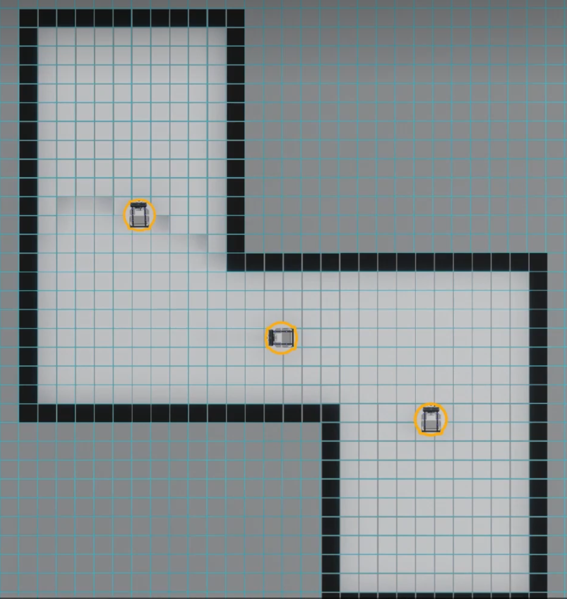

建好的**地图的原点**在**机器人建图的初始位置**，原点坐标系遵循右手原则，

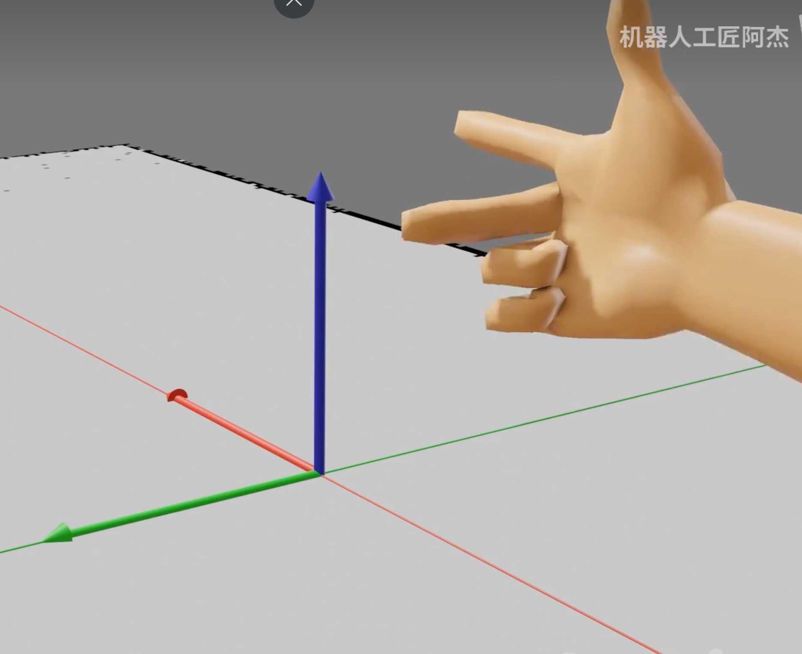 

**右手原则是 ROS 所有坐标系的统一基准，偏航角等旋转本质是在右手坐标系下的姿态表达**

机器人的基准坐标系和旋转坐标系遵循双枪原则，**左手描述旋转坐标系**（z轴向上，y轴向右，x轴向前，正方向为右手握住相应的轴，右手拇指向轴的正方向，而旋转的正方向在右手的4指旋转方向），**右手描述基准坐标系**，这两个坐标系合并表述了完整的机器人姿态


# 正确的机器人坐标系与旋转规则

机器人的**基准坐标系（位置）+ 旋转规则（姿态）是完全统一的右手原则**，规范表述是：

1. 基准坐标系（右手笛卡尔）
    - X 轴：机器人前进方向；
    - Y 轴：机器人左侧方向（与 X 轴垂直，在水平面内）；
    - Z 轴：垂直地面向上（与 X/Y 轴垂直，指向天空）；
2. 旋转正方向（右手螺旋定则）
    - 绕 X 轴（横滚角 Roll）：右手握住 X 轴，大拇指指向 X 轴正方向，4 指弯曲方向 = 横滚角正方向（对应机器人左侧向上抬升）；
    - 绕 Y 轴（俯仰角 Pitch）：右手握住 Y 轴，大拇指指向 Y 轴正方向，4 指弯曲方向 = 俯仰角正方向（对应机器人抬头）；
    - 绕 Z 轴（偏航角 Yaw）：右手握住 Z 轴，大拇指指向 Z 轴正方向，4 指弯曲方向 = 偏航角正方向（对应机器人左转）。


# 底盘与 ROS 之间是怎么进行通信的？

通过一个节点，这个节点通过接收 cmd_vel 话题中的数据，然后经过处理之后调用与底盘进行通讯的通讯协议将指令发送给底盘，底盘接收到这个指令之后执行相应的运动动作

那这个函数要怎么使用呢？怎么设计呢？


# C++ 中对象实例用“.”、对象指针用“->”的原因

首先是 “对象实例” 与 “对象指针”

对象实例：一整块连续的内存块，这块内存中存储了对象的所有内容（成员变量、属性。。。）这种是栈上实例

对象指针：则是一个 4/8 字节的内存地址，这个内存地址是对象实例的内存首地址


而对象实例用 `.`：直接访问（直接根据实例对象的内存地址，计算偏移量，一步到位访问）

​    对象指针用 `->`：先解指针然后计算成员的偏移量在做访问（两步操作）


注：`->` 是 `(*指针).成员` 的语法糖，比如 `nav_ptr->point(...)` 等价于 `(*nav_ptr).point(...)`，但 `->` 更简洁，是 C++ 专门为指针访问成员设计的简化语法。


简单记：

- 看到`.`：“我直接操作这个对象”；
- 看到`->`：“我先找到这个对象，再操作它”。

而这两者的区别在于

- 用`.` 时，程序员知道 “这是栈操作，速度快、内存小、生命周期短”；
- 用`->` 时，程序员知道 “这是堆操作，速度稍慢、内存大、需要手动管理（避免泄漏）”；


# ros 单独编译一个功能包命令

```
catkin_make -DCATKIN_WHITELIST_PACKAGES="xxxxx"
```


# VAD 算法工作原理

主要看两个核心的特征来判断是否有人在说话

* 音频能量：音量大小
    * 频谱特征：只采样人类语音的频率范围内的声音


# Ubuntu 查找音频设备

1. 使用命令，列出所有音频采集设备

    ```bash
    arecord -l
    ```

    输出示例：

    ```bash
    **** List of CAPTURE Hardware Devices ****
    card 0: Intel [HDA Intel], device 0: ALC897 Analog [ALC897 Analog]
      Subdevices: 1/1
      Subdevice #0: subdevice #0
    card 0: Intel [HDA Intel], device 2: ALC897 Alt Analog [ALC897 Alt Analog]
      Subdevices: 1/1
      Subdevice #0: subdevice #0
    card 1: A681600W [A68-1600W], device 0: USB Audio [USB Audio]
      Subdevices: 1/1
      Subdevice #0: subdevice #0
    card 2: MINI [DJI MIC MINI], device 0: USB Audio [USB Audio]
      Subdevices: 1/1
      Subdevice #0: subdevice #0
    ```

    这里的 card 2 和 device 0 是关键标识

    其中 ALSA 音频采集设备的节点格式为：

    ```
    /dev/snd/pcmC<Card号>D<Device号>c
    ```

    其中后缀为 `c` 代表 capture 采集， `p` 表示 playback 播放

    用上面的示例为例，则对应的节点则是：

    ```
    /dev/snd/pcmC2D0c
    ```

    


# 奇异点


# 查看 jetson 的设备型号

```
cat /proc/device-tree/model
```


# 串口通讯

串口的全称是 **串行接口**，是 **实现串型通讯的硬件载体**，相当于是串行通讯的 “数据出入口”

串口通讯 = **通过这个串口硬件接口，实现的串行通讯**

同时 串口通讯 ≠ 串行通讯

**串行通讯**：是所有“**一位一位顺序传输数据**”的方式的总称，是一种传输方式的概念，他并不局限于串口这种接口

**串口通讯**： **基于串口硬件的串型通讯**，是串型通讯的一个子集


而串行通讯与并行通讯的本质区别就是：

**串行通讯**是数据位逐位、按顺序通过一个串口进行传输，也就是说一组数据通过一条数据线传输

并行通讯是多个数据位同时传输，每一数据位都有一根独立的数据线，所有数据为在同一时间发送/接收

## RS485

RS485 是一种通讯协议，他主要就是通过一个 RS485 转换芯片来讲 TTL 电信号转换为差分信号，这是一种**半双工**的通讯方式
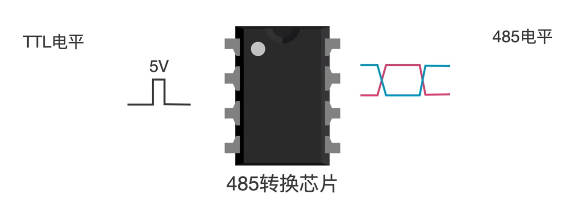

这种通讯协议最大的有点就是抗干扰能力强


## RS232

RS232 是一种通讯协议，它主要的作用就是让串口传输的数据更加可靠，不会因为传输过程中受到干扰就导致数据失真，但整体的通讯距离和通讯频率较低，这是一种全双工的通讯方式

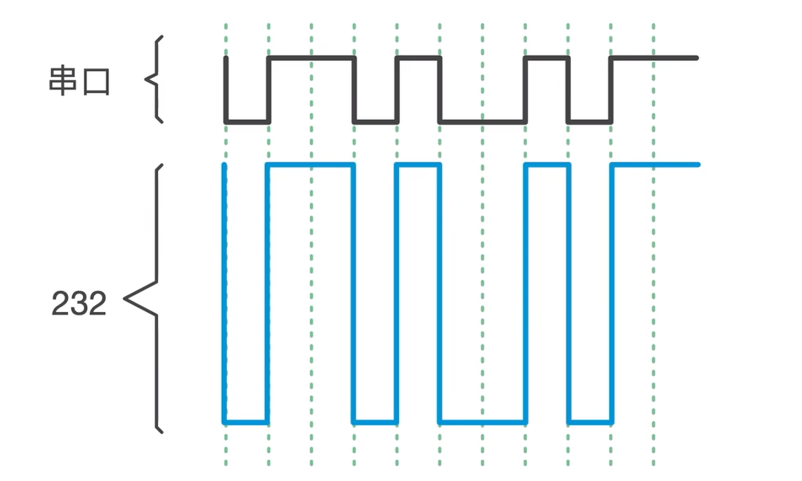

简单点来说，这两种通讯方式就是给串口通讯“**定电压规矩**”的标准，以来适配不同的传输距离、节点数量和抗干扰需求

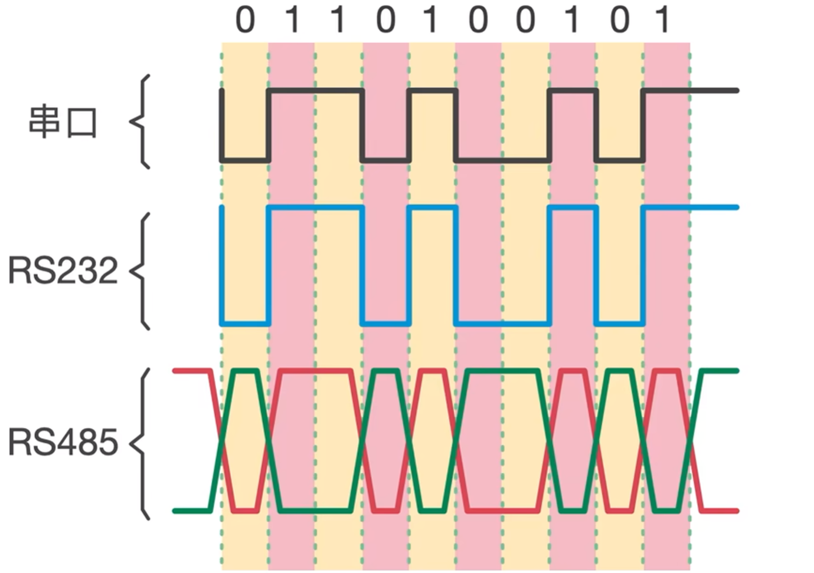


# 夹爪通过末端 RS485 接口进行 Modbus 通讯，这个 Modbus 又是什么东西，它具体在做什么？

要搞懂这句话，我们可以将 RS485 和 Modbus 拆成两个层面的东西：

* RS485：是硬件层面的电气标准
* Modbus：是软件层面的通讯协议


# 手眼标定

手眼标定是找到相机与机械臂末端执行器的变换矩阵，这个变换矩阵用于将由像素坐标转换为 **3D 坐标的坐标点转换为机械臂坐标系的坐标**


# 相机标定

相机标定则是找到相机的焦距、主点、畸变函数，以此来将像素坐标转换为相机坐标系下的 3D 坐标


# 完整的相机抓取数据流

```
像素坐标 
  → 相机内参（相机标定）
  → 相机坐标系 3D	（通过内参来将像素点坐标转为相机坐标系下的坐标）
  → 手眼标定变换		（通过手眼标定的转换矩阵计算相机坐标系下的坐标相对于末端执行器的位置）
  → 机械臂末端坐标系
  → 机械臂运动学
  → 机械臂基座坐标系	（再通过机械臂基座和末端执行器的转换矩阵获得像素点坐标相对于机械臂底座的3D坐标）
  → 控制机械臂抓取！
```


# 激光雷达三角测距法

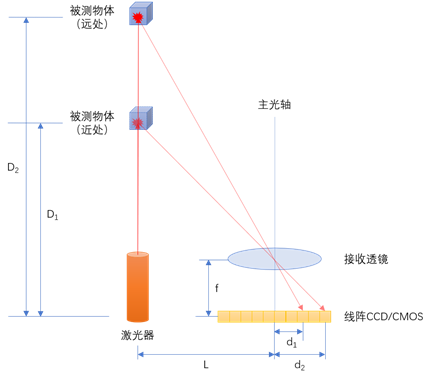

从上图中可以知道，当我们知道 L (机械安装量) 和 d1（CCS测量值）和f（机械安装值）的情况下，我们可以得到D1的值，即激光雷达到被测物体的距离

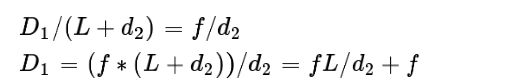

简单点来理解，实际上这个三角测距法就是根据了相似三角形的**两条直角边之间的比值相同的关系，来求出其中一条边的长度**


# 电机驱动

**让电机动起来只需要通电即可，只需要控制电压，即可控制电机的转速**

比如我们用的额定电压为12V 130RPM的电机，当给到12V的电压时可以达到额定转速130转/分，但如果我们给8V的电压，此时电机依然可以转动，但转速就相对较低。

而只是转起来还是不行，要想要控制机器人前进后退，左转右转，我们还需要**控制轮子的转动方向**

而 **H 桥（H-Bridge）电路**可以帮我们实现这个控制转速和转动方向的两个功能


## H 桥电路

H 桥电路之所以称之为 H 桥，是因为这个电路长得很像字母 H 。而我们通过改电路可以将电源电压正向或者反向地施加到电动机上，从而实现正向、反向转动和制动等功能

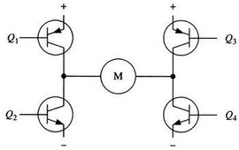

该电路由四个独立开关管（MOSFET）组成，在H桥电路中，两个开关管组成一对，如上图所示。当我们接通Q1和Q4，关闭Q3和Q2时，电源电压正向施加到电动机上，使其正向转动。

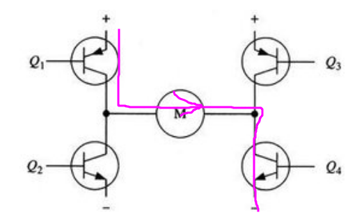

我们关闭Q1和Q4，接通Q2和Q3时，电源电压反向施加到电动机上，使其反向转动。

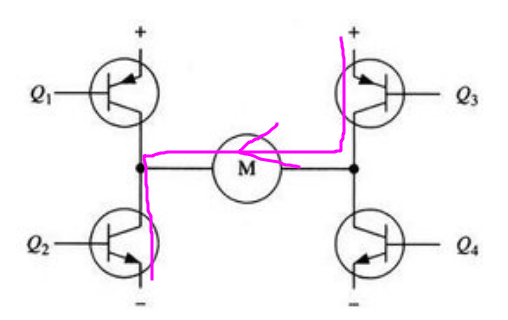

在制动时，同时关闭四个开关管，这样电动机会在短时间内停止转动。另外，通过之前介绍的在PWM（脉宽调制）控制下，可以通过改变开关管的开关时间比例，就可以实现电动机的速度控制。


# 正逆解

简单点来理解，正运动学就是小的部分的指标计算出大的整体的指标

​			   逆运动学就是大的整体的指标相应需要的小的部分的指标


## 关节正逆解

正运动学：指在已知关节变量的情况下，计算末端执行器的三维空间中的位置和姿态

逆运动学：在知道末端执行器的三维空间中的位置和姿态后，计算出所需要的关节变量


## 两轮差速正逆解

而两轮差速的正运动学：指已知轮子转速的情况下，计算出当前的机器人的运动速度

​			逆运动学：指在知道当前的机器人运动速度的情况下，计算出轮子相应需要的速度


# 查准率（Precision）与查全率（Recall）

在正式的了解这两种比例之前我们要理解一下具体的参数是什么：

首先就是会有四个概念，这四个概念来自于混淆矩阵，它们用于描述预测结果的正确性：

|          | 实际为正   | 实际为负   |
| -------- | ---------- | ---------- |
| 预测为正 | TP（真阳） | FP（假阳） |
| 预测为假 | FN（真阴） | TN（假阴） |

> **查准率_Precision**：
> 计算公式：
> TP /（TP + FP）模型预测的所有预测为正的目标中，真正为正的比例

>**查全率_Recall**：
>计算公式：
>TP /（TP + FN） 所有实际为正的目标中，被预测为正的比例


# TF 的工作

1. 发布坐标转换
    （并且每个坐标系转换包括：
      \- 平移：x, y, z
      \- 旋转：四元数 或 欧拉角
      \- 时间戳：变换发生的时间）
2. 自动处理中间的转换


# 报错：设置 SSH 主机 192.168.1.194: (details) 连接到 VS Code Server - 重试 1

当 vscode 终端的日志提示：

```
Installation already in progress...
  If you continue to see this message, you can try toggling the remote.SSH.useFlock setting
```

则是因为有一个 “幽灵” 安装进程卡住了，占用了锁文件，导致我们无法进一步连接

```
 快速解决方法

  方法一：删除锁文件（推荐）

  # SSH 登录到远程机器
  ssh bobac3@192.168.1.194

  # 删除锁文件
  rm -f /home/bobac3/.vscode-server/bin/*/vscode-remote-lock.*

  # 或者直接删除整个 vscode-server
  rm -rf /home/bobac3/.vscode-server/
```


# 图像的2D坐标转换为3D坐标

这种转换是通过 **针孔相机模型** 的几何原理方式去解算

首先是 **投影公式** （3D→2D）：

$$u=f_x *(X/Z) +c_x$$

其中 $(u,v)$ 是物体在图像上的像素坐标，$(X，Y，Z)$是相机坐标系下的3D坐标
	$f_x,f_y,c_x,c_y$ 则是相机的内参矩阵

其中 $f_x, f_y$ : 焦距（像素单位）

​	$c_x,c_y$：主点坐标（光心的坐标）


二是反投影公式 （2D→3D）：

$X=(u-c_x)*Z/f_x$

$Y=(v-c_y)*Z /f_y$

$Z=depth$

而这两条公式实际上就是**相似三角形原理**

<u>小孔成像的光心相当于一条映射，能让**物点(物品所在的点)**与**像点(成像面所在的点)**的空间位置有了一一对应的关系</u>


而我们通过反投影公司就能通过相机的像素值计算出实际的目标相对于相机坐标系的3维坐标：

## 反投影公式

实际上通俗点理解，

​    $f_x, f_y$ : 焦距（像素单位）：指的就是成像芯片与镜片光心之间的距离

而$c_x,c_y$：主点坐标（光心的坐标）则指的是光心在成像芯片上的坐标，一般为中间，如果有偏移就应该做标定

而通过了这些参数，与图像上的物体像素坐标进行相似三角形运算，即可计算出目标相对于相机坐标系的三维坐标

具体可通过下面这个例子来理解

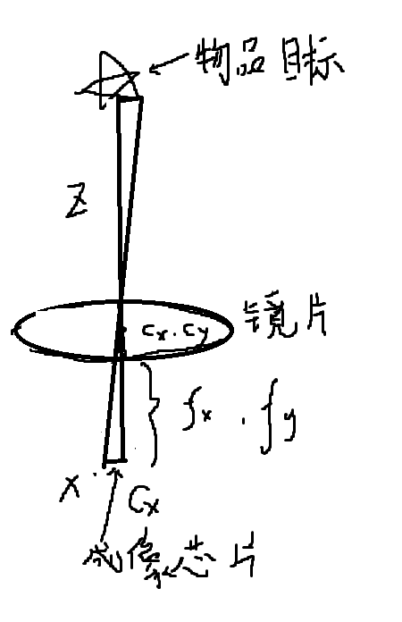

假设：

- 下面的成像芯片的像素坐标: (u=314, v=182)
- 深度值: 500mm = 0.5m
- 相机内参: fx=600, fy=600, cx=320, cy=200

计算：

$Z = 0.5 m \\
X = (314 - 320) * 0.5 / 600 = -6 * 0.5 / 600 = -0.005 m\\
Y = (182 - 200) * 0.5 / 600 = -18 * 0.5 / 600 = -0.015 m$

得到相机坐标系下的3D坐标：**(-0.005, -0.015, 0.5)**


# 二维平面的旋转计算

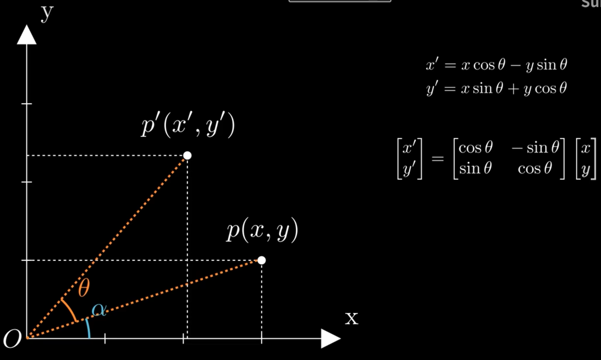


## 为什么我直接在 isaacsim 中点击这个总的机器人父类 即robot 这个link的时候，isaacsim会在展示界面中显示出其碰撞网络呢？不是应该去到 colliders 的时候才能看到吗，这样不是会误导我直接在这个Link里面同时设置了他的碰撞网络和刚体属性吗？

1. 为什么选中 Link 会显示碰撞体呢？
    因为递归可视化，实际上这种直接点击就能看到其碰撞网络是为了方便调试，但是实际上只是递归的显示出 colliders 中的碰撞体集合
2. 直接在这个 Link 里面同时设置碰撞网络和刚体属性？
    不能直接在 Link 中同时设置碰撞网络属性，因为这个父级 Link 中并没有这个 碰撞网络的 API
3. 


## 那Link组件到底是在描述什么呢？colliders 子组件又是在描述什么呢？

isaacsim 中使用 urdf 进行导入的 usd 整体的结果如下：

```
 /World/robot/
  ├── base_link                    ← Link 本身（Xform 节点）
  │   ├── meshes/                  ← ❌ 旧的导入方式（你可能看到这个）
  │   │   ├── base_link_visual
  │   │   └── base_link_collision
  │   │
  │   ├── visuals/                 ← ✅ 新的导入方式
  │   │   └── base_link_visual     ← 视觉网格
  │   │
  │   ├── colliders/               ← ✅ 新的导入方式
  │   │   └── base_link_collision  ← 碰撞网格
  │   │
  │   └── ... (其他属性)
  │
  └── link_1/
      ├── visuals/
      │   └── link_1_visual
      └── colliders/
          └── link_1_collision
```

其中 `Link` 中主要描述：刚体的属性、速度、受力、物理属性等参数）

​	`visuals` 主要描述：外观视觉描述网络

​	`colliders`主要描述：其碰撞物理形状 


为什么这样设计？

  类比理解

  真实的物体：
  		 一个刚体 = 一个物理实体
          			 = 有质量、有惯性
        			   = 可以由多个零件组成

 例子：一个锤子
   	 └── 锤子整体 = 1 个刚体（RigidBodyAPI）
        	├── 锤头 = 碰撞形状 1
      	  ├── 手柄 = 碰撞形状 2
        	└── 装饰 = 视觉形状（不参与物理）


## 什么是Xform

在 isaac sim 中锁使用的 USB 体系中，基本对象被称为 “**Prim**”，简单点理解就是组织场景数据的 **基本单元**

而在 USB （通用场景描述） 的上下文中，“xform” 是一种特殊的 “Prim” ，它**主要用于表示物体的变换信息**，用于控制场景中的物体的位置、旋转和缩放

Xform 是 transform 的缩写，代表一个变换矩阵，用于表示场景中的对象的变换

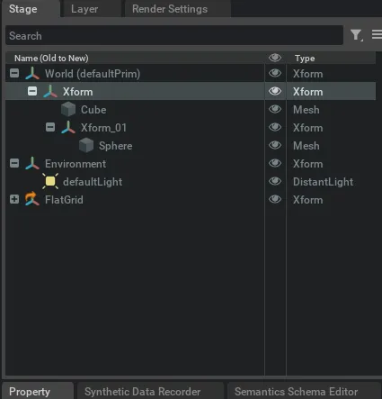

同时 Xform 还具有双重身份：

1. 作为场场景的节点
2. 作为属性的载体

这个 Prim 同时具有多种角色

一个是 Xform (具有位置和旋转)

一个是 具有 RigidBody 属性（是物理刚体）

一个是 具有 Mass 属性（具有质量）

我们可以将这个 Xform 想象成一个挂钩

它不仅会告诉你这个东西挂载哪里

还会告诉你东西怎么旋转

并且他还是一个物体

他还会描述它具体的Mesh 几何形状

**整体来说， Xform 是一个坐标系的容器，或者说就是一个盒子，有了这个盒子，我们能够让 Mesh 能够摆放到指定的空间坐标，朝向以及大小等内容，和urdf 中的link 是相似的含义**


## 为什么父节点是 RigidBody 之后子节点就不能是 RigidBody?

这个是 PhysX 的规则：如果父节点是 RigidBody， 那么子节点就自动成为父节点的一部分，且不能同时也是独立的 RigidBody

本质上 父节点是刚体时，子节点也可以是刚体，

总体来讲，isaacsim 的 Xform 嵌套父子节点实际上在描述的是这两个 Prim 是否为一体的

**而当父节点下的子节点也同样为一个 Xform 的时候，则认为子节点和父节点同为一体，且同时继承其刚体属性，但是整体之间是固定的，不能动**


1. NVIDIA 官方文档：刚体不能嵌套


  来源：https://docs.omniverse.nvidia.com/kit/docs/asset-requirements/1.7.1/capabilities/physics_bodies/physics_rigid_bodies/requirements/rigid-body-no-nesting.html

  官方原文：
  *Summary: In PhysX based simulators, like Omniverse Isaac Sim, Rigid bodies can not be nested unless xformOp reset xfor**m stack is used.*

总结：在基于PhysX的模拟器（如Omniverse Isaac Sim）中，除非使用xformOp重置变换堆栈，否则刚体不能嵌套。

  *Description: Since maximal coordinate simulation computes the world transformation, it has to be applied to the local* *transformation stack of the UsdGeomXformable. If rigid bodies are nested, it requires extra computation to make the tran**sformation parent-relative. To avoid this complication, if rigid bodies are nested, they must have their xformOp stack reset set.*

关键点：
  - Isaac Sim（基于 PhysX）中，刚体默认不能嵌套
  - 除非使用特殊的 !resetXformStack! 技术


 2. NVIDIA 官方文档：刚体要求

  来源：https://docs.omniverse.nvidia.com/kit/docs/asset-requirements/latest/capabilities/physics_bodies/physics_rigid_bodies/capability-physics_rigid_bodies.html

  官方原文：
  ⛔ In PhysX based simulators, like Omniverse Isaac Sim, Rigid bodies can not be nested unless xformOp reset xform stack is used.


3. NVIDIA 开发者论坛：刚体父子关系要求


  来源：https://forums.developer.nvidia.com/t/understanding-onshape-importer-result/268297

*"The articulation root must be on an xform prim which has children xform prims for each links. These children links mu**st be rigid bodies. The parent and children of these rigid bodies must not be rigid bodies themselves. The joint relatio**nships should be between these rigid body xforms."*

这句话的意思是：

1. Articulation Root 标记在所有 link 的父节点上（父节点不是 RigidBody）
2. 各个 link 作为 Articulation Root 的子节点，每个都是独立的 RigidBody
3. 刚体不能嵌套（父子不能同时是刚体）
4. 关节连接这些同级刚体


### 什么是 Articulation(机械臂/连杆系统)？

Articulation = 一个由多个刚体通过关节连接的系统，像是一个机械手臂或者移动机器人


### Articulation 根节点不能嵌套 是什么意思？

即 Robot Base 和 Arm Base 都标记为 Articulation Root  的时候，这两者不能呈现父子关系，因为可以说他们两个是完全独立的多关节体，嵌套的时候明显会有错误


## isaacsim 机器人资产的整体层级结构


## urdf  文件的层次结构

[URDF学习（一）什么是URDF以及怎么理解一个URDF文件-CSDN博客](https://blog.csdn.net/zhelijun/article/details/102709150)

[(9 封私信) 通用机器人描述格式URDF文件简介与生成 - 知乎](https://zhuanlan.zhihu.com/p/477556743)

URDF 全称（United Robotics Description Format） 统一机器人描述格式，是一个 XML 语法框架下用来描述机器人的语言格式


### 连杆—Link

连杆的描述一般具有惯性、视觉特征和碰撞体特征，参考文档：https://link.zhihu.com/?target=http%3A//wiki.ros.org/urdf/XML/link

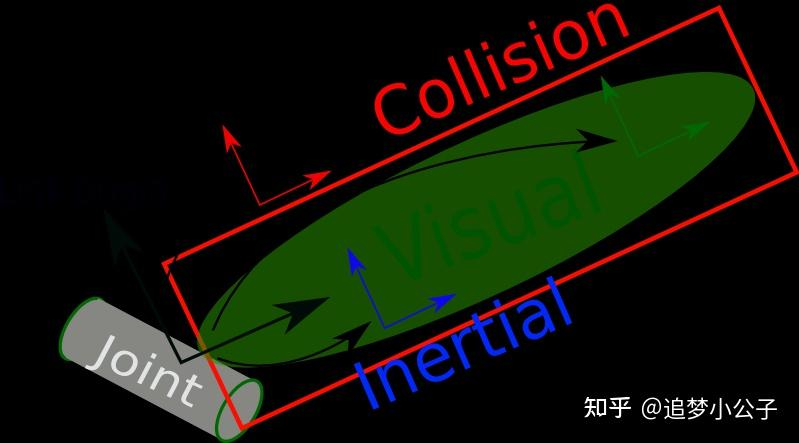


### 关节—joint

描述了关节运动学和动力学，还指定了关节的安全极限，参考：https://link.zhihu.com/?target=http%3A//wiki.ros.org/urdf/XML/joint


### 关节联动

关节联动，urdf 中通常会使用 \<mimic\> 这个标志位来进行描述，

**基本语法**如下：

```
<joint name="follower_joint" type="revolute">

<mimic joint="leader_joint" multiplier="2" offset="0" />

</joint>
```

- **joint**：指定要跟随的主关节名称。
- **multiplier**：倍数系数，表示随动关节的角度 = 主关节角度 × multiplier。
- **offset**：偏移量，表示在同步基础上增加的固定角度（弧度）。


## 三轮全向底盘kinematics

forwardkinematics（正运动学）

inverseKinematics （逆运动学）

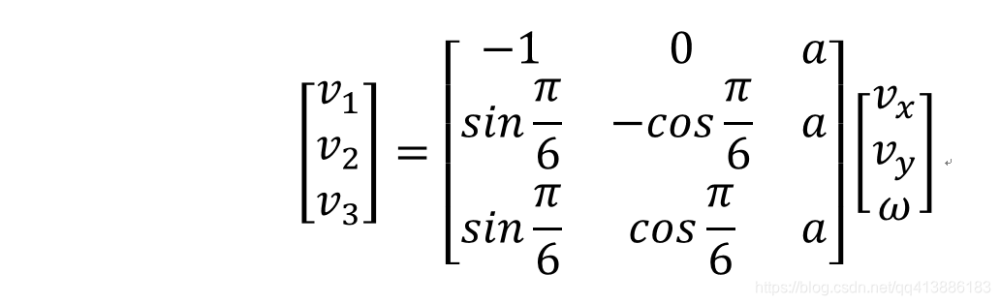

其中中间的这个矩阵是各个轮子在**相应方向的速度贡献**转换矩阵

速度贡献矩阵


### 为什么三角函数能够有这么多的用途，先是变换矩阵，然后就是这个速度贡献权重呢？

这是因为三角函数的本质是描述 “**角度**” 和 “**分量**” 之间的关系的


首先我们用一个向量来理解三角函数

```bash
		y
        ↑
        |     / 向量长度 = 1
        |    /
        |   /  
        |  /    这个向量朝向 30度
        | /
        |/_)______________→ x
         30度
```

角度 ← 三角函数 → 分量（坐标）


## 为什么2D 的旋转矩阵是 2x2=4 个元素

核心原因：描述两个新的轴的方向


## 为什么一个点在坐标系 A 中的坐标转换到坐标系 B 的时候会需要将一个轴方向的分量投影到另一个轴上，这个投影的作用到底是什么，为什么需要这个投影，投影的意义是什么？

投影 = “从这个坐标轴的某个轴方向上看，距离是多少”

投影的作用：将一个分量分解到某个方向上

而在几何学中，投影则是指一个点或者物体从高维空间映射到低维的空间（如平面或者是直线）


## 位置描述

当建立坐标系的时候，我们可以使用一个 3x1 的位置矢量给世界坐标系中的任何一个点来定位，其中位置矢量使用左上标来表示其坐标系例如 ：$^aP$，它表示在坐标系 `a` 中的位置矢量（矢量=向量），而**位置矢量中的元素数值是指矢量相对于坐标系上的投影**


也就是说我们能够通过 三个相互正交的带有箭头的单位矢量 来表示一个坐标系 $\{A\}$，然后通过一个矢量来表示一个点 $^AP$，这样就能够表达出空间 $\{A\}$ 中的一个位置了


点的位置可以使用矢量来描述，物体的姿态则可以固定在物体上的坐标系来描述

首先 物体的姿态我们可以这样理解，先给我们的物体安上一个固定的单位坐标系（各轴长为1 的坐标系），当物体旋转或者变化的时候这个坐标系也跟着旋转变化，然后参考坐标系通过对这个固定的单位坐标系的各个轴进行矢量描述，即可得到一个 3x3 的矩阵，这个矩阵就是 **旋转矩阵** 

具体来说就是 旋转矩阵 描述的是以参考坐标系处于原点，并且各轴没有任何角度或者位置偏移时候的物品 姿态


# 三角函数的本质

三角函数并不是凭空的定义，它实际上描述的是


# 网络代理是啥

实际上网络代理就是指，能够帮你去访问指定网站的机器，即替你干活的一个机器

想象一下，你想要买山姆超市的东西，但是你没有会员，因此你就需要找一个代理人（有会员）来帮你到山姆超市买东西，买完东西之后再将东西给你

而这个过程中，代理有可能能够获取到你的数据，导致数据泄漏，而这个时候就能够使用到 VPN 

## VPN

VPN 同样也是一种网络代理，但是这种方式使用了一种通道加密的方式，这种方式就不细究了，但是整体的效果就和你同样要寄东西，快递员帮你带到指定的地方给指定的人，但是它不知道这个包裹里面有啥，也看不了，因此就解决了这个数据泄漏的问题

但是 VPN 还不是完全安全能够确保数据不泄露的


# IsaacSim 将引用的 Prim 转为独立的 Prim 而不是 Payload

先直接制作好完整你需要的资产文件，不需要管是不是通过参考的方式进行加载的

当制作好之后，就能直接通过下面的这个功能按键直接将参考的资产转换为独立的资产

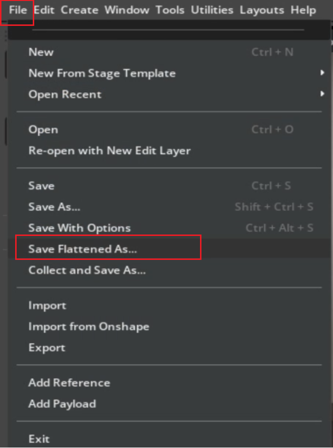

这样就能将这个原本有 Payload 的资产文件转换为完全独立的资产文件了，就不需要依赖别的文件了

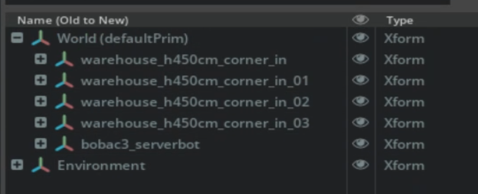


# 模型作为地面设置方法

1. 原定使用的模型

2. 创建碰撞体

3. 设置碰撞类型

4. 设置为 disable gravity  让地板不受重力影响

5. 将模型设置为 static

    1. 将 rigid Body 属性删除
    2. 保留 collision 属性
    3.  mass 设置为 0 

    

    ## 啥是 Static ?

    Static 即为静态的刚体，他是无线质量，并且永远不动的，同时没有 RigidBody API ，只有 Collision API 

    他一般用在场景的墙体之类的模型中，让机器人撞到墙体的时候，墙体不动，而机器人弹开

    ## 啥是 Kinematic ？

    Kinematic 叫 **运动学刚体**，它**不会被重力、碰撞、力等物理属性影响**，但是同时他却能影响别的刚体，也就是说：

    **Kinematic_Enable = True == 不受物理影响，但是能够影响别人的 “可控刚体”**

    这种刚体，我们一般会设置到作为墙壁，地面的仿真模型上去


Isaac Sim 基于 PhysX，物体分三类：

1. 静止物体 Static
    * 完全不动
    * 不参与物理计算
    * 不能移动
    * 只能被碰撞
2. 动力学刚体 Dynamic (普通物理物体)
    * 受重力、力、冲量、碰撞影响
    * 会弹、会跳、回滚
    * 不能直接设置其位置，只能施加力让他动起来
3. 运动学刚体 Kinematic
    * 不受物理影响（无重力、无碰撞反弹、不受力）
    * 能影响别的动力学刚体的运动状态

### Kinematic 和 Static 之间的根本差别是什么？

根本差别在于是否能够正常的控制运动，Static 是完全静止不动的，无论怎么样撞击它，而 Kinematic 只有在被控制的时候才会动，平常的撞击也是同样不会动，Static 平常用于墙体，场景环境，而 Kinematic 则是用于自动门，电梯等场景


# 为啥能够通过在 xform 中嵌套创建 colliders 文件夹，然后通过这个文件夹中的 prim 来决定这个xform 的碰撞体形状呢？

这是因为 isaacsim 的命名约定，在仿真的时候会便利


# articulation 控制关节的流程

  ┌─────────────────────────────────────────────────────────────┐
  	│  Articulation Controller 控制流程                            │
  	└─────────────────────────────────────────────────────────────┘

1. 初始化阶段 (init*_instance + initialize_*controller)

​     ├─ 读取 robotPath 获取机器人 prim 路径
​     ├─ 创建 ArticulationController 对象
​     └─ 获取机器人的所有 DOF 信息


2. 选择关节 (joint*_indicator)*

​     *├─ 读取 jointNames 输入（如 ["left_*wheel", "front*_joint:2"]）*
​     *├─ 对每个名称调用 get_*dof*_index(name)*
​     *│   └─ 返回该 DOF 在 articulation 中的索引*
​     *└─ 存储 joint_*indices 列表


3. 应用控制 (apply*_action)*

​     *├─ 读取 positionCommand / velocityCommand / effortCommand*
​     *├─ 创建 ArticulationAction 对象*
​     *│   ├─ joint_*indices: 要控制的 DOF 索引
​     │   ├─ joint*_positions: 目标位置*
​     *│   ├─ joint_*velocities: 目标速度
​     │   └─ joint*_efforts: 目标力矩*
​     *└─ 调用 controller_*handle.apply*_action()*


  *4. 物理引擎执行*
     *└─ PhysX 根据命令计算关节运动*

  \---
  关键点：get_dof_index()

  \# 第 42 行
  self.joint_indices.append(self.controller_handle.get_dof_index(name))

  这个方法的作用：
  \- 输入：关节名称（如 "left_wheel_joint" 或 "front_wheel_joint:2"）
  \- 输出：该 DOF 在 articulation 中的索引（整数）


# articulation 关节链

关节链通常表示一个整体，在这个整体中，所有的关节都会有联系，就像是 tf 树一样，每个关节各自独立，但又像链条一样各自影响


# 毫米波传感器与激光雷达

1. 首先这两种都是传感器（泛指额能够感知外界信息并输出数据的器件），只不过两种传感器发射的波不太一样
2. 毫米波传感器发送的是电磁波
3. 而机关雷达则是发送的激光（也可以说是电磁波，，但通常是近红外光）

一般来说两者的特点各有不同，激光雷达适合建图，定位与精准避障，

​						   而毫米波传感器则擅长在恶劣的环境中保持感知，虽然精度不高，但是能够大概感知到周围的障碍物以及其速度


# 传感器接上位机还是下位机?

1. 运动控制、实时安全 强相关的传感器，通常都会接到下位机中
2. 感知理解、导航定位、识别决策等强相关的传感器，则通常都接入到上位机中


通常接在下位机的传感器

这类传感器特点是：
  \- 实时性要求高
  \- 和电机控制直接相关
  \- 需要快速闭环
  \- 上位机挂了也最好还能起作用


通常接在上位机的传感器

这类传感器特点是：
  \- 数据量大
  \- 算法处理复杂
  \- 需要建图、识别、融合、规划
  \- MCU 不适合做


\---
  *二、为什么要这样分？*

  因为上位机和下位机职责不同。

  下位机负责

\- 采集底层状态
	  \- 控制电机
 	 \- 实时保护
 	 \- 快速响应

  一般是 MCU、PLC、控制板。

  特点：
  \- 实时性强
  \- 算力有限
  \- 稳定性高

  \---
  上位机负责

  \- 感知计算
  \- 地图构建
  \- 任务决策
  \- 路径规划
  \- 人机交互

  一般是：
  \- 工控机
  \- 嵌入式 Linux 主机
  \- Jetson
  \- x86 小主机

  特点：
  \- 算力强
  \- 适合跑 ROS/算法/AI
  \- 处理复杂数据能力强

  \---


*五、如何判断一个传感器该接哪边？*

  你可以用一个简单判断法：

  接下位机的条件

  如果这个传感器：
  \- 数据量小
  \- 需要毫秒级响应
  \- 直接影响安全
  \- 直接服务运动闭环

  那优先接下位机。

  \---
  接上位机的条件

  如果这个传感器：
  \- 数据量大
  \- 需要复杂算法处理
  \- 服务于定位、识别、建图、导航
  \- 需要和其他高级传感器融合

  那优先接上位机。

  \---


# 硬件是如何接入到 ros 中的

一般是靠以下四层：

1. 硬件本身：采集环境数据
2. 通讯协议（数据线）：让硬件能够通过这些通讯的规则或方式去将寄存器或硬件采集到的数据传输出去
3. 驱动（翻译）：接收方去解析通讯协议发送过来的内容，并转换未接收方能够理解的内容
4. ROS 节点：将理解好的内容重新封装为 ROS 能够理解的话题等内容


用一句特别通俗的话讲*

  ROS 像一个“会议室里的通用语言系统”。

  不同硬件原本说的是各自方言：
		  \- 雷达说自己的串口协议
 		 \- 相机说自己的网口协议
		  \- 底盘说自己的 CAN 协议

  驱动节点就像“翻译”：
 		 \- 把硬件方言翻译成 ROS 通用语言
		  \- 再把 ROS 命令翻译回硬件能懂的话

所以大家就能一起工作了。


# 封闭词汇学习

封闭词汇检测与分割就是在固定的类别中对目标进行检测与分割，其中能够进行检测与分割的类别都是在训练之前准备好的（数据准备阶段准备好的）


# Zero-shot learning 

零样本学习，也就是说在学习过的样本类别中训练过的目标，可以直接识别没见过的类别，但是这里的 Zero-shot learning 有个非常严的限制，就是 unseen 类别不能出现在 train 数据集中的（ unseen 的数据必须是模型的从没有见过的 ）

- 使用一个固定的类别编码器来代替分类器，如 Word2Vec、BERT 等，能够通过这些固定的类别编码器从 base 类别扩展到对 unseen 类别的理解

- zero-shot 是很受限制的，因为 unseen 的类别在训练中是没有见过的，就算出现了也只是被当做背景，所以这些类别的 visual 信息和 text 信息也很难对齐，很难建立真正的联系，所以 zero-shot 在 unseen 类别上的表现也不是很好


# 开放词汇学习

而开放词汇学习（open-vocabulary）则是放宽松的 Zero-shot learning ，因为没有了在训练中一定要 unseen 的这个严格限制，预训练中会见过各种各种的目标，无法保证也不需要保证这些类别一定 unseen，**因为预训练的目的就是要实现见多识广，才有利于在下游任务的泛化**

 

* 这个编码器是怎么样去提取特征的，怎么样去转换表示的？为什么编码器在将原数据的特征提取出来还能进行汇总为一个向量呢？这个汇总的操作是怎么做的？


* 什么是语义空间？为什么说：编码完之后，模型就会得到一个 “这个类别在语义空间里面的表示” 这个语义空间是向量空间嘛？这又要怎么理解呢？

语义空间能够理解成就是一个使用 **向量** 来表达意思的的空间，比如说 “dog” 这个词，在进行编码之后就被编码成一个向量：

$$ z_{dog} = [0.2, 0.7, 1.1, ...., 0.52]$$

这样这个词的含义在这个向量空间中就能通过上面的这个向量进行表示，而这个向量在这个高维的向量空间中就对应了一个点，而这个点的位置则就是表示了 “dog” 的这个含义


* 为什么说 编码器 在将图像或者是文字转换为 向量 之后就能够对这些内容进行相似度计算、分类、检索、检测、融合等的操作呢？

因为一旦将所有的输入都转换为了一个向量的形式，那么就能够进行数学计算，比如说，相似度计算：

那么两个向量就能够计算：

1. 点积

2. 余弦计算量

3. 欧式距离

    那么在进行计算过后，这两个对象语义相近，那么他们的向量通常就会在这个高维的空间中的位置会更加接近

# 编码器是怎么样起到作用的？

就是通过大量的训练，让模型能够学会将 “相似的东西映射到相近的向量，而不相似的东西则映射到更加远的向量”

编码器的主要 作用就是将这些不同表达的东西转换为数学模型看得懂的表达方式，进而让数学模型来帮我们做东西的对比

那这个向量相似与不相似是不是能够通过三角函数来进行计算呢？


# 开放词汇学习是怎么样去识别这些没有显式见过的词呢？是怎么举一反三的？

* 但是相关的知识之间的名字应该是不一样的啊，这个名字他都没有见过，他是怎么知道这个物品是我指出的这个新的类别的呢？就比如说我训练的时候使用的是 dog 、cat 这些东西，但是我给模型一个 orange 这个类别，他又是怎么知道这个类别是相对于图像中的什么东西呢？

这是因为 开放词汇学习 不同于 Zero-shot learning ，开放词汇学习是通过学习大规模的图文数据，学习大量的词和图像的概念，然后才能根据这些已经建立了概念的向量空间来进行泛化，但是如果是完全没有见过的新概念，那么就还是没办法正常的识别分类


# 卷积神经网络在特征提取完之后，怎么变成具体的分类结果？

以一张 224×224×3 的彩色图像为例，CNN 的特征汇总链路为：

输入图像（224×224×3）→ 多轮 “卷积 + 池化”（如输出 8×8×256 特征图）→ 展平（16384 维）+ 全连接（→256 维向量） 或 全局池化（→256 维向量）→ 最终特征向量。

即：先通过 **卷积层+池化层** 将图片中找与卷积核相似的部分来实现特征提取，然后通过，然后通过**展平**，将其总结成 **特征向量**，而特征向量中的关键特征中每个特征又会有一个明显的程度分，最后通过 **全连接层 + 全连接池化层** 中的线性映射 ($$ y= kx +b $$) 与 归一化 ( SoftMax )，来将展平的向量中包含的抽象特征与具体的类别建立关联，并通过 权重 W 来学习 “什么特征对这个类别更加重要” ，通过这种权重的方式


* 网络的各个层的作用：

**其中卷积核是“记录‘特征该有的明暗差异’的数字表”**—— 比如要找 “竖直边缘（胡须）”，特征的本质是 “左边暗、右边亮” 的明暗变化，卷积核就用数字来模拟这种变化，而**卷积层的计算则是计算出相应区域与卷积核的匹配分数**

而**池化层则是整理这些匹配分数**，将重要的匹配分数高的特征留下来，并压缩数量，或者说是将碎片化的线索归为一个关键的特征以及这个关节特征的得分，然后将这些得分整合为一维矩阵（向量），这些就是特征向量

最后通过线性层的 特征权重线性运算 ，当相应类别的特征的权重越大的时候，那个特征对于这个类别的重要性就越高，最终特征的得分与权重线性运算出来的置信分就越大，就越能证明这个特征就是这个类的属性


## 为什么传统 CNN 不用 “空间距离” 算置信度？

我们把 “特征向量” 比作**学生的 3 科成绩（数学、语文、英语）**，“类别” 比作 “能否考上 A 大学”，你就能明白两种方法的区别：

### 方法 1：“空间距离” 法（你疑惑的思路）

就像：

1. 先给 A 大学定一个 “标准录取成绩”（比如数学 120、语文 110、英语 115）—— 这就是 “类别中心”；
2. 看每个学生的成绩（比如数学 115、语文 105、英语 120）和 “标准成绩” 差多远（距离）；
3. 差得越近，就说 “考上的置信度越高”。

**但这个方法有 3 个大问题（也是 CNN 不用它的原因）：**

1. **“标准成绩” 太死板**：如果 A 大学突然想招 “数学好但语文稍差” 的学生，之前定的 “标准成绩” 就废了，得重新算 —— 对应到 CNN 里，就是 “类别中心固定，遇到新类型样本就不准”；
2. **算 “差距” 太麻烦**：如果要同时考虑 “考上 A、B、C3 所大学”，得分别算学生和 3 个 “标准成绩” 的差距，算 3 次 —— 对应到 CNN 里，1000 个类别就要算 1000 次距离，很慢；
3. **没考虑 “科目重要性”**：A 大学可能觉得 “数学比英语重要 10 倍”，但 “距离法” 会把数学和英语的差距同等看待 —— 比如学生数学差 5 分、英语差 5 分，其实数学差 5 分影响更大，但距离法分不清。


# 机器人抓取过程

机器人抓取过程中包含四个关键的任务：抓取检测、抓取规划、控制

其中抓取检测作为最重要的入口，他分为三个任务：目标定位、姿态检测、抓取点检测


# 抓取点检测

抓取检测被定义为能够识别任意给定图像中物体的抓取点和抓取姿态


# GraspNet 的抓取的整体思路

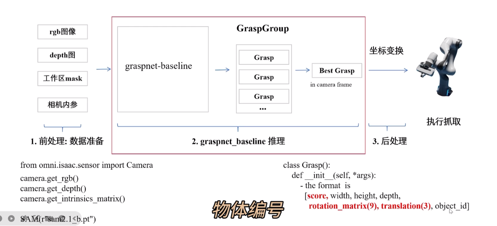

GraspNet 的输入如上：

1. rgb 图像
2. depth 图像
3. 工作区的分割后的  mask
4. 相机的内参


而 GraspNet 的输出 Best Grasp 对象中包含有 17 个数据：

1. 抓取点与抓取姿态的 得分 （score）
2. 宽
3. 高
4. 深
5. 旋转矩阵
6. 平移矩阵
7. 物体的编号 

而在一般的情况下我们只需要关注：score 、rotaion_matrix、translation 这三个数据即可

最后的这个输出实际上就是相对于相机坐标系的最佳抓取姿态，我们只需要将这个最佳的抓取姿态映射到机械臂 base_link 坐标系下的坐标以及姿态，就能够控制机械臂去进行抓取


#  graspnet 转 tcp 是什么意思？这个 tcp 是什么东西？

这里面的 TCP 不是网络中的 TCP/IP

在 机械臂/抓取里，TCP = Tool Center Point ，中文里面常叫做：

- 工具中心点
- 工具坐标点
- 末端执行器参考点

比如说我们的 末端执行器是夹爪，那么通常的 TCP 通常是处于两个夹爪之间的


而 graspnet 输出的抓取点以及抓取姿态一般是基于相机坐标系下的，我们需要将这个抓取点和抓取姿态的参考坐标系从 相机坐标系，转为 基座坐标系（base_link） 坐标系下 TCP/末端执行器的抓取姿态，进而实现让 末端执行器工具的中心点到达这个抓取位姿


# 为啥没办法 在宿主机端 通过 X11 展示 rviz2 的内容

出现下面这个问题的时候，通常是因为这个rviz2 没办法通过 X11 转发到宿主机端，可能是宿主机端没有开启 X11 显示服务

1. 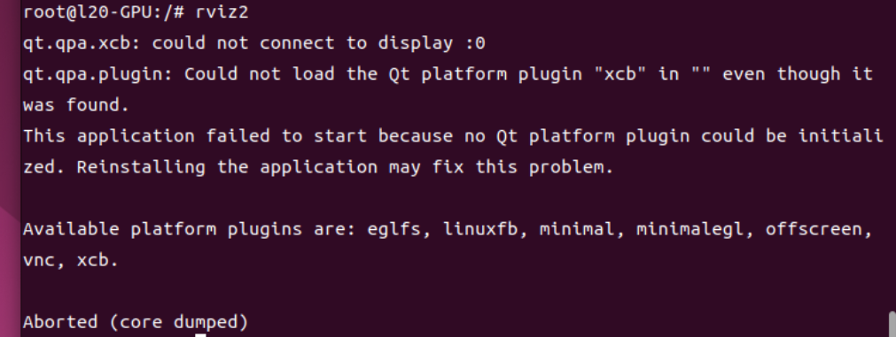

解决办法：

```bash
 # 先检查一下容器中有没有 X11
 xclock
 
 - 如果没有的话，可以使用下面的命令去安装一下
 apt update 
 apt install x11-apps

 # 可以在宿主机中先放行容器访问 X11 的权限
 xhost +
 
 # 并设置端口值
 export DISPLAY=:1
 
 # 然后就可以确认 X11 套接字的存在
 ls /tmp/.X11-unix/
 
- 正常输出：X0 或 X1（对应你的 DISPLAY 值）
- 如果为空 → 宿主机没有启动 X11 图形服务（比如你在纯命令行模式），无法转发。

 # 然后就可以进入到容器中，再确保一下 X11 转发端口
 echo $DISPLAY
 
 # 如果为空或者是和宿主机的端口号不一样，请重新设置一下
 
 # 若连 xhost 都提示没有 command 则需要重新安装一下 x11 服务
 sudo apt-get update && sudo apt-get install -y x11-xserver-utils
```


# 在 isaacsim 容器中安装使用 ros2 topic list 等命令的时候出现了崩溃报错：

```
root@l20-GPU:/# ros2 topic echo /camera/rgb
Traceback (most recent call last):
  File "/opt/ros/humble/bin/ros2", line 33, in <module>
    sys.exit(load_entry_point('ros2cli==0.18.15', 'console_scripts', 'ros2')())
  File "/opt/ros/humble/bin/ros2", line 25, in importlib_load_entry_point
    return next(matches).load()
  File "/usr/lib/python3.10/importlib/metadata/__init__.py", line 171, in load
    module = import_module(match.group('module'))
  File "/usr/lib/python3.10/importlib/__init__.py", line 126, in import_module
    return _bootstrap._gcd_import(name[level:], package, level)
  File "<frozen importlib._bootstrap>", line 1050, in _gcd_import
  File "<frozen importlib._bootstrap>", line 1027, in _find_and_load
  File "<frozen importlib._bootstrap>", line 1006, in _find_and_load_unlocked
  File "<frozen importlib._bootstrap>", line 688, in _load_unlocked
  File "<frozen importlib._bootstrap_external>", line 883, in exec_module
  File "<frozen importlib._bootstrap>", line 241, in _call_with_frames_removed
  File "/opt/ros/humble/lib/python3.10/site-packages/ros2cli/cli.py", line 22, in <module>
    from rclpy.executors import ExternalShutdownException
  File "/opt/ros/humble/local/lib/python3.10/dist-packages/rclpy/__init__.py", line 49, in <module>
    from rclpy.signals import install_signal_handlers
  File "/opt/ros/humble/local/lib/python3.10/dist-packages/rclpy/signals.py", line 15, in <module>
    from rclpy.exceptions import InvalidHandle
  File "/opt/ros/humble/local/lib/python3.10/dist-packages/rclpy/exceptions.py", line 15, in <module>
    from rclpy.impl.implementation_singleton import rclpy_implementation as _rclpy
  File "/opt/ros/humble/local/lib/python3.10/dist-packages/rclpy/impl/implementation_singleton.py", line 32, in <module>
    rclpy_implementation = import_c_library('._rclpy_pybind11', package)
  File "/opt/ros/humble/lib/python3.10/site-packages/rpyutils/import_c_library.py", line 39, in import_c_library
    return importlib.import_module(name, package=package)
  File "/usr/lib/python3.10/importlib/__init__.py", line 126, in import_module
    return _bootstrap._gcd_import(name[level:], package, level)
ImportError: /opt/ros/humble/lib/librcl_logging_spdlog.so: undefined symbol: _ZN6spdlog7details7log_msgC1ENS_10source_locEN3fmt2v817basic_string_viewIcEENS_5level10level_enumES6_
The C extension '/opt/ros/humble/local/lib/python3.10/dist-packages/rclpy/_rclpy_pybind11.cpython-310-x86_64-linux-gnu.so' failed to be imported while being present on the system. Please refer to 'https://docs.ros.org/en/{distro}/Guides/Installation-Troubleshooting.html#import-failing-even-with-library-present-on-the-system' for possible solutions
```

出现这个错误的原因是因为 spdlog/fmt 动态库的版本冲突，因为 isaacsim 中也带有这个 spdlog （高性能日志库），而在环境变量 **LD_LIBRARY_PATH** 中则带有了两个 ros2  humble 的库目录，导致了 ros2 在运行的时候优先加载了 isaac 的 libspdlog ，于 ros 里面的 fmt/spdlog 不匹配，因此出现了这个错误

解决办法：

添加前缀函数：前缀函数就是前置处理，在目标程序执行之前先执行的操作钩子/包装函数

我们只需要在 `~/.bashrc` 的末尾添加下面的前缀函数，就能在执行程序之前将 多余的 isaac 的humble 环境变量删除

```
ros_env() {
  local cleaned
  cleaned="$(echo "$LD_LIBRARY_PATH" | tr ':' '\n' \
    | grep -v '/isaac-sim/exts/isaacsim.ros2.bridge/humble/lib' \
    | paste -sd: -)"
  LD_LIBRARY_PATH="$cleaned" "$@"
}
```

设置之后可以 `source ~/.bashrc` 来加载这个设置，最后在使用 ros2 的命令的时候具体命令将变为：

```
ros_env ros2 topic list
```


# moveit 整体架构与完整控制流程

| 组件名称                     | 核心作用                                                   |
| ---------------------------- | ---------------------------------------------------------- |
| **MoveGroup**                | 总调度中心（用户交互入口，接收目标、分发任务、统筹全流程） |
| **Robot State Monitor**      | 状态监听器（实时获取机械臂当前**关节角度**）               |
| **Kinematics Solver**        | 运动学求解器（算正运动学 FK / 逆运动学 IK）                |
| **Planning Scene**           | 场景管理器（存储机器人 + 障碍物 3D 模型，做**碰撞检测**）  |
| **Planning Pipeline**        | 规划流水线（调用 OMPL 算法库，生成无碰撞路径）             |
| **Trajectory Processing**    | 轨迹处理器（优化路径、加速度 / 加速度、生成时间戳）        |
| **Controller Manager**       | 控制器管理器（下发轨迹给机械臂硬件 / 仿真）                |
| **Collision Detector (FCL)** | 碰撞检测引擎（底层库，判断是否发生碰撞）                   |


# isaacsim 拼装机器人

1. 导入各个部件的资产（每个部件都有单独的 articulation root）
2. 使用 Robot Assembler 来组装这些部件，通过 Robot Assembler 会取消组装的部件的 articulation root 并对其进行相应的碰撞配置
3. 调整位置后按下组装并仿真，完成组装


# isaacsim 机械臂配置

同样的我们可以通过 isaacsim 导入 机械臂，在导入机械臂过后，我们可以将这个机械臂的各个关节的 Driver 属性的：Damping 设置为 60000，Stiffness 设置为 600000


# isaacsim 机器人结构

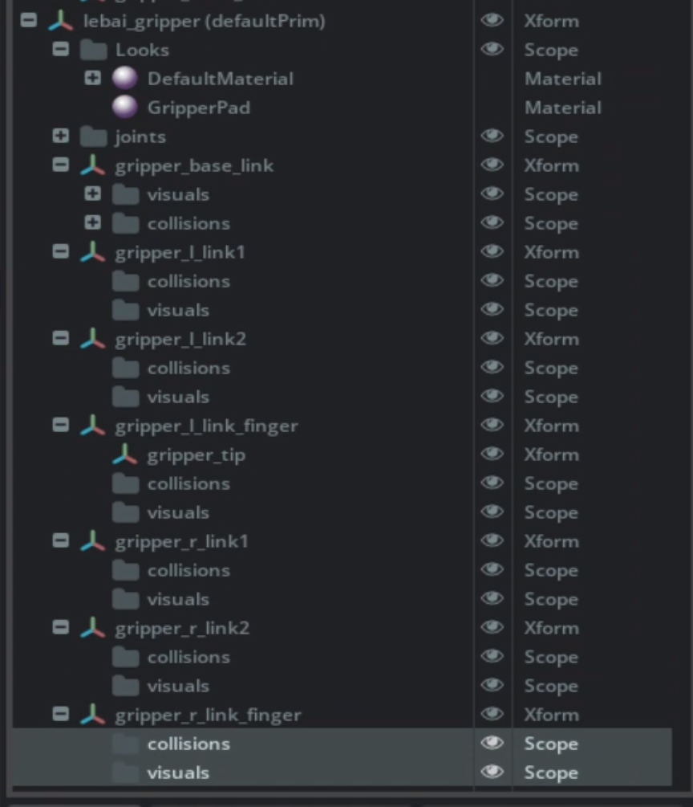

如上图为最标准的，其中最顶层的 lebai_gripper 为 articulation ，并且其下的所有 link 都是有一个 visuals 和 collision 子 link ，这两个子 Link 的形状属性构成了当前 机器人部件 prim 的外观以及碰撞网络形状


# isaacsim 的 Robot Assembler

Robot Assembler 是 isaacsim 提供的官方的部件组装器，让我们能够快速的将部件组装到机器人中，同时不会出现资产结构问题，同时机器人的结构树也会被 Robot Assembler 编辑，让结构树是独立的（即每个部件不都不是独立的，都是一体属于这个机器人本体的）

## 前提准备

1. 确保两个部件都是**完整的 Articulation 关节树**（有 RigidBody 和 Joint）
2. 机械臂和夹爪都已导入 Stage，且**没有提前手动连接**
3. 打开 Robot Assembler：`Tools > Robotics > Asset Editor > Robot Assembler`

## 核心操作（重点在步骤 3-4）

| 步骤 |               操作               |                         关键注意事项                         |                                                   |
| :--: | :------------------------------: | :----------------------------------------------------------: | :-----------------------------------------------: |
|  1   |          设置基础机器人          | Base Robot 选底盘 + 机械臂根节点（如`/bobac3_serverbot`）Base Attach Point 选**机械臂最后一节 link**（`link_6`/ 法兰盘） | 必须选**最后一个运动关节的 link**，不能选关节本身 |
|  2   |         设置待连接机器人         | Attach Robot 选夹爪根节点（如`/lebai_caught`）Attach Point 选**夹爪底座 link**（`gripper_base_link`） |      必须选夹爪的**固定底座**，不是活动关节       |
|  3   |           开始组装流程           |              点击 **Begin Assembling Process**               |      这一步会把夹爪 “悬浮” 到机械臂末端附近       |
|  4   | **Select Attach Point 核心操作** | 1. 点击按钮 → 舞台出现**绿色 / 红色临时坐标系**2. 用移动 / 旋转工具微调坐标系：   - 位置：让两个坐标系**完全重合**   - 角度：让夹爪朝向正确（向下 / 向前）3. 微调满意后，再次点击按钮**确认** | ❗️坐标系不重合 = 必报错❗️角度错了 = 夹爪歪着用不了  |
|  5   |             完成组装             | 勾选 **Assemble Into Single Robot**（**必须勾！**）点击 **Assemble** 完成 |    不勾这个，夹爪永远是独立部件，控制器找不到     |


# 这个关节树到底要怎么理解？难道说不是通过这个 robot assembler 来组装的机器人，各个部件都会是独立的关节树？关节树和 articulation  root 又有什么关系呢？为什么要用 robot assembler 来组装机器人？

## 核心类比：把机器人当成 **一个人**

## 1. 什么是「Articulation Root（关节树根）」？

就是人的**骨盆（腰）**

→ 一个人，**只能有一个腰**

→ 一个机器人，**只能有一个 Articulation Root**

## 2. 什么是「关节树（Articulation）」？

就是从**腰（根）** 连出来的**整副骨骼**：

腰 → 脊柱 → 肩膀 → 手臂 → 手

所有骨头连在**同一个腰**上，这就是**一棵关节树**。

[Articulation](https://archive.docs.nvidia.com/gameworks/content/gameworkslibrary/physx/guide/Manual/Articulations.html)

## 3. 两者的关系（死规则）

**一个关节树 = 必须只有 1 个根（Root）**

这是 Isaac Sim / PhysX 物理引擎的**铁律**，改不了！

------

## 关键问题：你手动用 Fixed Joint 拼接，会发生什么？

你现在的操作：

1. 拖一个**底盘**进场景 → 底盘自己有一个**腰（Root）** → 独立关节树 1
2. 拖一个**机械臂**进场景 → 机械臂自己有一个**腰（Root）** → 独立关节树 2
3. 用 Fixed Joint（胶水）把它们粘在一起

### 结果：

**它们还是两个独立的人！只是被胶水粘住了！**

- 两个腰（两个 Root）
- 两棵关节树
- 物理引擎看到的是**两个机器人**，不是一个！

## 那 Robot Assembler 到底做了什么？

它只干**一件核心事**：

**把两个机器人的骨骼合并，删掉多余的腰（Root），只留一个腰！**

合并后：

- 只有 **1 个 Root**
- 底盘 + 机械臂 都连在这一个根上
- 变成 **一棵完整的关节树**

物理引擎终于认：**这是一个机器人！**

------

## 为什么两棵关节树会导致「机械臂乱抖、底盘跟着动」？

想象一下：

把**两个人用胶水死死粘在一起**，然后让其中一个人挥手臂：

- 挥手臂的人用力
- 胶水硬拉着另一个人
- 两个人互相拉扯、颤抖、晃动

这就是你遇到的问题：

**两个独立关节树互相拉扯 → 抖动、漂移、机械臂动底盘也动**

物理引擎无法同时控制两个 “打架” 的关节树，直接乱套。

✅ **不用 Robot Assembler，你的底盘和机械臂就是两个独立的关节树！**

✅ **Articulation Root 就是关节树的唯一根，一个机器人只能有一个！**


# Mimic joint 的 Natural Frequency 和 Damping Ratio 

Natural Frequency ：控制 mimic 关节的跟随弹性

Damping Ratio ：控制跟随的 “软硬度” 

他是给柔性夹爪或者手臂使用的

**而平行夹爪是硬同步，刚性跟随，不需要这两个参数，所以都需要设置为 0**


# 全向轮模型的碰撞体炸开了怎么办？

将 articulation root 的 **self_collication 的选项取消**


# 平行夹爪设置好了 mimic joint 但是运动状态不正常怎么办

查看一下关节角度，看他是不是真的没有动，如果真的没有动，可能是 **gear （齿比）设置反了**


# 机器人组装好之后，Physics inspector 控制的时候不是 base_link 基座不动，而是别的 link 不动？


# Articulation Transforms 关节变换

To get the transforms of each linkage on an articulated robot, you can add the robot’s articulation root to the **targetPrims** field in a **ROS2 Publish Transform Tree** node. All the linkages subsequent to the articulation root will be published automatically.
要获取关节型机器人上每个连杆的变换关系，可将机器人的关节根添加到**targetPrims**字段中，该字段位于**ROS2 发布变换树**节点内。关节根之后的所有连杆都将自动发布。


# Publish Relative Transforms 发布相对变换

By default, the transforms are in reference to the world frame. You can check that the `/base_link` transform of the Turtlebot is published relative to the `/World`. If you wish to get the transforms relative to something else, such as a camera, make sure to indicate that in the *parentPrim* field. Add *Camera_1* in the *parentPrim* field, **Stop** and **Play** the simulation between property changes, and you can see that the `/base_link` transform is now relative to *Camera_1*.
默认情况下，变换参考的是世界坐标系。你可以确认 Turtlebot 的 `/base_link` 变换是相对于 `/World` 发布的。如果你希望获取相对于其他对象（例如相机）的变换，请务必在 *parentPrim* 字段中进行指定。在 *parentPrim* 字段中添加 *Camera_1*，在修改属性之间暂停并重启 **Play** 仿真，你会发现 `/base_link` 变换现在相对于 *Camera_1*。

也就是说，target_prim 是父 tf 变换节点，parent_prim 是子 tf 变换节点


# Joints

[ joints ](https://docs.isaacsim.omniverse.nvidia.com/4.5.0/physics/simulation_fundamentals.html#joints)

[pxd joint](https://archive.docs.nvidia.com/gameworks/content/gameworkslibrary/physx/guide/Manual/Joints.html#pxd6joint)


请注意，通过用户界面创建关节时，关节的坐标系会设置为与创建时所选的第二个刚体的位姿相匹配。


# Articulation 

[articulation](https://docs.isaacsim.omniverse.nvidia.com/4.5.0/physics/simulation_fundamentals.html#articulation)


# Maximum Joint Velocity

[maxjointvelocity](https://docs.omniverse.nvidia.com/kit/docs/omni_physics/latest/dev_guide/guides/articulation_stability_guide.html#maximum-joint-velocity)


# maximum-drive-force

[maximum-drive-force](https://docs.omniverse.nvidia.com/kit/docs/omni_physics/latest/dev_guide/guides/articulation_stability_guide.html#maximum-drive-force)


# joint-position-tracking-performance

[joint-position-tracking-performance](https://docs.omniverse.nvidia.com/kit/docs/omni_physics/latest/dev_guide/guides/articulation_stability_guide.html#joint-position-tracking-performance)

gravity compensation, acceleration compensation, coriolis compensation


# 什么是重力补偿？

重力补偿实际上就是机械臂自己的重量有的时候会影响电机，让电机没办法精准的到达这个位置

而重力补偿则是让机械臂在动或者到达指定位置的时候自动计算出自己的重力的影响，并通过输出额外的扭矩来主动抵消这个向下坠的力，进而让机械臂能够精准的到达这个位置


**重力补偿 = 全程抵消机械臂自身重量带来的向下拉力，**

**让它静止时能稳住、运动时不受重力干扰，保证位置准、抓取稳。**


## 为什么要使用重力补偿？

这是因为如果单纯使用闭环控制，那么这个时候电机就需要一直不断的调整，进而导致电机发热，并且电流增大

并且重力补偿属于主动，而闭环控制则属于被动

主动肯定是优于被动的

而当电机能过够通过这个重力补偿来提前将这个抵消重力的扭矩加上，那么电机就不需要一直调整自己，一直保持相应的扭矩即可，进而能精准并且保护电机


# 理解-joint-drives

[understanding-joint-drives](https://docs.isaacsim.omniverse.nvidia.com/4.5.0/robot_setup/joint_tuning.html#understanding-joint-drives)


# Drive type

在 Isaacsim 中 Drive Type 分为下面两种形式，这不是控制目标，而是两种控制的量的单位，我们的目标永远都是要么是速度，要么是位置，当我们要控制的目标是位置（position）的时候，这两种控制量分别代表：

1. Force （力矩）： 要让关节到达指定的关节角度，**要用多少扭矩，根据自身质量惯性进行计算**，并使用**扭矩这个值转换为物理引擎（PhysX）中的加速度，进而控制关节的位置**

2. acceleration (加速度)：**要让关节到达指定的关节角度，要用多少角加速度，而不管用了多少扭矩，只管到这个位置到底要多少加速度**

    也就是说，这两种模式的区别是：

    1.  force ：先算力，然后才计算出物理引擎的加速度
    2. acceleration：提供加速度，而不管力和惯性这些属性

最终的 articulation  controller 控制器最终遵守的都是下面的公式：

> 独立的
>
> $$ \tau = \text{stiffness} \cdot (q - q_{\text{target}}) + \text{damping} \cdot (\dot{q} - \dot{q}_{\text{target}}) $$
>
> 机器人控制常用的
>
> $$ \tau = K_{p}(q - q_{d}) + K_{d}(\dot{q} - \dot{q}_{d}) $$


# 我有个问题就是为什么说直接将 drive type 更改为 acceleration 就能解决？为什么说 isaacsim 使用的是力的控制方式，但是最终还是通过 加速度的方式去控制关节让其到达我们指定的位置呢？为什么加速度才是 PhysX 物理引擎 最终的控制的单位？为什么说最终的 drive type 使用 acceleration 会更加稳定？

在 PhysX 里，“drive type = force”和“drive type = acceleration”不是在说“最后 PhysX 只认加速度单位”，而是在说**这个关节驱动器在求解器里是以哪种方式施加约束/目标**。两者都最终会通过牛顿第二定律落到“加速度→速度→位置”的积分上，但**它们对质量/惯量、数值收敛、以及能量注入的敏感性完全不同**，这就是为什么把 drive type 改成 acceleration 往往更稳。

下面用工程视角解释清楚。


## 1) PhysX 最终在求什么？

每个 time step（Δt）里，PhysX 求的是：

**冲量**： **力在时间上的积累效果**‌，简单来说就是力乘以作用时间，公式为 ‌**I=FΔt\*I\*=\*F\*Δ\*t\***‌，它直接决定了物体动量的变化量 （也就是说）

PhysX 通过下面两种求解器来求解出具体的**关节控制冲量**


## 2) Force drive（力/力矩驱动）到底是什么？

Force drive 可以理解为：你给求解器一个“马达力矩”来推关节，类似：

[ \tau = k (q_{target}-q) - d \dot{q} ]

然后 PhysX 用 ( \alpha = \tau/I ) 把它转成运动。

**问题在于**：同一套 k、d、maxForce，遇到不同的惯量 I、不同负载、不同姿态的重力矩、不同接触条件，得到的加速度会差很多。
 这就导致你现在这种现象很常见：

- 正方向还能撑住（所需力矩小）
- 负方向某个角度开始撑不住或发散（所需力矩大、I/重力矩变大）
- gain tuner 一激励就飞（马达在某些姿态注入能量过大）


## 3) Acceleration drive（加速度驱动）是什么？为什么更稳？

Acceleration drive 的核心是：**你不是在说“给我施加这么多力矩”，而是在说“我想要这个关节达到某个目标加速度/速度变化”**。

求解器把它当成一种“更直接的运动目标”，并会内部按质量/惯量做归一化（等效地算出需要的力矩），因此：

- 对不同的惯量/负载更不敏感（不会因为 I 大了同样的 τ 推不动）
- 在数值上更像“约束/运动控制”，更容易收敛
- 更不容易因为 PD 过硬把能量灌爆（尤其在较大 timestep、迭代不高时）

所以说“改成 acceleration 可能解决”，本质原因不是“PhysX 最终单位是加速度”，而是：

> **acceleration drive 把控制问题从‘我给你多大力’变成‘我希望你以怎样的加速度运动’，求解器更容易稳定地满足这个目标。**

这在关节负载变化大（机械臂就是）时尤其明显。


## 为什么 PhysX 最终是通过控制速度来控制关节，而不是直接通过 position 


## 为什么说 关节约束 时锁的是速度，而不是锁位置？

这是因为 Position 实际上是 速度 的积分，即**位置是速度随着时间积累出来的结果**

同时因为物品的位置不能瞬移，他都是需要经过速度的变化才能发生位置的变化

**符合物理的修正只能靠：修改速度 → 经过Δ\*t\*时间积分，慢慢挪回正确位置**。

> ****


# IsaacSim 默认旋转顺序

Default rotation order. The default is set to execute rotation in X, then Y, and last Z.

出处：[环境配置](https://docs.isaacsim.omniverse.nvidia.com/4.5.0/gui/tutorial_intro_environment_setup.html#setting-up-stage-properties)


# Articulation controller 

note：A joint can only be controlled by one control method. For example a joint cannot be controlled by both desired position and desired torque

一个关节只能由一种控制方式控制。例如，一个关节不能同时被期望位置和期望扭矩控制


# Python Scripts

[Python Scripts](https://docs.isaacsim.omniverse.nvidia.com/4.5.0/python_scripting/index.html#python-scripting)


# mimic-joints

[mimic-joints](https://nvidia-omniverse.github.io/PhysX/physx/5.6.0/docs/Articulations.html#mimic-joints)


# 机械臂关节无法到达指定位置

将所有的机械臂的link 的 center of mass 都设置为 0


# robot Assembler 组装起来控制起来有点奇怪，会有抖动，驱动起来异常

解决办法：

1. 检查 底盘的 articulation root 是否在 base_link 上，如果不是请切换到 base_link 上

2. 检查 filtered Pairs 是否和 articulation root 处于同一 link 内，如果不是请切换到同样的 base_link 上（方便管理）

3. 机械臂的 articulation root 是不是在机械臂基座 base_link 上，如果不是请切换过来

4. 同样的也检查机械臂的 filtered Pairs 是否和 articulation root 处于同一 link 上，如果不是请切换过来

5. 使用 robot assembler 的时候 需要选中 singler of robot 将机械臂和底盘归为一个单体机器人

6. 如果还是不行请分别检查，检查模型的结构，articulation root 、self-collisions 等选项

    | 部件类别   | 是否需要self-collision |      |
    | ---------- | ---------------------- | ---- |
    | 机器人底盘 | ×                      |      |
    | 机械臂     | ×                      |      |
    | 夹爪       | √                      |      |

    

机械臂的 angular drive 的配置建议：

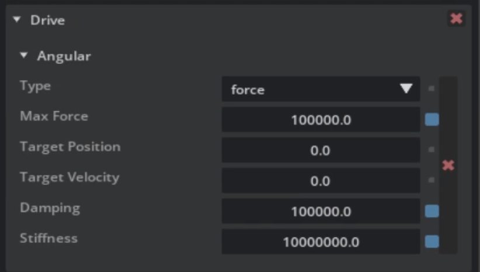


# isaacsim 老是崩溃

检查资产结果，设置有没有问题，可以从日志中得知问题所在


# script-node

[script-node](https://docs.omniverse.nvidia.com/extensions/latest/ext_omnigraph/node-library/nodes/omni-graph-scriptnode/scriptnode-1.html#script-node)

改节点允许执行任意的 python 代码，并且可以在代码中定义一下的回调函数：

* setup(db)：在首次计算前或按下重置按钮后调用

* compute(db)：每次节点计算时调用（必须始终定义） 

* cleanup(db)：节点被删除或按下重置按钮时调用 

可用变量： 

* db (og.Database)：节点接口，其属性可通过：
    * db.inputs.foo 等方式访问 
    * db.log_error、db.log_warning 报告问题 
    * og：omni.graph.core 模块 import 语句、函数/类定义和全局变量可置于回调函数之外，还可向 db.internal_state 状态对象添加变量。


# 启动仿真的时候，机器人会爆炸

如果你的机器人在启动模拟时发生爆炸，很可能是初始状态存在碰撞，例如机器人与其他物体发生碰撞，或者机器人自身的碰撞几何体设置不正确。你可以使用场景面板中的碰撞查看器工具来可视化机器人的碰撞几何体。碰撞几何体应是机器人视觉几何体的简化版本。你可以使用碰撞查看器工具调整机器人的碰撞几何体。有关更多信息，请参阅《碰撞查看器》。


# 重新设置资源

[重新设置资源](https://docs.isaacsim.omniverse.nvidia.com/4.5.0/robot_setup/robot_setup_tips.html#reparenting-assets)

该功能用于重新设置什么叫 “重父级”？什么叫 “资源重父级”？

先讲人话：

父级 = 爸爸

子级 = 孩子

在 3D 软件里，所有物体都可以有**父子关系**：

- 爸爸动，孩子跟着动
- 孩子动，爸爸不动

比如：

- 车身是爸爸

- 车轮是孩子

    

    车身移动 → 车轮跟着走

------

3. 重父级（Reparent）= 换爸爸

**重父级 = 把一个物体从原来的 “爸爸” 下面，挪到另一个 “爸爸” 下面。**

例子：

原来结构：

```plaintext
车身
  └─ 车门
```

你把车门拖到 “车顶” 下面，变成：

```plaintext
车身
  └─ 车顶
      └─ 车门
```

这就叫 **重父级**。

资源重父级（Reparenting Assets）

就是对**模型、零件、资源**执行 “换爸爸” 操作。

------

5. 文档里那个选项到底干嘛用？

文档里说的关键选项：

> **Keep Prim world Transform when reparenting**
>
> 重父级时保持世界坐标不变

它解决一个超级烦人的问题：

### 不勾选：

你把零件换爸爸 → **零件会瞬间瞬移、错位、飞出去**

因为它会跟着新爸爸的坐标系走。

### 勾选：

你把零件换爸爸 → **零件原地不动**

只是父子关系变了，位置不变。


# Articulation Tendons 关节肌腱

[Articulation Tendons](https://nvidia-omniverse.github.io/PhysX/physx/5.6.0/docs/Articulations.html#articulation-tendons)

Tendons create constraints within articulations. There are two types: *Fixed* and *Spatial*.肌腱在关节处形成约束。分为两种类型：*固定型*和*空间型*。


## fixed tendon 和 mimic joint 之间的区别

Fixed Tendon（固定肌腱）和 Mimic Joint（模拟关节）**核心区别：约束目标、自由度关系、实现原理、适用场景完全不同**——Fixed Tendon 是**几何距离 / 角度硬约束**，Mimic Joint 是**自由度间的线性函数绑定**。下面从本质、用法、参数、例子、性能 5 个维度讲透，一眼分清：

### 一、核心本质（一句话区分）

- **Fixed Tendon（固定肌腱）**：**约束连杆上附着点之间的距离 / 长度**，强制保持固定值，本质是**几何约束**，不直接绑定关节角，只限制空间位置。
- **Mimic Joint（模拟关节）**：**强制两个关节的自由度（角度 / 位移）满足固定线性关系**（q₁ = k・q₂ + b），本质是**自由度耦合约束**，直接绑定关节运动。

### 二、详细对比（表格最清晰）

| 维度           | Fixed Tendon (固定肌腱)                                      | Mimic Joint (模拟关节)                               |
| -------------- | ------------------------------------------------------------ | ---------------------------------------------------- |
| **约束对象**   | 连杆上的**附着点（Attachment Points）**                      | 两个关节的**自由度（DOF：角度 / 位移）**             |
| **约束逻辑**   | 强制两点间距离 = 固定长度（不可变）                          | 强制：`q_A = gain × q_B + offset`（线性方程）        |
| **自由度影响** | 间接限制关节运动（通过空间几何），不直接绑定关节角           | 直接锁定关节间的运动比例，一个动另一个必按公式动     |
| **拓扑要求**   | 可跨任意连杆（树内任意两点），不要求父子 / 相邻              | 必须是**同一 Articulation 内的两个关节**，无拓扑限制 |
| **实现原理**   | 求解时修正附着点距离，保持长度不变                           | 求解时把两个自由度合并，按线性方程同步更新           |
| **参数核心**   | 附着点坐标、固定长度、刚度 / 阻尼                            | gain（比例系数）、offset（偏移）、阻尼               |
| **典型场景**   | 肌肉 / 绳索 / 拉杆（长度固定）、机械连杆硬限位、布娃娃肢体长度锁定 | 齿轮、齿条、夹爪、差速器、双关节同步（如手指联动）   |
| **是否可驱动** | 不可直接驱动，仅被动约束                                     | 可配合驱动，按比例同步驱动两个关节                   |
| **性能开销**   | 较高（空间距离约束，需计算多点）                             | 较低（纯自由度线性绑定，计算简单）                   |

### 三、直观例子（一看就懂）

#### 1. Fixed Tendon 例子：机械臂拉杆 / 布娃娃手臂

- 场景：机械臂上臂和前臂之间有一根**长度固定的拉杆**，限制肘关节最大张开角度；或布娃娃手臂，强制上臂 - 前臂长度不变。
- 做法：在上臂、前臂各设一个附着点，Fixed Tendon 强制两点距离 = 拉杆长度。
- 效果：肘关节转到极限时，拉杆 “绷紧”，阻止继续张开；关节在范围内自由动，拉杆不影响。

#### 2. Mimic Joint 例子：齿轮 / 夹爪 / 双指

- 场景 1：齿轮传动，A 齿轮转 30°，B 齿轮必须转 - 60°（gain=-2，offset=0）。
- 场景 2：夹爪，左爪张开角度 = 右爪张开角度（gain=1，offset=0），同步开合。
- 做法：给两个旋转关节加 Mimic Joint，设 gain=1、offset=0。
- 效果：驱动其中一个关节，另一个**严格按比例同步运动**，完全绑定，无误差。

### 四、关键细节补充

1. 约束强度
    - Fixed Tendon：是**软约束（可加刚度 / 阻尼）**，极端情况会有微小拉伸（类似弹簧），可调节刚度。
    - Mimic Joint：是**硬约束（默认严格）**，几乎无误差，可加阻尼防振荡。
2. 创建时机
    - 两者都**只能在 Articulation 加入场景前创建 / 修改**，加入后不可改。
3. 与关节驱动的配合
    - Fixed Tendon：不影响关节驱动，驱动关节时，肌腱只在达到长度极限时起作用。
    - Mimic Joint：驱动**主关节**，从关节自动跟随；也可同时驱动，但会按公式叠加。
4. 适用边界
    - 要**绑定关节运动比例、齿轮 / 同步机构** → 用 **Mimic Joint**（简单、高效、精准）
    - 要**限制连杆空间距离、模拟绳索 / 拉杆 / 肌肉长度** → 用 **Fixed Tendon**

### 五、一句话速记

**Mimic Joint 绑关节角（按公式动），Fixed Tendon 绑点距离（按长度限）**


# 机械臂夹爪组装到底盘上之后，夹爪开合无法一次性到达 target position 

解决办法：将机械臂和底盘分别作为单独的 articulation


# 全向轮底盘在装上机械臂之后出现转弯的时候会飞起来

主要原因，轮子的速度太大了，降低转弯的速度即可


# 为什么组装起的机器人的两个部件会发生子碰撞

这个由很多个原因产生，首先是 filter Pairs ，然后是 collision group (通常机器人直接使用 filter pair 即可)


### isaac sim 的 filter pair 和 collision group 是什么关系，他们之间是啥玩意


# Action Graph Node library 文档

[omnigraph-short-node-library](https://docs.omniverse.nvidia.com/extensions/latest/ext_omnigraph/node-library/node-library.html#omnigraph-short-node-library)


# 最佳的机器人 Prim 结构

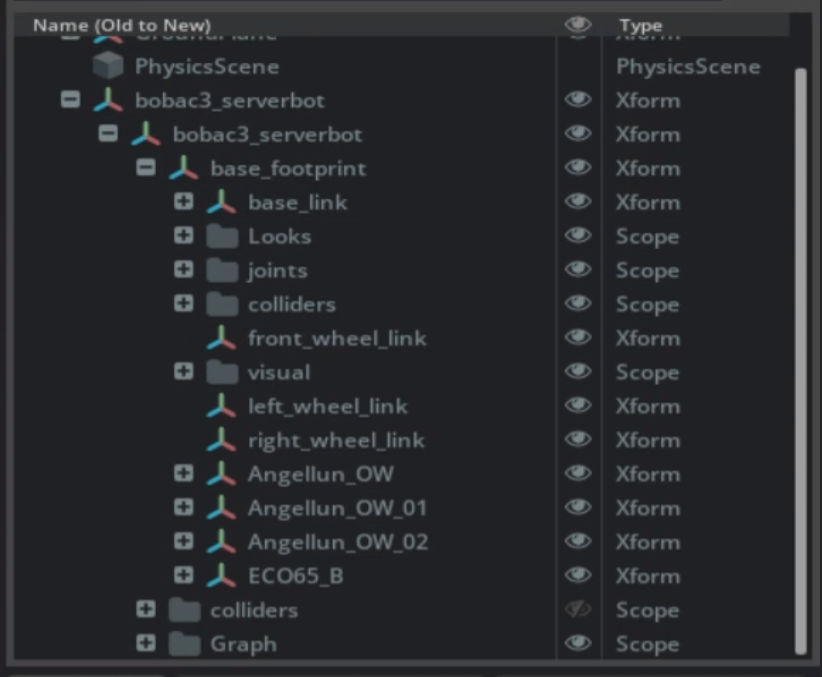

* 整个机器人的集合 prim
    * 机器人底盘（articulation root）
        * 雷达
        * 传感器
    * 机器人配件
        * 全向轮
        * 万向轮
    * 机器人机械臂（articulation root）
        * 机械臂夹爪


# tf 树应该如何设置？

一般情况下我们会在 omnigraph 中使用 **ROS2Publish Transfom Tree Node** ，其中 targetPrims 我们一般直接设置为具有 articualtion root 属性的 prim ，这样 Publish Transform Tree 这个节点就会帮我们自动去遍历这个 articulation root 下的所有 link （固定或者铰接在该具有 articualtion root 的 prim 下的所有 link）

而 bobac 机器人，因为我们将 机械臂 和 底盘 视为了两个独立的 关节体（articulation）因此我们需要单独简历两个关节体的关系，如下图：

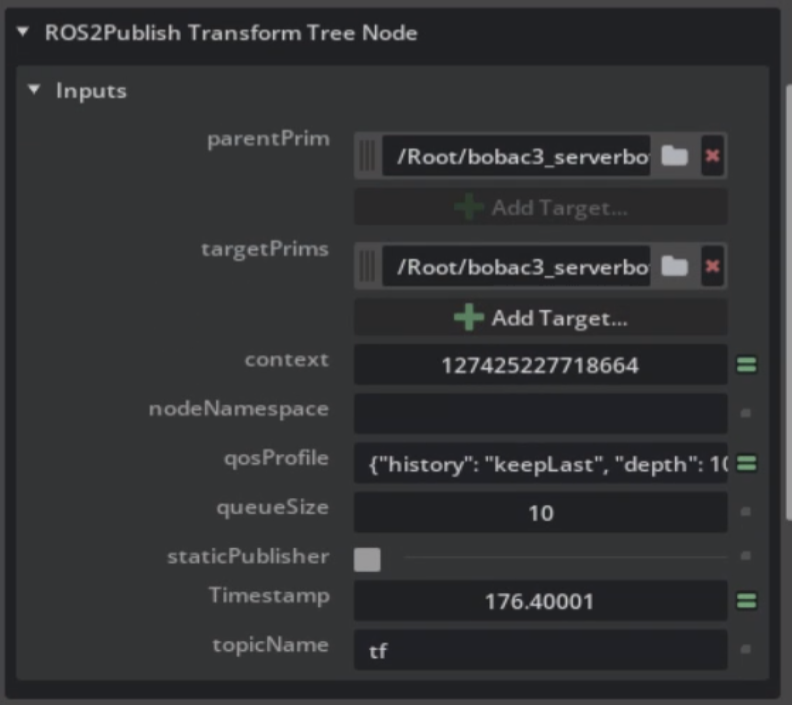

其中 targetPrim 依旧是设置 底盘 的 base link ，parentPrim 设置 机械臂 基座的 base_link_arm 作为其子亲戚 tf 节点

（注意：这里建立的 父子亲戚关系 的 tf 节点会和 当前机器人 的资产 Prim 结构的关系有关）


## 为什么 isaacsim 4.5 中建立的 父子亲戚关系的 tf 节点(ROS2Publisher Transform Tree Node)会和 当前机器人 的资产 Prim 结构的关系有关，比如说我的机械臂(articulation root)当将资产放到了与底盘 base_link (articualtion root)同级的位置的时候， tf 树是正常的，而当放到与底盘 base_link (articulation root)为父级关系的 link 同级的时候，tf 树就不正常了，变成了机械臂基座 base_link_arm 的 tf 指向 base_link，而这两种情况的 ROS2Publisher Transform Tree Node  的参数配置都是一样，都是 target prim 为 base_link 而 parent prim 为 base_link_arm


## 现在我的资产的 graph 放到了与我机器人同级的情况，即在 /bobac3_severbot 这个 link 之下，此时的 tf 树下的 odom 是处在 world 和 base_link 之间的，如第一张图所示 但是当讲 graph 放到了机器人内的时候，即 /bobac3_serverbot/bobac3_serverbot 这个 link 之下，此时，tf 树种的 odom 并没有和我的机器人 base_link 相连，如第二张图所示 这就让我有点疑惑了，就是这个 Stage 中的 link 结构到底要怎么理解？为什么有些 prim 放到不同的 link 下就会有不同的效果（结果）？


# Isaacsim组装机械臂教程

[isaacsim 组装机械臂教程](https://docs.isaacsim.omniverse.nvidia.com/5.0.0/robot_setup_tutorials/tutorial_import_assemble_manipulator.html)


# 为什么 articulation controller 需要指定 articulation(关节体)才能控制，而不是直接指定整个机器人的 group ?

原话解答：In Isaac Sim (and USD/PhysX), the articulation is the prim that actually has the ArticulationRoot API and the joint/rigid-body hierarchy. Controllers and the Joint State publisher look for that specific prim; they don’t automatically search children.

这是因为 **关节体** 是实际拥有 关节根（articulation root）和 刚体 （rigid-body）的 prim ，控制器会根据整个 关节体 来进行查找其中的子关节


# IsaacSim 快速学习

[quickstart](https://docs.isaacsim.omniverse.nvidia.com/5.1.0/introduction/quickstart_isaacsim.html#isaac-sim-app-intro-quickstart)

## Basic Robot Tutorial 

[Basic Robot Tutorial ](https://docs.isaacsim.omniverse.nvidia.com/5.1.0/introduction/quickstart_isaacsim_robot.html#isaac-sim-app-intro-quickstart-robot)


# 学习教程表

[tutorial_list](https://docs.isaacsim.omniverse.nvidia.com/5.1.0/introduction/tutorial_list.html)


# 仿真任务参考

[reference_architecture](https://docs.isaacsim.omniverse.nvidia.com/5.1.0/introduction/reference_architecture.html)


# 调节关节驱动增益

只有 5.1.0 版本才适用

[Tuning Joint Drive Gains](https://docs.isaacsim.omniverse.nvidia.com/5.1.0/robot_setup_tutorials/joint_tuning.html)


# 资产结构

[资产结构](https://docs.isaacsim.omniverse.nvidia.com/5.1.0/robot_setup/asset_structure.html#asset-structure)

Isaac Sim 导入的资产按照特定结构进行组织，每个资产都被分解为多个组件，可分为以下几类：
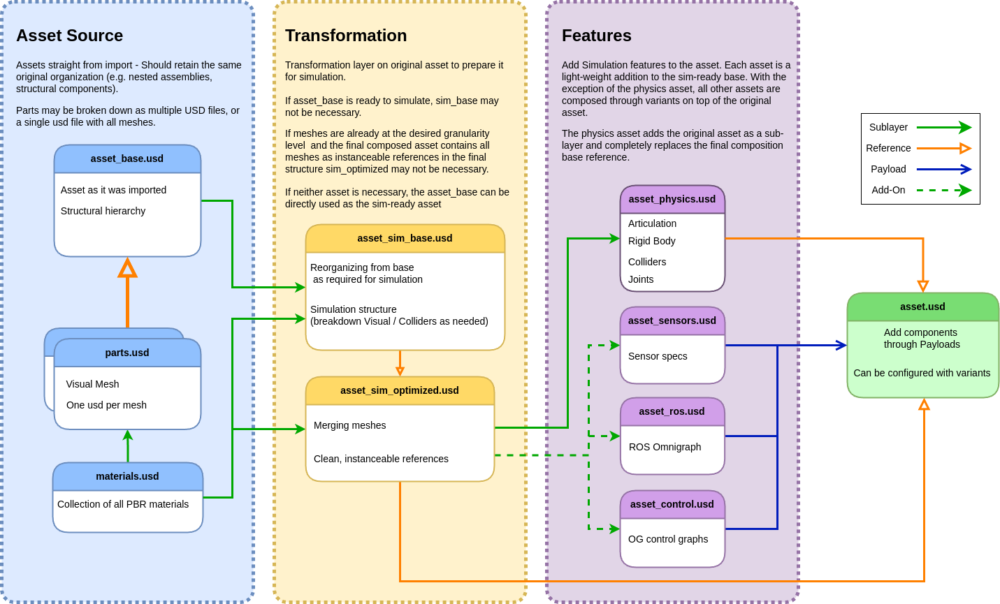


# 装配闭合结构

[adding-mimic-joint](https://docs.isaacsim.omniverse.nvidia.com/4.5.0/robot_setup/rig_closed_loop_structures.html#adding-mimic-joint)


# 物理

[physics](https://docs.isaacsim.omniverse.nvidia.com/4.5.0/physics/index.html#physics)


# 关节与机器人仿真稳定性指南

[articulation-and-robot-simulation-stability-guide](https://docs.omniverse.nvidia.com/kit/docs/omni_physics/latest/dev_guide/guides/articulation_stability_guide.html#articulation-and-robot-simulation-stability-guide)


# 为相机位姿发布 TF 树

[publish-a-tf-tree-for-the-camera-pose](https://docs.isaacsim.omniverse.nvidia.com/4.5.0/ros2_tutorials/tutorial_ros2_camera_publishing.html#publish-a-tf-tree-for-the-camera-pose)


# 关节控制器（articulation controlller）

[articulation-controller](https://docs.isaacsim.omniverse.nvidia.com/5.1.0/robot_simulation/articulation_controller.html#articulation-controller)


# 关节体（articulation）

[articulation-drive-stability](https://nvidia-omniverse.github.io/PhysX/physx/5.6.0/docs/Articulations.html#articulation-drive-stability)


# 固定肌腱（fixed tendon）

[fixed tendon api](https://nvidia-omniverse.github.io/PhysX/physx/5.6.0/_api_build/classPxArticulationFixedTendon.html#_CPPv425PxArticulationFixedTendon)


# 网格几何体碰撞体

[mesh-geometry-colliders](https://docs.omniverse.nvidia.com/kit/docs/omni_physics/latest/dev_guide/rigid_bodies_articulations/collision.html#mesh-geometry-colliders)

> | Mesh Approximation 网格近似                                  | Implied Collision Geometry 隐含碰撞几何体                    |
> | ------------------------------------------------------------ | ------------------------------------------------------------ |
> | UsdPhysics.Tokens.none Usd物理。代币。无                     | [Triangle Mesh 三角网格](https://docs.omniverse.nvidia.com/kit/docs/omni_physics/latest/dev_guide/rigid_bodies_articulations/collision.html#createmeshcollider) |
> | UsdPhysics.Tokens.meshSimplification Usd物理。令牌。网格简化 | [Triangle Mesh 三角网格](https://docs.omniverse.nvidia.com/kit/docs/omni_physics/latest/dev_guide/rigid_bodies_articulations/collision.html#createmeshcollider) |
> | UsdPhysics.Tokens.convexHull Usd物理。代币。凸包             | [Convex Hull 凸包](https://docs.omniverse.nvidia.com/kit/docs/omni_physics/latest/dev_guide/rigid_bodies_articulations/collision.html#createmeshcollider) |
> | UsdPhysics.Tokens.convexDecomposition Usd物理。令牌。凸分解  | [Convex Hulls 凸包](https://docs.omniverse.nvidia.com/kit/docs/omni_physics/latest/dev_guide/rigid_bodies_articulations/collision.html#createmeshcollider) |
> | UsdPhysics.Tokens.boundingSphere Usd物理。令牌。边界球体     | [Sphere 球体](https://docs.omniverse.nvidia.com/kit/docs/omni_physics/latest/dev_guide/rigid_bodies_articulations/collision.html#createmeshcollider) |
> | UsdPhysics.Tokens.boundingCube Usd物理。代币。边界立方体     | [Box 立方体](https://docs.omniverse.nvidia.com/kit/docs/omni_physics/latest/dev_guide/rigid_bodies_articulations/collision.html#createmeshcollider) |
> | PhysxSchema.Tokens.sdf (using `PhysxSchema.PhysxSDFMeshCollisionAPI`)PhysxSchema.Tokens.sdf（使用 `PhysxSchema.PhysxSDFMeshCollisionAPI`） | [Signed Distance Field 有符号距离场](https://docs.omniverse.nvidia.com/kit/docs/omni_physics/latest/dev_guide/rigid_bodies_articulations/collision.html#createsdfcollider) |

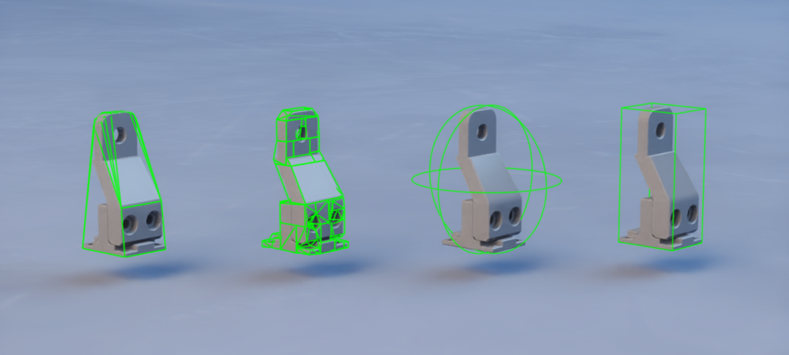

*Figure 2* Convex approximation options from left to right: convex hull, convex decomposition, bounding sphere, and bounding cube.图2 凸近似选项（从左到右）：凸包、凸分解、包围球和包围立方体。


# 配置碰撞过滤

[configure-collision-filtering](https://docs.omniverse.nvidia.com/kit/docs/omni_physics/latest/dev_guide/rigid_bodies_articulations/collision.html#configure-collision-filtering)


# 当我使用 ROS2Publisher Transform Node 来发布两个关节体的 tf 转换的时候，但是将 target prim 设置为 底盘的 base_link ，还是不会在 tf 树中自动的看到所有的关节啊，连 机械臂的 base_link_arm 的 tf 都没有，但是为什么到了这里的 target prim 的时候，反而就能遍历出所有的关节，并认为他们完全是同一个关节体内的呢


# 在 isaacsim 中的 link 中的 Instanceable 这个选项是什么意思？勾选上了有什么用，他具体是什么作用？

Instanceable （实例化共享）：这个功能是用于节省渲染资源，因为一个机器人有的很多相似的部分，这些在 isaac 中是重复的内容，这是一种渲染资源的浪费，因此，isaac 提供了一个渲染资源共享的功能，而 instance able 就是这个功能

功能的整体作用：

1. **原型与实例分离**：标记为 Instanceable 的 link 会创建一个**共享原型**（prototype），场景中所有该 link 的实例都仅引用这个原型，不复制完整数据
2. **数据共享范围**：共享内容包括**几何网格、材质、纹理**等静态资源，而**变换、物理状态**等动态属性仍保持独立
3. **视觉标识**：在 Isaac Sim 中，实例化的 prim 会显示蓝色 “I” 图标，提示这是引用而非独立副本Isaac Sim


## 为什么有的时候我的机器人部件 link 下的子 prim 勾选了 instanceable 的时候，机器人在运动的时候，这部分部件并不会按照机器人正常的运动方式动呢，而是静止在一个地方？

首先确定一个机器人资产的 stage 结构：

```
/夹爪_左手指 (Link本体：带关节、刚体、运动逻辑)
   └─ Visuals (分组节点)
       └─ Mesh (视觉网格：你手动给这个Mesh勾了Instanceable)
```

 

一、为什么勾了 Instanceable，视觉就不动了？（底层硬规则，有官方依据）

> **USD 官方文档明确规定**：
>
> 手动给**子级 Mesh**设置 `Instanceable` 后，这个 Mesh 会变成**独立的原型引用**，**自动丢失父级的变换继承**
>
> 简单说：**父 Link 动，子实例化 Mesh 不会跟着动！**


二、 当我这个 prim 之下的 visuals 和 collision 设置了 instanceable 的时候，夹爪碰到抓取物的时候会穿模，而当我将这个 instanceable 取消的时候，又不会穿模了这是为什么

> 

✅ **渲染层面**：确实是共享模型、各自独立物理，没问题

❌ **PhysX 物理层面（Isaac Sim 用的）**：

**碰撞几何体一旦实例化 = 物理直接废掉**

这是 **NVIDIA PhysX 硬限制**，不是 bug，是引擎不支持。


三、为什么 PhysX 不认可实例化碰撞网格？

1. PhysX 的碰撞检测机制核心需求

PhysX 需要为每个动态物体的碰撞体维护**独立的物理状态数据**，包括：

- 碰撞形状的世界变换（位置、旋转、缩放）
- 接触点缓存
- 碰撞响应状态
- 材质属性（摩擦、 restitution）

**实例化碰撞网格的致命问题**：所有实例共享同一个原型几何数据，PhysX 无法为每个实例维护独立的物理状态，导致碰撞检测系统无法区分不同实例的碰撞边界。


# Moveit 控制机械臂流程

## 有控制规划的整体控制流程

1. 初始化配置参数（URDF、SRDF、kinematics、ompl等等）
2. 目标点
3. 路径规划
4. 逆解


# 桌面法向是什么？

法向：完全垂直于一个平面的方向

桌面法向：垂直于桌面平面的方向


举个直白例子

1. 普通水平桌子：

    

    桌面平平铺在地上，

    桌面法向 = 纯竖直上下方向

    （朝上为正法向）；

2. 倾斜工作台：

    

    桌子是斜的，那法向也会跟着斜，

    永远和桌面板面呈 90° 直角

    。

配套区分：

- 平行桌面 = 切向（前后、左右）
- 垂直桌面 = 法向（上下）


**幻想模型：通过学习到的物品经验的大概方式来学习其大概的 3D 模型大小**

**全感传感器：能够模拟人的神经感受方式，感受温度，触觉等感觉，让机械臂能够自行建立起碰撞空间**


# PCA 是什么算法，它用来干嘛？PCA 点云法向估计是怎么做的？

PCA 算法是一个用于降维的算法，而它的降维方法则是通过找到另一个协方差与方差最小的那个坐标轴，然后通过记录坐标轴的位置和角度以及相应的这部分的点相对于这个新的坐标轴的 一个轴的 标量，

PCA的主要思想是将n维特征映射到k维上，这k维是全新的正交特征也被称为主成分，是在原有n维特征的基础上重新构造出来的k维特征。PCA的工作就是从原始的空间中顺序地找一组相互正交的坐标轴，新的坐标轴的选择与数据本身是密切相关的。其中，第一个新坐标轴选择是原始数据中方差最大的方向，第二个新坐标轴选取是与第一个坐标轴正交的平面中使得方差最大的，第三个轴是与第1,2个轴正交的平面中方差最大的。


# 为什么多激光雷达还要做标定

首先我们要明白标定这个有什么作用？标定其实就是获取传感器的数据与实际的数据之间的差别，差了多少，多了多少，知道了这些，我们才能纠正传感器之间数据的差距，确保传感器获取的数据是有用的

而多激光雷达数据的标定实际上就是因为两个激光雷达之间的位置有差别，因此他们之间采集的数据也会有位置上的偏差在，同时由于这个位置的偏差，如果将他们当作是在同一坐标系下看到的数据，那么就会有一个障碍物在某个地方，而在另一个传感器看来他在另一个地方，就完全失真了，因此，我们需要激光雷达标定，让两个处于不一样坐标系位置的激光雷达重新回到同一个坐标系下，让多个激光雷达之间采集的数据都是真实有效的

#### 终极极简总结

1. 雷达各自以自己为原点，坐标不通用；
2. 硬件安装必然有位置、角度差；
3. 标定 = 补这个位置角度差、统一坐标系；
4. 不标定，融合毫无意义；
5. 只有完美同轴同位安装，才免标定，现实不存在。


# 多激光雷达数据融合具体的操作是怎么样的？

时空对齐、坐标转换、点云配准、数据合并与优化

多激光雷达数据融合的核心操作可概括为：**先标定（内外参）→ 再同步（时空）→ 预处理（清洗去噪）→ 坐标转换→ 点云配准→ 数据融合→ 后处理优化**。通过这一系列操作，将多个独立的局部点云数据转化为一个全局一致、信息丰富的三维点云模型，显著提升环境感知能力和数据可靠性。


# 要怎么验证融合激光雷达的数据是正常的？


# isaacsim 输出的两个雷达没有数据

没关系，这是因为


# Nodelet 是什么东西？

[ROS技术：Nodelet学习（强烈推荐） - 知乎](https://zhuanlan.zhihu.com/p/422745030)

Ros 通过 XML-RPC 的方式传输数据，而通过这种方式传输数据会存在一定的延时和阻塞，但是在图像流和点云等数据量大的消息，或者执行实时性的任务的时候，因为传输而耗费的时间就不得不考虑，而 Nodelet 则就是为了改善这个状况设计的

它提供了一种方法，可以让多个算法程序在一个进程中用 shared_ptr 实现**零拷贝通信**，以降低因为传输大数据而损耗的时间


```
ros2 run laser_scan_fusion laser_scan_fusion_node --ros-args \
  -p front_topic:=/point_cloud_front \
  -p rear_topic:=/point_cloud_rear \
  -p scan_destination_topic:=/fuse_laser_scan \
  -p destination_frame:=fuse_lidar_link \
  -p tf_timeout:=0.5 \
  -p queue_size:=10 \
  -p use_sim_time:=True

```


# 为什么激光雷达数据融合需要将激光雷达的数据转为点云，然后才开始融合？最后融合完再转回激光雷达数据，为啥要这样？为啥都绕不过点云数据

因为激光雷达实际传输的数据是**按照固定角度格子存的测距数组**，

- 它是**极坐标格式**：角度起点、角度步长、每一格对应一个距离值
- 自带**固定角度网格**：第 0 个点对应最小角，第 1 个角 + 增量…… 依次排满
- **天生绑定自身雷达局部坐标系**

致命问题：

1. 两台雷达**安装位置不一样、朝向不一样**

2. 两台雷达**起始角度、角度增量、采样点数可能都不一样**

3. 一个是正前方 0 度起，一个是侧面 90 度起

    你拿两个错位、角度网格还不一样的 LaserScan，根本没法直接数组相加 / 拼接

就像两张**格子大小不一样、原点还错位**的表格，你没法直接叠在一起。


# 点云是什么？为什么它能解决问题？

点云（PointCloud/PointCloud2）是**笛卡尔直角坐标系**：

每一个点就是 `(x,y,z)` 真实空间坐标，**没有角度网格、没有固定排布**。

优势：

1. 可以通过**TF 坐标变换**，把所有雷达的点全部转到**同一个基坐标系**（比如 base_link /cart_frame）
2. 不管原雷达角度怎么偏、点数多少、分辨率多少，转成 `x,y` 后**都是统一空间下的离散点**
3. 直接在空间里把所有雷达的点**堆在一起**，就是天然融合

👉 **点云是通用中间语言，抹平了不同雷达、不同安装位置、不同参数的差异**

这就是绕不开点云的根本原因。


# holonomic Controller 

[holonomic controller](https://docs.isaacsim.omniverse.nvidia.com/6.0.0/py/source/extensions/isaacsim.robot.wheeled_robots/docs/ogn/OgnHolonomicController.html#holonomic-controller)


# Articulation root 要怎么设置?

Articulation（关节链）本质是减缩坐标仿真系统，用 “根刚体姿态 + 关节角度” 描述整个机械系统，而非每个刚体的世界坐标USD。Articulation Root 的核心作用是：
1.标记关节链的计算起点，建立减缩坐标的参考系
2.告诉仿真引擎：“这个子树下的所有关节和刚体，要用减缩坐标算法模拟”
3.决定根刚体的选择（固定 / 浮动基座的关键）

| 对比维度       | 祖先节点（如根 Xform）                            | base_link（根刚体）                         |
| -------------- | ------------------------------------------------- | ------------------------------------------- |
| **Prim 类型**  | 通常是 Xform（非刚体）                            | 必须是 Rigid Body（带碰撞、质量属性）       |
| **根刚体选择** | Isaac Sim**自动分配**最优根刚体，最小化关节树深度 | **手动指定**根刚体，完全控制运动学起点      |
| **计算效率**   | 自动优化，通常更高                                | 可能因关节树深度增加而略低                  |
| **兼容性**     | 符合 Isaac Sim 官方资产标准，适配性好             | 需手动处理关节链完整性，ROS2 TF 树更易对齐  |
| **适用场景**   | 通用机器人仿真、多关节链系统                      | 精确控制根坐标系、ROS2 集成、特殊动力学需求 |

总结：两种设置都有效，核心区别在于根刚体的选择方式（自动 vs 手动）。只要满足 “根节点是所有关节和刚体的共同祖先”，仿真就能正常运行。

依据：

[依据1](https://docs.isaacsim.omniverse.nvidia.com/5.0.0/robot_setup_tutorials/rig_mobile_robot.html?f_link_type=f_linkinlinenote&flow_extra=eyJkb2NfcG9zaXRpb24iOjAsImRvY19pZCI6IjkxZGJkNmZmYTM1ODMxODItZjIyNTk2OThlOGE1OWQ4MyIsImlubGluZV9kaXNwbGF5X3Bvc2l0aW9uIjowfQ%3D%3D#add-articulations):

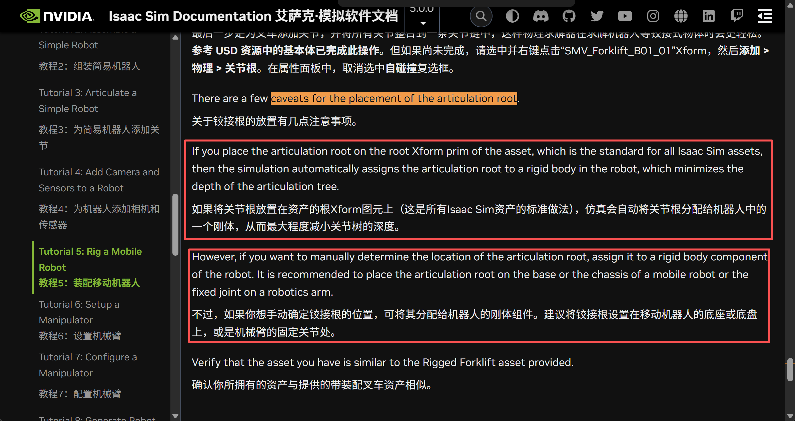


[依据2](https://forums.developer.nvidia.com/t/how-fix-the-tf-tree-articulation-root-problem-i-tried-to-find-the-articulation-root-in-the-raw-usd-property-tab-but-i-cannot-find-it/270595)		


# 关节链是什么?

## 1 先记住三个最基础概念（人话版）

### 1）Link（刚体连杆）= **骨头**

机器人每一块实心零件，比如底盘、大臂、小臂、轮子。

特点：

- 是**实体**
- 有重量、有碰撞、有形状
- 自己不会变形，是**刚体**

### 2）Joint（关节）= **软骨 / 转轴**

用来**把两根骨头连在一起**，限制怎么转、怎么动。

### 3）**关节链 Articulation = 一整串连起来的骨头 + 关节**

只要：

**骨头 → 关节 → 骨头 → 关节 → 骨头……**

这样一串**互相被关节锁住、连成一体**的整套结构，

就叫：**关节链 / Articulation**

#### 举个例子

机械臂：

底座骨头 → 关节 → 大臂骨头 → 关节 → 小臂骨头 → 关节 → 末端

这一整套连起来，**就是一条关节链**。

------

## 2 Articulation Root 到底是干啥的？

人话：

**Articulation Root 就是给这一整条关节链「画个圈 + 定起点」**

作用两件事：

1. 画圈：告诉物理引擎

> **从我这个节点往下所有子孙，全部属于同一条关节链，你按整体动力学算**

1. 定起点：物理引擎要从

    某一根骨头

    开始，整串往下推算运动、受力、关节角度。

    

    这根被当作

    起点的骨头

    ，叫

    根刚体 root link

    。

------

## 3 关键来了：Root 可以放两个地方，区别在哪？

### 情况 A：Root 放在最顶层「祖宗空文件夹」(Xform，不是骨头)

结构长这样：

```
/World/机器人(空文件夹，无物理，只是归类)  ← 你把Root放这
   └ base_link(底盘骨头，刚体)
      ├ 关节1
      ├ 大臂骨头
      └ ...
```

你在**空文件夹**上打了 Articulation Root：

- 你只是**画了一个大圈**：下面所有东西都是一条关节链
- **你没指定谁是起点骨头**
- 于是 PhysX/Isaac 自己进去遍历整串骨头，**自动挑一根最合适的骨头当起点**（一般就是 base_link）

✅ 这就是别人说的：

> 放祖宗节点，自动选最优根刚体

**本质：你画圈，引擎帮你选起点骨头。**

------

### 情况 B：Root 直接放在 base_link（本身就是骨头 / 刚体）

```
/World/机器人
   └ base_link(底盘骨头 + 你直接把Root打在这)
```

意思变成：

> **不用你帮我选，我手动指定：就以 base_link 这根骨头当整条链的起点**

**本质：你既画圈，又亲自指定了起点骨头。**

------

## 4 为什么 Root 不能随便放到「不是刚体的空 prim」上？

分两层，超级好懂：

### 1）空 Xform 是什么？

只是一个**文件夹、收纳盒**，

**不是骨头、没有重量、没有碰撞、不是实体**。

### 2）物理引擎算关节链必须要有一根「起始骨头」

关节链动力学，必须从**一根真实有质量的骨头**开始往下算。

如果你把 Root 放在一个：

- 没有任何子骨头
- 下面全是空文件夹

的 prim 上：

引擎扫了一圈：

> 你给我画了个圈，但圈里**一根骨头都没有**，我没法算关节链！
>
> 直接报错。

#### 总结一句话

Root 可以放在非刚体（文件夹）上做 “画圈”，

但这个文件夹下面，必须至少有一根真实刚体骨头给引擎当起点。

如果你放在一个下面**完全没有骨头**的空 prim → 直接报错。

------

## 5 你现在所有疑惑一句话浓缩

1. **关节链** = 被关节串起来的一整串机器人骨头
2. **Articulation Root** = 给这条链**画圈**，并决定**从哪根骨头开始算**
3. 放顶层祖宗节点：**只画圈，引擎自动选最合适的骨头当起点**
4. 放 base_link：**画圈 + 强制指定这根骨头当起点**
5. 不能放无刚体的空节点：圈里没骨头，物理引擎没法开工


## 但他的关节链的所有关节以及link 到底是怎么链的？怎么知道谁在前谁在后的？

[关节树结构](https://docs.omniverse.nvidia.com/kit/docs/omni_physics/latest/dev_guide/rigid_bodies_articulations/articulations.html#articulation-tree-structure)

关节链谁在前、谁在后，根本不看 USD 层级的父子关系，只看每一个 Joint 内部写死的 body0 和 body1

物理引擎铁规则

**永远固定：body0 是父刚体，body1 是子刚体**

连接关系：

```
body0 连杆 → 关节 → body1 连杆
```

**这就是前后顺序，写死在关节里，引擎按这个认。**

### 引擎怎么把零散的关节 + 连杆 串成一整条关节链？

步骤超级简单，就三步：

#### 第一步：Articulation Root 先画个圈

Root 放在哪个祖宗节点，就规定：

**只在这个节点下面的所有 prim 里搜索**

不搜外面的机器人、不搜地面。

#### 第二步：遍历圈内所有 Joint 和 RigidBody

引擎把圈里所有：

- 刚体 link

- 关节 joint

    

    全部收集出来。

#### 第三步：顺着 body0 ↔ body1 做「连通图」

引擎做一件事：

从任意一个 link 出发，顺着所有关节的 body0、body1 往外找：

- A 关节连 base→arm1
- B 关节连 arm1→arm2
- C 关节连 arm2→gripper

引擎自动把它们串成：

```
base → arm1 → arm2 → gripper
```

**这就是整条关节链的先后顺序**

#### 重点

不是按 USD 文件夹层级排的，

是**按关节互相引用的 body0/body1 连通关系**自动拼出来的一条链。

### Articulation Root 到底参与了什么？

它**不负责排序、不负责连接**，只干两件小事：

1. **划定搜索范围**：只在我下面找连杆和关节，别把别的机器人卷进来
2. **告诉 PhysX：这一坨连通的连杆关节，统一用减缩坐标动力学求解**

**Root 不决定谁在前谁在后**

前后顺序，全部由每一个关节的 body0/body1 决定。


### 为什么 Root 放顶层 Xform 也能自动识别整条链？

答：

- Root 圈定范围
- 引擎在范围内扫所有关节
- 按每个关节的 body0/body1 自动连通、自动排成前后顺序
- 再自动选一个最合适的 link 当根起点

### Articulation Root 为啥不能放纯空非刚体

官方报错逻辑 + 源码判断

当你把 Articulation Root 放在一个下面**没有任何 RigidBody** 的空 Xform 上：

PhysX 引擎遍历 Root 子树：

1. 扫描所有后代

2. 统计有多少 RigidBody

3. 数量 = 0 → 直接输出报错：

    ```
    Articulation root has no rigid body in subtree
    ```

底层原理

Articulation（减缩坐标）**数学上必须有至少一个刚体作为拓扑起点**。

纯非刚体 Xform 没有质量、惯性、物理形体，**无法作为关节链的拓扑根基**。

所以：

- Root 可以挂在**非刚体祖宗节点**，
- 但**子树里必须有刚体**，否则引擎无法构建关节链。


# ROS2 Publish Transform Tree

**ROS2 Publish Transform Tree** 是 Isaac Sim ROS2 Bridge 扩展中的**OmniGraph 节点**（非传统 ROS2 节点），用于将 USD 场景中**prim 的位姿变换**发布到 ROS2 的 `/tf` 话题，构建完整的坐标变换树，供 RViz2 等工具可视化与定位使用Isaac Sim。

### 关键区别

- **Publish Transform Tree**：自动遍历**关节链 / 父子关系**，批量发布多个 prim 间的变换
- **Publish Raw Transform Tree**：仅发布**单个指定父 - 子帧**的变换（如 odom→base_link）Isaac Sim

[官方示例](https://docs.isaacsim.omniverse.nvidia.com/latest/ros2_tutorials/tutorial_ros2_tf.html?f_link_type=f_linkinlinenote&flow_extra=eyJkb2NfcG9zaXRpb24iOjAsImRvY19pZCI6IjFmYTNkNTA5MGFlMTBmYTAtMzU4YTJjOTAzMjgxNjFkNyIsImlubGluZV9kaXNwbGF5X3Bvc2l0aW9uIjowfQ%3D%3D)


# Isaac Compute Odometry

#### 作用

从仿真里抓取机器人底盘（chassis）的**真实位姿与速度**，输出里程计核心数据（位置、姿态、线速度、角速度）。

#### 在干什么

- 输入：指定机器人底盘 Prim（如 `/World/turtlebot3_burger`）。
- 计算：
    - 位置：机器人**相对于仿真起始点**的坐标（x/y/z）。
    - 姿态：机器人的四元数（方向）。
    - 速度：三维线速度、三维角速度（真值，无噪声）。
- 输出：打包成内部结构，**直接喂给 ROS2 Publish Odometry 和 ROS2 Publish Raw Transform Tree**。
- 一句话：**它是里程计的 “数据源”，没有它就没有 /odom 和 odom→base_link 的数据**。


# ROS2 Publish Odometry（/odom 消息发布器）

#### 作用

把 Isaac Compute Odometry 算好的数据，转成 ROS2 标准 `nav_msgs/Odometry` 消息，发在 `/odom` 话题上。

#### 在干什么

- 输入：Isaac Compute Odometry 的输出（位姿 + 速度）。

- 配置：

    - `chassisFrameId`：填 `base_link`（机器人本体坐标系）。
    - `odomFrameId`：填 `odom`（里程计坐标系）。

- 发布内容（

    ```
    /odom
    ```

     

    话题）：

    - `header`：时间戳 + `frame_id: odom`。
    - `pose`：`base_link` 在 `odom` 坐标系下的位置 + 姿态。
    - `twist`：`base_link` 的线速度 + 角速度（本体坐标系）。

- 一句话：**它负责发 ROS2 导航需要的 “速度 + 位姿消息”，供 Nav2 等算法用**。


# ROS2 Publish Raw Transform Tree（odom→base_link 的 TF 发布器）

#### 作用

专门发布**无物理父子关系**的坐标系变换，核心是 `odom → base_link` 的动态 TF（必须和 /odom 同步）。

#### 在干什么

- 输入：Isaac Compute Odometry 的输出（位姿）。

- 配置：

    - `childFrameId: base_link`。
    - `parentFrameId: odom`。

- 发布内容（

    ```
    /tf
    ```

     

    话题）：

    - 动态变换：`odom` → `base_link`（随机器人移动实时更新）。

- 为什么必须用它：

    - ROS2 Publish Transform Tree：只发**有物理父子关系**的 TF（如 base_link→激光雷达、base_link→轮子）。
    - `odom` 和 `base_link` **没有物理连接**，只能用 Raw TF 发布。

- 一句话：**它负责补全 TF 树的 “odom→base_link” 关键一环，让 RViz/Nav2 能定位机器人**。


# Ros2 Publish Transform tree Node 输出的 tf 有环，以及 Robot State publish Node 输出指定的关节体的 states 的时候会输出整个机器人关节体的 states

关节体错误：


# IsaacSim action graph 的 Node 不输出 laser data ，有 point_cloud ，但是就是不输出 laser_data

因为在指定的场景中，laser_scan 的话题数据是处于无效状态，都是直接丢弃的状态，因此会出现 point_cloud 有数据，但是 laser_scan 无数据的问题，只有他扫描的值有有效值，他就一定会输出 laser_data 即使很多都是无效的 -1 数据，但他只有有效的数据，他都会输出


# ROS2 的 AMCL 丢雷达的数据，导航功能没办法正常使用

主要会输出的日志：

- `Lookup would require extrapolation ...`
- `Message Filter dropping message ... timestamp ... earlier than all the data in the transform cache`

**真正卡住导航的主因是：AMCL/Costmap 的 message_filter 在大量丢激光（LaserScan），因为在 LaserScan 的时间戳上查不到完整可用的 TF（典型是查 `map/odom/base_link/fuse_lidar_link` 这条链时发生 extrapolation / cache 覆盖不住）。**


## 为什么会这样丢掉？

### ros2 的 tf 数据缓存机制

首先

#### 分为 /tf 和 /tf_static 这样两个话题会不会有影响？


## 为什么设置好了 tf_static 之后，日志还会一直说 Robot is out of bounds of the costmap!

链式反应是这样的：

1. scan 被丢 → AMCL 不能用 scan 更新粒子滤波
     → 定位/TF（map->odom）不稳定或跟不上（即使 map->odom 在发，也可能质量很差）
2. scan 被丢 → costmap 的 obstacle layer 也无法把障碍物投到 costmap
     → costmap 更新失败/射线追踪失败 → 常见日志：
     `Sensor origin ... out of map bounds ... cannot raytrace`
3. costmap 没有有效数据或机器人位姿不正确
     → local_costmap 里机器人“落在地图外”
     → `Robot is out of bounds of the costmap!`
4. DWB 依赖 local_costmap 评估轨迹
     → 全部轨迹都“出了栅格”
     → `No valid trajectories` / `Trajectory Goes Off Grid`


### 为什么还丢 scan ?

需要这样做的原因很“硬”，不是 Nav2/AMCL 的特殊毛病，而是 **坐标变换在数学上必须在同一时间点成立**。你现在的现象可以用一句话解释：

**LaserScan 的时间戳是 2236.41s，但 TF 缓存里最早的 `odom->base_link` 是 2238.72s。你要求系统去计算“2236.41s 时刻雷达在地图里的位置”，但系统只有“2238.72s 之后”的位姿数据——这在物理/数学上无法推出，所以 TF2 只能报错并丢消息。**


## QoS 到底是什么？

QoS（Quality of Service）是 DDS/ROS2 的“传输契约”，决定一条 topic 在网络上传输时的行为，比如：

- **reliability**：可靠投递还是尽力而为
    - `reliable`：尽量保证每条消息送达（可能更慢、排队、重传）
    - `best_effort`：尽力发，丢了就丢了（传感器数据常用）
- **durability**：消息是否“可被后来者拿到”（你说的“缓存/锁存”最相关）
    - `volatile`：只给在线订阅者；订阅晚了就拿不到之前发过的消息
    - `transientLocal`：发布端会保存“最后 N 条”（由 history/depth 决定），**新订阅者一连上就会收到历史消息**（类似 ROS1 latched）
- **history + depth**：保存多少历史
    - `keepLast + depth=N`：只保留最后 N 条
    - `keepAll`：全保留（一般不建议）

这些设置不是“优化项”，而是决定了“订阅者能不能收到数据、能不能补历史”。

## 2) 它和 ROS2 的“缓存机制”、TF2 的关系是什么？

这里要区分两个“缓存”：

### A) DDS/Topic 层面的缓存（由 QoS 决定）

- `volatile`：没有“给后来者补发”的能力
- `transientLocal`：发布端**会保存**最后一条/几条消息，新订阅者一来立刻补发

### B) TF2 自己的缓存（tf buffer）

TF2 里每个节点都有一个 **tf buffer**，里面会存一段时间内的 transform（比如最近 10 秒）。当 AMCL/costmap 收到一条 LaserScan（带 stamp），它会去 tf buffer 里查“在这个 stamp 时刻的坐标变换”。

关键点：**如果订阅者启动时没收到静态外参**（base_link→lidar 这种固定关系），那么 tf buffer 在一开始是空的或时间覆盖不够，就会出现你日志里的：

- `timestamp earlier than all the data in the transform cache`
- `Lookup would require extrapolation`

这不是 TF 树错，是“在那个时间点 TF buffer 里没有对应 transform”。

而 `/tf_static` 之所以能显著降低这类问题，就是因为：

- 静态外参只发一次也行
- 但必须保证**晚启动的订阅者**也能拿到那一次
    → 这正是 `transientLocal` 的用途


# 为什么我使用 ROS2 Qos Profile Node 来设置数据发布的具体缓存逻辑的时候，每次都已经设置好了durability 为 transientLocal 之后，保存重新打开资产之后，他又变成了 volatile 呢？为什么会这样？

有的节点/版本对 durability 的持久化有 bug：UI 看起来能选 transientLocal，但保存到 USD 时没有序列化这个属性（或只序列化一部分 QoS 字段），重载就回到默认。

**解决办法**（绕过 bug）：

- 不用 “Default …” profile，改用 “Custom/Explicit” profile（最有效）


### `createProfile` 不同选项的含义

它不是“开关”，而是“用哪套模板生成 QoS 参数”。

#### `System Default`

用 DDS/ROS2 底层的系统默认 QoS（通常是通用默认值）。
 优点：省事；缺点：不保证符合传感器/静态数据的最佳实践。

#### `Default for publishers/subscribers`

用 Isaac/ROS2 bridge 给“普通 topic”准备的一套默认模板（一般偏 `volatile`）。
 关键点：**它会被当成模板**，场景加载时可能重新生成，从而覆盖你手动改的字段。

#### `Sensor Data`

给传感器数据（Camera/LiDAR/IMU 等）准备的模板：通常是

- Reliability: `BEST_EFFORT`
- Durability: `VOLATILE`
- History: keepLast，depth 适中
    目的：低延迟、允许丢包（传感器更关注最新数据）。

#### `Services`

给 service / action 这类请求-响应准备的模板（一般 `reliable`、更严格的交付语义）。

#### `Custom`

不再用模板自动回填，而是把你在节点里填的每个字段当成“最终值”。
 **所以它会被序列化进资产/graph，重载时直接读回这些值，不会被默认模板覆盖。**


## 为什么我将 ROS2 Qos Profile Node 中的 CreateProfile 设置为了 Custom 之后就不会出现这种情况了呢？

因为在 “Default / Sensor Data / Services / System Default” 这些模式下，Isaac 把 QoS 当成“模板派生”的结果：

- 你手动改 `durability=transientLocal` 只是临时改了 UI/运行时值
- 但**重启/重载时会重新按模板生成一次**（模板里 durability 默认是 volatile），于是你看到它又变回去

而在 `Custom` 模式下：

- Isaac 会把 QoS 字段当作“用户显式指定的参数”保存到资产里
- 重载时不会用模板重算，因此不会回滚


# 日志输出一直说不在地图范围内是为什么？

报错日志：

- `Robot is out of bounds of the costmap!`
- `Sensor origin ... out of map bounds ... cannot raytrace`

主要是因为 costmap 没有使用 rolling window 机制，并且由于此时的代价地图是完全静止在地图中的某个原点位置和原点位置周围指定范围内的，而机器人一直在这个范围以外，就会一直输出这个东西

### 不开 rolling window（`rolling_window: false`）时，local_costmap 是“固定窗口”

local_costmap 的地图是一块固定大小的栅格（你这里 20m×20m）。如果它不 rolling，那么它在 `global_frame`（你配置的是 `odom`）里会有一个固定的原点（origin_x/origin_y，默认很多时候就是 0,0）。

结果就是：

- local_costmap 的有效范围永远是 **[origin_x, origin_x+width] × [origin_y, origin_y+height]**
- 机器人（base_link）或传感器原点（fuse_lidar_link）只要不在这块范围内，就会报：
    - `Robot is out of bounds of the costmap`
    - `Sensor origin ... is out of map bounds ... cannot raytrace`

这和“地图(map)的 origin”没直接关系，它是 **local_costmap 自己这块小地图的边界**。


### 开 rolling window（`rolling_window: true`）时，local_costmap 会“跟着机器人走”

rolling window 的意思是：local_costmap 每次更新时，会把这块 20×20 的窗口**以机器人为中心（或附近）移动**，让机器人永远在 local_costmap 的范围内。

所以：

- 以前：机器人一移动/初始位姿不在 (0,0) 附近 → local_costmap 认为机器人出界
- 现在：窗口跟着机器人 → local_costmap 不容易再报“机器人出界”

这就是 rolling window 能“解决/消除”某一类 out-of-bounds 的原因。


# Ros2 Navigation2 TF 时间戳外推错误

[ROS2 Navigation2项目中TF时间戳外推错误的分析与解决 - AtomGit | GitCode博客](https://blog.gitcode.com/a1ae7ce7511aaec30cfa308a0371f7fc.html)

[8.2.4配置导航参数并测试，发现 | 鱼香ROS](https://fishros.org.cn/forum/topic/4424/8-2-4配置导航参数并测试-发现)

### TF时间戳外推机制

ROS中的TF系统维护着一个时间滑动窗口，用于存储坐标变换历史数据。当系统需要将一个坐标系中的位姿转换到另一个坐标系时，TF会查找最近的时间戳对应的变换关系。如果请求的时间戳超出了TF缓冲区的时间范围，就会触发"extrapolation into the past"错误。

### 典型错误场景分析

1. **时间同步问题**：当请求变换的时间戳(1721202114.598340)早于TF缓冲区中最早数据的时间戳(1721202154.813274)时，系统无法进行有效插值计算。
2. **计算资源瓶颈**：在计算能力有限的设备(如Jetson)上，高负载可能导致TF更新不及时，缓冲区数据过期。
3. **多系统时间不同步**：虽然本案例中所有组件运行在同一设备上，但在分布式系统中，不同节点间时钟不同步也会导致类似问题。


# 为什么这么奇怪，当我在 isaacsim 的 ros2 publish transform tree Node 的这个 actiongraph 的节点的 target_prim 指向了相机本体的时候发布出来的坐标系的类型是 optical 形式的,而当将 target_prim 指向了承载相机的 link 的时候发布出来的坐标是正常的坐标系形式，这是为什么，难道说是 ros2 publish transform tree Node 会自动识别是不是传感器然后去发送指定形式的坐标系类型嘛？

[Default Camera Axes](https://docs.isaacsim.omniverse.nvidia.com/6.0.0/reference_material/reference_conventions.html#default-camera-axes)

[publish-a-tf-tree-for-the-camera-pose](https://docs.isaacsim.omniverse.nvidia.com/latest/ros2_tutorials/tutorial_ros2_camera_publishing.html#publish-a-tf-tree-for-the-camera-pose)


# Property 的 translate 的值是在哪个坐标系下进行移动的？

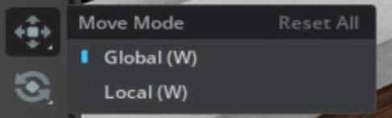

这个表明了在 UI 中以哪个坐标系的 UI 进行移动，但是**实际上变换的 property 数值始终是以部件相对于根 prim 下的 local 坐标轴下的值**


## 底层逻辑：USD 中 Prim 的变换是怎么计算的？

USD 中，物体上的每个点（包括原点）的最终位置，是按固定顺序组合`scale`、`rotate`、`translate`得到的，公式如下：

pparent=translate+rotate(scale(plocal))

- plocal：物体上的点相对于物体原点的局部坐标；
- `scale(p_local)`：先对局部点做缩放；
- `rotate(scale(p_local))`：再对缩放后的点，按物体的`orientation`旋转；
- `translate + ...`：最后加上物体原点在父坐标系中的位置，得到点在父坐标系中的位置。


## Property 的 Transform 在 普通模式 和 offfset 模式之下数值变化是相对于哪个坐标轴？

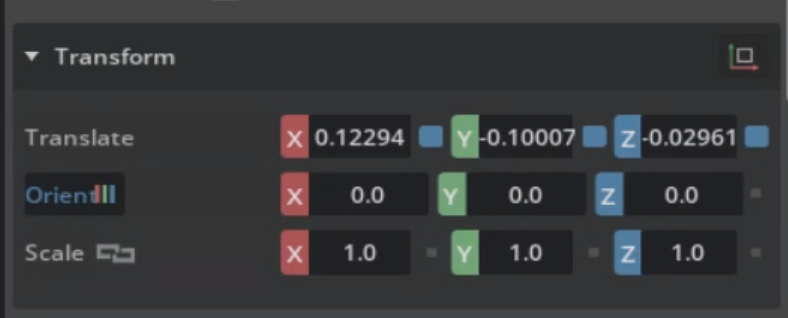

在普通模式下，如上图，tranlate 数值的变化是相对于物品原点并且没有任何角度变化的坐标轴

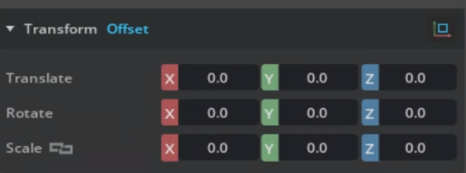

而在 offset 模式下，translate 数值的变化是相对于物品在角度变化后的坐标轴


# 为什么将 Ros2 Publish Transform Tree Node 的 parent prim 不设置的时候，tf 会出现有时是 world → base_link 有的时候是 odom → base_link 呢

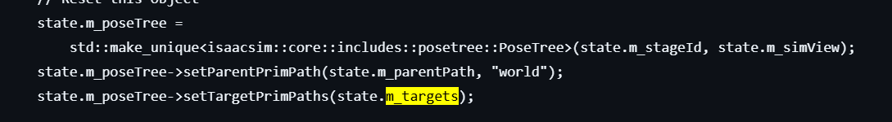

源码如上，如果不设置默认会是 world 作为 parent prim 所以就会出现这样的情况


# 我 lidar helper 明明一直都是使用仿真时间，但是为什么 ros2 publish transform tree Node 输出的时间戳就是比 lidar helper 输出的时间戳要慢呢？


# Lidar 的参数比如说扫描的性能，分辨率，range 等参数怎么设置？

这一部分 isaacsim 在 RTX Lidar 体系中，这套是“**传感器 prim（USD 里）+ 传感器模型配置（JSON profile）**”的机制，所以才会出现你在 USD 里只写了一个名字 `sensorModelConfig = Example_Rotary`，但雷达的扫描行为（线数、转速、每圈点数等）却能被一份 JSON 控制。

核心逻辑可以拆成三步：

## 1) USD 里的“雷达 prim”只做绑定与输出

在你的场景 [scene_bobac_testing.usd](vscode-webview://16n86o4ehb0rji119e55tfrm7d0oajkg876fr38mh71odfseo16d/workspace/race_map_usd/scene_bobac_testing.usd) 里，雷达对应的 prim：

- `/Root/.../fuse_lidar_link/fuse_lidar`

它身上有一个属性：

- `sensorModelConfig = Example_Rotary`（你现在已经改成 `Example_Rotary_360`）

这个属性的作用类似“**引用一个预定义的雷达模型**”，而不是把所有参数都直接写在 USD 里。

同时，场景里还有一个 OmniGraph（`ROS_LidarRTX`）负责把 RTX Lidar 的结果发布到 ROS2 topic（你这里是 `point_cloud_fuse` / `laser_scan_fuse`）。OmniGraph 本质是“取数据并发布”，通常不定义扫描几何细节。


## 2) `sensorModelConfig` 名称会被解析成一份 JSON profile

Isaac Sim/Omni 的 lidar 扩展会维护一个“**配置库**”：从一些固定的搜索路径加载 lidar 的 JSON 模型（例如内置扩展的 `data/lidar/*.json`，以及可能的用户/项目路径）。

当它看到 `sensorModelConfig = Example_Rotary` 时，会去配置库里找到对应的 JSON（我们定位到内置的是这个）：

- /isaac-sim/extscache/omni.sensors.nv.common-2.5.0-coreapi+lx64.r.cp310/data/lidar/Example_Rotary.json

然后把里面的 `profile` 读出来，用来构建 RTX Lidar 的扫描模型。

你之所以能通过“换名字”改变雷达参数，就是因为：**扫描模型不是写死在 prim 上，而是由这个 JSON profile 定义**。


## 3) JSON profile 决定“分辨率/点云密度”等行为

以我们改的 `Example_Rotary_360.json` 为例（你现在放在 workspace 下）：

- [Example_Rotary_360.json](vscode-webview://16n86o4ehb0rji119e55tfrm7d0oajkg876fr38mh71odfseo16d/workspace/race_map_usd/Example_Rotary_360.json)

里面这些字段控制了扫描行为（举例）：

- `scanType: "rotary"`：旋转式雷达
- `numberOfEmitters` + `elevationDeg[]`：垂直线束/通道与俯仰角分布（垂直分辨率）
- `scanRateBaseHz`：转速（圈/秒）
- `reportRateBaseHz`：报告/采样的“横向列数速率”（决定每圈横向点数密度）

因此把 `reportRateBaseHz` 从 36000 改成 3600，在 `scanRateBaseHz=10Hz` 时，就把每圈密度从约 3600 点/圈降到约 360 点/圈（常见关系是 `points_per_rev ≈ reportRateBaseHz / scanRateBaseHz`）。


## 为什么会选择这样的结构，通过 profile 这样的形式来决定传感器的参数？


## 为什么他智慧默认查找/isaac-sim/extscache/omni.sensors.nv.common-2.5.0-coreapi+lx64.r.cp310/data/lidar/这个文件夹内的？这个 profile 是什么意思？什么机制呢？

它之所以“默认去 `/isaac-sim/extscache/omni.sensors.nv.common-.../data/lidar/` 里找”，本质原因是：**`Example_Rotary` 这类 profile 是跟着 Isaac Sim 的一个扩展（extension）一起发布的资源文件**；profile_reader 插件会先在“扩展自己的 data 目录”里找这些资源。

下面按机制讲清楚。

## 1) `extscache` 是什么，为什么会出现在默认搜索路径里？

Isaac Sim/Omniverse 的扩展系统是“插件+资源”的形式分发的。扩展通常包含：

- Python/C++ 插件代码
- `data/` 目录里的资源文件（你的 lidar profile JSON 就属于资源）

运行时 Omniverse Kit 会把已安装/已启用的扩展解包/缓存到：

- `/isaac-sim/extscache/<extension-name+version+platform>/...`

所以 `omni.sensors.nv.common-2.5.0-coreapi+...` 是一个扩展包，里面自带了：

- `data/lidar/Example_Rotary.json`、`Example_Solid_State.json` 等

**profile_reader** 作为同一套传感器扩展体系的一部分，天然知道去这些扩展的 `data/lidar` 目录里找默认 profile。

这就解释了为什么你的日志里第一优先级会出现：

- `/isaac-sim/extscache/.../data/lidar/<name>.json`

因为这是“官方自带 profile 库”的位置。

## 2) profile 是什么意思？

这里的 profile 不是“用户配置文件”的意思，而是 **传感器模型参数模板**。

对于 RTX Lidar 来说，profile JSON 里描述的是“这颗雷达怎么扫”的模型参数，例如：

- 扫描类型：`scanType: rotary` / `solidState`
- 转速：`scanRateBaseHz`
- 每秒报告多少列/点：`reportRateBaseHz`
- 多少线/发射器：`numberOfEmitters`
- 每根线的俯仰角/方位偏移：`elevationDeg[]` / `azimuthDeg[]`
- 量程、噪声、波长、回波数：`nearRangeM`/`farRangeM`/误差等

你在 USD 里写的 `sensorModelConfig = Example_Rotary` 就相当于说：

> “这颗传感器用名为 Example_Rotary 的模型模板来生成扫描几何与数据输出。”

## 3) 整个机制（从 USD 到点云）是怎么串起来的？

可以理解为三层：

### A. USD 层：只做“绑定”

在你的场景里，雷达 prim 上有：

- `sensorModelConfig = Example_Rotary`（你改成了 `Example_Rotary_360`）

这一步不包含详细扫描参数，只是一个“引用名”。

### B. Profile Reader 层：把“引用名”解析成 JSON

`omni.sensors.nv.profile_reader.ext.plugin` 做的事就是：

1. 接到一个 config 名称，比如 `Example_Rotary_360`
2. 按预设搜索路径拼出候选文件路径：`.../data/lidar/Example_Rotary_360.json`、`.../lidar_configs/.../Example_Rotary_360.json` 等
3. 找到后读取 JSON，返回其中的 `profile` 结构给传感器系统使用
4. 如果找不到，就像你日志里那样“降级创建 minimal profile”（所以表现为不生效/参数不对）

你贴的日志就是第 2-4 步发生了：没在默认路径找到，所以降级。

### C. RTX Lidar 模拟层：用 profile 生成扫描并出数据

拿到 profile 后，RTX Lidar 扩展用它来：

- 决定每帧/每圈射线怎么发（角度分布、线数、转速、点数密度）
- 产生点云/laser scan 等输出
- 再由 OmniGraph（你场景里的 `ROS_LidarRTX`）发布到 ROS2 topic


## 也就是说它的这个实际上是 sensor 这个 extension 的机制之一咯？

对，你理解得没错：这就是 **Isaac Sim/Omniverse “sensors 扩展体系”**里的一部分机制。更准确说，是 `omni.sensors.nv.common` 这类传感器公共扩展提供的 **ProfileReader（配置读取器）** 机制，被 RTX Lidar 这类具体传感器拿来用。

我在你本机的扩展文档里已经找到官方说明，位置在：

- [common_extension.rst:558-581](vscode-webview://16n86o4ehb0rji119e55tfrm7d0oajkg876fr38mh71odfseo16d/isaac-sim/extscache/omni.sensors.nv.common-2.5.0-coreapi+lx64.r.cp310/docs/common_extension.rst#L558-L581)

里面直接写了：

- `IProfileReader reads ... modality specific profile from a JSON file`
- 用法是：
    - `getProfileJsonAtPaths(profileName, ProfileType::LIDAR)`
    - 然后 `init(json, ProfileType::LIDAR)`

这正对应你日志里的函数名 `getProfileJsonAtPaths`。

------

### 这个 “profile” 到底是什么？

在这里 **profile = 传感器“模型参数配置”**（modality-specific profile）。

- modality 指传感器类型：LIDAR / RADAR / USS / IDS 等
- profile JSON 里描述的是：该传感器如何扫描、噪声模型、发射器/通道角度分布、转速/报告率等
- USD 里的 `sensorModelConfig = Example_Rotary` 只是一个“名字/ID”，用来让 ProfileReader 去加载对应 JSON，然后把参数灌进传感器模拟器

所以你能通过改 profile 来改“分辨率”，是因为“分辨率”本来就是 profile 的一部分。

------

### 为什么默认会查 `/isaac-sim/extscache/.../data/lidar/`？

因为：

1. `Example_Rotary.json` 这类**默认 profile**是跟着扩展一起发布的资源文件（就放在扩展包的 `data/lidar` 里）

2. Omniverse/Isaac Sim 的扩展在运行时会被解包/缓存到

     

    ```
    extscache
    ```

    ，所以运行时真实路径就变成：

    - `/isaac-sim/extscache/<extension>/data/lidar/*.json`

3. ProfileReader 的

     

    ```
    getProfileJsonAtPaths()
    ```

     

    会按一组

    固定的已知目录

    去拼路径找

     

    ```
    <profileName>.json
    ```

    ——这些目录通常就是：

    - 扩展自带的 data 目录（最可靠、最可复现）
    - RTX lidar 扩展的 `data/lidar_configs/...`（厂商/示例配置）
    - 以及（可选的）“supplied paths”（你现在没提供，所以不会搜 `/workspace`）


# 资产结构

[asset_structure](https://docs.isaacsim.omniverse.nvidia.com/4.5.0/robot_setup/asset_structure.html)


# Ros2 Rtx lidar helper 

默认是使用 simulation time 


# 理解仿真时间和挂钟时间

[understanding-simulation-time-vs-wall-time](https://docs.isaacsim.omniverse.nvidia.com/latest/ros2_tutorials/ros2_faq.html#understanding-simulation-time-vs-wall-time)


# TF2 的时间缓冲说明

[缓冲区的工作原理](https://docs.ros.org/en/rolling/Tutorials/Intermediate/Tf2/Learning-About-Tf2-And-Time-Cpp.html#update-the-listener-node)

To understand why is this happening we need to understand how buffers work. Firstly, each listener has a buffer where it stores all the coordinate transforms coming from the different tf2 broadcasters. Secondly, when a broadcaster sends out a transform, it takes some time before that transform gets into the buffer (usually a couple of milliseconds). As a result, when you request a frame transform at time “now”, you should wait a few milliseconds for that information to arrive.

[timebuffer API](https://docs.ros2.org/latest/api/tf2/classtf2_1_1TimeCache.html)

https://docs.ros2.org/latest/api/tf2_ros/classtf2__ros_1_1Buffer.html


# rviz2 中显示的 laser scan 比地图慢

https://forums.developer.nvidia.com/t/point-cloud-lag-in-odom-frame-with-simulated-rtx-lidar-in-nvidia-isaac-sim/312274/2


# Rviz2 的 message filter 和 tf2::buffer 分别是什么？这是一个什么机制呢？


#  TF2 时间戳队列机制完整流程

[tf_buffer 核心基类 source code 用于定义整体的 TF 缓存队列、插值、过期淘汰等底层机制](https://github.com/ros2/geometry2/blob/rolling/tf2/src/buffer_core.cpp)

[tf buffer ros2 封装层 对接 rclcpp 时钟、时间跳转、服务、阻塞等待等机制](https://github.com/ros2/geometry2/blob/rolling/tf2_ros/src/buffer.cpp)

1. **每个子坐标系** 绑定一个独立**时间戳变换队列**；

2. 新 TF 消息带时间戳**入队**，先做合法性校验，非法直接丢弃（即：**帧名非空、不能自环、不能带 / 前缀、变换数值无 NaN、四元数归一化合法、时间戳不陈旧**，任意一条不满足直接丢弃，不加入 TF 缓存队列。）；

3. 队列自动按 **cache_time 缓存时长** 淘汰过期时间戳数据；

4. 查询时按指定时间戳：**精确匹配 → 插值 → 外推** 三级逻辑；

5. 静态 TF 无时间队列、永久生效；动态 TF 严格受时间戳和缓存窗口约束；

    

### **缓存本质**

TF 缓存是**按坐标系 + 时间戳** 存储的**历史变换队列**，每个 `frame_id` 维护一个**时间有序的变换缓存链表 / 队列**，带**缓存超时时间 `cache_time`**，自动淘汰老旧变换。


## Message filter

**Message Filter = RViz2 家的专属管家**

- 这个管家**只给 RViz 干活**，别的节点不用它

- 它的唯一工作：**处理传感器数据（激光、点云、图像）**

- 它有个**死规矩**：传感器数据必须先做**坐标变换**，才能在 RViz 里显示！

    *即：RViz / 导航内部的 **数据管家**，负责给传感器做坐标变换* 

Message filter 整体机制就是：

1. 先接收到我们的激光雷达或者其他传感器数据，然后缓存到这个 **缓存队列** 中
2. 然后去 **tf::buffer** 等待与刚才缓存下来的传感器数据的时间戳相等或在可接受的时间范围内的时间戳的 TF 数据，让这个 TF 数据能够与 rviz2 固定的 fixed frame 能够建立变换关系，
3. 建立关系之后，才调用 processMessage 来处理激光数据(比如说可视化激光雷达数据等等)
4. 用 `laser_geometry` 把 LaserScan 转成 PointCloud2
5. 交给点云通用模块在 RVIZ 渲染显示


最后的 3 种结果（决定数据生死）

1. ✅ **查到了**：坐标变换 → RViz 正常显示激光

2. ⏳ **暂时没查到**：等一小会儿（最多几十毫秒）

3. ❌ 

    等了也查不到

    （时间太早 / 太晚）：

    直接丢弃数据！

    

    打印：

    ```
    Message Filter dropping message
    ```


### 怎么才算时间戳有效？

源码里算

```cpp
tolerance = (scan->ranges.size() - 1) * scan->time_increment
```

含义：

一帧激光从**第一个点采样**到**最后一个点采样**有一段持续时间，不是瞬间完成。

所以不能用一个极小的时间点去卡 TF，要把容差放宽到**整帧激光的扫描时长**：

> 只要 TF 在这一帧激光**整个时间跨度内**有可用插值，就算可用，放行转换点云。


首先我们拿到了激光雷达的数据，然后这个激光雷达的 tf 有效数据为 200ms，然后我们将这个激光雷达的 200ms 的数据存储到了 message filter 中，

### Older

导航：

```
ros2 action send_goal /navigate_to_pose nav2_msgs/action/NavigateToPose "{
  pose: {
    header: {
      stamp: {sec: 0, nanosec: 0},
      frame_id: 'map'
    },
    pose: {
      position: {x: 1.76, y: -0.05, z: 0.0},
      orientation: {x: 0.0, y: 0.0, z: 0.0, w: 1.0}
    }
  }
}" --feedback
```

放置点：

```
ros2 action send_goal /navigate_to_pose nav2_msgs/action/NavigateToPose "{
  pose: {
    header: {
      stamp: {sec: 0, nanosec: 0},
      frame_id: 'map'
    },
    pose: {
      position: {x: -0.22, y: -0.10, z: 0.0},
      orientation: {x: 0.0, y: 0.0, z: 0.7071, w: -0.7071}
    }
  }
}" --feedback
```

初始点：

```
ros2 action send_goal /navigate_to_pose nav2_msgs/action/NavigateToPose "{
  pose: {
    header: {
      stamp: {sec: 0, nanosec: 0},
      frame_id: 'map's
    },
    pose: {
      position: {x: -3.783, y: 2.137, z: 0.0},
      orientation: {x: 0.0, y: 0.0, z: 0.7071, w: -0.7071}
    }
  }
}" --feedback
```


# 导航程序

```
ros2 launch bobac3_navigation bobac3_navigation.launch.py
```


### newer

抓取点1 

```
ros2 action send_goal /navigate_to_pose nav2_msgs/action/NavigateToPose "{
  pose: {
    header: {
      stamp: {sec: 0, nanosec: 0},
      frame_id: 'map'
    },
    pose: {
      position: {x: 1.44, y: -0.06, z: 0.0},
      orientation: {x: 0.0, y: 0.0, z: 0.0, w: 1.0}
    }
  }
}" --feedback
```

place

```
ros2 action send_goal /navigate_to_pose nav2_msgs/action/NavigateToPose "{
  pose: {
    header: {
      stamp: {sec: 0, nanosec: 0},
      frame_id: 'map'
    },
    pose: {
      position: {x: 1.34, y: -0.07, z: 0.0},
      orientation: {x: 0.0, y: 0.0, z: -0.7071, w: 0.7071}
    }
  }
}" --feedback
```


### 1. 打开夹爪（0度）：


```bash
ros2 topic pub --once /hand_command sensor_msgs/msg/JointState "{
  name: ['gripper_l_joint1'],
  position: [0.0]
}"
```

### 2. 关闭夹爪（65度 = 1.134 弧度）：


```bash
ros2 topic pub --once /hand_command sensor_msgs/msg/JointState "{
  name: ['gripper_l_joint1'],
  position: [1.134]
}"
```


```
# 编译
cd /workspace/bobac_ws
source /opt/ros/humble/setup.bash
colcon build --packages-select eco65b_grasp_interfaces eco65b_moveit_grasp yoloe_grasp
source install/setup.bash

# 启动（5个终端）
# 终端1: ros2 launch eco65b_moveit_config move_group.launch.py
# 终端2: ros2 run eco65b_moveit_grasp grasp_moveit_node
# 终端3: ros2 run yoloe_grasp yoloe_grasp_node   --ros-args   --params-file src/yoloe_grasp/config/pen_grasp_params.yaml
# 终端4: ros_env ros2 run grasp_control gripper_control_node
# 终端5: ros_env ros2 run grasp_control grasp_state_machine

# 放入盒子：ros2 run grasp_control place_state_machine

```


进盒子的预备姿态

```
ros2 topic pub --once /hand_command sensor_msgs/msg/JointState "{name: ['joint_1', 'joint_2', 'joint_3', 'joint_4', 'joint_5', 'joint_6'], position: [0.0, 0.65, -1.75, 0.83, 1.52, 0]}"
```

```
ros2 topic pub --once /hand_command sensor_msgs/msg/JointState "{name: ['joint_1', 'joint_2', 'joint_3', 'joint_4', 'joint_5', 'joint_6'], position: [0.0, 1.0, -1.19, -0.23, 1.52, 0]}"
```

进盒子的姿态

```
ros2 topic pub --once /hand_command sensor_msgs/msg/JointState "{name: ['joint_1', 'joint_2', 'joint_3', 'joint_4', 'joint_5', 'joint_6'], position: [0.0, 0.65, -1.75, 0.83, 1.52, 1.57]}"
```

打开夹爪

```
ros2 topic pub --once /hand_command sensor_msgs/msg/JointState "{name: ['gripper_l_joint1'], position: [0.78]}"
```


# Occupancy Map Extension

[Occupancy Map Extension](https://docs.isaacsim.omniverse.nvidia.com/5.0.0/digital_twin/ext_isaacsim_asset_generator_occupancy_map.html#occupancy-map-window)


# CCD 和 Speculative CCD 之间有什么区别

这两个选项都是为了解决**高速物体穿模（隧道效应）\**的「连续碰撞检测（CCD）」方案，但它们的\**原理、性能开销、防穿模效果完全不同**，我帮你拆解得明明白白，顺便结合你的盒子 + 铅笔场景给出直接建议：

------

## 一、核心一句话区别

表格


|            选项            |               核心原理               |        防穿模效果        |       性能开销       |
| :------------------------: | :----------------------------------: | :----------------------: | :------------------: |
| **Enable Speculative CCD** | 基于速度动态调整接触偏移（近似方案） |   中等，缓解大部分场景   | 极低，几乎不影响性能 |
|       **Enable CCD**       | 对物体运动轨迹做扫掠检测（精确方案） | 极高，几乎 100% 解决穿模 | 中高，比前者更耗性能 |

------

## 二、逐个拆解：原理 + 适用场景

### 1. Enable Speculative CCD（推测式 CCD）

#### 原理

根据物体当前的运动速度，**预测它在这一仿真步内可能到达的位置**，动态扩大碰撞检测的范围（相当于给物体加了个 “速度方向的安全垫”），提前和障碍物接触，避免穿模。

- 它不是真的 “扫过” 整个运动轨迹，而是用近似的方式提前扩大碰撞边界，属于**轻量近似方案**。
- 官方描述里也写了：`dynamically adjust contact offset based on velocity`（基于速度动态调整接触偏移）。

#### 特点

✅ 优点：性能开销极低，对场景帧率几乎无影响，适合大多数普通场景

❌ 缺点：近似方案，对**极薄 / 极高速物体**（比如你的铅笔），还是可能漏检穿模

#### 适用场景

- 大多数普通刚体，速度中等、不是极薄的物体
- 对性能敏感的大场景，不想为防穿模牺牲帧率

------

### 2. Enable CCD（扫掠式 CCD / Swept CCD）

#### 原理

在两个仿真时间步之间，对物体的**整个运动轨迹做一次 “扫掠检测”**：模拟物体从上一帧的位置到当前帧的位置的完整路径，和障碍物做碰撞检测，找到最早的碰撞点，直接在那个点停下来，不会穿过去。

- 它是**精确的 CCD 方案**，只要开启，物体再快、再薄也不会出现隧道效应。
- 官方描述里的 `Enables swept integration for the actor` 也说明了，它是基于 “扫掠积分” 的。

#### 特点

✅ 优点：防穿模效果拉满，对细长 / 薄 / 高速物体也能精准检测

❌ 缺点：需要额外的计算，性能开销比推测式 CCD 高

#### 适用场景

- 细长 / 薄物体（比如你的铅笔）、高速运动的物体
- 对穿模零容忍的场景（比如机器人抓取、精密物理交互）


# RTX Lidar 不是通过碰撞网络来过滤吗？RTX Lidar 和 PhysX Lidar 之间有什么区别？

## 核心结论：RTX Lidar 根本不依赖碰撞网络！它检测的是**视觉网格（Render Mesh）**，不是物理碰撞体Isaac Sim

你取消 base_link 的碰撞网络后雷达仍有无效数据，这是最关键的证据 ——RTX Lidar 的扫描逻辑和 PhysX Lidar 完全不同，碰撞体的有无对它**几乎没有影响**。

------

## 一、RTX Lidar vs PhysX Lidar：检测机制天差地别（彻底理解为什么碰撞体没用）

表格


| 特性            | **RTX Lidar**                                                | **PhysX Lidar**                                      | 对你的影响                                                   |
| --------------- | ------------------------------------------------------------ | ---------------------------------------------------- | ------------------------------------------------------------ |
| **底层技术**    | **NVIDIA OptiX 光线追踪**（渲染引擎）                        | PhysX 物理引擎射线检测                               | RTX 看的是 “眼睛能看到的东西”，不是 “物理能撞到的东西”       |
| **检测对象**    | **视觉网格（Render Mesh）**：模型的多边形表面（.usd/.glb 中的 mesh） | **碰撞网格（Collision Mesh）**：物理系统用的简化几何 | 取消碰撞体 = 物理上能穿过，但视觉上模型还在，雷达仍会被挡住  |
| **过滤规则**    | 基于 prim 路径、材质、语义标签的光线追踪过滤                 | 基于 PhysX 碰撞组、FilteredPairsAPI 的物理过滤       | 你之前用的 FilteredPairsAPI、collisionmeshes.exclude 都属于 PhysX 系统，对 RTX 无效 |
| **精度 / 效果** | 支持反射、透明材质、阴影等真实物理效果                       | 仅返回几何距离，不考虑材质特性                       | RTX 更逼真，但也更 “固执” 地检测所有可见表面                 |

------

## 二、为什么你取消碰撞体后雷达仍有无效数据？（本质原因）

1. **视觉网格还在**：你只是删除了物理碰撞体，但机器人底盘的**视觉多边形网格（Render Mesh）依然完整存在**，RTX Lidar 的光线会直接命中这些可见表面Isaac Sim。
2. **过滤规则不匹配**：RTX Lidar 的`collection:collisionmeshes`虽然名字带 “collisionmeshes”，但它实际过滤的是 **“参与光线追踪的视觉网格 prim”**，而不是物理碰撞体。
3. **一体模型的视觉网格无法分割**：你的模型是一体的，视觉网格是一个完整的多边形集合，RTX Lidar 无法区分 “底盘外壳” 和 “内部支撑结构”，只要是可见表面就会被检测到。


# Isaacsim 保存的几种方式

1. collect and Save As：


# X1 的主要使用的 通讯功能 

| 类型       | 具体硬件                           | 对应设备节点                     |
| ---------- | ---------------------------------- | -------------------------------- |
| 执行机构   | 左机械臂                           | `/dev/ttyTHS0`（40Pin 硬件串口） |
| 执行机构   | 右机械臂                           | `/dev/ttyACM0`（USB 串口）       |
| 导航避障   | 轮趣激光雷达                       | `/dev/ttyACM1`（USB 串口）       |
| 视觉设备   | 4 路 CSI 摄像头 + 主相机           | `/dev/video0~video3`             |
| 显示设备   | 两块外接显示屏                     | `/dev/fb0`、`/dev/fb1`           |
| 传感器总线 | 多路 I2C 传感器（姿态 / 编码器等） | `/dev/i2c-0 ~ i2c-101`           |
| 开关量外设 | 按键 / 指示灯 / 限位等 GPIO 设备   | `gpiochip0/1/2`                  |
| 时钟模块   | 双路实时时钟 RTC                   | `rtc0`、`rtc1`                   |
| 扩展存储   | NVMe 固态硬盘 + 板载 eMMC          | `nvme0n1`、`mmcblk0`             |
| 人机交互   | USB 键鼠 / 手柄等                  | `hidraw0`、`hidraw1`             |


# 为啥单片机能够直接通过控制寄存器来控制其他的外设，比如说直接通过控制寄存器就能实现控制电机等操作

首先 **CPU 的主要就只认识：地址、数据、读还是写**，至于他写入的是总线中的哪个硬件的数据，它并不会管

而 CPU 通过**总线**（AHB 或 APB ）来给指定的地址写入指定的数据，

而<u>**总线**就是这个邮差，负责将数据送到指定的地址上</u>，而他实现这一功能是因为，总线上有一个 **地址译码器** ，<u>负责 对比地址的高几位，来决定将数据路由到哪个外设</u> , 比如说：地址的高几位为 0x4002 ，那么通过地址译码器，*将数据路由到 gpio 外设，这个地址译码器中的地址以及相对应的外设，在芯片设计之初已经决定好了的*，总线矩阵里面的地址译码器，实际上就是<u>一段组合逻辑电路</u>

而外设内部实际上也有一个 **地址译码器**， 只是**外设中的 地址译码器** 关心的并不是高几位，而是具体的 **地址偏移** ，而这里的地址偏移，实际上这个 **偏移的地址对应的才是寄存器** ，而单片机上的寄存器实际上也并不是和内存中的寄存器一样，只是存储一组数据，而是一个 **触发器** ， 而这个触发器在接收到写入的数据之后，就会根据写入的数据来 <u>**操作另外的一组寄存器**</u> 来控制外部引脚电平，这个操作别的寄存器的寄存器实际上没有存储任何数据，他就是一个按钮，按完就弹回来


# 为啥，单片机直接控制控制寄存器，并在寄存器中的指定地址存储指定的数据，就能够进行控制电机的操作，这是为啥，还是说，单片机控制寄存器，实际上是一个巴掌拍不响的，一定是会有一个会去指定的寄存器地址中存储指定的数据，一个会去指定的寄存器地址中读取指定的数据

并不是说两个软件的程序互相发送和接收，进而完成一次完整的控制，并不是这样，这是软件的思维，真正的单片机实际上是通过 CPU 给 寄存器 发送数据，然后寄存器自动的接收指令，这个是一个硬件过程，并且寄存器并不是一个存储器，很多时候的单片机上的寄存器就只是一个开关，只要快关一打开，电机就能开始动了

整体的单片机读取引脚的完整流程实际上是：

1. CPU 编译并开始执行代码，**读取指定引脚的输入电平**（比如读取 PA0 引脚是高电平还是低电平）

    

2. CPU 只是一个数据包发送员，它只关心 **地址** 、**数据** 、**读还是写**

    * 本次是【读操作】，CPU 提前确定：目标地址 = GPIOA 的 IDR 寄存器、操作类型 = 读

    3、CPU 将 **目标地址** 传输到 **地址总线** 上，并通过发出的**地址的高四位**让**全局地址译码器**找到相应的外设

    - 地址高四位电信号 → 全局译码器识别 → 唯一选中 **GPIOA 外设**
    - 其他所有外设（定时器、串口等）全部被屏蔽，不响应信号

    4、找到外设后，通过 **地址的后四位**，在 GPIOA 外设内部的**局部地址译码器**中，选中 **某一个具体的寄存器**

    - 地址后四位电信号 → 局部译码器识别 → 唯一选中 **IDR 输入数据寄存器**（读取引脚电平的专用寄存器）

    5、然后对这个寄存器，CPU 通过 **控制总线** 发出 **「读指令」信号**，告诉 GPIOA 外设：我要读取 IDR 寄存器里的数据

    6、GPIOA 外设硬件收到「读指令」后，**自动将指定引脚（PA0）的实时电平，锁存到 IDR 寄存器对应的比特位中**

    - 物理流程：外部引脚电平 → 引脚输入电路 → 施密特触发器（整形）→ 直接写入 IDR 寄存器的对应位
    - 这个过程是纯硬件自动完成，不需要 CPU 干预

    7、IDR 寄存器将锁存好的**引脚电平数据（0 或 1）**，发送到 **数据总线** 上

    、 CPU 从 **数据总线** 上，接收这个 0/1 数据，存入自己的内部寄存器

    本次 **一次完整的读取引脚操作结束**，CPU 得到了引脚的电平值


其次要注意的是，单片机具有三条总线（所有的外设、寄存器、CPU 都挂在同一条的并行系统总线上）：

### 1. 三大总线（芯片内部的 “公共线路”）

|    总线类型     |                            作用                            |             信号方向              |
| :-------------: | :--------------------------------------------------------: | :-------------------------------: |
| **地址总线 AB** |    传递「地址编号」（门牌号），用来找目标设备 / 寄存器     |      仅 CPU 向外输出（单向）      |
| **数据总线 DB** |          传递 0/1 电信号（真正的数据），读写内容           | 双向（CPU 发数据 / 外设回传数据） |
| **控制总线 CB** | 发指令：告诉外设「现在是读操作，还是写操作」、时钟、使能等 |               双向                |

> 关键规则：**整个芯片所有外设（GPIO、定时器、串口、ADC…）共用这一套总线**。
>
> 就像一栋大楼所有房间共用一条走廊，CPU 要和某个房间通信，必须先报「房间号」（地址）。


> 

### 2. 地址的分层：高位地址 + 低位地址

单片机厂商会把**整个 CPU 地址空间**做统一规划：

- 把**地址总线的高几位** → 分配给「区分不同外设模块」（比如 GPIOA、GPIOB、定时器、串口）；
- 把**地址总线的低几位** → 分配给「同一个外设内部，区分不同寄存器」。

举个具象例子（STM32 实际地址规则）：

假设某段地址区间：`0x40020000 ~ 0x400203FF`**整块分配给 GPIOA 外设模块**

- 地址**高位**：只要落在这个区间 → 代表目标是「GPIOA 这个外设」；
- 地址**低位**：在区间内部变化 → 代表 GPIOA 内部不同寄存器（模式寄存器、输出寄存器、上拉寄存器等）。

### 3. 译码器 = 电子多路开关

**地址译码器本质就是纯硬件电路（门电路组成的开关阵列）**，功能只有一个：

> 收到一组地址电平 → 只**单独选通唯一一条通路**，其余通路全部切断。

单片机里天然分为**两级译码**，这就是你提到的逻辑：

1. 第一级：全局地址译码器（片选译码）

    

    读取

    地址总线高位

     → 选中「整个外设模块」（比如 GPIOA、定时器）。

2. 第二级：外设内部译码器（模块内译码）

    

    读取

    地址总线低位

     → 在已经选中的外设里，再选中「某一个具体寄存器」。


# 译码器是怎么到导通指定的外设和具体的寄存器的？是直接通过门电路的方式吗？


# Robot Simulation Tips

[Robot Simulation Tips](https://docs.isaacsim.omniverse.nvidia.com/4.5.0/robot_simulation/robot_simulation_tips.html#robot-simulation-tips)


# Gain Tuning(增益调节)

[Gain Tuning](https://docs.isaacsim.omniverse.nvidia.com/4.5.0/robot_setup/joint_tuning.html#gain-tuning)


## Position Drive 

[Position Drive](https://docs.isaacsim.omniverse.nvidia.com/4.5.0/robot_setup/joint_tuning.html#position-drive)


## Velocity Drive 

[Velocity Drive](https://docs.isaacsim.omniverse.nvidia.com/4.5.0/robot_setup/joint_tuning.html#velocity-drive)


# articulation-and-robot-simulation-stability-guide(关节与机器人仿真稳定性指南)

[articulation-and-robot-simulation-stability-guide](https://docs.omniverse.nvidia.com/kit/docs/omni_physics/latest/dev_guide/guides/articulation_stability_guide.html#articulation-and-robot-simulation-stability-guide)


# 关节体的自动组织形式

[Create an Articulation Based on Topology](https://docs.omniverse.nvidia.com/kit/docs/omni_physics/latest/dev_guide/rigid_bodies_articulations/articulations.html#create-an-articulation-based-on-topology)

- The automation process works as follows:自动化流程的工作原理如下：
    1. Traverse the hierarchy below the articulation root.遍历关节根节点下方的层级结构。
    2. Create topologies, which are graphs based on the traversed bodies and joints connecting them.创建拓扑结构，这些拓扑是基于遍历的刚体及其连接关节构建的图。
    3. For each topology, apply a deterministic algorithm to select the articulation root:针对每个拓扑结构，应用确定性算法来选择铰接根：
        * If any joint to the world is found, the topology (articulation) is considered fixed-base. The articulation root link is the body connected to the world with this joint.如果发现存在连接到世界的关节，则将该拓扑（关节连接）视为固定基座。该关节连接的主体即为关节根链接。
        * If no world joint is found, the topology is considered floating-base. In this case, the articulation root is set to the graph node (articulation link) with minimal eccentricity.如果未找到世界关节，则该拓扑被视为浮动基座。在这种情况下，关节根被设置为偏心率最小的图节点（关节连杆）。

Note that with this automation, it’s not possible to know the articulation root beforehand. As a result applying poses and velocities to the articulation root is not feasible unless the root is identified after parsing.请注意，通过此自动化操作，无法预先获知关节根节点。因此，除非在解析后识别出该根节点，否则无法对关节根节点应用位姿和速度。


# articulation root 是什么？

articulation root 实际上就是关节树的根节点，关节树是一棵从指定的节点开始生长的一棵单向无环的树，而这棵树可以有很多个不同的起始点，而 articulation root 实际上就是设定一个固定的树的起始点，通过这个起始点能通过这个起始点去遍历整棵关节树中指定的节点

而如果机器人不设定 articulation root ，那么关节树还是会构建起来，但是就是会没有起始点，就没法


## Parsing Robot Structure（解析机器人的结构）

[parsing robot structure](https://docs.isaacsim.omniverse.nvidia.com/latest/omniverse_usd/robot_schema.html?f_link_type=f_linkinlinenote&flow_extra=eyJpbmxpbmVfZGlzcGxheV9wb3NpdGlvbiI6MCwiZG9jX3Bvc2l0aW9uIjowLCJkb2NfaWQiOiJjN2E2MDM1ZjUyNmEyZDMzLWVmYTVjMzk4MzFlYTA3ZDQifQ%3D%3D#parsing-robot-structure)


机器人运动学树源自结合了机器人模式关系的物理模式。解析过程如下：

1. 从`robotLinks`图元的robotLinks关系中收集连杆。
2. 从`robotJoints`关系中收集关节。
3. 从第一个链接（基础链接）开始，对关节到相连的链接执行广度优先遍历，构建一棵树。

该树必须是无环的。会形成回路的关节必须将其**从关节中排除**属性设置为启用；否则，在解析过程中会根据访问顺序任意打破回路。

查看指定的机器人的 articulation tree 要怎么看

```
import omni.usd
from pxr import Usd, UsdGeom

# For legacy reasons, we need to import the schema from the usd.schema.isaac package
from usd.schema.isaac import robot_schema

stage = omni.usd.get_context().get_stage()
prim = stage.GetPrimAtPath("/World/ur10e")


robot_tree = robot_schema.utils.GenerateRobotLinkTree(stage, prim)

robot_schema.utils.PrintRobotTree(robot_tree)
```


## traversal-and-tree-generation

[traversal-and-tree-generation(遍历树生成)](https://docs.isaacsim.omniverse.nvidia.com/latest/omniverse_usd/robot_schema.html?f_link_type=f_linkinlinenote&flow_extra=eyJpbmxpbmVfZGlzcGxheV9wb3NpdGlvbiI6MCwiZG9jX3Bvc2l0aW9uIjowLCJkb2NfaWQiOiJjN2E2MDM1ZjUyNmEyZDMzLWVmYTVjMzk4MzFlYTA3ZDQifQ%3D%3D#traversal-and-tree-generation)


# PhysX 中的 joint

[PhysX 中的 Joint 的解释，以及具体的驱动方式](https://archive.docs.nvidia.com/gameworks/content/gameworkslibrary/physx/guide/Manual/Joints.html?f_link_type=f_linkinlinenote&flow_extra=eyJkb2NfaWQiOiI2YWZhOWE3OGY2MzhkMGY4LTc4MWZiMGU1NjNlZTEzMDkiLCJpbmxpbmVfZGlzcGxheV9wb3NpdGlvbiI6MCwiZG9jX3Bvc2l0aW9uIjowfQ%3D%3D)


As in the rest of the PhysX API, all joint angles for limits and drive targets are specified in radians.

注意与 PhysX API 的其他部分一样，所有用于限制和驱动目标的关节角度均以弧度为单位指定。


PD 控制器在 isaacsim 中有两种控制模式：位置  和 速度 控制


# Articulation controller

Articulation Controller 是一个 PD 控制器，其具体的关节驱动公式如下：

> PhysX 关节驱动的统一公式
>
> Torque = stiffness × (target*_position - current_*position) + damping × (target*_velocity - current_*velocity)

## Velocity Control

当我们使用速度进行控制关节的时候，我们的 根据上面的公式可以看出和 position 没有任何关系，所以在速度控制的时候我们可以将 stiffness 设置为 0 ，即如下面所说的：

  只关心速度 → 让 current*_velocity 追踪 target_*velocity

  分析公式

  Torque = stiffness × 位置误差 + damping × 速度误差

| 项                   | 作用                        | 设置   |
| -------------------- | --------------------------- | ------ |
| stiffness × 位置误差 | 不需要 — 速度控制不关心位置 | 设为 0 |
| damping × 速度误差   | 主要控制项 — 决定速度响应   | 设大   |

 简化后的公式

>  Torque ≈ damping × (target*_velocity - current_*velocity)

  这时 damping 本质上变成了速度控制的增益 (Kv)：

  damping = 100  →  速度误差 1 rad/s 时产生 100 N·m 扭矩
  damping = 1000 →  速度误差 1 rad/s 时产生 1000 N·m 扭矩

  damping 越大 = 速度跟踪越快、越"硬"


## Position Control

当对关节进行 Position Control 的时候，我们就只会关心关节的 Position → 让 current_position 追踪 target_position
分析公式

| 项                   | 作用                      | 设置 |
| -------------------- | ------------------------- | ---- |
| stiffness × 位置误差 | 主要控制项 — 拉向目标位置 | 设大 |
| damping × 速度误差   | 阻尼项 — 防止震荡         | 适中 |

  简化后的公式

  Torque ≈ stiffness × (target_position - current_position) + damping × (-current_velocity)

  - stiffness 是 Kp（位置增益）— 决定响应速度
  - damping 是 Kd（微分增益）— 抑制震荡


# PhysX 关节控制求解器公式说明：

[关节控制求解器详细说明公式文档](https://nvidia-omniverse.github.io/PhysX/physx/5.4.0/_downloads/6acf3afb8f69452757e0e766b5a22978/implicitDrives.pdf)


```
ros2 topic pub /joint_command sensor_msgs/msg/JointState "{
  name: ['front_wheel_joint'],
  velocity: [50.0]
}"
```


# holonomic controller 

[holonomic controller](https://docs.robotsfan.com/isaacsim/5.1.0/py/source/extensions/isaacsim.robot.wheeled_robots/docs/og/OgnHolonomicController.html)

[Usd Setup Holonomic Robot](https://docs.robotsfan.com/isaacsim/5.1.0/py/source/extensions/isaacsim.robot.wheeled_robots/docs/ogn/OgnHolonomicRobotUsdSetup.html#usd-setup-holonomic-robot)

[掌握基于NVIDIA Isaac Sim与ROS2的全向运动控制：Kaya机器人实操指南](https://forums.developer.nvidia.com/t/mastering-holonomic-control-with-nvidia-isaac-sim-and-ros2-a-guide-for-the-kaya-robot/308806)


|                 节点名称                 |                   核心作用                   |               应用场景                |
| :--------------------------------------: | :------------------------------------------: | :-----------------------------------: |
|              ROS2 Subscribe              | 订阅外部 ROS2 话题，接收 `/cmd_vel` 速度指令 | 外部指令接入入口，解析 Twist 格式消息 |
|              Break 3 Vector              |     将三维向量拆解为 X/Y/Z 三个独立分量      |  拆分 `cmd_vel` 的线速度、角速度数据  |
| Holonomic Controller（Holonomic Driver） |    全向运动学解算，底盘速度转各轮目标转速    |   本节核心节点，替代手动运动学代码    |
|              Make 3 Vector               |         将多个分量重新组合为三维向量         | 整合单轮转速指令，适配控制器输入格式  |
|         Articulation Controller          |       底层关节控制器，执行车轮转速指令       |    衔接物理引擎，驱动关节实际转动     |

**整体数据流总览**

```
外部ROS2终端 → /cmd_vel(Twist) → ROS2 Subscribe → Break 3 Vector（数据拆分）
→ Holonomic Controller（运动学解算：底盘速度→单轮转速）
→ Make 3 Vector（数据重组）→ Articulation Controller → PhysX 力矩驱动 → 全向轮底盘运动
```


# 机器人仿真 motion generation 


## kinematics Solvers

[Kinematics Solvers — Isaac Sim Documentation](https://docs.isaacsim.omniverse.nvidia.com/latest/manipulators/concepts/kinematics_solver.html)


# 轮式机器人api

[isaacsim.robot.wheeled_robots\]轮式机器人 — 艾萨克·西姆](https://docs.robotsfan.com/isaacsim/5.1.0/py/source/extensions/isaacsim.robot.wheeled_robots/docs/index.html#isaacsim-robot-wheeled-robots-wheeled-robots)


# Mobile Robot Controllers

[Mobile Robot Controllers — Isaac Sim Documentation](https://docs.isaacsim.omniverse.nvidia.com/latest/robot_simulation/mobile_robot_controllers.html?highlight=usd%20setup%20holonomic%20controller#holonomic-controller)


# Ackerman Drive actiongraph

[Tutorial #7 – Ackermann Drive Action Graph + ROS2 Bridge in Isaac Sim](https://www.youtube.com/watch?v=KmGzIMBzDh8)

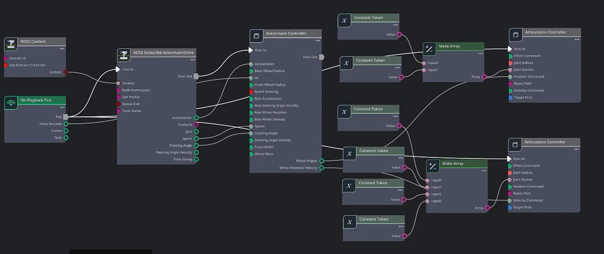


# Four-Wheel Differnetial Drive 

[Tutorial #8 – Four-Wheel Differential Drive + ROS2 Bridge in Isaac Sim](https://www.youtube.com/watch?v=7HZSxIcxYsA)

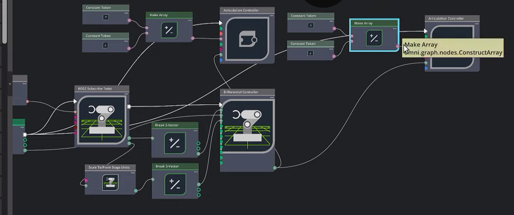


# 云纵无人机

1. Pegasus simulation 是 isaacsim 的一个无人机仿真的 extension 插件，能够用于加载无人机的资产、传感器，并发送传感器的数据
2. PX4 是无人机的飞控，PX4 Autopilot 是开源飞控软件。它可以跑在真实飞控硬件上，也可以用 SITL 形式跑在电脑里。SITL 是 Software In The Loop，飞控在仿真与实机上是相同的代码，实体机是根据真实的无人机数据反馈，而仿真则是由isaac sim传感器数据和动力学提供。能够仿真出真实的飞控数据
3. QGC 是无人机地面站，它通过 MAVLink 连接 PX4，进而给无人机下发指令


## PX4 下载慢

```
# clash
git config --global http.proxy http://192.168.1.201:7890
git config --global https.proxy http://192.168.1.201:7890

# v2rayN
git config --global http.proxy http://192.168.1.201:10808
git config --global https.proxy http://192.168.1.201:10808

git config --global --unset http.proxy
git config --global --unset https.proxy
```


# 数字电路中的数字信号的 高电平一般是电压来判断的对吧


# 云纵机器人代码执行流程：

```
# isaacsim 容器执行的命令

# 终端1
cd /root/cargo_delivery_demo
./integrated_runtime/run_demo_scene.sh --world office
```

```
# 终端2
cd /root/Micro-XRCE-DDS-Agent/build
./MicroXRCEAgent udp4 -p 8888
```


```
# ros 容器执行的命令
# 终端1
    export ROS_DOMAIN_ID=0
    cd /root/cargo_delivery_demo
    ./controls/run_ego_bridge.sh --restart
```

```
# 终端2
export ROS_DOMAIN_ID=0
source /opt/ros/humble/setup.bash
source /root/px4_ros_ws/install/setup.bash
source /root/cargo_ros_ws/install/setup.bash
export RMW_IMPLEMENTATION=rmw_fastrtps_cpp

rviz2 -d /root/cargo_delivery_demo/rviz/cargo_ego_avoidance.rviz
```

```
# 终端3
export ROS_DOMAIN_ID=0
cd /root/cargo_delivery_demo
source /opt/ros/humble/setup.bash
source /root/px4_ros_ws/install/setup.bash
source /root/cargo_ros_ws/install/setup.bash
export RMW_IMPLEMENTATION=rmw_fastrtps_cpp

python3 integrated_runtime/ego_mission_runner.py
```

```
# 终端4
export ROS_DOMAIN_ID=0
source /opt/ros/humble/setup.bash
source /root/px4_ros_ws/install/setup.bash
source /root/cargo_ros_ws/install/setup.bash
export RMW_IMPLEMENTATION=rmw_fastrtps_cpp

ros2 topic pub /cargo_delivery/start std_msgs/msg/String "data: 'start'" --once
```


```
# 手动控制货舱指令
docker exec -it ros2 bash

cd /root/cargo_delivery_demo
source /opt/ros/humble/setup.bash
source /root/px4_ros_ws/install/setup.bash
source /root/cargo_ros_ws/install/setup.bash
export RMW_IMPLEMENTATION=rmw_fastrtps_cpp

python3 controls/cargo_bay_control.py left_open
python3 controls/cargo_bay_control.py left_close
python3 controls/cargo_bay_control.py bottom_open
python3 controls/cargo_bay_control.py bottom_close
python3 controls/cargo_bay_control.py status
```


2026-06-15 02:31:37 [1,134ms] [Warning] [omni.platforminfo.plugin] failed to open the default display.  Can't verify X Server version.


# Kit 内核启动方式

[Kit Kernel Command Line Options](https://docs.omniverse.nvidia.com/kit/docs/carbonite/210.1.5/docs/Kernel/CommandLineOptions.html?f_link_type=f_linkinlinenote&flow_extra=eyJkb2NfaWQiOiI1ZWZiNWMwZDcyMzc3MzE4LWI1NjlmMjNmMzVmYzYzMjUiLCJpbmxpbmVfZGlzcGxheV9wb3NpdGlvbiI6MCwiZG9jX3Bvc2l0aW9uIjowfQ%3D%3D#kit-kernel-command-line-options)

`runheadless.sh` 是 Isaac Sim 封装的**Kit 应用启动器**，核心是启动 Omniverse Kit 运行时并进入**无头模式（无 GUI）**；`--exec` 是 Kit 内核原生参数，用于**在应用初始化后注入并执行 Python 脚本**NVIDIA Omniverse

#### 关键机制

1. 启动流程

    - 加载 Kit 内核 → 初始化基础运行时 → 加载指定 `.kit` 经验文件 → 执行 `--exec` 脚本 → 脚本结束后进程退出NVIDIA Omniverse

2. 核心特性

    - **脚本主导**：脚本获得 Kit 运行时的完整控制权，可直接操作 Stage、Physics、Rendering 等核心子系统NVIDIA Omniverse
    - **单次执行**：脚本执行完毕后，Kit 进程自动退出（可通过 `omni.kit.app.get_app().run()` 保持运行）NVIDIA Omniverse

    

    ### 三、为何独立于 Extension 和 Standalone 两种方式？

    Isaac Sim 有三种主流工作流，它们在**启动入口、上下文环境、控制权模型**上完全不同，因此 `--exec` 方式能 “独立” 于后两者运行Isaac Sim。

    | 维度         | `--exec` 内核脚本注入                    | Extension 扩展模式                  | Standalone 独立脚本模式                  |
    | ------------ | ---------------------------------------- | ----------------------------------- | ---------------------------------------- |
    | **启动入口** | Kit 内核直接启动，通过 `--exec` 注入脚本 | 先启动 Isaac Sim 主程序，再加载扩展 | 由 Python 脚本自身启动 `SimulationApp`   |
    | **上下文**   | 运行在 Kit 主进程中，与内核同生命周期    | 作为插件运行在主进程中，可热重载    | 脚本主导进程，`SimulationApp` 是子实例   |
    | **控制权**   | 脚本完全控制 Kit 运行时，无额外封装      | 扩展需注册到扩展系统，受主程序调度  | 脚本完全控制，`SimulationApp` 提供工具类 |
    | **依赖加载** | 基于 `.kit` 经验文件，按需加载扩展       | 自动加载依赖扩展，支持运行时管理    | 脚本显式启用扩展，依赖需手动处理         |
    | **典型场景** | 批量仿真、CI/CD、服务器自动化            | 交互式 GUI、自定义工具、实时应用    | 强化学习训练、大规模场景生成             |

    #### 独立运行的核心原因

    1. **启动路径不同**

        - `--exec`：`runheadless.sh` → Kit 内核 → 执行脚本（最底层启动方式）NVIDIA Omniverse
        - Extension：`isaac-sim.sh` → 主程序 → 加载扩展（上层应用启动）Isaac Sim
        - Standalone：`python.sh`/`python` → 脚本 → 启动 `SimulationApp`（脚本主导启动）

        

    2. **上下文隔离**

        

        - `--exec` 脚本运行在 Kit 内核初始化后的**原生上下文**中，无需通过 `SimulationApp` 封装，可直接调用 `omni.kit` 底层 APINVIDIA Omniverse
        - 不依赖 Extension 系统的注册 / 加载机制，脚本可直接操作 Stage、创建实体、控制物理，无需遵循扩展开发规范NVIDIA Omniverse

        

    3. **生命周期独立**

        

        - `--exec` 脚本执行完毕后，Kit 进程自动退出，无残留状态NVIDIA Omniverse
        - 与 Extension 的 “常驻内存、可热重载” 和 Standalone 的 “脚本主导退出” 完全不同Isaac Sim

    


# 生成 tf 树的 pdf 版本

### 一、完整使用流程

1. 确保安装依赖

    （默认随 ROS2 桌面版安装，缺失时执行）：

    

    ```
    sudo apt install ros-humble-tf2-tools  # 对应你的ROS2版本（humble/iron/rolling）
    ```

    

2. 运行命令生成 PDF

    ```
    ros2 run tf2_tools view_frames
    ```

    

    命令执行时会：

    - 监听 TF 数据约**5 秒**（收集当前所有广播的坐标系）
    - 在当前目录生成两个文件：
        - `frames.pdf`（或`frames_日期_时间.pdf`）：最终的 TF 树可视化 PDF
        - `frames.gv`：Graphviz 源文件（可用于手动调整布局）


# 清理缓存文件（tmp）

一般可以清理出几个 G 的无用文件，可以使用下面的命令进行清理

```
rm -rf ~/tmp
```


# 锦凌的程序思路

## 控制货舱关节的思路：

通过话题发送一个话题数据，来接收具体的指令名字，然后在话题中接收到这个话题的数据之后，就会开始执行触发函数，函数触发之后，就能调用具体的设置的具体控制函数，进行获取指定的关节在场景中的路径，然后根据这个关节路径来设置关节的 drive 属性的 target position 参数，求解器得到这个参数就会控制关节运动到指定的角度

注意：有的时候不起作用的原因就是因为我们执行的时候，频率刚好错开，可能是话题数据没办法正常接收到导致的（因为我们在执行这个控制货舱的命令的时候是手动一次性发送，不知道接收者到底有没有接收到，也不管有没有接收到）


# 什么叫做一个 Python 环境？

一个完整的 pyhton 环境，主要是由三个部分组成，缺一不可：

1. python 解释器本身
2. 专属的第三方包仓库（site-packages 文件夹）
3. 环境变量规则（PYTHONPATH/PATH，规定要去哪里找指定的包）


```
root@l20-GPU:/isaac-sim# which python3
/usr/bin/python3 	

root@l20-GPU:/isaac-sim# echo $ISAACSIM_PYTHON
/isaac-sim/python.sh
```

在上中就有两个不同的 python 执行脚本，这两个脚本会去寻找相应环境的 site-packages 的目录中的指定的 python 包文件，进而去执行相应版本的环境的程序 


## python 脚本在使用 `python` 这个命令的时候是怎么进行启动的？

## 

请你帮我继续修改一下这个程序，


# Nav1 和 Nav2 之间有什么区别？

首先是 Nav1 将整个导航的逻辑塞进单个 Move_Base 节点内部，而这个节点里面内部硬编码了一个**有限状态机  FSM** ，使用这个固定的有限状态机去固定循环整个导航的整体程序执行逻辑：规划 → 跟踪 → 故障恢复

而这种方式内部通信依赖 ROS1 中心化的 Master 核心，基于 actionlib  进行通讯，稳定性、实时性差


而 Nav2 则和 Nav1 有所不同，他将这个导航功能拆分成了 **多个独立的动作服务器节点** ，这些动作服务节点通过 **行为树 BT 进行统一的调度** 

1. `bt_navigator`（总指挥，替代 move_base 状态机）：读取 XML 行为树配置，编排导航全流程
2. `planner_server`：全局路径规划服务（ComputePathToPose）
3. `controller_server`：局部轨迹跟踪避障服务（FollowPath）
4. `recovery_server`：脱困恢复行为服务
5. 代价地图分别归属对应规划控制器内部

- 流程配置化：修改避障、重试、脱困逻辑**只改行为树 XML，不用改代码**
- 所有节点是**生命周期节点**，可启停、休眠、故障隔离，工业稳定性更强
- 基于 ROS2 DDS 分布式通信，无 Master 单点瓶颈，支持多机器人、硬实时场景


# Action graph Node explain

[Node Library](https://docs.omniverse.nvidia.com/extensions/latest/ext_omnigraph/node-library/node-library.html)

## actiongraph 的 graph 的概念

[graph_concepts](https://docs.omniverse.nvidia.com/kit/docs/omni.graph.exec/latest/GraphConcepts.html#graph-concepts)

实际机器人开发中，路径规划、定位导航、运动决策等上层算法普遍基于 ROS2（机器人操作系统 2）开发，ROS2 依靠话题、消息机制实现各模块数据交互。为了让仿真机器人接收 ROS2 算法下发指令、回传仿真传感器数据，接下来我们介绍如何打通 Isaac Sim 与 ROS2 的通信链路。


## On tick 节点

### [on tick](https://docs.omniverse.nvidia.com/kit/docs/omni.graph.action_nodes_core/latest/GeneratedNodeDocumentation/OgnOnTick.html#on-tick)


## On Playback tick 节点

[on playback tick](https://docs.omniverse.nvidia.com/kit/docs/omni.graph.action_nodes_core/latest/GeneratedNodeDocumentation/OgnOnPlaybackTick.html#on-playback-tick)


## 自定义 节点

https://docs.isaacsim.omniverse.nvidia.com/latest/omnigraph/omnigraph_custom_python_nodes.html#using-the-custom-node

### 作为示例的 IsaacSim 节点

https://docs.isaacsim.omniverse.nvidia.com/latest/omnigraph/omnigraph_custom_python_nodes.html#isaac-sim-nodes-as-examples


## 基于 Python 脚本编写 OmniGraph 教程

https://docs.isaacsim.omniverse.nvidia.com/latest/omnigraph/omnigraph_scripting.html#omnigraph-via-python-scripting-tutorial


# 物理开发Omniverse Physics Developer Guide

https://docs.omniverse.nvidia.com/kit/docs/omni_physics/latest/index.html


# ROS Navigation 导航

[【ROS】Navigation 导航_ros navigation-CSDN博客](https://blog.csdn.net/AbaAbaxxx_/article/details/147217115)


# 统一化

1. actiongraph 通用化、关节通用化，规划啥的直接控制 isaacsim 的模型进行控制
2. 若干个协议（能够和瞬擎那边对接一起使用）：通过 isaacsim 的统一化的 actiongraph ，
3. 有什么能够统一起来，比如说actiongraph的大概的图、相机激光雷达、机械臂、底盘
4. actiongraph 能不能够统一起来，然后去用 script editor 来修改值
5. isaacsim 内部的 IK 求解器我们能不能直接使用（优先级低）
6. actiongraph 打包为 独立的 usd 文件


- [x] actiongraph 能够单独保存，并且还能将具体的默认参数保存下来 
- [ ] actiongraph 能不能正常的被 script node 来进行修改呢？
- [ ] articulation controller 的 target_prim 能不能也被更改？

能够统一起来的，actiongraph： 相机  - [ ] ，激光雷达 - [ ] ，机械臂关节控制 - [ ] 、底盘 - [ ] ？

完全统一 actiongraph 的结构，然后通过 script node 来直接寻找 actiongraph 中的指定的节点，并统一这些节点的名字，然后通过 script node 根据这些 graph 名 + 节点名来查找 actiongraph 中的指定的节点，并更改这些 actiongraph 中的固定参数，通过 script node 更改完毕之后，通过 ctrl + s  来直接保存下来，到资产中？

能不能直接通过 extension 的方式来直接加载和更改这些内容？


# 系统中的 PATH 这个环境变量的作用是什么？

当我们在终端中使用 `make` 、 `python` 这些命令的时候，Shell 并不会全盘的搜素指定程序，而是会通过 PATH 这个环境变量来指出这些指令所处的目录路径，并且从头开始检查，并找到第一个 匹配的可执行文件的位置


# 给isaacsim容器配ros2环境

 https://jishuzhan.net/article/1966043236382326786
 https://blog.csdn.net/maizousidemao/article/details/144008825


# 保存镜像到本地文件目录中

```
# 基本语法：docker save -o <输出文件名>.tar <镜像名:标签>
docker save -o myapp.tar myapp:latest
```


# 将正在运行的容器打成一份镜像

```
docker commit -a "你的名字" -m "安装了Nginx服务" my_container my_nginx:latest
```

```
docker commit 正在运行的容器名 保存的镜像名:版本号
```


# 加载封装好（tar）的镜像

```
docker load -i /path/to/your/image.tar
```


# 为什么在使用了 YoloE 之后去识别物品的时候，知道了物品所在的相机坐标下的像素坐标，和具体的深度值之后还需要做一个反投影呢？

反投影实际上才是我们的将坐标从二维的像素坐标转换为三维的相机坐标系的关键，因为我们进行识别之后**获得的只是一个像素的坐标值，以及一个具体的深度值，但是我们并不知道这个 物品 所在相机坐标系下的具体的坐标**，而我们就需要通过相机的内参，来做反投影，进而获得，物品具体相对于相机坐标系的三维坐标，然后做 tf 转换


# 机器人的 DH 参数是什么


# DH 建系参数是什么东西？


# 机器人的 MDH 参数是什么


## 他们两个之间有什么区别？


#  什么是机器人运动学标定？


# ubuntu  进入系统后无法使用和操作，卡在桌面

[3分钟解决进入Ubuntu系统时一直卡住或一直加载的问题_ubuntu卡在启动界面进不去-CSDN博客](https://blog.csdn.net/qingxuly/article/details/142875098)


## 解决完之后无限卡在输入密码处	
