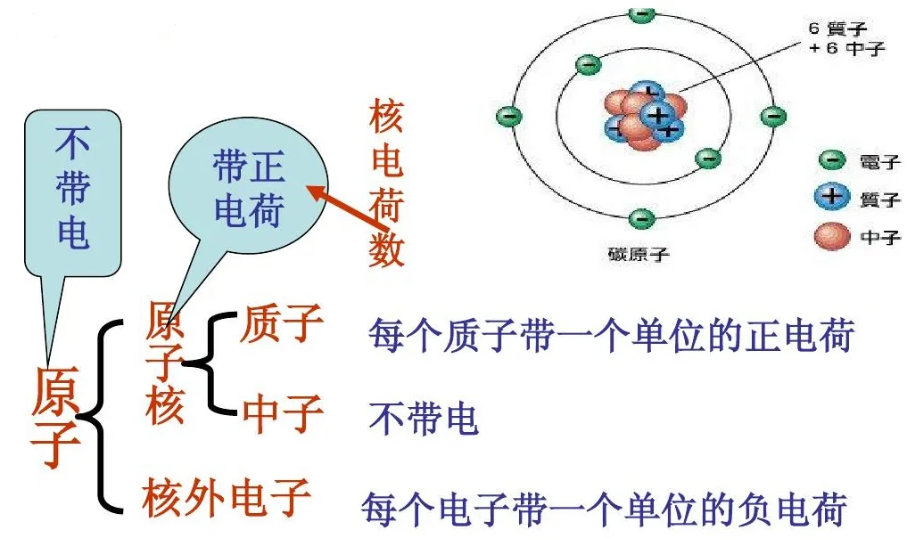

# 能量

“能量”是物理学中最基本的概念之一，它描述了**物体或系统具有的做功能力**

如果一个物体**能够对外做功**，那么就说这个物体具有能量，一个物体能够做的功越多，表示这个物体的能量就越大

能量不是某一种具体物体，是宇宙万物“**改变自身、影响他人**”的总能力。

**总结：能量是一种潜在能够做功的能力**

和势能相近，都是存储起来的还未做功的能力

### 电子的 “能量” 到底是什么？

在电路中，电子在电场的作用下进行定向的运动，而在运动的过程中，电子就有了电势能，而在电势能的作用下，将电子的电势能（动能）转换为热能、机械能，

即：

靠**电场 + 碰撞 / 电磁作用**传递：

导线内电场推着电子前进；电子经过负载时，通过碰撞、电磁相互作用，把自身的**电势能**转移给用电器，变成我们需要的光、热、动力。

## 功

**功**是力对物体再空间上的累积效应，表征力作用于物体并使其产生位移过程中传递的能量，

它是**能量**转换的“度量”：力对物体做功的过程，本质上就是从一种形式转移到另一种形式的过程

## 动能

**动能**指物体由于运动而具有的能量，动能由两个因素决定：`质量`、`速度`

## 势能

**势能**是存储于系统中的能量

###  那这个电势的能量是什么意思？为什么电路联通起来，他们之间有电势力，就能让电路工作起来，让电灯泡能够亮起来？这个能量到底是什么东西？这个能量是不是就是用原子之间的相互作用力做功，然后在这些功中推动指定的物质，进而亮起来或者能够做什么东西？电到底是怎么为我们工作的？

电势能，是因为通过将电路中的电子聚集到一极中，并形成一个电场（拉满弓），当将这个电路的两极连接到一起的时候，电场力推动电子进行运动，此时电子从负极出发，具有强大的电势能，而在运动的过程中，由于电场力的存在，因此会与电灯泡中的原子发生碰撞，进而产生了热能，并让电灯的灯丝产生热辐射，进而形成可见光，

我们抛开抽象名词，**从 “能量是什么→电势能怎么来→电流怎么驱动灯泡 / 电器” 一步步讲透**，全程结合微观粒子、宏观现象，把完整链条串起来。

#### 一、先搞懂：能量到底是什么？（通用定义，不止电学）

**能量 = 物体具备的「对外做功的能力」**

做功 = 让物体发生变化：移动、发热、发光、发声、形变……

只要一个东西能让别的物体产生变化，它就拥有能量。

举几个生活例子：

1. 高举的石头：有重力势能 → 松手落下，砸动地面 / 钉子（做功）
2. 燃烧的柴火：有化学能 → 发热、烧水（做功）
3. 压缩的弹簧：有弹性势能 → 弹开物体（做功）

**电势能，就是电荷在电场中，拥有的「对外做功的能力」**。

它不是一种神秘物质，和上面这些能量本质完全一样。

------

#### 二、电路里的电势能：从哪来？

以**电池**为例（家用市电原理一致，只是能量来源换成发电厂）：

1. 电池内部有化学物质，依靠

    原子 / 分子之间的化学作用力

    ，强行把

    电子从正极搬运到负极

    。

    

    这个过程需要

    消耗化学能

    ，把能量 “存” 到电子身上。

2. 电子被搬到负极后，处在

    高电势位置

    ，也就带上了满满的

    电势能

    。

    

    类比：你费力把石头搬到楼顶，石头就储存了重力势能。

简单说：

**电池的化学能 → 转化为电子的电势能**，这是整个电路能量的源头。

------

#### 三、接通电路：电势能如何变成 “动力”？（核心过程）

电路一闭合，整条线路建立定向电场，分两步看懂：

##### 1. 电场力推着电子定向移动

负极的电子带着电势能，在**电场力**持续推动下，沿着导线往正极流动，这就是**电流**。

- 移动过程中，**电场力一直在对电子做功**；
- 电子身上储存的**电势能，不断被消耗、释放**。

##### 2. 能量逐级转化（灯泡发光的完整链条）

电子流进灯泡灯丝（电阻），灯丝里金属原子排列紧密，电子穿行时会**不断撞击灯丝的原子**：

1. 电子的电势能 → 先转化为**原子的热运动能量**

2. 灯丝原子剧烈震动、温度急剧升高（白炽灯泡灯丝可达上千摄氏度）

3. 高温的金属原子，会向外辐射

    可见光

    

    👉 最终结果：

    电势能 → 热能 + 光能，灯泡就亮了

    。

### 补充其他电器的能量转化（帮你举一反三）

- 电风扇：电势能 → 驱动电机转动 → 机械能（风）
- 电热毯：电势能 → 纯热能
- 手机：电势能 → 光能、声音、芯片运算的能量

**总结一句话：电不是 “凭空干活”，是电子携带的电势能，通过电场力做功，一步步转换成我们需要的光、热、运动等能量。**

即：电场中的电势能 → 电场力做功 → 电子定向移动（电流） → 转为光能/热能/机械能

先后关系：先有电场，才有电势能，电场力是势能的“表现”

------

#### 四、回答你的关键疑问：是不是靠原子相互作用力做功？

**可以这么理解，微观层面就是如此**，分两层区分：

1. **源头动力：电场力**

    让电子持续流动的**主力**，是电场力（电荷之间的电磁相互作用）。没有电场力，电子不会定向移动，能量就无法传递。

    

2. **对外输出：电子撞击原子**

    电子流进用电器，和导线、灯丝里的**金属原子发生碰撞、摩擦**：

    电子把自身的能量传递给原子，让原子运动加剧。

    原子的热运动、相互碰撞，就是我们看到的**发热、发光**。

    

整个流程微观画面：

电池化学能 → 电子获得电势能 → 电场力推电子流动 → 电子撞击用电器内原子 → 原子剧烈运动（发热 / 发光）。

### 还有一些问题，那就是为什么，在一些电池里面，明明电池内部的电势差还有很多伏特，但是为什么就会被认为是没电了呢？而到了一定的大小又认为是满电呢？这是为什么，明明还有很多伏特的电势差，但是就是会说是没电了，不能继续用了，电池也驱动不起小灯了，这是为什么？

这是因为，你想的一直都是理性的空载 电势差，而对于电路来说，驱动电路正常运动，或者对指定的元器件做功，是需要一定的**能量阈值**的，也就是说，当电势差低于了某个限度的时候，这个时候，电势差在遇到了元器件的电阻的时候，此时电子收到了阻碍，因此电势能与电荷之间的电场力双重作用的情况下，进一步加大了做功的大小，进而进一步消耗了电势能，而消耗了电势能，进而正极的电势能就减小了，电场变弱，电子推不动了，就驱动不起电路了，因此即使电路中依旧有电势差，但是因为此时电势能已经推不动了，因此电路无法正常的工作，因此此时认为电池已经没有电了

#### 为什么说电池，在一接上负载，电势差就会狂跌？这是为什么？明明电场强度不是已经变强了吗？为什么说电势差还是会狂跌？

就是因为局部的电场变强了，而在这个电路的局部中，需要做的功多了，电子难通过了，因此电势能就消耗得多了，因此到了这里电阻大的地方，电势差就会跌，而**串联分压的道理，其实就是整条电路中，串联起来的元器件，在本质上都会有电阻，而电阻会阻碍电子的正常流动，并开始在电阻做功，将电势能转换为电阻的热量，进而导致了电势能的降低， 而将整条电路的电势差加起来，才等于完整的电路的电势差，即所电路中所包含的总势能**

电阻 = 能量消耗节点。电子过电阻 → 克服阻力做功 → 电势能转化为热 / 光 → 电势下降。串联电路里每个电阻都瓜分一部分电势差，就是串联分压。

#### 也就是说电场力的增大会大幅的增快电势能的消耗？这是为什么？难道说的是，因为能量是一定恒定的，当电场力增大，意味着做功的增大，进而导致了能量的消耗也变大？但是在阻塞位置上，电子受到的电场力一部分是电子与电子之间相互的作用力啊，和电路中原本的电场力也无关呀，这为什么也算上是电路的电场力呢？

##### 一、为什么电场力变大，电势能消耗会变快？

先回顾基础关系：

$做功W = 作用力 F × 移动距离 × s$

而规定：电荷在电场中移动时，**电场力做的功 = 电势能的减少量**

$W=Ep初−Ep末$

- W：电场力做的功
- Ep：电势能

因此$F⋅s=ΔEp（减少量）$​

从上面就能够看出来，当电场力增大的时候，电势能消耗的速度也就越快

电子在电阻里穿行的距离基本固定，电场力 F 越大，电场力做的功就越多。

而电路里有一条铁规律：

**电场力推动电荷前进的过程，就是电势能持续转化为其他能量（热、光）的过程。**

做功越多，单位时间消耗的电势能就越多。

举个直白例子：

同样走 10 米路（距离固定），你用**很大的力气**推着重物对抗阻力前行，比轻轻推着要累得多 —— 你自身的体力（类比电势能）消耗速度明显变快。

放到电路里：

电阻区局部电场变强 → 电场力变大 → 电子穿过这段距离时，电场力做功大幅增加 → 电势能快速损耗。

再结合能量守恒：电池能提供的总电势能是有限的，力变大、做功变多，能量自然耗得更快。

# 电荷

电荷是什么，电荷就是一种固有的特性，它就像质量一样决定物品受重力的影响，电荷则能决定物品会不会收到电场力的影响，以及是否会产生电场。

原子包含又质子、和电子，质子带正电、电子带负电，而一般来说质子和电子的数量是恒定的，即带电中性

而当物体失去电子的时候，质子数量>电子数量，就会带正电

​		失去质子的时候，质子数量<电子数量，就会带负电

质子和电子，他们的数量都是恒定的，只会转移到某个地方

正电荷与负电荷只是一个相反的电属性，根本来说就是 行为模式的相反

电荷的正负，本质上是表示物质在电场中受力的方向

我们假设有一个“方向向右”的电场，此时：

* 若放入一个“正电荷载体（如空穴）”，那么他就会**向右受力**，最终向右移动（正方向移动）
* 若放入一个“负电荷载体（如电子）”，那么他就会**向左受力**，最终向左移动（反向移动）

**因此电荷其实是一种属性**

而电子和空穴则是另一个维度的东西，电子是负电荷的载体，而空穴是正电荷的载体**，他们都是真实的例子**

**电子是负电荷的载体：电子是具有负电荷属性的粒子（受反方向电场力影响的粒子）**

**空穴是正电荷的载体：空穴是具有正电荷属性的例子（受正方向电场力影响的粒子）**

为什么所有的表述都好像将电荷看作了一个实体呢？就像“电场力：电场对处于其中的电荷产生的作用力”这句话中的“的电荷”，这个表述不是将电荷看作了一个实体吗？还有就是按照就是之前的结论来说，电荷是一种属性，属性为什么会接收到的作用力呢？

这是因为物理中很多日常的表述都会省略掉“载体”，只提属性，看似是属性在受力，但实际上，手里的永远是“携带这个电荷属性的载体”，实际上上面的“电场：电场对处于其中的电荷产生的作用力”最终表达的是，“电场对处于其中，并且带有电荷属性的粒子产生作用力”
就像是平常说的“喜欢红色的人买了裙子”，有时会省略成“喜欢红色的买了裙子”，喜欢红色是属性，但最终描述的还是主体“人”

# 自由电荷是什么

在电路中自由电荷实际上就是电子（带有负电荷的）

那电子到底是什么，是带有负电荷属性的什么东西？他是比原子更小的什么东西，还是说，电子已经是最小的一个东西了，这个东西他就只是叫电子，而带有电子数量比质子多的，则称这个原子带有负电荷？

# 原子

[原子的结构](https://mp.weixin.qq.com/s?__biz=MjM5MzAyNjUwMA==&mid=2652131667&idx=2&sn=ce02efcf7302b4378ecc8bd468c68caf&chksm=bca83a1345581bb5948d7e679aedaffa61d75a12679159c4c66c1c371c4b066bf07c2dbdc6fa&scene=27)

原子并不是最小的粒子，他主要由 三个部分 组成：

* 原子核：居于原子的中心，包含质子（带正电） + 中子（不带电）

* 电子：围绕着原子核外围运动，他就是电学中最微观的粒子（更深层次的完全用不到），天生就带有负电荷属性

补充：

1. 真正能在导线里自由移动的，**只有外层电子**，原子核和内层电子固定不动；

2. **电荷是粒子的固有属性**：不是 “原子后天变出了电荷”，而是电子天生带负电、质子天生带正电；

3. 我们平时说 “物体带电”，本质就是物体内部**正负电荷数量不相等**。

# 电场

**只要是带点粒子（电子，质子），周围都会有天然形成的电场**，这是带电粒子的固有属性，并不是为了吸引或者排斥电子而临时产生的

正负电荷的电场（实际上就是一种相互作用的力）：**对于其他的异属性电荷表吸引，但是排斥同属性电荷**

其中电场强度，是描述了带有电荷属性的粒子对于其他带有电荷属性的粒子的作用力（吸引或排斥）的力的大小

## 电场的方向

## 电场力的大小：

$$
电场力 F = 电荷量 q  \times  电场强度 E
$$

## 在闭合的电路里面：电子靠近正极，电场力会不会发生变化呢？

**家用 / 普通导线电路（匀强电场）里，全程电场力大小基本不变，不会越靠近正极就越小。**

1. 电路导线内部是**匀强电场**

    电源在闭合回路里建立的电场，**各处电场强度近似相等**。

    根据：电场力大小的公式来看

    当电子电荷量固定，E 不变 → **电子受到的电场力全程大小基本一致**。

2. 只有两种特殊情况，电场力才会发生变化

    1. 导线的粗细、材质不均匀：

        同一根电路，**导线忽粗忽细**：

        - 导线变细 → 局部电场强度 E 变大 → 电子受力变大；
        - 导线变粗 → 局部电场强度 E 变小 → 电子受力变小。

        类比：一条平坦跑道，突然变窄，人群挤压、推力变强；跑道变宽，推力变弱。

    2. #### 路里接入不同元器件（电阻、灯泡、电机）

        这是**最常见**的变化点：

        导线本身场强很弱，但**电阻、灯泡灯丝、半导体**这些位置，电场强度会明显变大。

        - 电子进入电阻区：E 骤增 → 受力明显变大；
        - 离开电阻回到粗导线：E 回落 → 受力变小。

        原因：电阻阻碍电子移动，电荷会在电阻两端轻微堆积，形成更强的局部电场。

# 电势

电势实际上就是相对于某个电荷来说的一个潜在的能量，并且这个能量是 **一个单位的具有电荷属性的粒子的电势能**  ，他是一种潜在的能量，潜在的能够做工的多少（**重点在于能做多少工**，但不是能做功的总和）

首先要明确的是，电势实际上就是一种潜在的能量，他与 **电场** 和 **位置** 有很密切的关系，

我们可以想想有一把弹弓(电场)，这把弹弓能够给电子施加作用力，让电子能够移动，当我们的电子在弓的零位（参考点的的差距为零）的时候，此时电子所受到的势能应该是最小的，此时我们可以认为他的电势能为零

而当我们拉动弹弓，让电子原理弓的零位，此时，电子收到的电势能随着距离的变动而增大，并且随着距离的变动，电子收到的电场力（电场的作用力）并不会发生变化，因此此时电势能增大，即：
$$
电势能 = 电场力 \times 位置落差
$$
用弹弓直白翻译公式逻辑（不用记公式，理解关系）：

> 储存的总势能 ≈ 平均作用力 × 拉开的距离

**注意：** **电势的高低是取决于对电子的吸引势能的正负（是推还是吸引）**，比如说，**负极中，由于存储了大量的 电子，对于电子来说是存储了大量对电子向外 push 的能量，因此说负极的电势低**（因为是排斥出去，所以是电势低），**而对于正极来说，是吸引电子的能高，所以说势能高**（<u>自我理解</u>，实际上的含义并不是相对于负电荷的）

## 结合电子 + 电路的形式再解释一次

1. 电源，就像是一把拉开的弓（提前使用化学能等方式，将具有正负电荷属性的粒子强行分开：一端富含有正电荷，一段富含有负电荷，存储在两极，相当于拉开的弓，一直不放开，形成一个稳定的电场）
2. 导线中的电场均匀，让电子走到电路中哪个位置都有相应的作用力，并带动其在电路中移动
3. 而电子停在 “拉的最开” 的位置（电源负极）的时候，存储的势能最多，对应的电势能最大
4. 接通回路的时候，相当于放开弓弦，电子受着电场的力向正极移动，一路释放势能（势能是一种存储起来的潜在的能量，就先像是弓的弹性势能，并且在放开做功的过程中弹性的势能转换为动、光和热能等能量）
5. 电子跑回 “弓” 的零点，势能基本释放完毕，而此时电场力依旧在影响着电子，但是电子现在的能量已经不足以让他摆脱电源正极的束缚了

## 力与势能的差别

力：是每一刻都在受到的作用力

势能：是积累下来的随着距离和对其他物品作用力而形成的能量（潜在的能量、能力）

**势能不单是一种潜在的能量，同时这个能量还有作用的范围，当到达指定的范围区域，此时能量会耗尽，即做功的能力的会变小**

就像是一把弓，这把弓具有动力场，当弦被拉动到一定的位置上，此时弦上的箭会有势能（他会有对其他物品作用力的能力），当弦被拉到极点，此时箭的势能最大，而当发射出去的时候，弹力会作用于箭上，箭在空中运动的过程中，势能随着射出的距离，对其他物品作用力的能力变小（摩擦力+阻力消耗作用力的能力），最后作用力不足，停下（没电了，电势能太小了）	

## 为什么走到很紧的位置的时候，拉力就会突然变大呢？电场力到底是什么东西呢？这个电场到底是什么，电场力又是什么，电势和电场又有什么关系？

一、这是因为，在正常的导线电路中，带有负电荷的粒子（电子）一直受到的都是均匀的正极的吸引力，此时的电场力稳定不变，而当遇到了阻塞的时候，<u>电子此时受到的作用力就不仅仅只是正极的电场力了，还有就是其他的 带有负电荷的粒子（电子） 的排斥力的推力</u>， 此时**累计在电荷身上的作用力就变成了（$ 正极的引力 + 负电荷的推力 $​）**

放到电路里：

电阻阻碍电子移动 → 电子在电阻前端**堆积**（负电荷扎堆）。

扎堆的负电荷会额外产生电场，和电源原本的电场叠加 → **电阻内部总电场变强**。

根据 $F=qE$，电场变强 → 电子受到的电场力（拉力 / 推力）自然变大。

二、**电场力是原子上的带电粒子之间对其他的带电粒子的作用力**，而**电场则是带电粒子对其他的带电粒子在空间中的影响力范围**，他就像是一个环境，在这个环境中的其他带电粒子都会受到产生电场的带电粒子的作用力的影响。

三、首先，要明确一下，势能始终是一个潜在的能量，而能量和力是不可分割的，因为产生能量就一定会有力的参与，因此说，两者是不可分割的， 就拿重力来看，重力这是一个直接的作用力，重力对重力场内的所有物品都有作用力，因此高处的小球才会有“向下跑”的趋势，才存在重力势能，因为如果完全没有重力的存在，重力势能也必然不存在，因为没有重力的影响，那么即使小球在再高的位置，也不会向下滚动，也就不存在“储存的潜在的势能”

总结来看，力是 “驱动的根源所在”， 而位置落差以及力的加持，就出现了“能量差的来源”

### 平移到电场：电场（力） ↔ 电势（电势能）

把上面的斜坡模型，1:1 换成电场场景：

|         重力场          |           电场            |
| :---------------------: | :-----------------------: |
|    地球产生的重力场     |   电荷 / 电源产生的电场   |
|    重力（下滑的力）     |  电场力（推动电荷的力）   |
| 山坡坡度陡缓 = 重力强弱 | 电场强度大小 = 电场力强弱 |
|        海拔高度         |           电势            |
|         高度差          |      电势差（电压）       |
|  重力势能（高处储能）   |  电势能（高电势处储能）   |

##### 1. 第一层：没有电场力，就不存在电势 / 电势能

假设空间里**完全没有电场**：

电荷放在任何位置，都不会受到推拉。哪怕人为划分 “高低位置”，电荷也不会自发移动，**就没有所谓 “潜在的能量”**。

反过来：

正因为存在**电场力**，高电势位置的电荷有向低电势移动的趋势，这个 “能移动、能干活” 的本事，才叫**电势能**。

👉 **电场力，是势能存在的前提。**

##### 2. 第二层：电势的变化快慢，直接决定电场力大小

回到斜坡：

- 同样是从山顶到山脚（总高度差固定）：

    

    某一段坡面

    特别陡

     → 高度掉得快 → 重力推力大；

    

    某一段坡面

    很平缓

     → 高度掉得慢 → 重力推力小。

对应电路 / 电场：

- 两点之间**电势下降得越快**（单位距离内电势差越大）→ 电场强度越大 → 电场力越大；
- 电势慢慢下降 → 电场弱 → 电场力小。

这就是电阻处电场力变大的第二层原因：

电阻内部，电势**急剧下降**（相当于坡面突然变陡）→ 电场变强 → 电场力变大。

##### 3. 第三层：运动过程 = 力做功 + 能量转化

小球从坡顶滚到坡底：

重力全程推着小球（力在持续作用），同时**高处的重力势能不断减少**，变成小球的动能。

电子从电源负极（高电势）流向正极（低电势）：

电场力全程推着电子（力持续作用），同时**电子的电势能不断减少**，转化为灯泡的光能、电阻的热能。

## 电势能和电场和电场力之间的关系

电势能实际上就是一种存储起来准备作用于电子的能力，而电场是这个能力产生的根本，而电场力则是这个电势能实际影响了电子的现象

## 所以电势能是推动电子的主导者吗？到底是电场力是主导还是电势能是主导？

### 一、先分清两个本质完全不同的物理量

1. **电场力（力，矢量）**

    是实实在在作用在电荷上的**作用力**，能直接改变电荷运动、产生加速度，是**改变电荷运动状态的直接动力**。

    公式：$F=qE$

    

2. **电势能（能量，标量）**

    是电荷和电场组成系统共有的**势能储存量**，和重力势能一个逻辑；本身**不能直接推、拉电荷**，它只是能量的度量。

    公式：$Ep=qφ$

    

### 二、谁是 “主导推动者”？

#### 1. 直接推动者：电场力

电子会动、会加速、会偏转，**直接原因只有电场力**。

类比重力场景：

- 物体下落 → 直接推手是**重力**
- 对应电子在电场里运动 → 直接推手是**电场力**

#### 2. 电势能扮演什么角色？能量标尺

电势能本身没有 “推力”，只有一个作用： 

电荷移动时，**电场力做功 = 电势能的减少量**

$W_电 = -\triangle E_p $

- 电场力做正功 → 电势能减少
- 电场力做负功 → 电势能增加

**做功 $W$**：过程量，电荷**移动一段距离**才会有，描述一段运动里能量转移了多少；

**电势能 $Ep$​**：状态量，电荷**停在某一个位置**就自带一个确定数值，只看当前位置，不看怎么过来的。

拆开理解：

1. 电势能是一个位置自带的 “能量家底”；
2. 它的大小，刚好等价于移去零势能处电场力能放出多少功；
3. 但它本身不是 “一堆已经做完的功”。

# 压电效应

【雷公助我！！压电效应是怎么产生的？】https://www.bilibili.com/video/BV1G14y1Q7NJ?vd_source=b32cc92dd4fddeeac695cc8761028979

# 电容

# 电势能、电场、电场力、电路、电子、能量

电路里的电势能载体不是单个电子，是「电场+整个电荷系统」

也就是说，电路就是一把弓，而电子就是弓上面的一颗石子

而电池就是拉弓的工具，通过给电池的两极创建净电荷差，并在电场的作用下，储存了电势能

当将电池接入到电路中时，就相当于放开拉满的弓弦，此时在电场的作用下，电势能释放，并以电场力为媒介推动电子（石头），让电势能通过电场力转化为电子的动能，电子有了动能后在运动的过程中撞到晶格原子，将动能转化为别的能量（热能、机械能），进而让实现某种功能

## 为什么会说不是电势能→电子动能→再转化成灯泡热量，明明电子运动了呀？

这是因为电子确实获得了动能，但移动了很短的距离后，动能就转化为别的能量了，整个过程循环周期极短，电子永远处于：
势能→瞬时动能→立刻变热能→动能清零→再电场力再为其加速

电子每前进一点点，刚拿到动能就当场转化为热量，能量不在电子身上储存运输。
导线从头到尾，只要有电阻，一路上都在发热，不是只有灯泡发热。

举极端例子帮你感受：
一根很长、电阻很大的导线，只串联一个极小灯泡。通电后导线烫得厉害，灯泡微亮。
按照你的思路：动能都存在电子身上，应该全部带到灯泡再放热，导线不该发热。
但现实导线全程发热，证明能量是边走边耗，不是攒到负载再释放。

电子确实有定向运动，也确实短暂获得动能，但有两个致命问题：

1. 动能无累积
稳态电流下，电子平均漂移速度不变。加速获得的动能，全部通过碰撞流失，平均动能不增加。
如果能量是靠电子携带动能输送，那电子越靠近灯泡速度应该越来越快，现实完全不是。

2. 能量载体不是电子，是电场
真正沿着导线光速传递能量的，是导线周围的电磁场，不是电子。电子漂移速度只有毫米每秒，能量却接近光速到达灯泡。
如果靠电子携带动能运能量，开关闭合后，要等几十分钟电子走到灯泡才会亮，现实开灯瞬间就亮。

5、简化总结

1. 微观瞬时看：电势能确实会短暂变成电子动能；

2. 宏观电路整体看：动能只是转瞬即逝的中间过渡，不会储存、不会运输；

3. 你说的「电势能→电子动能→热量」适合真空加速；

4. 日常电线、灯泡里，宏观能量转化描述标准写法是：电场电势能直接转化为热能，不需要把电子动能作为中间储存环节写进去，因为它留不住。
